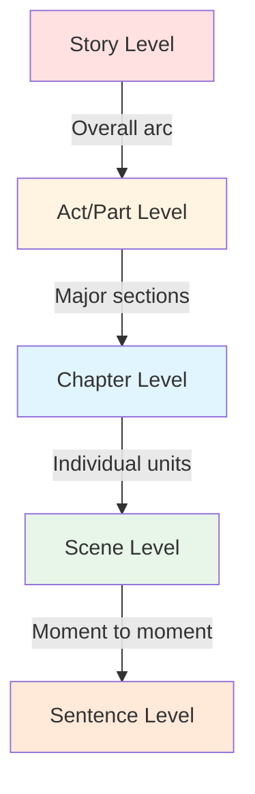

# ⚡ Pacing Fundamentals

> *Master the rhythm and speed that keeps readers turning pages*

---

## 📖 **Overview**

**Pacing** is the speed at which your story unfolds—the rate at which events happen, information is revealed, and emotional beats occur. It's the narrative momentum that determines whether readers feel rushed, bored, or perfectly carried along by your story's current.

### **Why Pacing Matters:**
- 📖 **Controls Engagement:** Keeps readers invested
- ⚡ **Creates Rhythm:** Alternates between high and low intensity
- 💓 **Builds Emotion:** Allows feelings to develop and peak
- 🎯 **Directs Focus:** Emphasizes important moments
- 🌊 **Manages Energy:** Prevents reader fatigue

### **The Golden Rule:**
> "Pacing isn't about speed—it's about control. It's knowing when to sprint, when to stroll, and when to stop and breathe."

---

## 🎯 **What is Pacing?**

### **Pacing Operates at Multiple Levels:**

**Story Level:** The overall tempo from beginning to end  
**Act Level:** The rhythm within major sections  
**Chapter Level:** The speed of individual chapters  
**Scene Level:** The pace of specific dramatic units  
**Sentence Level:** The rhythm of individual sentences and paragraphs

---

## 🚀 **Fast vs. Slow Pacing**

### **Fast Pacing:**

**When to Use:**
- ⚔️ Action sequences
- ⏰ High-stakes moments
- 🎭 Intense confrontations
- 🏃 Chase scenes
- 💥 Climactic events
- ⚡ Revelations and twists

**How to Create Fast Pacing:**
- Short sentences and paragraphs
- Action verbs
- Present tense or active voice
- Minimal description
- Rapid dialogue exchanges
- Immediate consequences
- Multiple events in quick succession
- Scene over summary

**Example (Fast):**
> The door exploded inward. Sarah dove. Gunfire erupted. Glass shattered. She rolled behind the desk. Another shot. Wood splintered above her head. Her hand found the gun. She fired blind.

---

### **Slow Pacing:**

**When to Use:**
- 🌅 World-building
- 💭 Character reflection
- 💑 Intimate moments
- 📖 Backstory delivery
- 🎨 Atmospheric scenes
- 🧘 Recovery periods
- 🌊 Building tension

**How to Create Slow Pacing:**
- Longer, complex sentences
- Rich sensory details
- Internal monologue
- Descriptive passages
- Leisurely dialogue
- Philosophical musings
- Summary over scene
- Subplots and tangents

**Example (Slow):**
> Sarah stood at the window, watching rain trace uncertain paths down the glass. Each drop seemed to hesitate, as if considering its route before committing to gravity's inevitable pull. She understood that hesitation. The letter from her mother lay unopened on the table behind her, its presence as tangible as a held breath. Three weeks it had waited, and still she couldn't bring herself to break the seal.

---

## ⚖️ **The Pacing Spectrum**

### **Understanding Story Speed:**

| Pace | Effect | Tools | Use Case |
|------|--------|-------|----------|
| **Breakneck** | Breathless urgency | Ultra-short sentences, fragments | Final confrontation, life-or-death |
| **Fast** | Excitement, tension | Action, dialogue, short paragraphs | Chase scenes, battles, arguments |
| **Moderate** | Comfortable momentum | Balanced scene/summary | Standard narrative |
| **Leisurely** | Contemplative, immersive | Description, reflection, detail | Character moments, atmosphere |
| **Glacial** | Meditative, exhaustive | Dense prose, digressions | Literary fiction, philosophy |

---

## 🌊 **The Rhythm of Story: Peaks and Valleys**

### **Creating Narrative Waves:**

**The Pattern:**
- Build tension → Release tension → Build higher → Release → Repeat
- Each peak should be higher than the last
- Each valley gives readers time to recover
- Final climax is the highest peak

### **Why Valleys Matter:**

**Constant high intensity = Reader exhaustion and numbness**

Valleys provide:
- ✨ Contrast (making peaks feel higher)
- 💭 Processing time (let events sink in)
- 💖 Connection (character development)
- 🌍 Context (world-building)
- 😌 Relief (emotional recovery)
- 🎯 Anticipation (building toward next peak)

---

## 📊 **Pacing by Story Structure**

### **Three-Act Structure:**

**Act 1 (Setup - 25%):**
- **Pace:** Moderate to Fast
- **Purpose:** Hook reader, establish stakes
- **Focus:** Inciting incident, character introduction
- **Danger:** Don't linger too long in "normal world"

**Act 2 (Confrontation - 50%):**
- **Pace:** Variable (rollercoaster)
- **Purpose:** Complicate, escalate
- **Focus:** Rising action, setbacks, complications
- **Pattern:** Build → Release → Build Higher

**Act 3 (Resolution - 25%):**
- **Pace:** Fast → Slow
- **Purpose:** Resolve conflict, provide closure
- **Focus:** Climax (fastest), falling action, denouement (slower)
- **Pattern:** Maximum speed → Gradual deceleration

---

## 🎭 **Genre-Specific Pacing**

### **Thriller:**
- **Overall Pace:** Fast to breakneck
- **Pattern:** Constant escalation with brief respites
- **Technique:** Cliffhangers, ticking clocks, multiple threats

### **Literary Fiction:**
- **Overall Pace:** Leisurely to moderate
- **Pattern:** Character-driven rhythm
- **Technique:** Internal reflection, rich prose, thematic development

### **Romance:**
- **Overall Pace:** Moderate with emotional acceleration
- **Pattern:** Alternating tension and intimacy
- **Technique:** Slow-burn building or quick attraction with obstacles

### **Mystery:**
- **Overall Pace:** Steady with investigation rhythm
- **Pattern:** Clue → revelation → new question
- **Technique:** Information control, red herrings

### **Fantasy/Sci-Fi:**
- **Overall Pace:** Moderate (world-building needs)
- **Pattern:** Balance discovery with action
- **Technique:** Reveal setting through action when possible

---

## 🛠️ **Tools for Controlling Pace**

### **1. Sentence Length:**

**Fast:** Short. Choppy. Urgent.  
**Slow:** Longer, more complex sentences that unfold gradually, carrying multiple ideas and descriptions within their grammatical structure.

### **2. Paragraph Length:**

**Fast Pace:**
Single line paragraphs.

Create urgency.

Drive readers forward.

**Slow Pace:**
Longer paragraphs create a more leisurely feel, allowing readers to settle into the text. They provide space for complex ideas, detailed descriptions, and nuanced character thoughts. The eye must travel further before finding a break, subconsciously signaling less urgency.

### **3. Scene vs. Summary:**

**Scene (Slower):**
- Real-time action
- Dialogue
- Detailed description
- "Show"

**Summary (Faster):**
- Compressed time
- Reported action
- General overview
- "Tell"

### **4. Dialogue:**

**Fast Pacing:**
> "Run!"  
> "Where?"  
> "Anywhere!"

**Slow Pacing:**
> "I suppose," she said, setting down her teacup with careful precision, "that we should consider our options rather carefully before committing to any particular course of action."

### **5. Description:**

**Minimal (Fast):** The room was empty.

**Rich (Slow):** The room stretched before her in abandoned elegance—dustsheets draped over furniture like ghosts of former grandeur, afternoon light filtering through dirty windows to cast golden bars across the hardwood floor.

---

## 📏 **Measuring Your Pacing**

### **Questions to Ask:**

**Story Level:**
- Does the story start quickly enough?
- Are there sagging sections?
- Does momentum build toward climax?
- Is the ending too rushed or too drawn out?

**Scene Level:**
- Does each scene justify its length?
- Do important moments get adequate space?
- Are transitions smooth or jarring?

**Sentence Level:**
- Do sentence rhythms match scene intensity?
- Is there variety in sentence structure?
- Are readers getting fatigued or bored?

### **Signs of Pacing Problems:**

**Too Fast:**
- ⚠️ Readers feel confused or overwhelmed
- ⚠️ Character development suffers
- ⚠️ Emotional moments don't land
- ⚠️ World feels shallow
- ⚠️ Stakes feel unearned

**Too Slow:**
- ⚠️ Readers get bored
- ⚠️ Story feels padded
- ⚠️ Tension dissipates
- ⚠️ Plot doesn't advance
- ⚠️ Readers skip sections

---

## 🎯 **Practical Guidelines**

### **The 50-Page Rule:**

**Pages 1-50:** Hook hard and fast
- Establish character, conflict, and stakes quickly
- Don't linger in exposition
- Give readers reason to continue

**Middle Pages:** Create rhythm
- Vary intensity
- Build complications
- Maintain momentum through escalation

**Final 50 Pages:** Accelerate to climax
- Increase pace steadily
- Remove distractions
- Drive toward resolution

### **The Chapter-End Test:**

At the end of each chapter, ask:
- Would I turn the page?
- Does something pull me forward?
- Is there a question unanswered?
- Has tension increased or been released intentionally?

---

## 💡 **Common Pacing Mistakes**

### **1. Constant High Speed:**
**Problem:** Exhausts readers, numbs impact  
**Fix:** Build in valleys, let moments breathe

### **2. Sagging Middle:**
**Problem:** Story loses momentum in Act 2  
**Fix:** Add complications, raise stakes, cut filler

### **3. Rushed Ending:**
**Problem:** Climax feels unearned or too quick  
**Fix:** Give climax adequate space, don't compress resolution

### **4. Slow Opening:**
**Problem:** Reader loses interest before hook  
**Fix:** Start closer to action, cut unnecessary setup

### **5. Inconsistent Rhythm:**
**Problem:** Jarring speed changes confuse readers  
**Fix:** Use transitional scenes to shift gears smoothly

### **6. Over-Description:**
**Problem:** Story bogs down in details  
**Fix:** Filter description through action and character POV

---

## 📚 **Examples from Literature**

### **Masterful Fast Pacing:**

**The Road by Cormac McCarthy:**
> "He woke in the woods in the dark and the cold of the night. He reached out to touch the child sleeping beside him. Nights dark beyond darkness and the days more gray each one than what had gone before."

**Note:** Short sentences, minimal description, immediate stakes.

### **Masterful Slow Pacing:**

**The Great Gatsby by F. Scott Fitzgerald:**
> "Already it was deep summer on roadhouse roofs and in front of wayside garages, where new red petrol-pumps sat out in pools of light, and when I reached my estate at West Egg I ran the car under its shed and sat for a while on an abandoned grass roller in the yard. The wind had blown off, leaving a loud, bright night, with wings beating in the trees and a persistent organ sound as the full bellows of the earth blew the frogs full of life."

**Note:** Long, flowing sentences; rich sensory detail; contemplative tone.

### **Pacing Shift Within Same Book:**

**The Hunger Games by Suzanne Collins:**

**Fast (Arena Combat):**
> "I dive for cover. The heat of the explosion hits me, knocking me sideways. I scramble to my feet, grab a container, and run."

**Slow (Cave Recovery):**
> "We lie intertwined in the sleeping bag, my head resting on his chest. I can feel the warmth of his breath, the steady beat of his heart. For the first time in days, I feel safe."

---

## ✍️ **Practice Exercise**

### **Pacing Rewrite:**

Take this neutral-paced paragraph and rewrite it twice:

**Original:**
> "Sarah walked into the house and noticed something was wrong. The furniture had been moved. She checked the kitchen and found the back door open. She realized someone had been there."

**Your Fast Version:**
> [Rewrite with urgent pacing]

**Your Slow Version:**
> [Rewrite with leisurely pacing]

**Example Solutions:**

**Fast:**
> The door stood open. Sarah froze. Furniture—wrong. All wrong. She moved fast. Kitchen. Back door gaping. Someone. Here. Now.

**Slow:**
> Sarah stepped across the threshold and paused, a prickle of unease raising the hairs on her arms. Something felt off, though it took her a moment to identify what. The furniture. Yes. The couch had been shifted—only a few inches, but enough to notice the faded rectangular imprint on the carpet where it had sat for years. Her heart began a slow, measured acceleration as she moved through the house toward the kitchen, where the back door stood open, spilling afternoon light across the linoleum floor.

---

## 🔗 **Related Topics**

- **[Scene vs. Summary](scene-summary.md)** — When to show vs. tell for pace
- **[Sentence-Level Pacing](sentence-pacing.md)** — Micro-control of rhythm
- **[Tension & Release](tension-release.md)** — Creating emotional waves
- **[Chapter Structure](chapter-structure.md)** — Macro pacing decisions
- **[Cliffhangers](cliffhangers.md)** — Compelling page turns

---

## 📖 **Further Reading**

- **"Story Trumps Structure" by Steven James** — Intuitive approach to pacing
- **"The Anatomy of Story" by John Truby** — Structure and timing
- **"Scene & Structure" by Jack Bickham** — Practical pacing techniques
- **"Wired for Story" by Lisa Cron** — Brain science of engagement

---

*Remember: Perfect pacing is invisible. Readers shouldn't notice the speed—they should simply be unable to stop reading.*
