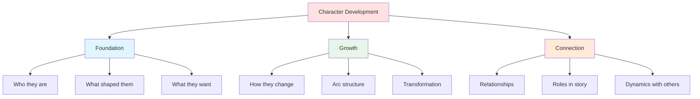
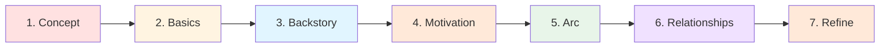

# 👥 Character Development

> *The Art of Creating Memorable, Complex Characters*

---

## 📖 **Overview**

**Character development** is the process of creating three-dimensional, compelling characters that feel real, engage readers emotionally, and drive your story forward. Great characters are the heart of great stories—they're what readers remember long after they've forgotten the plot.

This section provides comprehensive guidance on every aspect of building unforgettable characters, from initial conception through transformation and growth.

---

## 🎯 **What You'll Learn**

---

## 📚 **Complete Character Development Guide**

### **🧱 Foundation: Building Your Character**

<table>
<tr>
<td width="50%">

#### **[📖 Character Basics](character-basics.md)**

**Learn the fundamentals of character creation:**
- Three-dimensional characters (physical, psychological, social)
- Character types and archetypes
- Creating believable, consistent characters
- Common character mistakes to avoid
- Character creation process step-by-step

**Master the building blocks of compelling characters**

</td>
<td width="50%">

#### **[📚 Backstory](backstory.md)**

**Craft meaningful character history:**
- The Ghost: formative wounds and trauma
- Family background and relationships
- Education, skills, and experiences
- Past failures and successes
- How to reveal backstory effectively
- Avoiding info-dumps

**The past that shapes the present**

</td>
</tr>

<tr>
<td width="50%">

#### **[🎯 Motivation & Goals](motivation-goals.md)**

**Understand what drives your characters:**
- External wants vs. internal needs
- Eight types of motivation
- Creating compelling goals
- Motivation through story stages
- The lie and the truth
- Avoiding cliché motivations

**Why characters do what they do**

</td>
<td width="50%">

#### **[💑 Relationships](relationships.md)**

**Develop meaningful connections:**
- Romantic relationships
- Family dynamics
- Friendships and found family
- Professional relationships
- Antagonistic relationships
- Relationship arcs and evolution

**No character is an island**

</td>
</tr>
</table>

---

### **🌟 Growth: Character Transformation**

<table>
<tr>
<td width="50%">

#### **[📈 Character Arcs](character-arcs.md)**

**Master character transformation:**
- Positive change arcs (overcoming flaws)
- Negative change arcs (corruption/fall)
- Flat arcs (changing the world)
- The 12-step positive arc structure
- Integrating arc with plot
- Testing and proving change

**How characters grow and evolve**

</td>
<td width="50%">

#### **[🎭 Protagonist & Antagonist](protagonist-antagonist.md)**

**Create compelling heroes and villains:**
- Defining protagonists and antagonists
- Essential elements of each
- Types of heroes and villains
- The mirror dynamic
- Creating sympathy and threat
- Avoiding common mistakes

**The heart of your story's conflict**

</td>
</tr>
</table>

---

## 🗺️ **Learning Paths**

Choose your path based on your current needs:

### **📘 For Beginners:**

Start with the foundational concepts, then build complexity:

1. **[Character Basics](character-basics.md)** — Learn the fundamentals
2. **[Protagonist & Antagonist](protagonist-antagonist.md)** — Understand your main characters
3. **[Motivation & Goals](motivation-goals.md)** — What drives them
4. **[Character Arcs](character-arcs.md)** — How they change
5. **[Relationships](relationships.md)** — How they connect
6. **[Backstory](backstory.md)** — What shaped them

---

### **🎯 For Specific Needs:**

Jump directly to what you need:

**My character feels flat:**
→ [Character Basics](character-basics.md) — Add dimensions

**My character isn't changing:**
→ [Character Arcs](character-arcs.md) — Structure transformation

**My character's actions don't make sense:**
→ [Motivation & Goals](motivation-goals.md) — Clarify drives

**My villain is boring:**
→ [Protagonist & Antagonist](protagonist-antagonist.md) — Create compelling antagonists

**My relationships feel shallow:**
→ [Relationships](relationships.md) — Develop connections

**My character has no depth:**
→ [Backstory](backstory.md) — Create meaningful history

---

### **📈 For Advanced Writers:**

Deepen your understanding of character:

1. **[Character Arcs](character-arcs.md)** — Master complex transformations
2. **[Motivation & Goals](motivation-goals.md)** — Layer want vs. need
3. **[Protagonist & Antagonist](protagonist-antagonist.md)** — Create mirror dynamics
4. **[Relationships](relationships.md)** — Develop complex dynamics
5. **[Backstory](backstory.md)** — Strategic revelation techniques

---

## 🎨 **Character Development Process**

### **Step-by-Step Character Creation:**

**1. Concept & Role**
- Who is this character?
- What role do they play?
- Protagonist, antagonist, or supporting?
- Core concept or hook

**Resources:** [Character Basics](character-basics.md), [Protagonist & Antagonist](protagonist-antagonist.md)

---

**2. Foundation**
- Physical description
- Personality traits
- Values and beliefs
- Skills and knowledge

**Resources:** [Character Basics](character-basics.md)

---

**3. History**
- Family background
- The Ghost (formative wound)
- Major life events
- Relationships past

**Resources:** [Backstory](backstory.md)

---

**4. Drives**
- External goal (want)
- Internal need
- Motivation sources
- The lie they believe

**Resources:** [Motivation & Goals](motivation-goals.md)

---

**5. Transformation**
- Character arc type
- Starting point
- Journey stages
- Ending point

**Resources:** [Character Arcs](character-arcs.md)

---

**6. Connections**
- Key relationships
- Dynamics with others
- Supporting cast
- Antagonistic forces

**Resources:** [Relationships](relationships.md), [Protagonist & Antagonist](protagonist-antagonist.md)

---

**7. Refinement**
- Consistency check
- Depth evaluation
- Test against story
- Revise and strengthen

**Resources:** All sections

---

## 🎯 **Essential Character Elements**

Every well-developed character should have:

### **✅ The Core Seven:**

| Element | Purpose | See |
|---------|---------|-----|
| **Clear Goal** | What they want (plot) | [Motivation & Goals](motivation-goals.md) |
| **Deep Need** | What they actually need (theme) | [Motivation & Goals](motivation-goals.md) |
| **Significant Flaw** | What holds them back | [Character Arcs](character-arcs.md) |
| **Rich Backstory** | What shaped them | [Backstory](backstory.md) |
| **Meaningful Relationships** | Who they connect with | [Relationships](relationships.md) |
| **Transformation Arc** | How they change | [Character Arcs](character-arcs.md) |
| **Distinctive Voice** | How they express themselves | [Dialogue Techniques](../dialogue-techniques/) |

---

## 📊 **Character Types Comparison**

### **Understanding Different Character Roles:**

<table>
<thead>
<tr>
<th>Type</th>
<th>Function</th>
<th>Arc Necessity</th>
<th>Depth Needed</th>
</tr>
</thead>
<tbody>
<tr>
<td><b>Protagonist</b></td>
<td>Drives story, main perspective</td>
<td>Essential</td>
<td>Maximum</td>
</tr>
<tr>
<td><b>Antagonist</b></td>
<td>Opposes protagonist, creates conflict</td>
<td>Optional but recommended</td>
<td>High</td>
</tr>
<tr>
<td><b>Deuteragonist</b></td>
<td>Second most important, supports protagonist</td>
<td>Recommended</td>
<td>High</td>
</tr>
<tr>
<td><b>Love Interest</b></td>
<td>Romantic relationship, personal stakes</td>
<td>Recommended</td>
<td>Medium-High</td>
</tr>
<tr>
<td><b>Mentor</b></td>
<td>Guides protagonist, represents theme</td>
<td>Optional</td>
<td>Medium</td>
</tr>
<tr>
<td><b>Sidekick</b></td>
<td>Supports protagonist, provides help/comic relief</td>
<td>Optional</td>
<td>Medium</td>
</tr>
<tr>
<td><b>Minor Supporting</b></td>
<td>Fills specific function, adds flavor</td>
<td>Not needed</td>
<td>Low-Medium</td>
</tr>
</tbody>
</table>

**See:** [Character Basics](character-basics.md), [Protagonist & Antagonist](protagonist-antagonist.md)

---

## ⚖️ **Common Character Development Mistakes**

<b>❌ Pitfalls to Avoid</b>

### **Flat Characters:**
- **Problem:** One-dimensional, shallow
- **Fix:** Add three dimensions (physical, psychological, social)
- **See:** [Character Basics](character-basics.md)

### **No Clear Goal:**
- **Problem:** Character wanders aimlessly
- **Fix:** Establish clear want and need
- **See:** [Motivation & Goals](motivation-goals.md)

### **Static Characters:**
- **Problem:** No growth or change
- **Fix:** Create meaningful character arc
- **See:** [Character Arcs](character-arcs.md)

### **Unbelievable Motivation:**
- **Problem:** Actions don't make sense
- **Fix:** Establish clear, consistent motivation
- **See:** [Motivation & Goals](motivation-goals.md)

### **Too Much Backstory:**
- **Problem:** Info-dumps that stop the story
- **Fix:** Reveal strategically, show don't tell
- **See:** [Backstory](backstory.md)

### **Shallow Relationships:**
- **Problem:** Connections feel fake
- **Fix:** Develop meaningful dynamics
- **See:** [Relationships](relationships.md)

### **Weak Antagonist:**
- **Problem:** No real threat or depth
- **Fix:** Create compelling, complex opposition
- **See:** [Protagonist & Antagonist](protagonist-antagonist.md)

### **Inconsistent Character:**
- **Problem:** Acts different in each scene
- **Fix:** Establish core traits, maintain consistency
- **See:** [Character Basics](character-basics.md)

### **Too Perfect or Too Flawed:**
- **Problem:** Character unrealistic
- **Fix:** Balance strengths and weaknesses
- **See:** [Character Basics](character-basics.md)

### **Passive Protagonist:**
- **Problem:** Things happen TO character
- **Fix:** Give agency, active choices
- **See:** [Protagonist & Antagonist](protagonist-antagonist.md)

---

## 💡 **Quick Reference: Character Checklist**

### **Use this checklist for every major character:**

**Foundation:**
- [ ] Clear physical description
- [ ] Distinct personality
- [ ] Consistent voice
- [ ] Believable skills/knowledge

**Depth:**
- [ ] Meaningful backstory
- [ ] The Ghost (formative wound)
- [ ] Core values and beliefs
- [ ] Internal conflicts

**Drive:**
- [ ] Clear external goal
- [ ] Deep internal need
- [ ] Strong motivation
- [ ] Significant obstacles

**Growth:**
- [ ] Character arc type identified
- [ ] Starting flaw/lie
- [ ] Transformation planned
- [ ] Ending state

**Connection:**
- [ ] Key relationships established
- [ ] Dynamics with protagonist/antagonist
- [ ] Role in story clear
- [ ] Impact on plot

---

## 🔗 **Related Resources**

### **Within Fundamentals:**
- 💬 **[Dialogue Techniques](../dialogue-techniques/)** — How characters speak
- 📖 **[Story Structure](../story-structure/)** — How character arc fits plot
- 🌍 **[World-Building](../world-building/)** — How character fits world
- 📈 **[Plot Development](../plot-development/)** — How character drives plot

### **Craft & Advanced:**
- 🎨 **[Show vs. Tell](../../craft/show-vs-tell/)** — Revealing character through action
- 👁️ **[POV & Perspective](../../craft/pov-perspective/)** — Character voice and viewpoint
- 📝 **[Prose Style](../../craft/prose-style/)** — Character-specific writing

### **Templates & Tools:**
- 📋 **[Character Sheets](../../../templates/character-sheets/)** — Development templates
- ✍️ **[Character Exercises](../../../resources/exercises/)** — Practice techniques
- 📚 **[Glossary](../../../resources/glossary/)** — Key terms

---

## 📖 **Recommended Reading**

**Essential Books on Character:**
- *Creating Character Arcs* — K.M. Weiland
- *The Anatomy of Story* — John Truby
- *Story Genius* — Lisa Cron
- *Save the Cat!* — Blake Snyder
- *The Emotional Wound Thesaurus* — Angela Ackerman & Becca Puglisi
- *The Positive Trait Thesaurus* — Angela Ackerman & Becca Puglisi
- *The Negative Trait Thesaurus* — Angela Ackerman & Becca Puglisi

See **[Craft Books Reading List](../../../resources/reading-lists/craft-books.md)** for more.

---

## 🎯 **Next Steps**

### **Ready to Start?**

1. **New to character development?**  
   → Start with [Character Basics](character-basics.md)

2. **Have a character but they feel flat?**  
   → Review [Character Basics](character-basics.md) and [Backstory](backstory.md)

3. **Character isn't growing?**  
   → Study [Character Arcs](character-arcs.md)

4. **Need templates and tools?**  
   → Visit [Character Sheets](../../../templates/character-sheets/)

5. **Want to practice?**  
   → Try exercises in each section

---

## **✨ Great Stories Need Great Characters ✨**

*Master character development and you master storytelling. Your characters are your story's beating heart—make them unforgettable.*

---

### **📚 Explore Character Development:**

**[Character Basics](character-basics.md)** | **[Character Arcs](character-arcs.md)** | **[Motivation & Goals](motivation-goals.md)**

**[Backstory](backstory.md)** | **[Relationships](relationships.md)** | **[Protagonist & Antagonist](protagonist-antagonist.md)**

---

**[⬅️ Back to Fundamentals](../README.md)** | **[🏠 Home](../../../README.md)**

