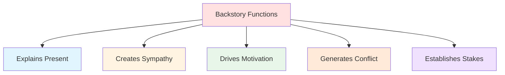

# 📚 Backstory

> *The past that shapes the present: crafting character history that matters*

---

## 📖 **Overview**

**Backstory** is everything that happened to your character **before** your story begins. It's the foundation that explains who they are, why they act the way they do, and what shaped their personality, beliefs, and motivations. Good backstory enriches character depth; bad backstory bogs down narrative.

### **Why Backstory Matters:**
- 🎭 **Explains Behavior:** Why character acts this way
- 💔 **Creates Flaws:** Origin of weaknesses and fears
- 🎯 **Drives Motivation:** Why they want what they want
- 🌟 **Adds Depth:** Makes character feel real and lived-in
- ⚡ **Generates Conflict:** Past creates present obstacles

### **The Golden Rule:**
> "Backstory is the iceberg beneath the water—most of it should stay hidden, but its presence makes the story float."  
> — The majority of backstory you create will never appear on page, but it informs everything

---

## 🎯 **The Purpose of Backstory**



---

## 🧱 **Essential Elements of Backstory**

### **1. The Ghost (The Wound):**

**What It Is:**
The **traumatic or formative event** that created the character's lie, flaw, or driving fear.

**Purpose:**
- Creates the flaw protagonist must overcome
- Justifies current behavior
- Explains why change is hard
- Generates sympathy

**Types of Ghosts:**

**Traumatic Event:**
- Death of loved one
- Betrayal or abandonment
- Abuse or violence
- Catastrophic failure
- Witnessing horror

**Formative Experience:**
- Rejection or humiliation
- Poverty or deprivation
- Overprotection or coddling
- Success that came too easy
- Specific moment of shame

**Examples:**

| Character | The Ghost |
|-----------|-----------|
| **Batman** | Parents murdered before his eyes |
| **Katniss** | Father died, family nearly starved |
| **Harry Potter** | Parents killed by Voldemort, raised by abusive relatives |
| **Elsa** | Accidentally hurt sister with powers |
| **Iron Man** | Saw his weapons used to harm innocents |
| **Hamlet** | Father murdered (though learns this in story) |

**Using the Ghost:**
- ✅ Reference it, don't fully explain immediately
- ✅ Show how it affects current behavior
- ✅ Make it proportional to character's issues
- ❌ Don't make it melodramatic excuse
- ❌ Don't heal it too quickly

---

### **2. Family Background:**

**What It Includes:**
Parents, siblings, extended family, and family dynamics

**Key Aspects:**

**Parental Influence:**
- Present or absent?
- Loving or abusive?
- High expectations or neglectful?
- Role models or cautionary tales?

**Sibling Relationships:**
- Competition or support?
- Birth order effects
- Shared or different experiences
- Current relationship status

**Family Values:**
- What family taught
- Cultural/religious traditions
- What character accepted or rejected
- Generational patterns

**Economic Status:**
- Poverty, wealth, or middle class
- Stability or instability
- How money was valued
- Impact on worldview

**Examples:**

**Elizabeth Bennet:**
- Middle-class family
- Educated father, frivolous mother
- Four sisters (marriage pressure)
- Secure but not wealthy
- Values intelligence over social status

**Bruce Wayne:**
- Wealthy family, philanthropic parents
- Parents murdered (ghost)
- Only child
- Alfred as surrogate parent
- Inherited wealth and responsibility

---

### **3. Formative Relationships:**

**What They Include:**
Early friendships, first loves, mentors, rivals

**Why They Matter:**
- Shape how character relates to others
- Create trust or distrust patterns
- Establish relationship models
- Generate current conflicts

**Types:**

**First Love:**
- How did it end?
- What did they learn?
- Still affected by it?
- Comparison point for current relationships

**Best Friend:**
- Loyal or betrayal?
- Still in life or lost?
- What bonded them?
- How did it end (if it did)?

**Mentor Figure:**
- Who guided them?
- Positive or negative influence?
- Still alive/present?
- What did they teach?

**Formative Enemy:**
- Early rivalry or antagonism
- What did it teach?
- How did it shape them?
- Unresolved conflict?

---

### **4. Education & Skills:**

**What It Includes:**
Formal education, training, self-taught skills

**Aspects:**

**Formal Education:**
- How much schooling?
- Quality of education?
- Subjects studied?
- Attitude toward learning?

**Special Training:**
- Mentorship or apprenticeship
- Military or professional training
- Self-taught skills
- Natural talents developed

**Life Experience:**
- Street smarts vs. book smarts
- Cultural knowledge
- Practical skills
- Unique experiences

**Impact on Character:**
- What they know
- How they think
- Problem-solving approach
- Confidence or insecurity

---

### **5. Past Failures & Successes:**

**What They Include:**
Major achievements and catastrophic failures

**Why They Matter:**
- Shape self-perception
- Create confidence or doubt
- Establish patterns
- Generate fears or aspirations

**Past Failures:**
- What did they fail at?
- Why did they fail?
- Who did it affect?
- Do they take responsibility?
- Has it healed or festered?

**Past Successes:**
- What did they achieve?
- How did they achieve it?
- Was it earned or given?
- How do they view it now?
- Does it create pressure?

**Examples:**

**Katniss Everdeen:**
- **Failure:** Couldn't save father
- **Success:** Kept family alive through hunting
- **Result:** Self-reliant but guilty, provider role

**Luke Skywalker:**
- **Failure:** Never left Tatooine, stayed too long
- **Success:** Exceptional pilot (podracing background)
- **Result:** Restless but skilled, ready for adventure

---

### **6. Past Relationships:**

**What They Include:**
Ex-partners, estranged friends, former allies

**Types:**

**Romantic History:**
- Previous relationships
- How they ended
- Scars left behind
- Patterns established
- Unresolved feelings

**Broken Friendships:**
- Former best friends
- What caused rift?
- Regret or anger?
- Possibility of reconciliation?

**Professional Relationships:**
- Former partners or colleagues
- Betrayals or falling outs
- Shared history
- Current status

**Why Include:**
- Explains relationship patterns
- Creates complications
- Opportunity for growth
- Sources of conflict

---

## 📝 **Creating Effective Backstory**

### **The Backstory Development Process:**

**Step 1: Go Deep (For You)**
Write extensive backstory:
- Timeline of major events
- Family history
- Relationship history
- Formative moments
- Secrets and shame

**Purpose:** Understand character completely

---

**Step 2: Identify What Matters (For Story)**
Which backstory elements:
- Explain current behavior?
- Drive motivation?
- Create conflict?
- Support theme?
- Generate sympathy?

**Cut:** Everything else (or save for character file)

---

**Step 3: Decide What's Revealed (For Reader)**
Of what matters, how much to show:
- Essential for understanding?
- Creates intrigue if hinted?
- Better discovered than told?
- Timing of revelation?

**Rule of Thumb:** Show 10-20% of backstory, imply another 20-30%, keep rest hidden

---

**Step 4: Plan Revelation**
When and how to reveal:
- What's established in opening?
- What unfolds gradually?
- What's revealed at key moments?
- What's discovered late?
- What stays mystery?

---

## 🎨 **Techniques for Revealing Backstory**

### **1. Through Action & Behavior:**

**Show, Don't Tell:**
Let past shape present behavior

**❌ Telling:**
> "John didn't trust women because his ex-wife betrayed him."

**✅ Showing:**
> John's jaw tightened when Sarah mentioned meeting for coffee. "Let's do it here," he said, gesturing to the busy office. "Public places are safer."

**Techniques:**
- Reactions to situations
- Habitual behaviors
- Fears and triggers
- Skills and knowledge
- Relationship patterns

---

### **2. Through Dialogue:**

**Natural Revelation:**
Characters discuss past in context

**Methods:**

**Brief Mention:**
> "Last time I trusted someone like that, I ended up homeless."

**Argument:**
> "You left me! Just like everyone else leaves!"

**Reminiscence:**
> "Remember when we used to sit on this porch? Before everything changed?"

**Confession:**
> "I need to tell you something. Back in Detroit, I made a mistake..."

**Rules:**
- ✅ Must serve present scene
- ✅ Natural in context
- ❌ No "as you know, Bob" exposition
- ❌ No therapy session info-dumps

---

### **3. Through Flashback:**

**When to Use:**
- Absolutely necessary for understanding
- Emotionally pivotal moment
- Can't be conveyed any other way
- Won't interrupt story flow

**How to Execute:**

**Clear Transition:**
- Scene break
- Clear time marker
- Different formatting (italics)
- Obvious trigger in present

**Keep Brief:**
- Show key moment
- Don't linger
- Return to present quickly
- Make it worth interruption

**Example Structure:**
```
PRESENT: Character sees old photo, freezes
FLASHBACK: The moment captured in photo (1-2 pages)
PRESENT: Character sets photo down, changed by memory
```

**Flashback Alternatives:**
- Summary in character's thoughts
- Dialogue about event
- Photograph or letter
- Another character's perspective
- Implication through behavior

---

### **4. Through Thoughts & Internal Monologue:**

**In POV Narration:**
Character's thoughts reveal past

**Techniques:**

**Brief Memory:**
> The smell of jasmine hit her, and suddenly she was twelve again, hiding in her grandmother's garden.

**Comparative Thought:**
> He'd seen fear before—real fear, the kind that came from watching your city burn.

**Painful Recollection:**
> Don't think about it. Don't think about the last time someone said they loved you, right before they left.

**Rules:**
- ✅ Brief and evocative
- ✅ Triggered by present moment
- ❌ Don't stop story
- ❌ No multi-page memory dumps

---

### **5. Through Environmental Clues:**

**Show past through present evidence**

**Methods:**

**Physical Scars:**
- Old injury
- Tattoo or brand
- Burn mark
- Missing finger

**Possessions:**
- Photograph
- Letter
- Heirloom
- Weapon

**Setting:**
- Childhood home
- Scene of trauma
- Place of triumph
- Abandoned location

**Example:**
> The silver watch on his wrist was scratched and dented, its face frozen at 3:47. He'd never gotten it fixed, never wanted to forget the exact moment his father had given it to him.

---

### **6. Through Other Characters:**

**Secondhand Revelation:**
Others reveal protagonist's past

**Methods:**

**Exposition by Ally:**
> "You don't know her like I do. After what happened in Prague, she swore she'd never—"

**Antagonist's Knowledge:**
> "Did you really think I didn't know about your little sister? About what you did to save her?"

**Gossip or Reputation:**
> "That's Dr. Chen. Brilliant surgeon. Shame about the malpractice suit that destroyed her career."

**Old Friend:**
> "Remember when we were kids and you said you'd never end up like your father? Look at you now."

**Advantages:**
- Avoids info-dump
- Creates mystery
- Multiple perspectives
- Dramatic revelation

---

## ⚖️ **Backstory Best Practices**

### **✅ DO:**

**Make It Relevant:**
- Affects current story
- Explains present behavior
- Creates conflict
- Supports theme

**Reveal Gradually:**
- Sprinkle throughout
- Time revelations strategically
- Build intrigue
- Satisfy curiosity

**Show Consequences:**
- Past affects present
- Scars still painful
- Patterns still active
- Growth still needed

**Use Specifics:**
- Concrete details
- Vivid moments
- Sensory memories
- Particular events

**Create Contrast:**
- Then vs. now
- Before vs. after
- Who they were vs. who they are

---

### **❌ DON'T:**

**Info-Dump:**
- No paragraphs of exposition
- No "as you know" dialogue
- No prologue backstory dump
- No flashback chapters

**Stop the Story:**
- Backstory interrupts momentum
- Readers want present story
- Past should enhance, not distract

**Over-Explain:**
- Let readers infer
- Implication is powerful
- Mystery is engaging
- Not everything needs explanation

**Make It Melodramatic:**
- Proportional to character issues
- Believable trauma
- Avoid torture porn
- Earned, not exploitative

**Use As Excuse:**
- Past explains, doesn't excuse
- Character still responsible
- Readers see through it
- Makes character weaker

---

## 🎯 **Backstory for Different Character Types**

### **Protagonist:**

**Essentials:**
- The Ghost (formative wound)
- Origin of flaw/lie
- Why they want what they want
- Skills and knowledge source
- Key relationships

**Revelation Strategy:**
- Establish some early (sympathy)
- Reveal most gradually
- Save shocking details for key moments
- Connect to theme

---

### **Antagonist:**

**Essentials:**
- Why they believe they're right
- Origin of their worldview
- What made them this way
- Personal stakes

**Revelation Strategy:**
- Mystery early on
- Gradual humanization
- Full picture near climax
- Creates complexity

**Example:**
- Magneto's Holocaust experience
- Explains his "never again" philosophy
- Makes him sympathetic despite methods

---

### **Supporting Characters:**

**Essentials:**
- Enough to justify current role
- Connection to protagonist
- Own motivations
- Personality explanation

**Revelation Strategy:**
- Minimal but sufficient
- Revealed when relevant
- Creates depth without derailing
- Focus on present role

---

## 📊 **Backstory Timeline Template**

### **Character Backstory Development:**

**Birth - Age 5:**
- Family situation
- Major events
- Early influences

**Ages 6-12:**
- Childhood experiences
- School/education
- Friendships
- Formative events

**Ages 13-18:**
- Adolescence
- Major changes
- Relationships
- The Ghost (if applicable)

**Ages 19-Present:**
- Major life events
- Relationship history
- Career/path
- Failures and successes

**Immediately Before Story:**
- Current situation
- Recent events
- Status quo
- Trigger for change

---

## 🎯 **Common Backstory Mistakes**

<details>
<summary><b>❌ Pitfalls to Avoid</b></summary>

### **The Prologue Dump:**
- **Problem:** Chapter of backstory before story starts
- **Fix:** Start with present, reveal past as needed

### **The Info-Dump:**
- **Problem:** Paragraphs explaining character's history
- **Fix:** Show through action, dialogue, brief mentions

### **The Therapy Session:**
- **Problem:** Character explains their whole past in dialogue
- **Fix:** Natural, contextual revelation

### **The Melodrama:**
- **Problem:** Every character has extreme tragic backstory
- **Fix:** Proportional trauma, varied experiences

### **The Excuse:**
- **Problem:** "They're mean because bad childhood"
- **Fix:** Explanation, not justification

### **The Irrelevant:**
- **Problem:** Backstory that doesn't affect present story
- **Fix:** Cut what doesn't serve narrative

### **The Flashback Overload:**
- **Problem:** Constantly jumping to past
- **Fix:** Stay in present, use flashbacks sparingly

### **The Missing Motivation:**
- **Problem:** No backstory to explain behavior
- **Fix:** Create necessary foundation

### **The Over-Explanation:**
- **Problem:** Explaining everything in detail
- **Fix:** Imply, suggest, let readers infer

### **The Late Revelation:**
- **Problem:** Crucial backstory revealed too late to matter
- **Fix:** Time revelations strategically

</details>

---

## 💡 **Backstory Development Exercises**

### **Exercise 1: The Timeline**
Create detailed timeline of character's life:
- Major events
- Important people
- Formative moments
- The Ghost
- Current status

Write it all, use 10%

### **Exercise 2: The Ghost Scene**
Write the traumatic/formative event in full:
- Where were they?
- What happened?
- Who was involved?
- How did they feel?
- What changed?

This scene probably won't appear in story, but you'll understand character

### **Exercise 3: Revelation Strategy**
For each backstory element:
- Does reader need to know?
- When should they know?
- How will it be revealed?
- Why does it matter?

### **Exercise 4: Dialogue Reveal**
Write scene where character naturally reveals backstory:
- What triggers the revelation?
- Who are they talking to?
- Why are they sharing now?
- How much do they share?

### **Exercise 5: The "Before" Scene**
Write a scene from before the story:
- Character in their element
- Before the Ghost (or after, showing impact)
- Normal life before disruption
- Contrast with present

---

## 🔗 **Related Resources**

- 📖 **[Character Basics](character-basics.md)** — Foundation of character
- 📈 **[Character Arcs](character-arcs.md)** — How past drives change
- 🎯 **[Motivation & Goals](motivation-goals.md)** — How backstory creates wants
- 💑 **[Relationships](relationships.md)** — Past relationship patterns
- 📋 **[Character Sheets](../../../templates/character-sheets/)** — Backstory development tools

---

## 📖 **Recommended Reading**

- *The Emotional Wound Thesaurus* — Angela Ackerman & Becca Puglisi
- *Story Genius* — Lisa Cron
- *Creating Character Arcs* — K.M. Weiland

---

<div align="center">

### **The Past Shapes the Present — Use It Wisely 📚**

*Great backstory enriches character without overwhelming story. Know everything, reveal strategically.*

**[⬅️ Back to Character Development](README.md)** | **[📚 Fundamentals](../README.md)**

</div>
