# 📈 Character Arcs

> *The transformative journey: how characters change, grow, and evolve*

---

## 📖 **Overview**

A **character arc** is the transformation or inner journey of a character over the course of a story. It's the path from who they are at the beginning to who they become by the end. While plot is what happens externally, the character arc is what happens **internally**.

### **Why Character Arcs Matter:**
- 💖 **Emotional Resonance:** Transformation creates satisfying emotional payoff
- 🎯 **Story Meaning:** The arc often embodies the theme
- 📊 **Reader Investment:** We care about growth and change
- ⚡ **Plot Integration:** External events drive internal change
- 🌟 **Memorability:** We remember characters who change us

### **The Core Principle:**
> "A character arc is a lie the character believes at the beginning of the story that they no longer believe by the end."  
> — K.M. Weiland

---

## 🎭 **The Three Types of Character Arcs**

```mermaid
graph TD
    A[Character Arcs] --> B[Positive/Change Arc<br/>False belief → Truth]
    A --> C[Negative/Fall Arc<br/>Truth → False belief]
    A --> D[Flat/Testing Arc<br/>Truth → Hold truth despite pressure]
    
    style B fill:#e8f5e9
    style C fill:#ffe1e1
    style D fill:#fff4e1
```

---

## ✨ **POSITIVE ARC: The Change Arc**

> *From lie to truth, weakness to strength, ignorance to wisdom*

### **What It Is:**
The character **overcomes a flaw or false belief** to become a better, more complete version of themselves.

### **Structure:**

---

### **1. The Lie They Believe:**

**What It Is:**
A false belief about themselves, others, or the world that limits them

**Types of Lies:**
- **About Self:** "I'm not worthy/strong/smart enough"
- **About Others:** "People can't be trusted"
- **About World:** "The world is cruel and merciless"
- **About Life:** "I must be perfect to be loved"

**Examples:**
- **Elizabeth Bennet:** "I'm a good judge of character" (Pride)
- **Ebenezer Scrooge:** "Money is all that matters"
- **Harry Potter:** "I don't deserve love or belonging"
- **Elsa:** "I must hide my true self to protect others"

**The Lie Creates:**
- Internal conflict
- Misguided behavior
- Flawed relationships
- Missed opportunities
- The need for growth

---

### **2. Want vs. Need:**

**The Want (External Goal):**
What character consciously pursues
- Tangible, plot-driven
- What they think will make them happy
- Often connected to the lie

**The Need (Internal Goal):**
What they actually require for fulfillment
- Emotional, psychological
- What will actually make them whole
- The truth that contradicts the lie

**The Conflict:**
Pursuing the want often prevents getting the need

**Examples:**

| Character | Want | Need |
|-----------|------|------|
| **Elizabeth Bennet** | To find love on her terms | To overcome prejudice and see beyond first impressions |
| **Ebenezer Scrooge** | To accumulate wealth | To reconnect with humanity and generosity |
| **Harry Potter** | To defeat Voldemort | To accept love and connection |
| **Katniss Everdeen** | To survive the Games | To trust and open her heart |
| **Bruce Wayne** | To fight crime as Batman | To find peace and let others in |

---

### **3. The Ghost (Wound):**

**What It Is:**
Past trauma or experience that created the lie

**Purpose:**
- Explains origin of flaw
- Creates sympathy
- Justifies current behavior
- Shows why change is hard

**Examples:**
- **Batman:** Parents murdered (creates trauma, drives vigilante mission)
- **Katniss:** Father died, family nearly starved (creates distrust, self-reliance)
- **Elsa:** Accidentally hurt Anna with powers (creates fear of self)

**Using the Ghost:**
- ⚠️ **Don't:** Over-explain or use as excuse
- ✅ **Do:** Show how it shapes current behavior
- ⚠️ **Don't:** Make it melodramatic
- ✅ **Do:** Make it proportional and believable

---

### **4. The Characteristic Moment:**

**What It Is:**
Early scene showing character in their "lie" state

**Purpose:**
- Establish starting point
- Show flaw in action
- Create baseline for measuring change
- Demonstrate personality

**Examples:**
- **Ebenezer Scrooge:** Refusing to give to charity, treating Bob Cratchit poorly
- **Elizabeth Bennet:** Instantly disliking Darcy based on first impression
- **Iron Man:** Tony Stark's arrogant weapons demo

---

### **5. The World of the Lie:**

**What It Is:**
The character's status quo that reinforces their false belief

**Elements:**
- Familiar environment
- Relationships that enable flaw
- Routine that avoids growth
- Comfort zone

**Story Function:**
This world must be **disrupted** to force change

---

### **6. Inciting Event:**

**What It Is:**
External event that disrupts status quo and begins the journey

**Requirements:**
- Outside character's control
- Cannot be ignored
- Challenges the lie (subtly at first)
- Forces character into new situation

---

### **7. Resistance & Doubt:**

**First Half of Story:**
Character **clings to the lie** despite evidence

**What Happens:**
- Refuses to change
- Justifies old behavior
- Misinterprets events through lens of lie
- Experiences small failures due to flaw

**Why It's Important:**
- Makes change earn-worthy
- Creates realistic resistance
- Shows flaw's power
- Builds tension

**Example:**
Elizabeth Bennet continues to judge Darcy harshly even after seeing evidence of his good character

---

### **8. The Midpoint Shift:**

**What It Is:**
Moment when truth and lie directly **collide**

**Effect:**
- Character glimpses the truth
- Can't fully ignore lie anymore
- Begins considering change
- May try half-measures

**Not Yet:**
- Full transformation
- Complete acceptance of truth
- Abandonment of lie

**Example:**
- **A Christmas Carol:** Scrooge sees Ghost of Christmas Present, begins feeling compassion
- **Pride and Prejudice:** Elizabeth starts reconsidering her judgment of Darcy

---

### **9. The Crisis (All Is Lost):**

**What It Is:**
The **worst moment** where clinging to the lie causes catastrophic failure

**Characteristics:**
- Direct result of flaw
- Can't be ignored or rationalized
- Character hits bottom
- Must choose: change or fail completely

**The Dark Night:**
Brief period of despair before breakthrough

**Examples:**
- **Scrooge:** Sees his own death, unloved and unmourned
- **Ebenezer:** Realizes his choices led to total isolation
- **Iron Man 3:** Tony's suits fail, must rely on himself not tech

---

### **10. The Revelation (Truth Revealed):**

**What It Is:**
Character **recognizes the truth** and rejects the lie

**The Realization:**
- Sees lie for what it is
- Understands what they actually need
- Accepts need to change
- Commits to new path

**Often Includes:**
- Help from mentor or ally
- Synthesis of lessons learned
- Moment of clarity
- Active choice to change

**Example:**
- **Scrooge:** "I will honour Christmas in my heart, and try to keep it all the year"
- **Elizabeth:** "Till this moment I never knew myself"

---

### **11. The Climax (New Self Tested):**

**What It Is:**
Character **proves transformation** by acting on the truth

**Requirements:**
- Must use new understanding
- Old self would have failed
- Victory through growth
- Demonstrates complete change

**Structure:**
1. Faces situation similar to earlier failure
2. Applies new truth instead of old lie
3. Succeeds specifically because they changed
4. Shows transformation was real and complete

**Example:**
- **Scrooge:** Gives generously, treats people with kindness (opposite of beginning)
- **Elizabeth:** Accepts Darcy based on who he truly is, not first impressions

---

### **12. The Resolution (New World):**

**What It Is:**
Character in **new equilibrium** having internalized the truth

**Show:**
- Living according to truth
- Contrast with beginning
- Maintaining change
- Helping others (often)

**The Reward:**
- External goal achieved (or not, but doesn't matter)
- Internal need fulfilled
- Relationships healed/formed
- Purpose and peace

---

## 📉 **NEGATIVE ARC: The Fall**

> *From truth to lie, virtue to corruption, innocence to darkness*

### **What It Is:**
Character begins with truth (or potential) but **succumbs to a lie or flaw**, leading to tragedy or downfall.

### **Types of Negative Arcs:**

#### **1. Corruption Arc:**
Good person becomes bad
- **Example:** Walter White (*Breaking Bad*)
- **Path:** Teacher → Drug lord
- **Lie Embraced:** "The end justifies the means"

#### **2. Disillusionment Arc:**
Idealist becomes cynic
- **Example:** Michael Corleone (*The Godfather*)
- **Path:** War hero → Ruthless mob boss
- **Lie Embraced:** "Family loyalty requires becoming what you hate"

#### **3. Tragedy Arc:**
Fatal flaw leads to downfall
- **Example:** Macbeth
- **Path:** Noble warrior → Murderous tyrant
- **Lie Embraced:** "Ambition justifies all actions"

### **Structure:**

### **Key Moments:**

**1. The Character Has Truth:**
Starts with potential for goodness or wisdom

**2. The Temptation:**
Lie promises something appealing
- Power
- Security
- Revenge
- Success

**3. The Choice:**
Character chooses lie over truth
- Often seems justified
- "Just this once"
- "For good reasons"

**4. Escalation:**
Each choice makes next easier
- Moral compass erodes
- Rationalizations increase
- Line-crossing becomes normal

**5. Point of No Return:**
Action that seals fate
- Can't go back
- Bridge burned
- Transformation complete

**6. The Consequences:**
Lie leads to destruction
- External: Power, relationships, life
- Internal: Soul, peace, humanity

**7. The End:**
- **Tragedy:** Complete downfall
- **Cautionary:** Destroyed but aware
- **Redemptive:** Last-minute salvation (rare)

### **Why Negative Arcs Work:**

**Thematic Power:**
- Warnings about human nature
- Exploration of corruption
- Examination of morality

**Emotional Impact:**
- Watching downfall is compelling
- Creates dread and tension
- Catharsis through tragedy

**Genre Applications:**
- Tragedies
- Crime dramas
- Horror
- Dark literary fiction

---

## ⚖️ **FLAT ARC: The Testing Arc**

> *Character holds truth and maintains it despite pressure to change*

### **What It Is:**
Character already has the truth and uses it to **change the world** or **others** around them while remaining fundamentally unchanged.

### **Structure:**

### **Characteristics:**

**The Character:**
- Begins with truth/virtue
- Faces pressure to abandon it
- Tempted to compromise
- Remains steadfast
- Changes others through example

**The World:**
- Believes the lie
- Tries to corrupt character
- Must be changed
- Eventually transformed by character's truth

### **Examples:**

**Captain America:**
- **Truth:** "Do what's right, not what's easy"
- **World's Lie:** "Might makes right, ends justify means"
- **Arc:** Stays true to principles, inspires others to be better

**Atticus Finch:**
- **Truth:** All people deserve dignity and justice
- **World's Lie:** Racism is acceptable
- **Arc:** Maintains integrity, influences daughter and community

**Katniss Everdeen** (partially):
- **Truth:** Individual dignity over oppression
- **World's Lie:** Capitol's control is absolute
- **Arc:** Symbol of rebellion, changes Panem

**Wonder Woman:**
- **Truth:** Compassion and truth combat darkness
- **World's Lie:** Violence and cynicism are necessary
- **Arc:** Inspires hope and heroism in others

### **Structure Beats:**

**1. Establish Truth:**
Show character's core belief in action

**2. Enter Lie World:**
Character enters situation where everyone believes lie

**3. First Test:**
Pressure to compromise truth

**4. Hold Truth:**
Character refuses, faces consequences

**5. Escalating Pressure:**
World pushes harder, stakes rise

**6. Moment of Doubt:**
Character questions if truth is worth cost

**7. Reaffirmation:**
Chooses truth despite cost

**8. Climax:**
Ultimate test of truth vs. lie

**9. Victory:**
Truth changes the world
- Others inspired
- System reformed
- Lie exposed

**10. Resolution:**
New equilibrium with truth prevailing

### **Variations:**

**Pure Flat Arc:**
No internal change at all
- Superman
- James Bond (traditionally)
- Many superheroes

**Growth Flat Arc:**
Minor internal growth, major external change
- Luke Skywalker (partially)
- Harry Potter (has truth about love, grows in other ways)

**Hybrid Arc:**
Combines flat arc with minor positive arc
- Most common in modern stories
- Character mostly right but has small flaw to overcome

### **Why Flat Arcs Work:**

**Inspirational:**
- We need heroes who don't compromise
- Aspirational rather than relatable
- Models of virtue

**Thematic:**
- Statement about truth and integrity
- Exploration of influence and change
- Hope in face of corruption

**Genre Applications:**
- Superhero stories
- Action films
- Inspirational tales
- Stories of social change

---

## 🔄 **Comparing the Three Arcs**

| Aspect | Positive Arc | Negative Arc | Flat Arc |
|--------|--------------|--------------|----------|
| **Starting Point** | Believes lie | Has truth/potential | Has truth |
| **Journey** | Lie → Truth | Truth → Lie | Maintains truth |
| **Internal Change** | Significant growth | Significant corruption | Minimal/none |
| **External Change** | May change world | Destroys self/world | Changes world |
| **Ending** | Better person | Worse/destroyed | Same but validated |
| **Reader Experience** | Hope, satisfaction | Warning, catharsis | Inspiration, hope |
| **Best For** | Most stories | Tragedies, dark tales | Heroes, role models |

---

## 🎯 **Creating Effective Character Arcs**

### **Planning Your Arc:**

**1. Identify Arc Type:**
Which arc serves your story?

**2. Define The Lie (Positive) or Truth (Flat/Negative):**
What's the core belief?

**3. Establish Want vs. Need:**
External goal vs. internal requirement

**4. Create The Ghost:**
What past event created lie/truth?

**5. Plan Key Moments:**
- Opening state
- Midpoint shift
- Crisis/All is lost
- Revelation/choice
- Climax demonstration
- Resolution new state

**6. Connect to Plot:**
External events force internal change

---

### **Arc Integration:**

**Plot & Arc Must Work Together:**

**Every Major Plot Point Should:**
- Test the character's lie/truth
- Force choice about belief
- Reveal something about character
- Contribute to arc progression

**Example: Pride and Prejudice**

| Plot Event | Arc Moment |
|------------|-----------|
| Elizabeth meets Darcy | Characteristic moment (quick to judge) |
| Darcy proposes | Crisis (prejudice causes her to reject him) |
| Darcy's letter | Revelation begins (sees her prejudice) |
| Visits Pemberley | Shift (sees Darcy differently) |
| Lydia elopes | Test (will she let it affect her view?) |
| Second proposal | Climax (accepts him for who he is) |

---

## ✅ **Character Arc Checklist**

### **Beginning:**
- [ ] Character clearly in "lie" state (or has truth for flat arc)
- [ ] Lie/truth demonstrated through action
- [ ] Want vs. need established
- [ ] Ghost/wound hinted at or shown
- [ ] Status quo that must be disrupted

### **First Act:**
- [ ] Inciting incident disrupts world
- [ ] Character resists change
- [ ] First test of lie/truth
- [ ] Stakes established

### **Second Act - First Half:**
- [ ] Character clings to lie despite evidence
- [ ] External obstacles reflect internal flaw
- [ ] Relationships show character state
- [ ] Small failures due to flaw

### **Midpoint:**
- [ ] Lie and truth collide
- [ ] Character glimpses truth (or truth tested)
- [ ] Stakes raised
- [ ] Approach begins to shift

### **Second Act - Second Half:**
- [ ] Escalating pressure
- [ ] Character wavers between lie and truth
- [ ] Flaw causes bigger problems
- [ ] Support system tested or lost

### **Crisis:**
- [ ] All is lost moment
- [ ] Direct result of lie/flaw
- [ ] Character must choose
- [ ] Darkest moment

### **Climax:**
- [ ] Character acts on truth (or succumbs to lie)
- [ ] Demonstrates transformation (or fall)
- [ ] Old self would have failed differently
- [ ] Victory through change (or destruction through corruption)

### **Resolution:**
- [ ] Character in new state
- [ ] Change is permanent
- [ ] Contrast with beginning
- [ ] Emotional satisfaction

---

## 🎯 **Common Arc Mistakes**

<b>⌠Pitfalls to Avoid</b>

### **No Clear Lie/Truth:**
- **Problem:** Can't track arc without defined belief
- **Fix:** Establish clear false belief character must overcome

### **Lie Not Connected to Plot:**
- **Problem:** Arc feels tacked on
- **Fix:** Make external obstacles test internal lie

### **Sudden Transformation:**
- **Problem:** Character changes overnight without cause
- **Fix:** Build gradual progression with clear turning points

### **No Resistance:**
- **Problem:** Character accepts truth too easily
- **Fix:** Show genuine struggle and setbacks

### **Climax Doesn't Test Arc:**
- **Problem:** External resolution unrelated to internal growth
- **Fix:** Victory must require character's transformation

### **Multiple Climaxes:**
- **Problem:** Character "learns lesson" multiple times
- **Fix:** One clear moment of transformation

### **Ghost Too Dramatic:**
- **Problem:** Melodramatic backstory
- **Fix:** Proportional, believable wound that explains flaw

### **Arc Abandonment:**
- **Problem:** Start arc but forget about it
- **Fix:** Track arc through entire story

### **No Arc:**
- **Problem:** Character same at end as beginning
- **Fix:** Plan meaningful change or choose flat arc intentionally

### **Unearned Change:**
- **Problem:** Character changes because plot requires it
- **Fix:** Change must be result of story events and choices

---

## 💡 **Arc Development Exercises**

### **Exercise 1: Identify Arcs in Favorite Stories**
Watch/read and track:
- What's the lie?
- When do they first resist truth?
- What's the midpoint shift?
- What's the crisis?
- How do they demonstrate change?

### **Exercise 2: Write the Lie**
Complete: "My character believes that _____, but will learn that _____."

### **Exercise 3: Want vs. Need Statement**
"My character wants _____, but needs _____. They can't have both because _____."

### **Exercise 4: Track the Arc**
Create visual graph:
- Y-axis: Belief in lie (high) to acceptance of truth (low)
- X-axis: Story progression
- Plot key moments

### **Exercise 5: Reverse the Arc**
Take a positive arc and reimagine as negative, or vice versa. How does story change?

---

## 🔗 **Related Resources**

- 📖 **[Character Basics](character-basics.md)** — Foundation of character creation
- 🎯 **[Motivation & Goals](motivation-goals.md)** — Want vs. need
- 📚 **[Backstory](backstory.md)** — Creating the ghost/wound
- 🎭 **[Story Structure](../story-structure/)** — Integrating arc with plot
- 📋 **[Character Arc Worksheet](../../../templates/character-sheets/character-arc-worksheet.md)**

---

## 📖 **Recommended Reading**

- *Creating Character Arcs* — K.M. Weiland
- *The Negative Trait Thesaurus* — Angela Ackerman & Becca Puglisi
- *The Positive Trait Thesaurus* — Angela Ackerman & Becca Puglisi
- *The Emotional Wound Thesaurus* — Angela Ackerman & Becca Puglisi

---

### **Character Change Is Story — Make It Matter 📈**

*The best stories are about transformation. Plan your arc, earn the change, and deliver satisfaction.*

**[⬅️ Back to Character Development](README.md)** | **[📚 Fundamentals](../README.md)**

