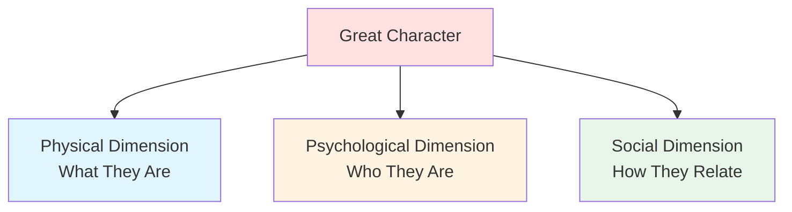

# 👤 Character Basics

> *The foundation of compelling characters: creating people readers remember*

---

## 📖 **Overview**

Characters are the **heart of your story**. They're the lens through which readers experience your narrative, the emotional anchors that make readers care, and the driving force behind every compelling plot. Great characters feel real, flawed, and utterly unforgettable.

### **Why Characters Matter:**
- 💖 **Emotional Connection:** Readers invest in people, not just plots
- 🎯 **Story Driver:** Characters create and resolve conflict
- 🌟 **Memorability:** Great characters outlive their stories
- 🎭 **Reader Identification:** We see ourselves in characters
- ⚡ **Agency:** Characters make choices that drive narrative

### **The Truth:**
> "Plot is no more than footprints left in the snow after your characters have run by on their way to incredible destinations."  
> — Ray Bradbury

---

## 🎯 **The Three Dimensions of Character**

Great characters have **depth**. They exist in three dimensions:

---

## 🎨 **PHYSICAL DIMENSION: What They Are**

### **What It Includes:**

#### **1. Appearance:**
Physical traits that readers can visualize
- **Age:** How old they are (or appear)
- **Height/Build:** Physical stature
- **Features:** Face, eyes, hair, distinctive marks
- **Clothing:** Style, preferences, economic indicators
- **Movement:** Posture, gait, gestures
- **Voice:** Tone, accent, speech patterns

#### **2. Health & Physicality:**
- Physical abilities and limitations
- Chronic conditions or disabilities
- Fitness level
- Energy levels
- Physical quirks or tics

#### **3. Distinctive Features:**
What makes them recognizable
- Scars, tattoos, birthmarks
- Unique mannerisms
- Memorable physical traits
- Signature accessories

### **Writing Physical Description:**

**❌ Don't:** Info-dump appearance
> "She was 5'6" with long brown hair, blue eyes, a thin nose, and wore a red dress."

**✅ Do:** Weave in naturally through action
> "She tucked a strand of brown hair behind her ear as she surveyed the room, her blue eyes narrowing. The red dress felt too tight for surveillance work."

### **Techniques:**

**Show Through Action:**
Reveal appearance through what characters do
- How they move
- What they interact with
- How others react to them

**Use POV:**
Filter through viewpoint character's perspective
- What would they notice?
- What matters to them?
- Their biases and observations

**Less Is More:**
Choose distinctive details, not comprehensive catalogs
- 2-3 memorable features
- Leave room for reader imagination
- Return to details when relevant

**Make It Matter:**
Physical traits that affect story or character
- Limp from old injury (backstory)
- Height creating insecurity (psychology)
- Appearance causing assumptions (theme)

---

## 🧠 **PSYCHOLOGICAL DIMENSION: Who They Are**

### **The Core Elements:**

#### **1. Personality:**
Fundamental traits and temperament

**The Big Five Personality Traits:**
- **Openness:** Curious vs. Cautious
- **Conscientiousness:** Organized vs. Spontaneous
- **Extraversion:** Outgoing vs. Reserved
- **Agreeableness:** Compassionate vs. Detached
- **Neuroticism:** Anxious vs. Stable

#### **2. Desires:**
What they want (driving force)

**Types of Desires:**
- **External Goal:** Tangible objective (win tournament, find treasure)
- **Internal Need:** Psychological fulfillment (acceptance, purpose)
- **Conscious Want:** What they think they want
- **Subconscious Need:** What they actually need

**Example:**
- **External Goal:** Katniss wants to survive the Games
- **Internal Need:** To accept love and vulnerability
- **Conflict:** Survival requires shutting out emotion; growth requires opening up

#### **3. Fears:**
What they're afraid of (creating obstacles)

**Types of Fears:**
- **Physical:** Death, pain, injury
- **Psychological:** Failure, rejection, inadequacy
- **Social:** Humiliation, abandonment, isolation
- **Existential:** Meaninglessness, loss of identity

**Make Fears Active:**
- Show how fear influences decisions
- Create situations forcing them to face fears
- Use fear as character development opportunity

#### **4. Values & Beliefs:**
What they stand for (moral compass)

**Core Values:**
- What's right and wrong
- What's worth fighting for
- What lines won't be crossed
- What they'll sacrifice for

**Examples:**
- Honesty over convenience
- Family above all else
- Individual freedom vs. collective good
- Pragmatism vs. idealism

#### **5. Flaws & Weaknesses:**
What holds them back (making them human)

**Types of Flaws:**
- **Moral Flaws:** Pride, greed, cowardice
- **Psychological Flaws:** Insecurity, paranoia, obsession
- **Behavioral Flaws:** Impulsiveness, passivity, arrogance
- **Skill Deficits:** Lacks necessary abilities

**Why Flaws Matter:**
- Make characters relatable
- Create internal conflict
- Drive character arcs
- Generate authentic obstacles
- Earn reader sympathy

**Example:**
- **Harry Potter:** Impulsive, sometimes arrogant
- **Elizabeth Bennet:** Prejudiced, too quick to judge
- **Hamlet:** Indecisive, overthinking

#### **6. Strengths & Skills:**
What they're good at (resources for conflict)

**Types:**
- **Physical Skills:** Combat, athletics, craftsmanship
- **Mental Abilities:** Intelligence, creativity, strategy
- **Emotional Strengths:** Empathy, courage, determination
- **Social Skills:** Leadership, persuasion, charm
- **Special Talents:** Magic, technology, unique abilities

**Balance:**
Strengths create interest, but shouldn't solve everything

---

## 🌍 **SOCIAL DIMENSION: How They Relate**

### **Social Elements:**

#### **1. Background:**
Where they come from

**Key Aspects:**
- **Socioeconomic Status:** Rich, poor, middle class
- **Education:** Formal schooling, self-taught, uneducated
- **Culture:** Ethnicity, nationality, regional identity
- **Family Structure:** Parents, siblings, extended family
- **Community:** Rural, urban, isolated, communal

#### **2. Relationships:**
Connections with others

**Important Relationships:**
- **Family:** Parents, siblings, children
- **Romantic:** Partners, love interests, exes
- **Friends:** Close friends, acquaintances
- **Rivals:** Competitors, enemies, antagonists
- **Mentors:** Teachers, guides, role models
- **Mentees:** Students, followers, protégés

#### **3. Social Role:**
Position in community

**Types of Roles:**
- Occupation/profession
- Family role (parent, child, sibling)
- Community position (leader, outcast, newcomer)
- Social status (respected, feared, ignored)

#### **4. Reputation:**
How others see them

**Consider:**
- Public perception vs. reality
- Different groups' different views
- Earned vs. inherited reputation
- Changing reputation through story

---

## 🎭 **Character Types & Roles**

### **By Function:**

#### **Protagonist:**
Main character driving the story
- POV character (often)
- Pursues main goal
- Undergoes primary transformation
- Reader's emotional anchor

#### **Antagonist:**
Opposes protagonist's goal
- Not necessarily evil
- Has own motivations
- Creates main conflict
- Forces protagonist to grow

#### **Supporting Characters:**
Aid or complicate protagonist's journey
- **Allies:** Help protagonist
- **Love Interests:** Romantic subplot
- **Mentors:** Provide guidance
- **Sidekicks:** Loyal companions
- **Foils:** Contrast with protagonist

#### **Minor Characters:**
Serve specific story functions
- Provide information
- Create obstacles
- Add texture to world
- Serve plot purposes

---

## 🎯 **Creating Believable Characters**

### **The Character Checklist:**

#### **✅ Consistency:**
Characters act according to their nature
- Established personality traits
- Consistent speech patterns
- Believable reactions
- Logical choices (for them)

**But Allow:**
- Growth and change
- Contradictions (humans are complex)
- Situational variation
- Surprises that make sense in retrospect

#### **✅ Motivation:**
Clear reasons for actions
- What do they want?
- Why do they want it?
- What will they do to get it?
- What won't they do?

#### **✅ Agency:**
Characters make choices
- Active, not passive
- Decisions drive plot
- Face consequences
- Have impact on story

#### **✅ Complexity:**
Multi-faceted personalities
- Strengths AND weaknesses
- Virtues AND flaws
- Public self AND private self
- Contradictions and nuances

#### **✅ Change:**
Growth through experience
- React to events
- Learn from mistakes
- Transform over time
- Arc from beginning to end

---

## 💡 **Character Development Techniques**

### **1. Backstory:**
Past events shaping present character

**What to Include:**
- Formative experiences
- Key relationships
- Traumas and triumphs
- Origin of fears and desires

**How Much to Include:**
- ⚠️ **Don't:** Dump entire history
- ✅ **Do:** Reveal as relevant
- ⚠️ **Don't:** Explain everything
- ✅ **Do:** Imply through behavior

### **2. Character Voice:**
Unique way of speaking and thinking

**Elements:**
- **Vocabulary:** Word choice, complexity
- **Syntax:** Sentence structure
- **Rhythm:** Pacing of speech
- **Perspective:** How they see world
- **Humor:** Type and frequency
- **References:** Cultural touchstones

**Example:**
- **Holden Caulfield:** Cynical, colloquial, repetitive ("phony")
- **Hermione Granger:** Precise, formal, informative
- **Tyrion Lannister:** Witty, sardonic, educated

### **3. Show, Don't Tell:**
Reveal character through action

**❌ Telling:**
> "John was brave."

**✅ Showing:**
> "John's hand trembled as he gripped the door handle, but he pushed it open anyway."

**Methods:**
- Actions and choices
- Dialogue and speech patterns
- Reactions to events
- Treatment of others
- Body language
- Internal thoughts (in POV)

### **4. Contrast & Conflict:**
Reveal through opposition

**Internal Conflict:**
- Want vs. need
- Desire vs. fear
- Values in opposition

**External Conflict:**
- Character vs. character
- Character vs. society
- Character vs. nature

**Pressure Reveals:**
Characters show true nature under stress

---

## 📝 **Character Creation Process**

### **Step 1: Concept**
Start with a seed
- Interesting trait
- Compelling conflict
- Unique role
- "What if..." question

### **Step 2: Core Elements**
Define essentials
- External goal
- Internal need
- Major flaw
- Greatest fear
- Core strength

### **Step 3: Background**
Build foundation
- Key past events
- Important relationships
- Formative experiences
- Current situation

### **Step 4: Voice & Personality**
Make them distinct
- How they speak
- How they think
- What they notice
- How they react

### **Step 5: Test & Refine**
Put them in situations
- How would they react to...?
- What would they say about...?
- What choice would they make when...?

---

## 🎨 **Character Profile Template**

### **Basic Information:**
- **Name:**
- **Age:**
- **Occupation:**
- **Role in Story:**

### **Physical:**
- **Appearance:** (2-3 distinctive features)
- **Physical Traits:** (anything affecting story)

### **Psychological:**
- **Personality:** (key traits)
- **External Goal:** (what they want to achieve)
- **Internal Need:** (what they need to learn/gain)
- **Greatest Fear:**
- **Core Flaw:**
- **Main Strength:**

### **Social:**
- **Background:** (relevant history)
- **Key Relationships:**
- **Social Position:**

### **Voice:**
- **Speech Pattern:**
- **Vocabulary Level:**
- **Key Phrases:**

---

## 🎯 **Common Character Mistakes**

<b>❌ Pitfalls to Avoid</b>

### **Mary Sue/Gary Stu:**
- **Problem:** Character too perfect, no real flaws
- **Fix:** Give genuine weaknesses and failures

### **Info-Dumping:**
- **Problem:** Explaining everything about character at once
- **Fix:** Reveal gradually through action and dialogue

### **Inconsistency:**
- **Problem:** Character acts out of character
- **Fix:** Ensure actions align with established traits

### **Passive Protagonist:**
- **Problem:** Things happen TO character, not BY character
- **Fix:** Give character agency and active choices

### **No Arc:**
- **Problem:** Character same at end as beginning
- **Fix:** Plan meaningful change or growth

### **Stereotypes:**
- **Problem:** Relying on clichés instead of individuals
- **Fix:** Add specific, unique details and motivations

### **All Tell, No Show:**
- **Problem:** Describing character instead of demonstrating
- **Fix:** Show traits through action and dialogue

### **Too Many Characters:**
- **Problem:** Readers can't track everyone
- **Fix:** Merge roles, cut unnecessary characters

### **Unmotivated Actions:**
- **Problem:** Character does things for plot convenience
- **Fix:** Ensure every action has character-driven reason

### **No Internal Life:**
- **Problem:** Character is just external actions
- **Fix:** Show thoughts, feelings, reactions

---

## 📚 **Character Examples to Study**

### **Complex Protagonists:**
- **Elizabeth Bennet** (*Pride and Prejudice*) — Witty but prejudiced
- **Harry Potter** — Brave but impulsive, sometimes arrogant
- **Katniss Everdeen** — Strong but emotionally closed-off
- **Tyrion Lannister** — Intelligent but cynical, uses wit as shield

### **Memorable Antagonists:**
- **Darth Vader** — Tragic villain with redemption arc
- **Hannibal Lecter** — Sophisticated evil with code
- **Amy Dunne** (*Gone Girl*) — Complex, sympathetic yet terrifying
- **Cersei Lannister** — Understandable motivations, terrible methods

### **Supporting Characters:**
- **Samwise Gamgee** — Loyal friend, essential to hero's success
- **Hermione Granger** — Intelligent ally with own arc
- **Ron Weasley** — Flawed but loveable friend
- **Dr. Watson** — Narrator, audience surrogate, competent companion

---

## 💡 **Character Development Exercises**

### **Exercise 1: Interview Your Character**
Ask them questions:
- What's your greatest fear?
- What's your happiest memory?
- What do you want more than anything?
- What line won't you cross?
- Who do you trust most? Why?

### **Exercise 2: Ordinary Moments**
Write character doing mundane tasks:
- Making breakfast
- Shopping for groceries
- Commuting to work
- Waiting in line

How do personality, mood, background show in these moments?

### **Exercise 3: Pressure Test**
Place character in difficult scenarios:
- They find a wallet full of cash
- Someone insults their best friend
- They must choose between two loved ones
- They discover a terrible secret

What do they do? Why?

### **Exercise 4: Opposite Perspective**
Write scene from antagonist's POV
- What do they want?
- Why are they "right"?
- How do they justify actions?

Makes antagonist more complex and believable

### **Exercise 5: Character Relationships**
Write scenes between characters:
- First meeting
- Argument
- Moment of trust
- Betrayal

Relationships reveal character

---

## 🔗 **Related Resources**

### **Within This Repository:**
- 📖 **[Character Arcs](character-arcs.md)** — How characters change
- 🎯 **[Motivation & Goals](motivation-goals.md)** — What drives characters
- 📚 **[Backstory](backstory.md)** — Building character history
- 💑 **[Relationships](relationships.md)** — Character connections
- ⚔️ **[Protagonist & Antagonist](protagonist-antagonist.md)** — Main character roles

### **Templates:**
- 📋 **[Character Sheets](../../../templates/character-sheets/)** — Development worksheets
- 🗺️ **[Character Arc Worksheet](../../../templates/character-sheets/character-arc-worksheet.md)**

### **Examples:**
- 📖 **[Character Examples](../../../examples/character-examples/)** — Analyzed characters
- 📊 **[Story Analysis](../../../examples/story-analysis/)** — Characters in context

### **Craft:**
- ✍️ **[Dialogue Techniques](../dialogue-techniques/)** — Character voice in dialogue
- 🎭 **[POV & Perspective](../../craft/pov-perspective/)** — Character as narrator

---

## 📖 **Recommended Reading**

### **Books on Character:**
- *The Art of Character* — David Corbett
- *Creating Character Arcs* — K.M. Weiland
- *Characters & Viewpoint* — Orson Scott Card
- *The Emotional Craft of Fiction* — Donald Maass

---

### **Characters Are Story — Make Them Unforgettable 👤**

*Great characters drive great stories. Invest in making yours real, flawed, and compelling.*

**[⬅️ Back to Character Development](README.md)** | **[📚 Fundamentals](../README.md)**

