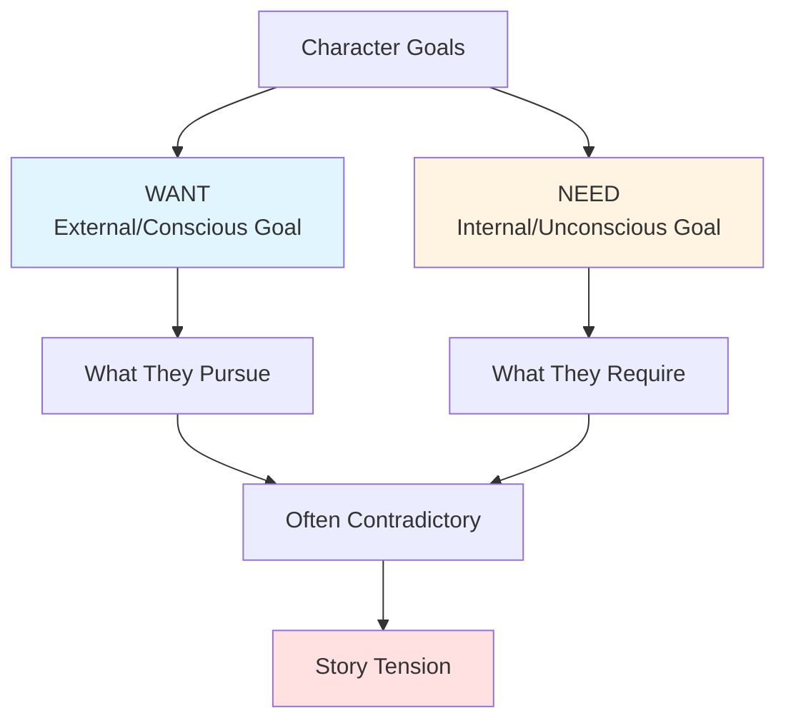

# 🎯 Motivation & Goals

> *What drives your characters: the engine of story and the heart of conflict*

---

## 📖 **Overview**

**Motivation** is the **why** behind everything your characters do. It's the driving force that propels them through the story, makes their choices believable, and creates the foundation for compelling conflict. Without clear motivation, characters feel hollow and their actions arbitrary.

### **Why Motivation Matters:**
- ⚡ **Drives Plot:** Motivated characters create story through action
- 🎯 **Creates Conflict:** Competing motivations = drama
- 💖 **Builds Empathy:** Understanding why makes us care
- ✅ **Ensures Consistency:** Motivation guides authentic choices
- 🎭 **Reveals Character:** What they want shows who they are

### **The Golden Rule:**
> "Every character is the hero of their own story."  
> — Everyone has reasons for what they do, even villains

---

## 🎯 **Want vs. Need: The Core Duality**

The most powerful character motivations involve **two goals in conflict**:



---

### **THE WANT: External Goal**

**What It Is:**
The **conscious, plot-driven objective** the character actively pursues.

**Characteristics:**
- **Tangible:** Can be achieved or failed
- **Specific:** Clear, measurable objective
- **Active:** Character works toward it
- **Plot-Driving:** Creates external story
- **Often Wrong:** May not lead to fulfillment

**Examples:**

| Character | Want (External Goal) |
|-----------|---------------------|
| **Harry Potter** | Defeat Voldemort |
| **Katniss Everdeen** | Survive the Hunger Games |
| **Elizabeth Bennet** | Find love on her own terms |
| **Frodo Baggins** | Destroy the Ring in Mordor |
| **Bruce Wayne** | Clean up Gotham's crime |
| **Luke Skywalker** | Become a Jedi, defeat Empire |

**Function in Story:**
- Creates plot structure
- Generates obstacles
- Provides story question
- Drives external conflict
- Gives readers something to root for

---

### **THE NEED: Internal Goal**

**What It Is:**
The **unconscious, emotional requirement** for the character's growth and fulfillment.

**Characteristics:**
- **Psychological:** About growth, healing, understanding
- **Often Unknown:** Character may not recognize it
- **Thematic:** Connects to story's theme
- **Arc-Driving:** Creates internal transformation
- **Actually Fulfilling:** What truly makes them whole

**Examples:**

| Character | Need (Internal Goal) |
|-----------|---------------------|
| **Harry Potter** | Accept love and belonging |
| **Katniss Everdeen** | Trust others and open her heart |
| **Elizabeth Bennet** | Overcome prejudice and see clearly |
| **Frodo Baggins** | Find courage and inner strength |
| **Bruce Wayne** | Heal from trauma, accept help |
| **Luke Skywalker** | Trust the Force, have faith |

**Function in Story:**
- Creates character arc
- Drives internal conflict
- Embodies theme
- Provides emotional resolution
- Delivers deep satisfaction

---

### **THE CONFLICT: Want vs. Need**

**The Tension:**
Pursuing the want often **prevents** achieving the need.

**Why This Works:**
- Creates internal conflict
- Forces difficult choices
- Builds complexity
- Raises stakes
- Makes character relatable

**The Journey:**
```
Beginning: Focuses on WANT
Middle: Realizes WANT isn't enough
Crisis: Chooses between WANT and NEED
Climax: Must have NEED to achieve WANT
End: Gets NEED (and maybe WANT)
```

**Example: Katniss Everdeen**

**Want:** Survive the Hunger Games
**Need:** Learn to trust and love

**Conflict:** 
- Survival requires emotional armor
- Love requires vulnerability
- Can't have both... or can she?

**Resolution:**
- Must accept love to truly survive
- Fake romance becomes real
- Vulnerability becomes strength
- Gets both want and need

---

## 🔥 **Types of Motivation**

### **1. Survival:**
Most primal motivation
- **Physical:** Stay alive
- **Economic:** Make living
- **Social:** Maintain status

**Examples:**
- Katniss in Hunger Games
- Fugitives in thrillers
- Characters in dystopias

**Why It Works:**
Universal, relatable, high stakes

---

### **2. Love:**
Seeking connection and affection
- **Romantic:** Find/keep partner
- **Familial:** Protect family
- **Friendship:** Build bonds
- **Belonging:** Find community

**Examples:**
- Elizabeth Bennet (Pride and Prejudice)
- Westley (The Princess Bride)
- Marlin (Finding Nemo)

**Why It Works:**
Deeply human, emotional resonance

---

### **3. Power:**
Control over self, others, or situation
- **Authority:** Leadership, control
- **Influence:** Shape events
- **Autonomy:** Self-determination
- **Domination:** Conquest

**Examples:**
- Macbeth (ambition)
- Frank Underwood (House of Cards)
- Cersei Lannister (Game of Thrones)

**Why It Works:**
Relatable desire, creates conflict

---

### **4. Justice:**
Righting wrongs, seeking fairness
- **Revenge:** Punish wrongdoers
- **Protection:** Defend innocents
- **Reform:** Change unjust system
- **Truth:** Expose corruption

**Examples:**
- Batman (justice through vigilantism)
- Atticus Finch (legal justice)
- Erin Brockovich (corporate accountability)

**Why It Works:**
Moral clarity, righteous cause

---

### **5. Knowledge:**
Seeking truth or understanding
- **Discovery:** Uncover secrets
- **Understanding:** Make sense of world
- **Mastery:** Learn skills
- **Wisdom:** Gain enlightenment

**Examples:**
- Sherlock Holmes (solve mysteries)
- Scientists in sci-fi
- Students in coming-of-age

**Why It Works:**
Intellectual engagement, mystery

---

### **6. Achievement:**
Accomplishing goals, proving worth
- **Success:** Win, excel, triumph
- **Recognition:** Earn respect
- **Legacy:** Leave mark on world
- **Self-Actualization:** Reach potential

**Examples:**
- Athletes in sports stories
- Artists seeking recognition
- Entrepreneurs building empires

**Why It Works:**
Aspirational, competitive tension

---

### **7. Identity:**
Understanding self, finding place
- **Self-Discovery:** Who am I?
- **Purpose:** Why am I here?
- **Belonging:** Where do I fit?
- **Authenticity:** Be true self

**Examples:**
- Coming-of-age protagonists
- Harry Potter (discovering identity)
- Many YA protagonists

**Why It Works:**
Universal human question

---

### **8. Redemption:**
Atoning for past wrongs
- **Forgiveness:** Earn absolution
- **Change:** Become better person
- **Reparation:** Fix what was broken
- **Second Chance:** Prove transformation

**Examples:**
- Ebenezer Scrooge
- Severus Snape
- Jaime Lannister

**Why It Works:**
Hope for change, moral complexity

---

## 🎭 **Motivation in Different Character Types**

### **Protagonist:**

**Primary Motivation:**
- Drives main plot
- Creates story question
- Often combines want and need
- Develops through story

**Complexity:**
Should have:
- Clear external goal (want)
- Deep internal need
- Competing desires
- Moral struggles

---

### **Antagonist:**

**Essential Truth:**
**Every antagonist must have motivation**

**Common Mistake:**
"They're evil" is NOT motivation

**Better Approach:**
Antagonists are protagonists of their own stories

**Types of Antagonist Motivation:**

**Believes They're Right:**
- Sees self as hero
- Has justifiable reasons (from their POV)
- Methods are questionable
- Goals might even be sympathetic

**Example:** Thanos (believes killing half saves universe)

**Wants Same Thing as Protagonist:**
- Competing for same goal
- Different methods
- Creates direct conflict

**Example:** Rival detective in mystery

**Opposite Values:**
- Fundamentally different worldview
- Clash of ideologies
- Neither necessarily evil

**Example:** Magneto vs. Xavier (both want mutant safety, different approaches)

**Personal Vendetta:**
- Past history with protagonist
- Seeking revenge or justice
- Personal stakes

**Example:** Count of Monte Cristo antagonists

---

### **Supporting Characters:**

**Should Have:**
- Own goals (not just helping protagonist)
- Personal stakes in outcome
- Reasons for involvement
- Independent existence

**Common Roles & Motivations:**

**Mentor:**
- Guide next generation
- Atone for past failures
- Achieve through proxy
- Fulfill duty

**Sidekick:**
- Friendship/loyalty
- Own adventure
- Prove worth
- Personal growth

**Love Interest:**
- Own story arc
- Independent goals
- Reasons beyond romance
- Agency and choice

---

## 💡 **Creating Strong Motivation**

### **Make It Personal:**

**❌ Weak:** Character must save world
**✅ Strong:** Character must save world to protect loved one

**❌ Weak:** Detective solves crime for job
**✅ Strong:** Detective solves crime because victim resembles their child

**The Difference:**
Personal stakes create emotional investment

---

### **Make It Specific:**

**❌ Vague:** Character wants happiness
**✅ Specific:** Character wants to open bakery in hometown

**❌ Vague:** Character seeks revenge
**✅ Specific:** Character will ruin antagonist's business, not kill them

**The Difference:**
Specific goals create clear conflicts and satisfaction

---

### **Make It Justified:**

**Requirements:**
- Understandable reasons
- Proportional to goal
- Rooted in character
- Earned through backstory

**Test:**
Would audience do same thing in character's position?

---

### **Make It Cost Something:**

**Strong Motivation Requires Sacrifice:**
- Time and effort
- Relationships
- Comfort and safety
- Other opportunities
- Parts of self

**The Principle:**
What character willing to give up shows how much they want it

**Examples:**
- **Katniss:** Volunteers for death game to save sister
- **Frodo:** Carries Ring despite knowing it will destroy him
- **Elizabeth:** Rejects Mr. Collins despite financial pressure

---

### **Make It Complex:**

**Layer Multiple Motivations:**
- Primary goal
- Secondary goals
- Conflicting desires
- Hidden motivations
- Evolving priorities

**Example: Batman**
- **Surface:** Fight crime
- **Deeper:** Prevent others' pain
- **Deepest:** Punish self for failure to save parents
- **Conflict:** Justice vs. vengeance

---

## 🔄 **Motivation Through Story**

### **Beginning: Establish**

**Show Motivation in Action:**
- What do they pursue?
- What do they avoid?
- What do they sacrifice?
- What do they prioritize?

**Techniques:**
- Opening scene showing pursuit of goal
- Dialogue revealing desires
- Choices demonstrating priorities
- Conflicts exposing values

---

### **Middle: Test**

**Challenge Motivation:**
- Obstacles that make goal harder
- Temptations to change direction
- Consequences of pursuit
- Costs mounting

**Questions to Raise:**
- Is it worth it?
- Am I doing right thing?
- Do I still want this?
- What am I becoming?

---

### **Crisis: Choose**

**Force Decision:**
- Can't have everything
- Must prioritize
- Choose between want and need
- Reveal true motivation

**The Defining Moment:**
What character chooses shows who they truly are

---

### **Climax: Prove**

**Demonstrate Commitment:**
- Act on chosen motivation
- Face consequences
- Sacrifice for goal
- Achieve or fail

**Requirements:**
- Must be character's choice
- Must reflect character development
- Must be earned
- Must satisfy emotionally

---

### **End: Fulfill or Transform**

**Resolution:**
- Get what they needed (if positive arc)
- Lose what they wanted (if tragic)
- Achieve synthesis (if complex)

**Show:**
- Whether goal achieved
- How character changed
- What was learned
- New equilibrium

---

## 🎯 **Motivation Checklist**

### **For Each Major Character:**

- [ ] **Clear Want:** What external goal do they pursue?
- [ ] **Deep Need:** What internal requirement drives them?
- [ ] **Why:** What's the reason/backstory behind motivation?
- [ ] **Cost:** What are they willing to sacrifice?
- [ ] **Stakes:** What happens if they fail?
- [ ] **Obstacles:** What prevents achieving goal?
- [ ] **Conflict:** What competing desires create tension?
- [ ] **Evolution:** How does motivation change through story?

---

## 🎯 **Common Motivation Mistakes**

<details>
<summary><b>❌ Pitfalls to Avoid</b></summary>

### **No Clear Motivation:**
- **Problem:** Character wanders aimlessly
- **Fix:** Establish concrete goal early

### **Unmotivated Actions:**
- **Problem:** Character does things for plot convenience
- **Fix:** Every action must have character-driven reason

### **Weak Stakes:**
- **Problem:** Don't care if character succeeds
- **Fix:** Make goal personally important

### **Too Easy:**
- **Problem:** No real sacrifice required
- **Fix:** Make pursuit cost something

### **Inconsistent Motivation:**
- **Problem:** Character's desires change randomly
- **Fix:** Motivation evolution must be earned

### **Motivation = Plot Device:**
- **Problem:** Goal exists only to create plot
- **Fix:** Goal must matter to character, not just story

### **No Internal Need:**
- **Problem:** Only external want, no depth
- **Fix:** Add psychological requirement for growth

### **Evil for Evil's Sake:**
- **Problem:** Antagonist has no real motivation
- **Fix:** Give villain justifiable reasons (from their POV)

### **Telling Not Showing:**
- **Problem:** Explain motivation in exposition
- **Fix:** Demonstrate through choices and actions

### **Multiple Incompatible Motivations:**
- **Problem:** Too many goals, none developed
- **Fix:** Choose primary motivation, others as secondary

</details>

---

## 💡 **Motivation Development Exercises**

### **Exercise 1: The "Why" Ladder**
Ask "Why?" five times:
1. Character wants to win tournament
2. Why? To prove they're skilled
3. Why? To earn father's approval
4. Why? Because father never acknowledged them
5. Why? Because father grieving, emotionally absent
6. Core: Character needs to be seen and valued

### **Exercise 2: Want vs. Need Statement**
Complete:
"My character wants _____, but needs _____."
"They conflict because _____."
"The character must learn _____."

### **Exercise 3: Sacrifice Scale**
What would character give up for their goal?
- Money?
- Time?
- Relationships?
- Integrity?
- Life?

Shows strength of motivation

### **Exercise 4: Antagonist Perspective**
Write scene from antagonist's POV
- What do they want?
- Why is it important?
- How are they the hero?
- Why is protagonist wrong?

### **Exercise 5: Goal Evolution**
Chart how goals change:
- Chapter 1 goal:
- Quarter point goal:
- Midpoint goal:
- Crisis goal:
- End goal:

Should show development

---

## 🔗 **Related Resources**

- 📖 **[Character Basics](character-basics.md)** — Foundation of character
- 📈 **[Character Arcs](character-arcs.md)** — How goals drive change
- 📚 **[Backstory](backstory.md)** — Origin of motivation
- ⚔️ **[Protagonist & Antagonist](protagonist-antagonist.md)** — Conflicting goals
- 💑 **[Relationships](relationships.md)** — Interpersonal motivations

---

## 📖 **Recommended Reading**

- *Story Genius* — Lisa Cron
- *The Anatomy of Story* — John Truby
- *Creating Character Arcs* — K.M. Weiland
- *Save the Cat!* — Blake Snyder

---

<div align="center">

### **Motivation Is Everything — Make It Matter 🎯**

*Clear, personal, and complex motivation is the engine of compelling story. Know what drives your characters.*

**[⬅️ Back to Character Development](README.md)** | **[📚 Fundamentals](../README.md)**

</div>
