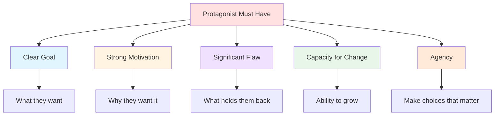
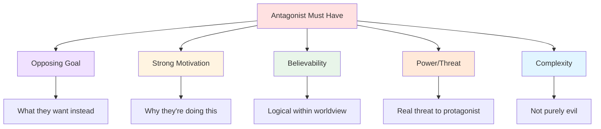
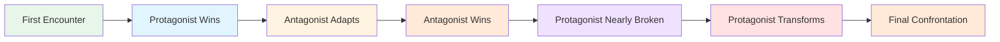

# 🎭 Protagonist & Antagonist

> *The Hero and the Opposition: crafting the heart of your story*

---

## 📖 **Overview**

The **protagonist** and **antagonist** form the central dynamic of your story. The protagonist drives the narrative forward, pursuing a goal, while the antagonist provides opposition, creating the conflict necessary for drama. Understanding these roles deeply is essential to crafting compelling fiction.

### **Why They Matter:**
- ⚡ **Create Conflict:** Opposition generates drama
- 🎯 **Drive Plot:** Their struggle is the story
- 💡 **Embody Theme:** Represent story's ideas
- 💔 **Generate Stakes:** What's won or lost
- 🌟 **Provide Structure:** Beginning to end arc

### **The Golden Rule:**
> "A protagonist is only as good as their antagonist. The stronger the opposition, the more compelling the hero's journey."  
> — The antagonist makes the protagonist earn their victory

---

## 🦸 **The Protagonist**

### **Definition:**

The **protagonist** is:
- The character whose story this is
- Who pursues the primary goal
- Who undergoes the main character arc
- Whose perspective we follow (usually)
- Who we're meant to root for (usually)

**Not Always:**
- The hero (can be antihero)
- Morally good (can be flawed or bad)
- Likeable (but should be interesting)
- The POV character (though often is)

---

### **Essential Protagonist Elements:**

---

### **1. The Goal:**

**What the Protagonist Wants:**
- External goal (plot level)
- Concrete and achievable
- Significant stakes if fails
- Drives story forward
- Tests character

**Examples:**

| Story | Protagonist | External Goal |
|-------|-------------|---------------|
| **The Hunger Games** | Katniss | Survive the games, protect Prim |
| **The Lord of the Rings** | Frodo | Destroy the One Ring |
| **Finding Nemo** | Marlin | Rescue his son |
| **Die Hard** | John McClane | Save the hostages (and his wife) |
| **Pride and Prejudice** | Elizabeth | Find her place, marry well (on her terms) |

---

### **2. The Motivation:**

**Why the Protagonist Wants It:**
- Internal need (character level)
- Emotional drive
- Often unconscious
- Revealed through arc
- More important than goal

**Want vs. Need:**

**External Want:**
- What they think they need
- Conscious desire
- Drives plot
- May be misguided
- Surface level

**Internal Need:**
- What they actually need
- Often unconscious
- Drives arc
- True satisfaction
- Thematic

**Examples:**

| Protagonist | Want | Need |
|-------------|------|------|
| **Luke Skywalker** | Adventure, to leave Tatooine | To believe in himself, find his place |
| **Elsa** | To hide her powers | To accept herself, connect with Anna |
| **Walter White** | Money for family | Validation, power, ego satisfaction |
| **Elizabeth Bennet** | Security, respect | To overcome prejudice, find true partnership |

---

### **3. The Flaw:**

**What Holds Them Back:**
- Internal weakness
- False belief or lie
- Character weakness
- Blindspot
- Must overcome to succeed

**Types of Flaws:**

**Moral Flaw:**
- Selfishness
- Dishonesty
- Cowardice
- Cruelty
- Pride

**Psychological Flaw:**
- Fear
- Distrust
- Low self-worth
- Trauma response
- Rigidity

**Situational Flaw:**
- Lack of skill
- Ignorance
- Wrong assumption
- Misunderstanding
- Limited perspective

**Examples:**

| Protagonist | Flaw | Impact |
|-------------|------|--------|
| **Batman** | Inability to let go of past | Isolates self, can't move forward |
| **Hamlet** | Indecision, overthinking | Delays action, causes more death |
| **Jay Gatsby** | Obsession with past, delusion | Can't accept reality, leads to death |
| **Katniss** | Emotional walls, distrust | Pushes away those who care |

---

### **4. The Arc:**

**How They Change:**
- Overcome flaw
- Learn truth
- Grow and transform
- Earn the goal
- Become who they need to be

See **[Character Arcs](character-arcs.md)** for detailed analysis.

---

### **5. Agency:**

**They Must Make Choices:**
- Active, not passive
- Decisions drive plot
- Face consequences
- Take responsibility
- Drive their own story

**❌ Passive Protagonist:**
> Things happen TO character, they react

**✅ Active Protagonist:**
> Character makes things happen, drives story

**Examples:**

**Passive:** Harry Potter (early books)
- Rescued repeatedly
- Led by others
- Things happen to him
- (Grows more active later)

**Active:** Katniss Everdeen
- Volunteers for sister
- Makes alliance decisions
- Takes risks
- Drives rebellion

---

## 🎭 **Types of Protagonists**

### **1. The Hero:**

**Characteristics:**
- Morally good
- Selfless
- Courageous
- Inspiring
- Saves others

**Examples:**
- Superman
- Captain America
- Frodo Baggins
- Harry Potter
- Katniss Everdeen

**Story Type:** Adventure, epic, heroic fantasy

---

### **2. The Antihero:**

**Characteristics:**
- Morally gray
- Flawed and complex
- Selfish or cynical
- Unconventional methods
- Relatable struggles

**Types:**

**Reluctant Hero:**
- Doesn't want responsibility
- Forced into action
- Grows into role
- Examples: Han Solo, Mad Max

**Pragmatic Hero:**
- Does what's necessary
- Ends justify means
- Morally flexible
- Examples: Jack Bauer, Dexter

**Villain Protagonist:**
- Actually a bad person
- We follow anyway
- Character study
- Examples: Walter White, Patrick Bateman

---

### **3. The Everyman:**

**Characteristics:**
- Ordinary person
- Relatable
- Thrown into extraordinary situation
- Represents reader
- Learns and grows

**Examples:**
- Bilbo Baggins
- Lucy Pevensie
- Neo (*The Matrix*)
- Arthur Dent

**Story Type:** Hero's journey, fish-out-of-water

---

### **4. The Chosen One:**

**Characteristics:**
- Destined for greatness
- Special abilities
- Prophesied
- Burden of fate
- Must accept role

**Examples:**
- Harry Potter
- Neo
- Anakin Skywalker
- Paul Atreides

**Story Type:** Epic fantasy, sci-fi, mythic

---

### **5. The Ensemble:**

**Characteristics:**
- Multiple protagonists
- Shared goal
- Different perspectives
- Interwoven arcs
- Collective journey

**Examples:**
- *Ocean's Eleven*
- *The Avengers*
- *Game of Thrones*
- *The Lord of the Rings* (fellowship)

**Story Type:** Heist, ensemble cast, epic

---

## 😈 **The Antagonist**

### **Definition:**

The **antagonist** is:
- The force opposing the protagonist
- Source of conflict
- Tests the hero
- Represents thematic opposition
- Makes the protagonist prove themselves

**Not Always:**
- A person (can be nature, society, self)
- Evil (can be well-intentioned)
- The villain (can be sympathetic)
- Wrong (in their perspective)

---

### **Essential Antagonist Elements:**

---

### **1. Opposing Goal:**

**What Antagonist Wants:**
- Directly conflicts with protagonist
- Can't both win
- Equally valid (to them)
- Creates central conflict
- Drives opposition

**Examples:**

| Story | Protagonist Goal | Antagonist Goal |
|-------|------------------|-----------------|
| **Harry Potter** | Stop Voldemort | Kill Harry, rule wizards |
| **The Dark Knight** | Stop crime, save city | Prove everyone is corruptible |
| **Black Panther** | Protect Wakanda as is | Share Wakanda's resources by force |
| **Frozen** | Control powers | Exploit Elsa's weakness |

---

### **2. Strong Motivation:**

**Why Antagonist Opposes:**
- Believes they're right
- Personal stakes
- Justified (to them)
- Sympathetic (ideally)
- Makes sense

**❌ Weak Antagonist:**
> "Evil for evil's sake"

**✅ Strong Antagonist:**
> "I'm doing what's necessary, what you're too weak to do"

**Examples:**

**Magneto:**
- Survived Holocaust
- Believes humans will always persecute mutants
- Wants to strike first
- Sympathetic, understandable, wrong methods

**Thanos:**
- Saw his planet die from overpopulation
- Believes he's saving universe
- Willing to sacrifice for greater good
- Logical (in his view), horrifying

---

### **3. The Threat:**

**Antagonist Must Be:**
- **Powerful:** Real threat to protagonist
- **Competent:** Intelligent and capable
- **Proactive:** Makes moves, not just reacts
- **Escalating:** Gets more dangerous
- **Personal:** Attacks what protagonist cares about

**Measuring Threat:**

**Physical:** Can overpower protagonist  
**Intellectual:** Outsmarts protagonist  
**Social:** Undermines protagonist's support  
**Psychological:** Attacks protagonist's mind  
**Moral:** Corrupts or tempts protagonist

---

### **4. Complexity:**

**Beyond Pure Evil:**
- Understandable motivation
- Humanizing details
- Own relationships
- Moments of doubt
- Sympathetic elements

**The Best Villains:**
- Think they're the hero
- Have valid point
- Understandable methods (even if extreme)
- Make protagonist question self
- Represent real-world evil

**Examples:**

**Walter White's Antagonists:**
- Gus Fring: Businessman, calculated, family man
- Hank: Literally a good guy, just opposes Walt
- Jack: Pure evil (weakest antagonist)

**The Joker:**
- *Dark Knight* version: Philosophy of chaos, testing Batman
- Sympathetic? No. Compelling? Absolutely.
- Represents Batman's dark mirror

---

## 🎭 **Types of Antagonists**

### **1. The Villain:**

**Characteristics:**
- Actively evil
- Selfish or cruel
- Enjoys causing harm
- No redeeming qualities
- Pure opposition

**Examples:**
- Voldemort
- Sauron
- Emperor Palpatine

**When to Use:** 
- Clear good vs. evil
- Genre expectations (fantasy, superhero)
- When theme requires absolute evil

---

### **2. The Sympathetic Antagonist:**

**Characteristics:**
- Understandable motivation
- Tragic backstory
- Believes they're right
- Humanizing details
- Could have been protagonist

**Examples:**
- Magneto
- Killmonger
- Thanos
- Roy Batty

**When to Use:**
- Complex moral questions
- Thematic depth
- Gray morality
- Character study

---

### **3. The Hero Antagonist:**

**Characteristics:**
- Actually a good person
- Opposes protagonist legitimately
- May be more moral than protagonist
- Doing their job/duty
- Forces protagonist to question self

**Examples:**
- Javert (*Les Misérables*)
- Inspector Zenigata (*Lupin III*)
- Will Graham vs. Hannibal
- Hank vs. Walter White

**When to Use:**
- Antihero protagonist
- Moral complexity
- No easy answers
- Internal conflict emphasis

---

### **4. The Force of Nature:**

**Characteristics:**
- Not a person
- Nature, disaster, disease
- Unstoppable force
- Survival story
- Tests character

**Examples:**
- Shark (*Jaws*)
- Storm (*The Perfect Storm*)
- Space (*Gravity*, *The Martian*)
- Nature (*Into the Wild*)

**When to Use:**
- Survival story
- Man vs. nature
- Internal arc emphasis
- Minimalist cast

---

### **5. Society/System:**

**Characteristics:**
- Social structure
- Government, institution
- Cultural norms
- Impersonal evil
- Systemic oppression

**Examples:**
- The Capitol (*Hunger Games*)
- The Party (*1984*)
- Society (*The Handmaid's Tale*)
- Racism (*To Kill a Mockingbird*)

**When to Use:**
- Social commentary
- Dystopian fiction
- Political themes
- Cultural critique

---

### **6. The Self:**

**Characteristics:**
- Internal conflict
- Protagonist is own worst enemy
- Psychological struggle
- Addiction, fear, trauma
- Must overcome self

**Examples:**
- Addiction (*Requiem for a Dream*)
- Mental illness (*Black Swan*)
- Self-doubt (*The King's Speech*)
- Trauma (*Manchester by the Sea*)

**When to Use:**
- Character study
- Internal journey
- Psychological drama
- Literary fiction

---

## ⚖️ **The Protagonist-Antagonist Dynamic**

### **They Should Be Mirrors:**

**Similar But Opposite:**
- Faced same choice, made opposite decision
- Same flaw manifested differently
- Same goal, different methods
- Same trauma, different response

**Examples:**

| Story | Protagonist | Antagonist | Mirror |
|-------|-------------|------------|--------|
| **Batman** | Batman | Joker | Order vs. Chaos |
| **Black Panther** | T'Challa | Killmonger | Both want to help black people, different methods |
| **Harry Potter** | Harry | Voldemort | Both orphans, both powerful, different choices |
| **Breaking Bad** | Walter White | Gus Fring | Both drug lords, both pride-driven |

---

### **Escalation:**

**The Conflict Should Intensify:**

---

### **Personal Stakes:**

**Make It Personal:**
- Antagonist attacks what protagonist loves
- Personal history between them
- Philosophical opposition
- Represents protagonist's fear
- Forces personal growth

**Examples:**

**Impersonal:** "I must stop the evil empire"  
**Personal:** "He killed my father and wants to kill me too"

**Impersonal:** "The virus is spreading"  
**Personal:** "My daughter is infected"

---

## 🎨 **Crafting Compelling Heroes and Villains**

### **For Protagonists:**

**✅ DO:**
- Give them clear goal and stakes
- Make them active, not passive
- Give them flaws to overcome
- Make them earn their victory
- Show growth and change
- Give them tough choices
- Make them relatable

**❌ DON'T:**
- Make them perfect
- Let them be passive
- Give them easy wins
- Make them inconsistent
- Forget their agency
- Make them special for no reason
- Make them too unlikeable (unless antihero)

---

### **For Antagonists:**

**✅ DO:**
- Give them strong motivation
- Make them believe they're right
- Make them competent and threatening
- Give them complexity
- Show their perspective
- Make them escalate
- Connect them to theme

**❌ DON'T:**
- Make them evil for evil's sake
- Make them incompetent
- Make them one-dimensional
- Forget their humanity
- Make them too weak
- Introduce them too late
- Make them monologue endlessly

---

## ⚠️ **Common Mistakes**

<b>❌ Pitfalls to Avoid</b>

### **Protagonist Mistakes:**

**The Chosen One Syndrome:**
- Special for no reason
- Doesn't earn power
- Everything handed to them
- No real struggle

**Passive Protagonist:**
- Things happen TO them
- Other characters drive story
- No real choices
- Lacks agency

**Too Perfect:**
- No flaws
- Always right
- Never struggles
- Boring

**Too Unlikeable:**
- No redeeming qualities
- Can't root for them
- Cruel without reason
- (Unless intentional antihero)

**Inconsistent:**
- Acts out of character
- Changes arbitrarily
- Motivated by plot, not character
- Unbelievable

---

### **Antagonist Mistakes:**

**Purely Evil:**
- No motivation
- Evil for evil's sake
- One-dimensional
- Boring

**Too Weak:**
- Not real threat
- Easily defeated
- Protagonist wins easily
- No tension

**Incompetent:**
- Makes stupid mistakes
- Protagonist wins through antagonist's stupidity
- Not believable
- Unsatisfying

**Introduced Too Late:**
- No time to establish threat
- Rushed conflict
- No buildup
- Weak payoff

**The Monologuer:**
- Explains entire plan
- Gives protagonist time to escape
- Unrealistic
- Cliché

---

## 💡 **Development Exercises**

### **Exercise 1: Goal Clarity**
For your protagonist:
- What do they want? (external)
- What do they need? (internal)
- Why do they want it?
- What's stopping them?
- What will they sacrifice for it?

### **Exercise 2: The Antagonist's Story**
Write your story from antagonist's POV:
- They're the hero of their story
- Why are they doing this?
- Why is protagonist wrong?
- What are their stakes?

### **Exercise 3: The Mirror**
How are protagonist and antagonist similar?
- Same trait, different expression
- Same choice point, different decision
- Same goal, different methods
- What does antagonist represent?

### **Exercise 4: The Test**
Design three escalating tests:
1. Antagonist tests protagonist's strength
2. Antagonist tests protagonist's resolve
3. Antagonist tests protagonist's soul

### **Exercise 5: The Personal**
How does antagonist make it personal?
- What do they attack?
- How do they know protagonist?
- What do they threaten?
- Why does protagonist care?

---

## 🔗 **Related Resources**

- 📖 **[Character Basics](character-basics.md)** — Foundation of character
- 📈 **[Character Arcs](character-arcs.md)** — How they change
- 🎯 **[Motivation & Goals](motivation-goals.md)** — What drives them
- 💑 **[Relationships](relationships.md)** — Their dynamic
- 📚 **[Backstory](backstory.md)** — What shaped them
- 🎬 **[Plot Development](../plot-development/)** — How conflict drives story

---

## 📖 **Recommended Reading**

- *The Anatomy of Story* — John Truby
- *Creating Character Arcs* — K.M. Weiland
- *Save the Cat!* — Blake Snyder

---

### **The Hero Is Only As Good As The Villain 🎭**

*Great protagonists need great antagonists. Conflict creates story.*

**[⬅️ Back to Character Development](README.md)** | **[📚 Fundamentals](../README.md)**

