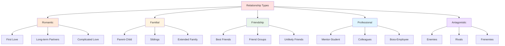
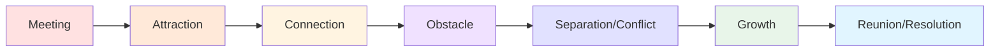
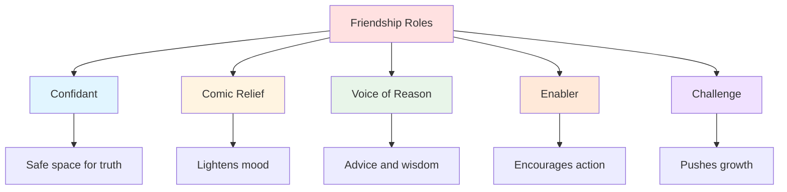
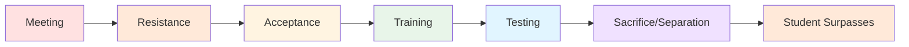

# 💑 Relationships

> *No character is an island: crafting meaningful connections*

---

## 📖 **Overview**

**Relationships** are the connections between characters that drive conflict, reveal personality, and create emotional resonance. Whether love, hate, friendship, or rivalry, these dynamics are the heart of compelling stories. Characters don't exist in isolation—they're defined by how they relate to others.

### **Why Relationships Matter:**
- 💕 **Create Conflict:** Best source of tension
- 🎭 **Reveal Character:** Who we are with others
- ⚡ **Drive Plot:** Relationships create stakes
- 💔 **Generate Emotion:** Reader investment
- 🌟 **Add Complexity:** Multiple perspectives

### **The Golden Rule:**
> "Character is action, but character is also reaction—and we react most powerfully to other people."  
> — Relationships show who your character really is

---

## 🎯 **Types of Relationships**

---

## 💕 **Romantic Relationships**

### **Core Elements:**

**Chemistry:**
- Physical attraction
- Emotional connection
- Intellectual compatibility
- Shared values or conflicts

**Tension:**
- External obstacles
- Internal barriers
- Timing issues
- Risk and vulnerability

**Arc:**
- Meeting or reunion
- Growing attraction
- Complications
- Resolution or tragedy

---

### **1. First Love / New Romance:**

**Characteristics:**
- Excitement and discovery
- Idealization
- Vulnerability
- Fear of rejection
- Intensity

**Story Uses:**
- Coming-of-age tales
- Character growth
- Learning about love
- Innocence vs. experience

**Examples:**
- Romeo & Juliet
- Eleanor & Park
- The Fault in Our Stars

**Key Elements:**

| Element | Description |
|---------|-------------|
| **First Meeting** | "Meet cute" or memorable encounter |
| **Attraction** | What draws them together |
| **Obstacles** | What keeps them apart |
| **First Kiss** | Moment of vulnerability |
| **Declaration** | Moment of commitment |

---

### **2. Established Relationships:**

**Characteristics:**
- Comfort and familiarity
- Deeper knowledge
- Tested by conflict
- Past history
- Patterns and habits

**Story Uses:**
- Testing commitment
- Rediscovering each other
- Overcoming crisis
- Growing together or apart

**Challenges:**
- Making it interesting (no easy comfort)
- Creating stakes
- Avoiding cliché fights
- Showing depth

**Examples:**
- The Time Traveler's Wife
- The Notebook
- Up (Carl & Ellie)

---

### **3. Complicated Love:**

**Types:**

**Forbidden Love:**
- Social barriers
- Family opposition
- Professional ethics
- Timing

**Love Triangle:**
- Competing suitors
- Different needs
- Impossible choice
- Self-discovery

**Toxic Relationships:**
- Power imbalance
- Manipulation
- Codependency
- Must recognize and escape

**Unrequited Love:**
- One-sided affection
- Pining and longing
- Acceptance or reciprocation
- Growth through rejection

---

### **Romantic Relationship Arc:**

---

### **Writing Romance:**

**✅ DO:**
- Create chemistry through conflict
- Show compatibility and differences
- Make them earn the relationship
- Use specific, personal details
- Respect both characters equally

**❌ DON'T:**
- Make love instant (unless fairy tale)
- Use abuse as romance
- Make romance only plot
- Forget individual character arcs
- Use tired clichés

---

## 👨‍👩‍👧‍👦 **Family Relationships**

### **1. Parent-Child:**

**Dynamic Types:**

**Loving & Supportive:**
- Unconditional love
- Guidance without control
- Safe harbor
- Healthy separation

**Strained & Complicated:**
- Expectations vs. reality
- Disappointment
- Unresolved conflict
- Desire for approval

**Absent or Neglectful:**
- Physical absence
- Emotional unavailability
- Abandonment issues
- Seeking replacement figures

**Controlling & Overbearing:**
- Manipulation
- High expectations
- Inability to let go
- Rebellion or submission

**Abusive:**
- Physical, emotional, or psychological harm
- Lasting trauma
- Escape and healing
- Breaking cycles

---

**Story Uses:**

| Parent Type | Character Impact | Story Examples |
|-------------|------------------|----------------|
| **Supportive** | Confidence, security | *Coco*, *Moana* |
| **Absent** | Abandonment issues, self-reliance | *Harry Potter*, *Star Wars* |
| **Overbearing** | Rebellion, self-doubt | *Tangled*, *Dead Poets Society* |
| **Abusive** | Trauma, need for healing | *A Child Called It*, *Educated* |
| **Dead** | Idealization, living shadow | *The Lion King*, *Batman* |

---

### **2. Sibling Relationships:**

**Dynamic Types:**

**Close & Supportive:**
- Best friends
- Protectiveness
- Shared history
- Inside jokes

**Competitive & Rivalrous:**
- Comparison
- Seeking approval
- Different paths
- Resentment

**Distant & Estranged:**
- Grown apart
- Unresolved conflict
- Different lives
- Potential reconciliation

**Contrasting & Complementary:**
- Opposite personalities
- Balance each other
- Conflict from differences
- Strength from variety

---

**Birth Order Effects:**

**Oldest:**
- Responsible
- Natural leader
- Perfectionist
- Resentful of burden

**Middle:**
- Peacemaker
- Overlooked
- Independent
- Diplomatic

**Youngest:**
- Carefree
- Protected
- Attention-seeking
- Underestimated

**Only Child:**
- Self-sufficient
- Adult-oriented
- Lonely
- Pressure

---

**Examples:**

| Story | Siblings | Dynamic |
|-------|----------|---------|
| **Thor** | Thor & Loki | Favored vs. overlooked, rivalry |
| **Frozen** | Elsa & Anna | Protection vs. connection |
| **The Godfather** | Corleone Brothers | Different roles, loyalty tested |
| **Little Women** | March Sisters | Varied personalities, tight bond |
| **Supernatural** | Sam & Dean Winchester | Codependent, sacrifice |

---

### **3. Extended Family:**

**Types:**

**Grandparents:**
- Wisdom and tradition
- Unconditional love
- Alternative perspective
- Connection to past

**Aunts/Uncles:**
- Mentor figures
- Alternative family model
- Support or complication
- Relief from parents

**Cousins:**
- Like siblings or strangers
- Forced proximity
- Comparison point
- Shared history

---

## 👥 **Friendship**

### **1. Best Friends:**

**Characteristics:**
- Deep trust
- Shared history
- Unconditional support
- Brutal honesty
- Chosen family

**Types:**

**Lifelong Friends:**
- Known since childhood
- Shared history
- Deep understanding
- May drift or reconnect

**Unlikely Friends:**
- Opposite personalities
- Shouldn't work but does
- Complement each other
- Learn from differences

**Found Family:**
- Chosen over blood
- Deeper than biology
- Created through shared experience
- Loyalty tested and proven

---

**Friendship Functions:**

---

**Examples:**

| Story | Friends | Dynamic |
|-------|---------|---------|
| **Harry Potter** | Harry, Ron, Hermione | Complementary trio |
| **Lord of the Rings** | Frodo & Sam | Loyalty and service |
| **Sherlock** | Sherlock & Watson | Unlikely partnership |
| **Parks and Recreation** | Leslie & Ann | Supportive best friends |
| **The Outsiders** | Greasers | Found family |

---

### **2. Friend Groups:**

**Dynamics:**
- Multiple personalities
- Different roles
- Group identity
- Internal conflicts
- Shifting alliances

**Group Archetypes:**
- The Leader
- The Heart
- The Brain
- The Muscle
- The Joker
- The Outsider

**Examples:**
- *Friends* — Six distinct personalities
- *The Breakfast Club* — Unlikely grouping
- *Ocean's Eleven* — Heist team
- *Stranger Things* — Kids against the world

---

### **3. Fractured Friendships:**

**Causes:**
- Betrayal
- Growing apart
- Unresolved conflict
- Jealousy or competition
- Different paths

**Story Uses:**
- Reconciliation arc
- Test of loyalty
- Character growth
- Emotional payoff

**Example:**
- Steve Rogers & Tony Stark (*Civil War*)
- Betrayal splits friendship
- Emotional devastation
- Hope for healing

---

## 💼 **Professional Relationships**

### **1. Mentor-Student:**

**Classic Dynamic:**
- Teacher and learner
- Wisdom passed down
- Challenges and tests
- Eventual separation

**Mentor Types:**

**Wise Guide:**
- Obi-Wan, Dumbledore
- Patient teacher
- Shows the way
- Often sacrifices self

**Tough Teacher:**
- Mr. Miyagi, Toph
- Harsh methods
- Hidden lessons
- Builds strength

**Reluctant Mentor:**
- Grumpy but caring
- Must be convinced
- Sees self in student
- Personal redemption

**False Mentor:**
- Appears helpful
- Actually manipulative
- Betrays trust
- Student must overcome

---

**Mentor Arc:**

---

### **2. Colleagues & Partners:**

**Types:**

**Buddy Cops / Partners:**
- Forced together
- Conflicting methods
- Learn to work together
- Complementary skills

**Workplace Rivals:**
- Competition
- Respect vs. resentment
- Possible friendship
- Professional growth

**Work Friends:**
- Share environment
- Support and commiseration
- May not translate outside work
- Bond through shared experience

---

### **3. Boss-Employee:**

**Dynamics:**
- Power imbalance
- Respect earned or demanded
- Learning or exploitation
- Professional growth

**Types:**
- Supportive leader
- Tyrannical boss
- Incompetent superior
- Mentor figure

---

## ⚔️ **Antagonistic Relationships**

### **1. Enemies:**

**Characteristics:**
- Active opposition
- Mutual hatred
- History of conflict
- Personal stakes

**Types:**

**Mortal Enemies:**
- Life or death stakes
- Deep personal grievance
- No compromise
- One must fall

**Ideological Enemies:**
- Conflicting beliefs
- Both think they're right
- Represents theme
- Mutual respect possible

**Personal Nemesis:**
- Mirror to protagonist
- Similar but opposite
- Personal history
- Symbolic significance

---

**Examples:**

| Story | Enemies | Conflict |
|-------|---------|----------|
| **Harry Potter** | Harry & Voldemort | Prophecy, survival |
| **Batman** | Batman & Joker | Order vs. chaos |
| **The Prestige** | Competing magicians | Obsession, revenge |
| **Kill Bill** | Bride & Bill | Betrayal, love twisted |

---

### **2. Rivals:**

**Characteristics:**
- Competition
- Similar goals
- Respect and resentment
- Push each other

**Differences from Enemies:**
- Not necessarily hate
- May become friends
- Respect abilities
- Make each other better

**Examples:**
- Professor X & Magneto (ideological rivals, friends)
- Sherlock & Mycroft (sibling rivals)
- Salieri & Mozart (talent envy)

---

### **3. Frenemies:**

**Characteristics:**
- Forced cooperation
- Underlying tension
- Mutual benefit
- Possible betrayal

**Story Uses:**
- Unstable alliance
- Dramatic tension
- Moral complexity
- Surprising loyalty

**Examples:**
- Loki & Thor (sometimes)
- Pirates of the Caribbean (various)
- Game of Thrones (many relationships)

---

## 🔄 **Relationship Arcs**

### **Positive Arc:**

**Progression:**
1. **Conflict/Distance:** Start apart
2. **Forced Proximity:** Must interact
3. **Discovery:** Learn about each other
4. **Connection:** Find common ground
5. **Testing:** Relationship challenged
6. **Deepening:** Grow stronger
7. **Commitment:** Choose relationship

**Examples:**
- Enemies to lovers
- Strangers to friends
- Rivals to allies

---

### **Negative Arc:**

**Progression:**
1. **Harmony:** Start together
2. **Tension:** Cracks appear
3. **Conflict:** Disagreement emerges
4. **Betrayal:** Trust broken
5. **Rupture:** Relationship breaks
6. **Consequence:** Deal with loss
7. **Resolution:** Acceptance or revenge

**Examples:**
- Friends to enemies
- Love to hate
- Allies to rivals

---

### **Complex Arc:**

**Progression:**
1. **Initial Dynamic:** Established relationship
2. **Disruption:** Change occurs
3. **Fluctuation:** Back and forth
4. **Crisis:** Major test
5. **Transformation:** Both change
6. **New Dynamic:** Different but stable
7. **Acceptance:** Embrace new normal

**Examples:**
- Breaking Bad (Walter & Jesse)
- The Godfather (Michael's relationships)
- Revolutionary Road (Frank & April)

---

## 🎨 **Crafting Believable Relationships**

### **1. Establish History:**

**Methods:**
- Shared memories
- Inside jokes
- Shorthand communication
- Unspoken understanding
- Shared trauma or joy

**Example:**
> "Remember Tampa?" Sarah said.  
> John groaned. "We swore never to speak of Tampa."  
> "Exactly."

---

### **2. Create Distinct Dynamics:**

**Each Relationship Is Unique:**
- Character acts differently with different people
- Relationships have own "personality"
- Power dynamics shift
- Different sides revealed

**Example:**
With boss: Formal, restrained  
With sibling: Relaxed, teasing  
With lover: Vulnerable, honest  
With enemy: Guarded, strategic

---

### **3. Show Evolution:**

**Relationships Change:**
- React to story events
- Grow or deteriorate
- Test and strengthen
- Surprise and challenge

**Track The Arc:**
- Where do they start?
- What changes them?
- How do they grow?
- Where do they end?

---

### **4. Balance Conflict & Connection:**

**Both Are Necessary:**
- Pure harmony is boring
- Pure conflict is exhausting
- Ebb and flow
- Complexity and depth

**Types of Conflict:**
- External pressure
- Internal disagreement
- Misunderstanding
- Competing needs
- Values clash

---

### **5. Use Subtext:**

**Not Everything Is Said:**
- Body language
- Tone of voice
- What's not said
- Implications
- Shared knowledge

**Example:**

**❌ On-the-nose:**
> "I'm angry because you betrayed me by telling my secret!"

**✅ Subtext:**
> "That was fast. I told you Tuesday. By Wednesday, everyone knew."  
> "I don't know what you're implying."  
> "Of course you don't."

---

## ⚖️ **Common Relationship Mistakes**

<b>❌ Pitfalls to Avoid</b>

### **Telling Not Showing:**
- **Problem:** "They were best friends."
- **Fix:** Show the friendship through actions, dialogue, history

### **Instant Connection:**
- **Problem:** Deep bond appears instantly
- **Fix:** Develop relationships over time, show building trust

### **One-Note Relationships:**
- **Problem:** Only conflict OR only harmony
- **Fix:** Add complexity, ebb and flow

### **Forgetting Outside Story:**
- **Problem:** Relationships only exist when protagonist present
- **Fix:** Imply ongoing connections, their own lives

### **Sacrificing Character for Relationship:**
- **Problem:** Characters change personality for relationship
- **Fix:** Relationships should enhance, not replace character

### **No Stakes:**
- **Problem:** Nothing at risk if relationship fails
- **Fix:** Make relationship matter, create consequences

### **Toxic Presented as Romantic:**
- **Problem:** Abuse, stalking, or control presented as love
- **Fix:** Understand difference, show healthy relationships

### **Secondary Characters as Props:**
- **Problem:** Exist only to serve protagonist
- **Fix:** Give them own motivations, agency

### **Resolving Too Easily:**
- **Problem:** Major conflict solved in one conversation
- **Fix:** Realistic resolution, earned forgiveness

### **No Growth:**
- **Problem:** Relationships static throughout story
- **Fix:** Show evolution, change, development

---

## 💡 **Relationship Development Exercises**

### **Exercise 1: Relationship Web**
Map your protagonist's relationships:
- Who do they know?
- How did they meet?
- Current dynamic?
- What do they want from each other?
- What's at stake?

### **Exercise 2: Dialogue Dynamics**
Write same scene with different people:
- Protagonist with best friend
- Protagonist with parent
- Protagonist with enemy
- How does behavior change?

### **Exercise 3: Relationship History**
Choose two characters and write:
- How they met
- Formative moment in relationship
- Best memory together
- Worst fight
- Where are they now?

### **Exercise 4: Conflict Creation**
For each major relationship:
- What do they want from each other?
- Where do they disagree?
- What's unsaid?
- What could tear them apart?

### **Exercise 5: The Test**
Write scene testing relationship:
- Moment of betrayal or loyalty
- Difficult choice
- Secret revealed
- How do they react?

---

## 🔗 **Related Resources**

- 📖 **[Character Basics](character-basics.md)** — Foundation of who they are
- 📈 **[Character Arcs](character-arcs.md)** — How relationships drive change
- 🎯 **[Motivation & Goals](motivation-goals.md)** — What they want from others
- 📚 **[Backstory](backstory.md)** — Past relationships shape present
- 🎭 **[Protagonist & Antagonist](protagonist-antagonist.md)** — Primary relationship
- 💬 **[Dialogue Techniques](../dialogue-techniques/)** — How relationships speak

---

## 📖 **Recommended Reading**

- *The Anatomy of Story* — John Truby
- *Creating Character Arcs* — K.M. Weiland
- *Save the Cat!* — Blake Snyder (buddy/love story)

---

### **Characters Are Defined by Connection 💑**

*No character exists in isolation. Relationships create conflict, reveal truth, and generate emotion.*

**[⬅️ Back to Character Development](README.md)** | **[📚 Fundamentals](../README.md)**

