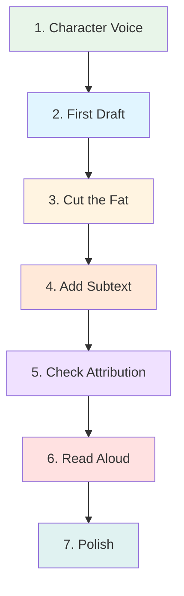

# 💬 Dialogue Techniques

> *Mastering the art of conversation: creating authentic, powerful dialogue that reveals character and drives story*

---

## 📖 **Welcome to Dialogue Techniques**

Dialogue is one of the most powerful tools in fiction writing. When done well, it reveals character, creates conflict, conveys information, and advances plot—all while sounding natural and effortless. This section provides comprehensive guides to help you master every aspect of writing compelling dialogue.

**Great dialogue** is not transcribed real speech—it's the illusion of real speech, carefully crafted to serve your story while maintaining authenticity.

---

## 🗣️ **Complete Guide to Dialogue**

| Guide | Focus | Key Topics | Best For |
|-------|-------|------------|----------|
| **[Dialogue Fundamentals](fundamentals.md)** | Core Techniques | Natural dialogue, character voice, functions, best practices | All writers learning dialogue basics |
| **[Subtext](subtext.md)** | Layered Meaning | What's unsaid, reading between lines, emotional depth | Adding sophistication to dialogue |
| **[Dialogue Tags](dialogue-tags.md)** | Attribution | "Said" vs. alternatives, action beats, formatting rules | Mechanical clarity and invisibility |

---

## 🎯 **Learning Paths**

### **Path 1: Dialogue Beginners**

**If you're new to writing dialogue:**

1. **Start Here:** [Dialogue Fundamentals](fundamentals.md)
   - Understand what makes dialogue good
   - Learn the basic functions
   - Create distinctive character voices
   - Write natural-sounding conversation

2. **Then:** [Dialogue Tags](dialogue-tags.md)
   - Master "said" and "asked"
   - Learn when to use action beats
   - Understand formatting rules
   - Avoid common tag mistakes

3. **Finally:** [Subtext](subtext.md)
   - Add layers of meaning
   - Say one thing, mean another
   - Create tension through the unspoken
   - Master what's not said

---

### **Path 2: Fixing Dialogue Problems**

**"My dialogue feels unnatural":**
→ [Dialogue Fundamentals](fundamentals.md) — Natural speech techniques  
→ Read it aloud, use contractions, embrace incomplete sentences

**"All my characters sound the same":**
→ [Dialogue Fundamentals](fundamentals.md) — Creating distinctive voices  
→ Vary word choice, sentence structure, and speech patterns

**"My dialogue is too on-the-nose":**
→ [Subtext](subtext.md) — Layering meaning  
→ Characters say opposite of what they mean

**"Readers are confused about who's speaking":**
→ [Dialogue Tags](dialogue-tags.md) — Clear attribution  
→ Balance tags, beats, and no attribution

**"My tags distract from dialogue":**
→ [Dialogue Tags](dialogue-tags.md) — Use "said" liberally  
→ Avoid said bookisms and excessive adverbs

**"My dialogue is boring":**
→ [Dialogue Fundamentals](fundamentals.md) — Functions of dialogue  
→ [Subtext](subtext.md) — Add conflict and layers  
→ Every line should do multiple things

---

### **Path 3: Genre-Specific Dialogue**

**Romance:**
- Focus on [Subtext](subtext.md) for unspoken attraction
- Use [Fundamentals](fundamentals.md) for flirtation and intimacy
- Master emotional layers

**Mystery/Thriller:**
- Use [Subtext](subtext.md) for lies and deception
- Focus on [Fundamentals](fundamentals.md) for interrogation
- Create tension through what's not said

**Fantasy/Sci-Fi:**
- Use [Fundamentals](fundamentals.md) for world-building through dialogue
- Master [Tags](dialogue-tags.md) for multiple species/characters
- Create distinctive voices for different cultures

**Literary Fiction:**
- Deep focus on [Subtext](subtext.md)
- Master [Fundamentals](fundamentals.md) for character revelation
- Prioritize layered, complex conversations

**Action/Adventure:**
- Use [Fundamentals](fundamentals.md) for quick, punchy exchanges
- Minimize tags per [Dialogue Tags](dialogue-tags.md)
- Keep pace fast

---

## 🎨 **Core Principles**

### **1. Good Dialogue Is Purposeful**

Every line should accomplish multiple functions:
- ✅ Reveals character
- ✅ Advances plot
- ✅ Creates conflict
- ✅ Conveys information
- ✅ Shows relationships
- ✅ Builds tension

**Not just:** "Nice weather today."  
**But:** "Nice weather for a funeral."

*Reveals character attitude, situation, tone*

---

### **2. Natural ≠ Real**

**Real Conversation:**
> "Um, so, like, I was thinking, you know, maybe we could, uh, possibly go to dinner or something, if you want, I mean, only if you're free, but like, no pressure or anything..."

**Fiction Dialogue:**
> "Dinner tonight?"

*Fiction dialogue is real speech condensed and purposeful*

---

### **3. Character Voice Matters**

Each character should sound distinct:

**Professor:**
> "The hypothesis requires additional empirical evidence before we can draw conclusions."

**Mechanic:**
> "We need to test this thing before we know if it works."

**Teenager:**
> "We should totally try it first."

*Same meaning, three voices*

**See: [Dialogue Fundamentals](fundamentals.md)**

---

### **4. Subtext Creates Depth**

What's said vs. what's meant:

**Surface:**
> "Fine."

**Subtext:**
> "I'm not fine. I'm angry/hurt/upset, but I don't want to talk about it."

**In Context:**
> "Are you okay?"  
> "Fine." She turned away.

*Body language confirms subtext*

**See: [Subtext](subtext.md)**

---

### **5. "Said" Is Your Friend**

The best dialogue tags are invisible:

**❌ Don't:**
> "I love you," he professed ardently.  
> "Do you?" she queried dubiously.

**✅ Do:**
> "I love you," he said.  
> "Do you?"

*Simple tags disappear; readers focus on dialogue*

**See: [Dialogue Tags](dialogue-tags.md)**

---

## 📊 **The Dialogue Toolkit**

### **Essential Techniques:**

<b>💬 Creating Natural Dialogue</b>

**Techniques:**
- Read dialogue aloud
- Use contractions naturally
- Include interruptions
- Embrace incomplete sentences
- Skip meaningless greetings
- Vary sentence length
- Control pacing through rhythm

**Example:**
> "I think we should—"  
> "Should what?"  
> "Let me finish."  
> "You were going to say leave."  
> "No, I—"  
> "That's what you always do."

*Overlapping, incomplete, realistic*

**Deep Dive:** [Dialogue Fundamentals](fundamentals.md)

<b>🎭 Distinctive Character Voices</b>

**Elements:**
- Word choice (vocabulary)
- Sentence structure (long/short)
- Speech patterns (quirks)
- Content focus (what they discuss)

**Vary By:**
- Education level
- Regional background
- Social class
- Profession
- Age
- Personality

**Example:**
Three characters react to danger:

**Scientist:**
> "The probability of survival is approximately 12%."

**Warrior:**
> "We fight or we die."

**Optimist:**
> "I've beaten worse odds."

**Deep Dive:** [Dialogue Fundamentals](fundamentals.md)

<b>💭 Mastering Subtext</b>

**What Is It:**
Unspoken meaning beneath dialogue

**Techniques:**
- Say the opposite
- Use silence
- Change the subject
- Minimal responses
- Body language contradicts words

**Example:**
> "I don't care what he thinks."  
> "Then why are you asking?"

*Says doesn't care, clearly cares*

**Types:**
- Emotional subtext
- Intentional subtext
- Power dynamics
- Historical baggage
- Self-deception

**Deep Dive:** [Subtext](subtext.md)

<b>🏷️ Invisible Attribution</b>

**Three Methods:**
1. Dialogue tags ("said/asked")
2. Action beats (physical actions)
3. No tag/beat (clear from context)

**The 80/20 Rule:**
- 80% should be "said" or "asked"
- 20% can be alternatives or beats

**Example:**
> "I need to tell you something," Sarah said.  
> Tom set down his coffee. "What?"  
> "It's about your brother."  
> "What about him?"  
> "He's been lying." She paused. "For years."

*Mix of tags, beats, no attribution*

**Deep Dive:** [Dialogue Tags](dialogue-tags.md)

---

## 🔄 **The Dialogue Writing Process**

### **Step-by-Step:**

---

**1. Establish Character Voice**
- How does this character speak?
- What's their background?
- Education level?
- Personality quirks?

**2. Write First Draft**
- Let it flow naturally
- Don't worry about tags yet
- Focus on what's being said
- Capture character voices

**3. Cut the Fat**
- Remove greetings and small talk
- Eliminate repeated information
- Start conversations mid-exchange
- Delete anything that doesn't serve story

**4. Add Subtext**
- What are they not saying?
- What do they really mean?
- Where can you add layers?
- What's the emotional truth?

**5. Check Attribution**
- Use "said" for most tags
- Add action beats where meaningful
- Remove unnecessary attribution
- Ensure clarity throughout

**6. Read Aloud**
- Does it flow naturally?
- Can you say it comfortably?
- Where do you stumble?
- Does each character sound distinct?

**7. Polish**
- Fix any awkward phrasing
- Ensure proper formatting
- Check punctuation
- One final read-aloud

---

## 🚫 **Common Mistakes to Avoid**

<b>❌ Major Dialogue Pitfalls</b>

### **1. "As You Know, Bob" (Info-Dumping)**
**Problem:**
> "As you know, Bob, we've been searching for the Crystal for ten years, ever since it was stolen by the Dark Brotherhood."

**Fix:**
> "Ten years, Bob. And we're still no closer."

---

### **2. On-the-Nose Dialogue**
**Problem:**
> "I'm very angry at you!"

**Fix:**
> "Get out." Her voice was ice.

---

### **3. Everyone Sounds the Same**
**Problem:** All characters speak identically

**Fix:** Give each distinct voice through word choice, sentence structure, and speech patterns

---

### **4. Too Formal or Too Casual**
**Problem:**
> "I am uncertain as to whether we should proceed."

**Fix:**
> "I'm not sure about this."

---

### **5. Said Bookisms**
**Problem:**
> "Hello," he ejaculated cheerfully.

**Fix:**
> "Hello," he said.

---

### **6. Adverb Abuse**
**Problem:**
> "Stop," she said angrily.

**Fix:**
> "Stop." Her hands clenched.

---

### **7. No Subtext**
**Problem:** Everything stated directly

**Fix:** Add layers—characters say one thing, mean another

---

### **8. Wrong Punctuation**
**Problem:**
> "Hello." She said.

**Fix:**
> "Hello," she said.

---

### **9. Greeting Exposition**
**Problem:**
> "Hi, how are you?"  
> "Fine, how are you?"  
> "Good. Did you hear about the thing?"

**Fix:**
> "Did you hear about the thing?"

---

### **10. Physically Impossible Tags**
**Problem:**
> "Never," he grimaced.

**Fix:**
> He grimaced. "Never."

---

## 💡 **Quick Tips for Better Dialogue**

### **The Essentials:**

**✅ DO:**
- Read all dialogue aloud
- Use "said" and "asked" 80% of the time
- Give each character a distinctive voice
- Include subtext and layered meaning
- Start scenes mid-conversation
- Use contractions naturally
- Let characters interrupt each other
- Skip meaningless small talk
- Make every line do multiple things
- Show emotion through action, not tags

**❌ DON'T:**
- Use said bookisms ("ejaculated," "queried")
- Load tags with adverbs ("said angrily")
- Make everyone sound the same
- State everything directly (on-the-nose)
- Include "as you know" exposition
- Write complete, formal sentences for casual speech
- Tag every single line
- Use meaningless action beats
- Forget to vary attribution methods
- Write what you haven't spoken aloud

---

## 📋 **Complete Dialogue Checklist**

**Before finalizing any dialogue:**

**Character Voice:**
- [ ] Each character sounds distinct
- [ ] Voice appropriate for background/education
- [ ] Personality shows through speech
- [ ] Age and context reflected

**Content:**
- [ ] Every line serves multiple functions
- [ ] No information dumps
- [ ] Subtext where appropriate
- [ ] Conflict or tension present
- [ ] Advances plot or reveals character

**Natural Flow:**
- [ ] Reads aloud smoothly
- [ ] Contractions used naturally
- [ ] Interruptions where appropriate
- [ ] Incomplete sentences if natural
- [ ] Meaningless greetings removed

**Attribution:**
- [ ] Mostly "said" and "asked"
- [ ] No said bookisms
- [ ] Minimal adverbs with tags
- [ ] Action beats add meaning
- [ ] Not every line has attribution
- [ ] Clear who's speaking throughout

**Formatting:**
- [ ] Proper punctuation
- [ ] New paragraph per speaker
- [ ] Correct comma/period usage
- [ ] Dialogue tags formatted correctly

**Polish:**
- [ ] Read aloud successfully
- [ ] No awkward phrasing
- [ ] Appropriate pacing
- [ ] Emotionally resonant

---

## 🎯 **Practice Exercises**

### **Exercise 1: Voice Differentiation**
Write the same line of dialogue spoken by:
- A professor
- A teenager
- A soldier
- An elderly person

Notice how word choice and structure change.

### **Exercise 2: Subtext Scene**
Write a conversation where:
- Characters want opposite things
- Neither states their true feelings
- Conflict simmers beneath surface
- Reader understands both layers

### **Exercise 3: Tag Variation**
Take a dialogue exchange and rewrite it three ways:
1. Using only dialogue tags
2. Using only action beats
3. Using mix of both + no attribution

Which works best?

### **Exercise 4: Cut the Fat**
Take any dialogue you've written:
- Remove all greetings
- Cut repeated information
- Start mid-conversation
- Eliminate meaningless lines

What's left is tighter.

### **Exercise 5: Real Life Adaptation**
Eavesdrop on real conversation:
- Transcribe it exactly
- Then adapt it for fiction
- Notice what you cut and condense

---

## 🔗 **Related Resources**

### **Within This Section:**
- 💬 **[Dialogue Fundamentals](fundamentals.md)** — Core techniques and natural dialogue
- 💭 **[Subtext](subtext.md)** — Layered meaning and what's unsaid
- 🏷️ **[Dialogue Tags](dialogue-tags.md)** — Attribution and mechanics

### **Character Development:**
- 👤 **[Character Basics](../character-development/)** — Understanding who's speaking
- 🎭 **[Protagonist & Antagonist](../character-development/protagonist-antagonist.md)** — Hero and villain voices
- 💑 **[Relationships](../character-development/relationships.md)** — How characters interact

### **Craft Guides:**
- 🎨 **[Show vs. Tell](../../craft/show-vs-tell/)** — Revealing through dialogue
- ⚡ **[Pacing & Rhythm](../../craft/pacing-rhythm/)** — Controlling dialogue speed
- 📝 **[Prose Style](../../craft/prose-style/)** — Overall writing style

### **Plot & Conflict:**
- ⚔️ **[Conflict Types](../plot-development/conflict-types.md)** — Using dialogue for tension
- 🎯 **[Tension & Stakes](../plot-development/tension-stakes.md)** — Building through conversation

---

## 📖 **Recommended Reading**

### **Craft Books:**
- *Dialogue* — Robert McKee
- *Self-Editing for Fiction Writers* — Renni Browne & Dave King
- *Stein on Writing* — Sol Stein
- *The Art of Fiction* — John Gardner
- *The Art of Subtext* — Charles Baxter

### **Study Dialogue Masters:**

**Natural Voices:**
- Elmore Leonard — Distinctive, authentic dialogue
- Cormac McCarthy — Minimal attribution, powerful
- Jane Austen — Wit and social subtext
- Ernest Hemingway — Iceberg theory in dialogue

**Subtext Masters:**
- Harold Pinter — Theatrical subtext
- Raymond Carver — What's not said
- Kazuo Ishiguro — Layered meaning

**Genre Excellence:**
- Quentin Tarantino — Rhythm and style (screenwriting)
- Aaron Sorkin — Fast-paced, intelligent
- Gillian Flynn — Unreliable narrators
- Dorothy Sayers — Mystery interrogation

---

## 🎬 **Films to Study**

**For Subtext:**
- *Casablanca* — Romance and sacrifice
- *The Godfather* — Power dynamics
- *Lost in Translation* — Unspoken connection

**For Natural Dialogue:**
- *Before Sunrise/Sunset/Midnight* — Authentic conversation
- *Good Will Hunting* — Character voice

**For Distinctive Voices:**
- *Pulp Fiction* — Tarantino's style
- *The Social Network* — Sorkin's rhythm

---

## 🎯 **Your Next Steps**

### **Getting Started:**

1. **Read:** [Dialogue Fundamentals](fundamentals.md) first
2. **Practice:** Write dialogue and read it aloud
3. **Study:** [Subtext](subtext.md) for depth
4. **Polish:** Use [Dialogue Tags](dialogue-tags.md) for mechanics
5. **Iterate:** Rewrite until it sounds natural

### **Remember:**

> "Good dialogue is not real speech—it's the illusion of real speech. It sounds natural but serves your story purposefully."

**The goal isn't perfect transcription. The goal is authentic-sounding dialogue that reveals character, creates conflict, and advances your plot.**

---

## **Let Your Characters Speak 💬**

*Great dialogue is one of fiction's most powerful tools. Master these techniques and watch your characters come alive on the page.*

**Choose your guide above and start improving your dialogue today.**

---

**[⬅️ Back to Fundamentals](../README.md)** | **[📚 Main Documentation](../../README.md)**

