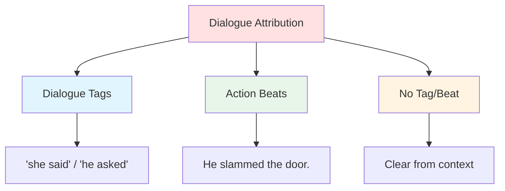

# 🏷️ Dialogue Tags & Attribution

> *Mastering the art of attribution: how to attribute dialogue clearly, invisibly, and effectively*

---

## 📖 **Overview**

**Dialogue tags** (also called attribution tags or speaker tags) tell readers who is speaking. While seemingly simple, the craft of attribution can make the difference between smooth, invisible dialogue and clunky, distracting conversation. The best tags guide readers without drawing attention to themselves.

### **Why Tags Matter:**
- 🎯 **Clarity:** Readers know who's speaking
- 💡 **Invisibility:** Good tags disappear
- ⚡ **Rhythm:** Tags control pacing
- 🎭 **Action:** Beats add movement
- 🌟 **Simplicity:** Less is more
- 🎨 **Variety:** Mix techniques appropriately

### **The Golden Rule:**
> "'Said' is invisible. Use it liberally. Readers' eyes skip over it to focus on what matters—the dialogue itself."  
> — The best tags are the ones readers don't notice

---

## 🎯 **Types of Attribution**

### **The Three Methods:**



---

## 💬 **Method 1: Dialogue Tags**

### **The Basics:**

**Standard Format:**
> "Dialogue," she said.  
> "Dialogue!" she said.  
> "Dialogue?" she asked.

**After Tag Continues:**
> "First part," she said. "Second part."

**Tag in Middle:**
> "First part," she said, "continuing same sentence."

---

### **The Big Two: "Said" and "Asked"**

**Why "Said" Is King:**
- ✅ Invisible to readers
- ✅ Never draws attention
- ✅ Works 90% of the time
- ✅ Professional standard
- ✅ Timeless and reliable

**Why "Asked" for Questions:**
- ✅ Clarifies interrogative
- ✅ Equally invisible
- ✅ Natural and expected
- ✅ Removes ambiguity

**Example:**
> "Where are you going?" she asked.  
> "Out," he said.  
> "When will you be back?" she asked.  
> "Late," he said.

*Clean, clear, invisible*

---

### **The 80/20 Rule:**

**80% of dialogue tags should be "said" or "asked"**
- Reliable
- Invisible
- Professional
- Clear

**20% can be something else:**
- When emotion is crucial
- When action is important
- When "said" feels repetitive
- When specificity serves story

---

### **Alternative Tags (Use Sparingly):**

**Sometimes Acceptable:**
- whispered
- shouted / yelled
- muttered / murmured
- called
- replied / answered

**Use When:**
- Volume matters to scene
- Manner of speaking is important
- "Said" would mislead

**Example:**
> "Help!" she shouted. "Someone help!"

*Volume is crucial*

> "It's nothing," he murmured.

*Quiet tone matters*

---

### **Said Bookisms (Avoid These):**

**What Are They?**
Over-creative, distracting dialogue tags

**Common Culprits:**
- "articulated"
- "opined"
- "ejaculated" (yes, really)
- "queried"
- "proclaimed"
- "pontificated"
- "hissed" (unless you're a snake—no 's' in the dialogue!)
- "grimaced" (you can't talk with your face)
- "smiled" (can't talk while smiling)

**Why They're Bad:**
- Draw attention to themselves
- Feel amateurish
- Distract from dialogue
- Often physically impossible
- Tell rather than show

---

### **Bad vs. Good:**

**❌ Bad (Said Bookism):**
> "I love you," he professed ardently.  
> "Do you really?" she queried dubiously.  
> "With all my heart," he avowed passionately.  
> "I'm not sure I believe you," she countered skeptically.

*Every tag draws attention, sounds purple*

**✅ Good:**
> "I love you," he said.  
> "Do you really?"  
> "With all my heart."  
> "I'm not sure I believe you."

*Clean, invisible, focuses on dialogue*

---

## 🎭 **Method 2: Action Beats**

### **What Are Action Beats?**

**Definition:** Physical actions that replace dialogue tags

**Format:**
> She slammed the door. "Get out!"

**vs.**

> "Get out!" she said, slamming the door.

---

### **When to Use Action Beats:**

**✅ Use Beats When:**
- Adding meaningful action
- Showing emotion through movement
- Breaking up long dialogue exchanges
- Character is doing something significant
- Need to slow pacing
- Want to ground scene physically

**❌ Don't Use When:**
- Action is meaningless
- Slows pace unnecessarily
- Better served by simple "said"
- Every single line (overkill)

---

### **Effective Action Beats:**

**Example 1: Showing Emotion**
> He punched the wall. "I can't believe you did that."

*Action shows anger*

**Example 2: Adding Context**
> She checked her watch. "We're late."

*Action adds information*

**Example 3: Character Revelation**
> He straightened his tie before answering. "Everything is under control."

*Action shows he's nervous despite words*

**Example 4: Scene Grounding**
> She poured herself another drink. "Tell me about your day."

*Action grounds scene in physical reality*

---

### **Beat Patterns:**

**Alternating Beats and Tags:**
> "I don't understand." She sat down.  
> "It's simple," he said.  
> She shook her head. "Nothing about this is simple."  
> "You're overcomplicating it," he said.  
> She laughed bitterly. "Am I?"

*Natural rhythm, varied attribution*

---

### **Common Beat Mistakes:**

**❌ Meaningless Beats:**
> She blinked. "What?"  
> He breathed. "I said no."  
> She existed. "But why?"

*These add nothing*

**❌ Overly Complex Beats:**
> He adjusted his collar, cleared his throat, shifted his weight from foot to foot, and ran his fingers through his hair. "Hi."

*Too much action for simple dialogue*

**❌ Every Line Has Beat:**
> He sat down. "We need to talk."  
> She crossed her arms. "About what?"  
> He leaned forward. "You know what."  
> She turned away. "I don't want to discuss it."

*Exhausting, slows pace too much*

---

## 🎯 **Method 3: No Tag or Beat**

### **When You Don't Need Attribution:**

**✅ Skip Tags When:**
- Only two speakers
- Back-and-forth exchange is rapid
- Clear who's speaking from context
- Action just happened
- Previous attribution is recent

---

### **The Ping-Pong Rule:**

**In two-person conversation, after establishing speakers:**

> "I need to tell you something," John said.  
> "What is it?" Mary asked.  
> "I'm leaving town."  
> "When?"  
> "Tomorrow."  
> "Why?"  
> "It's complicated."  
> "Try me."  
> "I can't."  
> "John—"  
> "I'm sorry."

*After first two lines, rhythm is clear*

---

### **When to Re-Establish:**

**Add attribution when:**
- More than 3-4 exchanges untagged
- Reader might lose track
- New action interrupts
- Change in speaker order
- Character leaves or enters
- Long speech by one person

**Example:**
> "I need to tell you something," John said.  
> "What is it?" Mary asked.  
> "I'm leaving town."  
> "When?"  
> "Tomorrow."  
> "Why?"  
> "It's complicated."  
> Mary crossed her arms. "Try me."  
> "I can't."  
> "John—"  
> "I'm sorry." He headed for the door.

*Re-established with beats after several untagged exchanges*

---

## 🎨 **Advanced Attribution Techniques**

### **1. Embedding Information in Tags:**

**Basic:**
> "I'm leaving," she said.

**With Information:**
> "I'm leaving," she said, grabbing her coat.

**Character Revelation:**
> "I'm fine," she said, though her hands were shaking.

*Tag carries additional meaning*

---

### **2. Dialogue Interrupted by Action:**

**Format:**
> "I think that we should—" She paused as the door opened. "—continue this later."

**Shows:**
- Interruption
- Cause of interruption
- Continuation

---

### **3. Multiple Speakers with Action:**

**Scene with Three+ People:**
> "We need a plan," Sarah said.  
> Tom nodded. "Agreed."  
> "I have an idea." Lisa stood. "What if we split up?"  
> "Bad idea," Tom said.  
> Sarah moved to the window. "Actually, she might be right."

*Varied attribution keeps scene clear*

---

### **4. Internal Thought as Attribution:**

**POV Character:**
> "It's fine," he said.  
> She didn't believe him for a second. "If you say so."

*Internal thought provides context*

---

## 📏 **Formatting Rules**

### **Punctuation:**

**Comma Before Tag:**
> ✅ "Hello," she said.  
> ❌ "Hello." She said.  
> ❌ "Hello" she said.

**Question Mark / Exclamation:**
> ✅ "Hello!" she said.  
> ✅ "Hello?" she asked.  
> ❌ "Hello!," she said.

**Tag Then Dialogue:**
> ✅ She said, "Hello."  
> ❌ She said "Hello."

**Continuing After Tag:**
> ✅ "First part," she said. "Second sentence."  
> ✅ "First part," she said, "continuing sentence."  
> ❌ "First part," she said, "Second sentence."

---

### **Paragraph Breaks:**

**New Speaker = New Paragraph:**
```
"I need to go," she said.
"Why?" he asked.
"It's late."
```

**Action With Dialogue = Same Paragraph:**
```
She grabbed her coat. "I need to go."
```

**Action + Other Speaker = New Paragraph:**
```
She grabbed her coat. "I need to go."
He stood. "I'll walk you out."
```

---

## 🎯 **Tag Placement**

### **Where to Put Tags:**

**Beginning (Least Common):**
> She said, "I'm leaving."

*Formal, can slow pace*

**Middle:**
> "I'm leaving," she said, "and I'm not coming back."

*Natural break point*

**End (Most Common):**
> "I'm leaving," she said.

*Most natural, most common*

---

### **Strategic Placement:**

**For Dramatic Pause:**
> "I know who killed him," she said.

vs.

> She said, "I know who killed him."

*End placement creates more drama*

**For Quick Pace:**
> "Run!" he shouted.

vs.

> He shouted, "Run!"

*Immediate action works better*

---

## 🚫 **Common Tag Mistakes**

<details>
<summary><b>❌ Major Pitfalls</b></summary>

### **Said Bookisms:**
**Problem:**
> "I love you," he professed passionately.

**Fix:**
> "I love you," he said.

---

### **Adverb Overload:**
**Problem:**
> "Stop it," she said angrily.  
> "Never," he replied defiantly.  
> "Please," she begged desperately.

**Fix:**
> "Stop it." Her voice was sharp.  
> "Never." He crossed his arms.  
> "Please." Tears filled her eyes.

*Show emotion through action, not adverbs*

---

### **Physically Impossible Tags:**
**Problem:**
> "Get out," she smiled.  
> "Never," he grimaced.  
> "Why?" she frowned.

**Fix:**
> She smiled. "Get out."  
> He grimaced. "Never."  
> She frowned. "Why?"

*Facial expressions aren't speech verbs*

---

### **Over-Variation:**
**Problem:**
> "Hello," she greeted.  
> "Hi," he responded.  
> "How are you?" she inquired.  
> "Fine," he answered.  
> "Good," she acknowledged.

**Fix:**
> "Hello," she said.  
> "Hi."  
> "How are you?"  
> "Fine."  
> "Good."

*Simple is better*

---

### **Tag After Every Line:**
**Problem:**
> "Hi," she said.  
> "Hi," he said.  
> "How are you?" she asked.  
> "Good," he said.  
> "That's good," she said.

**Fix:**
> "Hi," she said.  
> "Hi."  
> "How are you?"  
> "Good. You?"  
> "Can't complain."

*Many lines don't need tags*

---

### **Beats With Every Line:**
**Problem:**
> She sat down. "We need to talk."  
> He crossed his arms. "About what?"  
> She leaned forward. "You know what."  
> He looked away. "I don't want to."

**Fix:**
> She sat down. "We need to talk."  
> "About what?"  
> "You know what."  
> He looked away. "I don't want to."

*Mix beats with no attribution*

---

### **Wrong Punctuation:**
**Problem:**
> "Hello." She said.  
> "How are you." He asked.  
> "Fine," she said, "How are you?"

**Fix:**
> "Hello," she said.  
> "How are you?" he asked.  
> "Fine," she said. "How are you?"

---

### **Hissing Without 'S':**
**Problem:**
> "Get out," he hissed.

*No 's' sounds—you can't hiss this*

**Fix:**
> "Get out," he said, his voice low.

OR

> "Stay away," he hissed.

*This one has 's' sounds*

</details>

---

## 💡 **Practical Guidelines**

### **The Tag Ratio:**

**For Standard Scene:**
- 40% "said/asked"
- 30% Action beats
- 30% No tag/beat

**For Fast-Paced Scene:**
- 20% "said/asked"
- 20% Action beats
- 60% No tag/beat

**For Complex Scene (3+ speakers):**
- 50% "said/asked"
- 40% Action beats
- 10% No tag/beat

---

### **The Three-Line Rule:**

**After 3-4 untagged exchanges, re-establish speaker**

> "What do you want?" Alice said.  
> "To talk," Bob said.  
> "About what?"  
> "About us."  
> "There is no us."  
> "That's not true."  
> Alice stood. "It is now."  ← Re-establish after several lines

---

### **When to Use Each Method:**

| Situation | Best Method | Why |
|-----------|------------|-----|
| Quick back-and-forth | No tag | Maintains pace |
| Two speakers, clear | No tag | Unnecessary attribution |
| Multiple speakers | Tags | Clarity needed |
| Emotional moment | Action beat | Shows feeling |
| Information exchange | Tags ("said") | Clean and clear |
| Character revelation | Action beat | Shows through action |
| Volume matters | Specific tag ("shouted") | Clarifies tone |
| Standard dialogue | "Said" | Invisible, reliable |

---

## 💬 **Examples of Excellent Attribution**

### **Example 1: Balanced Mix**

> "I need to tell you something," Sarah said.  
> Tom set down his coffee. "What is it?"  
> "It's about your brother."  
> "What about him?"  
> "He's been lying to you." She paused. "For years."  
> Tom's face went pale. "That's not possible."  
> "I have proof," she said, pulling out her phone.

*Mix of tags, beats, and no attribution*

---

### **Example 2: Fast-Paced**

> "Run!"  
> "Where?"  
> "Anywhere!"  
> "They're behind us!"  
> "I know!"  
> "We're not going to make it!"  
> "Yes we are!" She grabbed his hand. "This way!"

*Minimal attribution, maximum pace*

---

### **Example 3: Multiple Speakers**

> "We need a plan," Sarah said.  
> "I agree," Tom said.  
> Lisa stood. "I have an idea."  
> "Let's hear it," Sarah said.  
> "We split up."  
> Tom shook his head. "Too dangerous."  
> "You have a better idea?" Lisa asked.  
> "Not yet," Tom admitted.

*Clear attribution for three speakers*

---

## 📋 **Attribution Checklist**

**Before finalizing dialogue:**

- [ ] 80% of tags are "said" or "asked"
- [ ] No said bookisms
- [ ] Minimal adverbs with tags
- [ ] Action beats add meaning
- [ ] Not every line has attribution
- [ ] Clear who's speaking throughout
- [ ] Re-established after 3-4 untagged lines
- [ ] Proper punctuation
- [ ] New paragraph per speaker
- [ ] Physically possible tags only
- [ ] Varied attribution methods
- [ ] Appropriate for scene pace

---

## 🔗 **Related Resources**

- 💬 **[Dialogue Fundamentals](fundamentals.md)** — Core dialogue techniques
- 💭 **[Subtext](subtext.md)** — What's unsaid in dialogue
- 🎭 **[Show vs. Tell](../../craft/show-vs-tell/)** — Showing emotion through action
- ⚡ **[Pacing & Rhythm](../../craft/pacing-rhythm/)** — Controlling story speed
- 📝 **[Prose Style](../../craft/prose-style/)** — Overall writing style

---

## 📖 **Recommended Reading**

- *Self-Editing for Fiction Writers* — Renni Browne & Dave King (excellent chapter on dialogue mechanics)
- *Stein on Writing* — Sol Stein
- *The Art of Fiction* — John Gardner

**Study Attribution in:**
- Elmore Leonard — Master of invisible attribution
- Cormac McCarthy — Minimal, often no tags
- Any literary fiction — Clean, professional tags

---

<div align="center">

### **Keep It Simple 🏷️**

*The best dialogue attribution is invisible. Use "said" liberally, action beats purposefully, and trust your readers to follow along.*

**[⬅️ Back to Dialogue Techniques](README.md)** | **[📚 Fundamentals](../README.md)**

</div>
