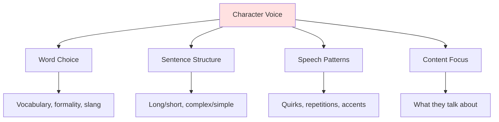

# 💬 Dialogue Fundamentals

> *Mastering the art of conversation: creating authentic, purposeful dialogue that reveals character and advances story*

---

## 📖 **Overview**

**Dialogue** is conversation between characters—one of the most powerful tools in fiction writing. Great dialogue sounds natural while serving multiple story functions simultaneously. It reveals character, advances plot, conveys information, and creates conflict, all while maintaining the illusion of real speech.

### **Why Dialogue Matters:**
- 🎭 **Reveals Character:** How people speak shows who they are
- ⚡ **Creates Conflict:** Disagreement drives drama
- 🎯 **Advances Plot:** Conversations move story forward
- 💡 **Conveys Information:** Natural exposition
- 🌟 **Breaks Up Prose:** Visual relief from description
- 🎨 **Establishes Rhythm:** Pacing and energy

### **The Golden Rule:**
> "Good dialogue is not real speech—it's the illusion of real speech. It's real speech made purposeful, condensed, and dramatic."  
> — Real conversation is boring; fiction dialogue is curated

---

## 🎯 **What Is Good Dialogue?**

### **Good Dialogue Is:**

**✅ Purposeful:**
- Serves story function
- Reveals character
- Advances plot
- Creates conflict
- Conveys subtext

**✅ Natural-Sounding:**
- Flows like real speech
- Authentic to character
- Age and background appropriate
- Contextually believable

**✅ Distinctive:**
- Each character has unique voice
- Vocabulary reflects background
- Speech patterns vary
- Identifiable without tags

**✅ Concise:**
- Edited and condensed
- No meaningless small talk
- Gets to the point
- Omits obvious greetings

**✅ Dynamic:**
- Creates tension
- Features interruptions
- Includes subtext
- Shows power dynamics

---

### **Good Dialogue Is NOT:**

**❌ Transcript of Real Speech:**
> Real: "Um, so, like, I was thinking, you know, maybe we could, uh, go to the movies or something?"

> Fiction: "Want to catch a movie?"

**❌ Information Dump:**
> "As you know, Bob, we've been best friends since third grade when we both joined the soccer team at Lincoln Elementary..."

**❌ On-the-Nose:**
> "I'm angry at you!"  
> "Well, I'm angry at you too!"

**❌ All Formal or All Slang:**
Characters aren't robots or caricatures

**❌ Interchangeable:**
Every character sounds the same

---

## 🎨 **The Functions of Dialogue**

### **1. Character Revelation:**

**Dialogue Shows:**
- Personality and temperament
- Education and background
- Values and beliefs
- Emotional state
- Relationships with others
- Internal conflicts

**Examples:**

<details>
<summary><b>Education & Background</b></summary>

**Highly Educated:**
> "The correlation between socioeconomic status and educational attainment is well-documented."

**Practical Education:**
> "Poor kids don't go to college. That's just how it is."

**Same information, different voices**

</details>

<details>
<summary><b>Personality</b></summary>

**Optimist:**
> "It's going to be fine. We'll figure something out."

**Pessimist:**
> "We're doomed. There's no way out of this."

**Realist:**
> "We have three options, all bad. Let's choose the least terrible."

</details>

<details>
<summary><b>Emotional State</b></summary>

**Calm:**
> "I understand you're upset. Let's talk about this."

**Angry:**
> "Oh, you understand? You understand nothing!"

**Defensive:**
> "I'm not upset. Why would I be upset? I'm perfectly fine."

</details>

---

### **2. Plot Advancement:**

**Dialogue Moves Story By:**
- Revealing information
- Creating decisions
- Making plans
- Causing misunderstandings
- Establishing stakes
- Triggering action

**Example:**
> "The shipment arrives at midnight. If we're not there, Marcus dies."  
> She checked her watch. "That gives us four hours."  
> "We'll never make it in time."  
> "Then we'd better start running."

*Reveals: deadline, stakes, conflict, decision, action*

---

### **3. Conflict Creation:**

**Dialogue Creates Tension Through:**
- Disagreement
- Misunderstanding
- Secrets and lies
- Different goals
- Power struggles
- Unspoken feelings

**Example:**
> "You promised me you'd quit."  
> "I did quit."  
> "Then what's this?" She held up the cigarette pack.  
> "Those aren't mine."  
> "They were in your jacket pocket."  
> "Someone must have planted them."  
> She stared at him. "Do you even hear yourself?"

*Conflict escalates through lie, discovery, denial*

---

### **4. Exposition:**

**The Challenge:**
Conveying necessary information without info-dumping

**Bad Exposition:**
> "As you know, Father, I'm your only son, born twenty-five years ago in Boston, where I attended Harvard before becoming a lawyer."

**Good Exposition:**
> "Twenty-five years. That's how long you've been grooming me for this."  
> "I never forced you to go to Harvard. I never forced you to become a lawyer."  
> "Didn't you?"

*Same information, delivered naturally through conflict*

---

### **5. Relationship Dynamics:**

**Dialogue Shows:**
- Power imbalances
- Intimacy levels
- History between characters
- Respect or contempt
- Affection or hostility
- Comfort or tension

**Example - Intimate:**
> "You're doing that thing again."  
> "What thing?"  
> "The thing where you pretend you're fine when you're not."  
> She smiled despite herself. "I hate that you know me so well."

**Example - Hostile:**
> "You're doing that thing again."  
> "What thing?"  
> "The thing where you pretend you're fine when you're clearly falling apart."  
> "Go to hell."

*Same words, different relationships*

---

## 🗣️ **Creating Distinctive Voices**

### **Character Voice Elements:**



---

### **Word Choice (Diction):**

**Consider:**
- Education level
- Regional origin
- Social class
- Profession
- Age group
- Cultural background

**Examples:**

**Character A (Professor):**
> "The hypothesis requires additional empirical evidence."

**Character B (Mechanic):**
> "We need to check if this thing actually works."

**Character C (Teenager):**
> "We should totally test this first."

*Same meaning, three voices*

---

### **Sentence Structure:**

**Short, Choppy:**
> "Don't go. Stay here. Please."

*Urgency, emotion, simplicity*

**Long, Complex:**
> "While I understand your desire to leave, and I certainly wouldn't want to prevent you from doing what you feel is necessary, I hope you'll consider staying, at least for a little while longer."

*Educated, contemplative, possibly evasive*

**Medium, Varied:**
> "I know you want to go. But stay. Just for tonight."

*Balanced, natural, earnest*

---

### **Speech Patterns:**

**Repetition:**
> "I'm fine. Really, I'm fine. Everything's fine."

*Nervous, trying to convince self*

**Interruption:**
> "I just think that maybe we should—"  
> "No."  
> "You didn't let me—"  
> "I said no."

*Power struggle, impatience*

**Hedging:**
> "Maybe we could possibly consider perhaps trying something different?"

*Uncertainty, lack of confidence*

**Directness:**
> "Do it. Now."

*Authority, urgency, confidence*

---

### **Content Focus:**

**What characters talk about reveals them:**

**Scientist:**
> "The molecular structure suggests an organic compound, possibly carbon-based."

**Artist:**
> "Look at the colors—how they bleed into each other, creating something new."

**Warrior:**
> "Where's the enemy? How many? What weapons?"

**Same situation (alien substance), different professional focus*

---

## 💡 **Writing Natural Dialogue**

### **Techniques for Authenticity:**

**1. Read It Aloud:**
- Does it flow?
- Can you say it comfortably?
- Does it sound like a real person?
- Where do you stumble?

**2. Use Contractions:**
> ❌ "I do not know what you are talking about."  
> ✅ "I don't know what you're talking about."

*Natural speech contracts*

**3. Include Interruptions:**
> "I think we should—"  
> "Should what? Run away?"  
> "Let me finish."  
> "You were going to say run."  
> "No, I was going to say—"  
> "Run. That's what you always do."

*Real conversations overlap*

**4. Embrace Incomplete Sentences:**
> "If only I'd..."  
> "But you didn't."  
> "No. I didn't."

*People trail off, leave thoughts unfinished*

**5. Use Subtext:**
> "Fine."  
> "Fine?"  
> "I said it's fine."  
> "Doesn't sound fine."  
> "Well, it is."

*Says fine, means not fine*

**See: [Subtext](subtext.md) for detailed guide**

---

### **The Rhythm of Dialogue:**

**Vary Length:**
```
"I need to tell you something."
"What?"
"It's about your brother."
"What about him?"
"He's not who you think he is."
"Meaning?"
"He's been lying to you. For years."
```

*Mix of long and short creates rhythm*

**Use White Space:**
Dialogue exchanges create visual breaks in prose

**Control Pacing:**
- Short exchanges = fast pace
- Long speeches = slow pace
- Interruptions = tension
- Pauses = significance

---

## 🚫 **Common Dialogue Mistakes**

<details>
<summary><b>❌ Major Pitfalls</b></summary>

### **"As You Know, Bob" (Info-Dumping):**
**Problem:**
> "As you know, Bob, we've been searching for the Crystal of Power for ten years, ever since it was stolen from the Temple of Light by the Dark Brotherhood on that fateful night in 2015."

**Fix:**
> "Ten years, Bob. Ten years we've been chasing this thing."  
> "And we're still no closer than we were the night it was stolen."

---

### **On-the-Nose Dialogue:**
**Problem:**
> "I am very angry at you because you betrayed my trust!"

**Fix:**
> "Get out."  
> "Can we talk about this?"  
> "I said. Get. Out."

*Shows anger without stating it*

---

### **Said Bookism (Over-Creative Tags):**
**Problem:**
> "I love you," he professed ardently.  
> "Do you really?" she queried dubiously.  
> "With all my heart," he avowed passionately.

**Fix:**
> "I love you," he said.  
> "Do you really?"  
> "With all my heart."

*Simple is better*

**See: [Dialogue Tags](dialogue-tags.md)**

---

### **Ping-Pong Dialogue:**
**Problem:**
> "How are you?"  
> "I'm good. How are you?"  
> "I'm fine. Nice weather."  
> "Yes, very nice."

**Fix:**
Cut it. Starts mid-conversation:
> "So what did the doctor say?"

*Skip meaningless greetings*

---

### **Exposition Disguised as Dialogue:**
**Problem:**
> "Remember when we first met at the coffee shop on Fifth Street three years ago, and you spilled coffee on my white shirt, and I was on my way to that job interview?"

**Fix:**
> "You ruined my shirt."  
> "It was an accident! And you still got the job."  
> "Despite you, not because of you."

*Show history through banter, not recitation*

---

### **Everyone Sounds the Same:**
**Problem:**
All characters speak with same vocabulary, rhythm, style

**Fix:**
- Give each character distinctive voice
- Consider background, education, personality
- Vary sentence structure
- Different speech patterns

---

### **Too Formal or Too Casual:**
**Problem:**
> "I am uncertain as to whether we should proceed."  
> OR  
> "Like, I dunno, maybe we should, like, totally bail?"

**Fix:**
> "I'm not sure about this."

*Natural middle ground*

---

### **Dialogue That Does Nothing:**
**Problem:**
Conversation that doesn't reveal character, advance plot, or create conflict

**Fix:**
Cut it or make it serve multiple functions

**Test:**
What would happen if you deleted this dialogue? If answer is "nothing," cut it.

---

### **Accents/Dialects Done Wrong:**
**Problem:**
> "Aye, 'tis a bonny day, 'tis. We'll be havin' a wee bit o' whisky, we will."

**Fix:**
> "It's a beautiful day. Let's have some whisky."  
> [NARRATION: His Scottish brogue thickened with pleasure.]

*Suggest accent through word choice and narration, not phonetic spelling*

---

### **Too Much Dialect:**
**Problem:**
> "'Ere now, wot's all this then? Oi ain't never seen nuffin' like that before, 'ave I?"

**Fix:**
> "What's all this then? Never seen anything like it."  
> [First line establishes pattern, then ease off]

*A little goes a long way*

</details>

---

## 🎯 **Dialogue Best Practices**

### **The 80/20 Rule:**

**80% of your dialogue should be simple "said" or "asked"**
- Invisible to readers
- Doesn't distract
- Reliable and clear

**20% can be action beats or variations**
- When movement is significant
- When emotion needs emphasis
- When "said" feels repetitive

---

### **Every Line Should Do Multiple Things:**

**Good dialogue accomplishes 2-3 functions:**
- ✅ Reveals character
- ✅ Advances plot
- ✅ Creates conflict
- ✅ Conveys information
- ✅ Shows relationship
- ✅ Builds tension

**Example:**
> "I told you to stay in the car."  
> "Since when do I listen to you?"

*Reveals: relationship dynamic, character independence, conflict, backstory*

---

### **Start Scenes Mid-Conversation:**

**Instead of:**
> "Hi."  
> "Hello. How are you?"  
> "I'm fine. How are you?"  
> "Good. Did you hear about the bank robbery?"

**Do This:**
> "The bank robbery—you heard?"

*Skip greetings, start with interesting part*

---

### **Cut Repetitive Agreement:**

**Instead of:**
> "We should leave."  
> "Yes, we should."  
> "Okay, let's go."  
> "Alright."

**Do This:**
> "We should leave."  
> She grabbed her coat. "Let's go."

*Action shows agreement*

---

### **Use Silence:**

**Not speaking is powerful:**
> "Do you love me?"  
> He said nothing.  
> "That's what I thought."

*Silence speaks volumes*

---

## 💬 **Formatting Dialogue**

### **Basic Rules:**

**New Speaker = New Paragraph:**
```
"I need to tell you something," John said.
"What is it?" Mary asked.
"I'm leaving town."
```

**Action With Dialogue = Same Paragraph:**
```
She slammed the door. "Get out!"
```

**Punctuation Inside Quotes:**
```
✅ "I love you," she said.
❌ "I love you", she said.
```

**New Sentence After Dialogue Tag:**
```
✅ "Stop," he said. "Don't go."
❌ "Stop," he said, "don't go."
```

**Comma After Dialogue (If Tag Follows):**
```
✅ "Hello," she said.
❌ "Hello." She said.
```

---

## 💡 **Dialogue Exercises**

### **Exercise 1: Eavesdrop**
Listen to real conversations:
- What makes them natural?
- How do people actually talk?
- Speech patterns and rhythms?
- Then condense for fiction

### **Exercise 2: Distinctive Voices**
Write same line three ways:
- Teenager
- Elderly person
- CEO
- How does word choice change?

### **Exercise 3: Subtext Scene**
Write conversation where:
- Characters want different things
- Neither says what they mean
- Conflict simmers beneath surface

### **Exercise 4: Cut the Fat**
Take your dialogue and:
- Remove greetings
- Cut small talk
- Eliminate repeated information
- Start mid-conversation
- What remains?

### **Exercise 5: Read Aloud**
Read all your dialogue out loud:
- Does it flow?
- Can you say it naturally?
- Where do you stumble?
- Fix those spots

---

## 📋 **Dialogue Checklist**

**Before finalizing dialogue, check:**

- [ ] Each character has distinctive voice
- [ ] Dialogue serves multiple functions
- [ ] No info-dumps or "as you know"
- [ ] Mostly "said" and "asked" tags
- [ ] Appropriate amount of subtext
- [ ] Conflict or tension present
- [ ] Natural rhythm and flow
- [ ] Read aloud successfully
- [ ] Contractions used naturally
- [ ] Interruptions where appropriate
- [ ] No unnecessary small talk
- [ ] Action beats when needed
- [ ] Proper formatting and punctuation

---

## 🔗 **Related Resources**

- 💭 **[Subtext](subtext.md)** — What's unsaid in dialogue
- 🏷️ **[Dialogue Tags](dialogue-tags.md)** — Attribution techniques
- 👥 **[Character Development](../character-development/)** — Voice and personality
- 🎭 **[Show vs. Tell](../../craft/show-vs-tell/)** — Revealing through dialogue
- ⚔️ **[Conflict Types](../plot-development/conflict-types.md)** — Using dialogue for tension

---

## 📖 **Recommended Reading**

- *The Art of Fiction* — John Gardner
- *Self-Editing for Fiction Writers* — Renni Browne & Dave King
- *Stein on Writing* — Sol Stein
- *Dialogue* — Robert McKee

**Study Dialogue Masters:**
- Elmore Leonard — Natural, distinctive voices
- Jane Austen — Wit and subtext
- Ernest Hemingway — Minimalist power
- Quentin Tarantino — Rhythm and style
- Aaron Sorkin — Fast-paced, intelligent

---

<div align="center">

### **Let Your Characters Speak 💬**

*Great dialogue sounds natural while serving story. It reveals character, creates conflict, and advances plot—all at once.*

**[⬅️ Back to Dialogue Techniques](README.md)** | **[📚 Fundamentals](../README.md)**

</div>
