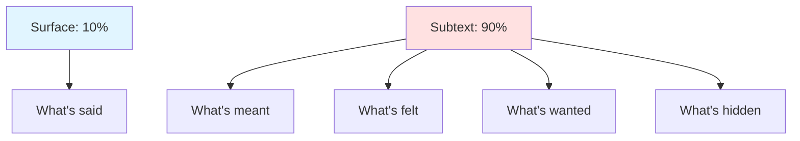
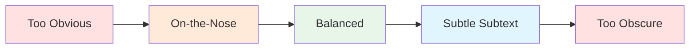

# 💭 Subtext in Dialogue

> *Mastering what's unsaid: creating layered conversations where meaning lies beneath the surface*

---

## 📖 **Overview**

**Subtext** is the unspoken meaning beneath dialogue—what characters really mean versus what they actually say. It's the difference between the words on the page and the true emotional or psychological content of a conversation. Subtext creates depth, tension, and realism by acknowledging that people rarely say exactly what they mean.

### **Why Subtext Matters:**
- 🎭 **Creates Realism:** People don't always say what they mean
- 💡 **Adds Depth:** Multiple layers of meaning
- ⚡ **Builds Tension:** Unspoken conflicts simmer
- 🎯 **Respects Readers:** They enjoy interpreting
- 🌟 **Reveals Character:** True feelings show through
- 🎨 **Creates Complexity:** Nothing is simple

### **The Golden Rule:**
> "The most interesting dialogue is what's NOT said. Subtext is the gap between what characters say and what they mean."  
> — The best dialogue works on two levels simultaneously

---

## 🎯 **What Is Subtext?**

### **Definition:**

**Subtext** = The underlying meaning beneath the surface dialogue—what's really being communicated

**Surface Text:**
The actual words spoken

**Subtext:**
The real meaning, emotion, or intention

---

### **Example:**

**SURFACE:**
> "Fine."

**SUBTEXT:**
> "It's not fine. I'm angry/hurt/frustrated, but I don't want to talk about it."

**FULL CONTEXT:**
> "Are you okay?"  
> "Fine." She turned away.

*The word "fine" carries weight of everything unsaid*

---

### **Why We Use Subtext:**

**In Real Life:**
- Social politeness
- Fear of confrontation
- Protecting ourselves
- Shame or embarrassment
- Power dynamics
- Cultural norms
- Self-deception

**In Fiction:**
- Creates tension
- Shows character complexity
- Engages readers
- Builds dramatic irony
- Reveals internal conflict
- Makes dialogue interesting

---

## 🎨 **Types of Subtext**

### **1. Emotional Subtext:**

**What's really being felt:**

**Example:**
> "I'm happy for you. Really."

**Surface:** Congratulations  
**Subtext:** Jealousy, pain

**Full Scene:**
> "I got the promotion."  
> "That's wonderful." Her smile didn't reach her eyes. "I'm happy for you. Really."

*Says one thing, feels another*

---

### **2. Intentional Subtext:**

**What the character wants:**

**Example:**
> "You look tired. Maybe you should go home early."

**Surface:** Concern for coworker  
**Subtext:** I want you to leave so I can snoop through your desk

**Full Scene:**
> "You look tired. Maybe you should go home early."  
> "I'm fine."  
> "You've been here twelve hours. Go. I'll finish up."  
> "You sure?"  
> "Absolutely." *I'll finally have access to those files.*

*Hidden agenda*

---

### **3. Power Dynamics Subtext:**

**Who's in control:**

**Example:**
> "That's an... interesting choice."

**Surface:** Neutral observation  
**Subtext:** I think it's terrible and I'm judging you

**Full Scene:**
> "What do you think of my design?"  
> "It's very... bold." She paused. "That's an interesting choice."  
> He heard what she didn't say.

*Power through disapproval*

---

### **4. Historical Subtext:**

**Baggage from the past:**

**Example:**
> "You promised."

**Surface:** Simple reminder  
**Subtext:** You broke your promise before, you'll do it again, I can't trust you

**Full Scene:**
> "I'll be there. I promise."  
> "You promised." Her voice was flat.  
> "I mean it this time."  
> "You always mean it."

*History colors present*

---

### **5. Social/Cultural Subtext:**

**Unspoken social rules:**

**Example:**
> "How nice to see you."

**Surface:** Greeting  
**Subtext:** I didn't expect you here / I'm not happy to see you / social obligation

**Full Scene:**
> "How nice to see you." The words were ice.  
> "I'm sure." He matched her tone.  
> "Will you be staying long?"  
> "As long as necessary."

*Polite warfare*

---

### **6. Self-Deception Subtext:**

**What character won't admit:**

**Example:**
> "I don't care what he thinks."

**Surface:** Indifference  
**Subtext:** I care deeply and I'm hurt

**Full Scene:**
> "Did he say anything?"  
> "About what?"  
> "About me."  
> "I don't care what he thinks."  
> "Then why are you asking?"

*Lying to self*

---

## 💡 **Creating Subtext**

### **Technique 1: Say the Opposite**

**What They Mean:**
"I love you and I'm terrified of losing you"

**What They Say:**
> "Whatever. I don't care."

**In Context:**
> "I'm leaving tomorrow."  
> "Okay."  
> "That's it? Just okay?"  
> "What do you want me to say?"  
> "Something. Anything."  
> "Have a good trip." He turned away so she wouldn't see his face.

*Opposite of true feeling*

---

### **Technique 2: Use Silence**

**Sometimes the subtext is in not speaking:**

**Example:**
> "Do you love me?"  
> He didn't answer.  
> "That's what I thought."

*Silence says everything*

---

### **Technique 3: Change the Subject**

**Avoidance reveals:**

**Example:**
> "We need to talk about what happened."  
> "Did you see the game last night?"  
> "Don't do that. Don't avoid this."  
> "I'm not avoiding anything."  
> "You won't even look at me."

*Subject change = I don't want to discuss this*

---

### **Technique 4: Use Specific Word Choice**

**Particular words carry weight:**

**Example:**
> "That's... nice."

vs.

> "That's wonderful!"

*Hesitation and word choice reveal true opinion*

---

### **Technique 5: Body Language Contradicts Words**

**Actions show truth:**

**Example:**
> "I'm not upset." She threw the plate into the sink, where it shattered.

**Example:**
> "I trust you completely," he said, checking his phone for the third time.

*Words and actions conflict*

---

### **Technique 6: Minimal Response**

**Brief answers hide emotion:**

**Example:**
> "How was your day?"  
> "Fine."  
> "Just fine?"  
> "Yep."  
> "You want to talk about it?"  
> "Nope."

*Monosyllables = walls up*

---

### **Technique 7: Overstatement**

**Too much emphasis reveals insecurity:**

**Example:**
> "I'm totally over him. Completely. I don't even think about him anymore. Not at all."

*Protesting too much*

---

## 🎭 **Subtext Patterns**

### **The Iceberg Dialogue:**

**Example:**

**Surface (10%):**
> "Nice dress."

**Subtext (90%):**
- **What's meant:** "You're trying too hard"
- **What's felt:** Jealousy
- **What's wanted:** To diminish her
- **What's hidden:** Own insecurity

---

## ⚔️ **Subtext and Conflict**

### **Subtext Creates Tension:**

**Direct Conflict (On-the-Nose):**
> "I hate you!"  
> "Well, I hate you too!"

*No subtext, all surface*

**Indirect Conflict (Subtext):**
> "How lovely to see you."  
> "I'm sure."  
> "You're looking well."  
> "As are you."  
> "Mother always said you had... resilience."

*Polite conversation, hostile subtext*

---

### **The Argument Beneath the Argument:**

**Surface Argument:**
About dishes in the sink

**Real Argument (Subtext):**
About respect, consideration, feeling taken for granted

**Example:**
> "You left dishes in the sink again."  
> "I'll do them later."  
> "You always say that."  
> "God, it's just dishes."  
> "It's not about the dishes."  
> "Then what's it about?"  
> "If you have to ask, you'll never understand."

*Real issue: feeling unseen and unappreciated*

---

## 💬 **Subtext in Different Contexts**

### **Romantic Subtext:**

**Example 1: Confession Hidden in Small Talk**
> "Coffee?"  
> "Sure."  
> "How do you take it?"  
> "Black. Like my soul."  
> "Poetic."  
> "You bring it out in me."

*Flirting disguised as coffee discussion*

---

**Example 2: "I Love You" Without Saying It**
> "Drive safe."  
> "It's just to the store."  
> "I know. Still. Be careful."  
> "I will."  
> "Text me when you get there."

*Concern = love*

---

### **Professional Subtext:**

**Example: Office Politics**
> "Interesting approach to the presentation."  
> "Thank you."  
> "Very... creative."  
> "I appreciate the feedback."  
> "I'm sure Johnson will have thoughts."  
> "I'm sure he will."

*Surface: compliments  
Subtext: warnings, disapproval, politics*

---

### **Family Subtext:**

**Example: Parent-Child Tension**
> "You're eating out again?"  
> "Just meeting friends."  
> "You were out last night too."  
> "So?"  
> "Nothing. I just worry."  
> "I'm fine."  
> "I'm sure you are."

*Surface: plans  
Subtext: worry, growing distance, loss of closeness*

---

### **Friendship Subtext:**

**Example: Jealousy Between Friends**
> "How's the new boyfriend?"  
> "Great. Really great."  
> "That's wonderful."  
> "You should meet him."  
> "I'd love to. When I have time."  
> "You're always busy lately."  
> "Work, you know."

*Surface: catching up  
Subtext: jealousy, feeling replaced*

---

## 🎯 **Balancing Subtext and Clarity**

### **The Subtext Spectrum:**

---

### **Too Obvious (On-the-Nose):**

> "I'm angry at you because you lied to me about where you were last night!"

*No subtext, everything stated*

---

### **Balanced Subtext:**

> "Where were you last night?"  
> "Out."  
> "That's specific."  
> "What do you want me to say?"  
> "The truth would be nice."

*Anger clear but not stated*

---

### **Too Obscure:**

> "The weather's nice."  
> "Is it?"  
> "I thought so."  
> "Interesting."

*So subtle it's meaningless*

---

### **Finding Balance:**

**Give Readers Clues:**
- Character reactions
- Body language description
- Internal thoughts (in POV)
- Other characters noticing
- Narrative framing

**Example with Context:**
> "Where were you last night?"  
> "Out." He wouldn't meet her eyes.  
> "That's specific." Her voice was sharp.  
> "What do you want me to say?"  
> "The truth would be nice." She knew he was lying. She'd seen the texts.

*Body language and internal knowledge guide interpretation*

---

## 🚫 **Common Subtext Mistakes**

<b>❌ Pitfalls to Avoid</b>

### **All Subtext, No Text:**
**Problem:** Everything is so indirect nothing is clear

**Example:**
> "So..."  
> "Yeah."  
> "About that thing."  
> "Right."  
> "You know."  
> "I know."

**Fix:** Give readers something concrete to anchor to

---

### **No Subtext (On-the-Nose):**
**Problem:** Everything is stated directly

**Example:**
> "I'm angry because I feel neglected in this relationship!"

**Fix:**
> "Fine. Stay late at work again. Don't worry about me."

---

### **Inconsistent Subtext:**
**Problem:** Character's hidden meaning shifts without reason

**Fix:** Be clear (to yourself) what character really means, even if readers infer

---

### **Explaining the Subtext:**
**Problem:** Narration tells us what dialogue already shows

**Bad:**
> "I'm fine," she said angrily. She was not fine. She was very upset.

**Good:**
> "I'm fine." She slammed the door.

*Action shows truth*

---

### **Every Line Has Subtext:**
**Problem:** Exhausting for readers

**Reality:** Not every line needs layers

**Balance:**
- Important moments: subtext
- Information exchange: direct
- Character revelation: subtext
- Plot advancement: can be either

---

## 💡 **Subtext Exercises**

### **Exercise 1: Translate the Subtext**
Write scene twice:
1. Version A: Characters say exactly what they mean
2. Version B: Characters use subtext

Compare which is more interesting.

### **Exercise 2: The Unspoken Rule**
Write a scene where characters:
- Want opposite things
- Can't say what they mean (social rules, power dynamic, etc.)
- Must communicate through subtext

### **Exercise 3: Body Language Contradicts**
For each line, add action that contradicts:
- "I'm not nervous." [fidgets, sweats]
- "I don't care." [checks phone repeatedly]
- "I'm fine." [voice cracks]

### **Exercise 4: Analyze Real Subtext**
Watch a scene from a film:
- What's said?
- What's meant?
- How do you know?
- What clues reveal subtext?

### **Exercise 5: The Argument Beneath**
Write argument that's ostensibly about Topic A but really about Topic B:
- Surface: dirty dishes
- Real: feeling disrespected
- Don't state real issue, but make it clear

---

## 📋 **Subtext Checklist**

**For important dialogue scenes:**

- [ ] What does character want?
- [ ] What are they afraid to say?
- [ ] What's the true emotion?
- [ ] Does dialogue match or contradict?
- [ ] Are there clues to real meaning?
- [ ] Can readers infer subtext?
- [ ] Is balance right (not too obvious or obscure)?
- [ ] Does body language reveal truth?
- [ ] Does context support interpretation?
- [ ] Would scene be better direct or indirect?

---

## 🎭 **Famous Examples of Subtext**

### **Film:**

**Casablanca:**
> "Here's looking at you, kid."

*Surface: Toast  
Subtext: I love you, goodbye, I'll never forget you*

**The Godfather:**
> "I'm going to make him an offer he can't refuse."

*Surface: Business proposition  
Subtext: Threat, violence, power*

---

### **Literature:**

**Pride and Prejudice - First Proposal:**
> "In vain I have struggled. It will not do. My feelings will not be repressed. You must allow me to tell you how ardently I admire and love you."

*Surface: Declaration of love  
Subtext: Despite my better judgment, despite your inferior family, I can't help myself*

Lizzy hears the subtext.

---

**Hills Like White Elephants - Hemingway:**
Entire story is subtext—abortion never mentioned directly

> "It's really an awfully simple operation, Jig," the man said. "It's not really an operation at all."

*Surface: Simple procedure  
Subtext: Abortion, pressure, relationship at stake*

---

## 🔗 **Related Resources**

- 💬 **[Dialogue Fundamentals](fundamentals.md)** — Basic dialogue techniques
- 🏷️ **[Dialogue Tags](dialogue-tags.md)** — How to attribute speech
- 🎭 **[Show vs. Tell](../../craft/show-vs-tell/)** — Revealing through action
- ⚔️ **[Conflict Types](../plot-development/conflict-types.md)** — Using conflict in dialogue
- 👥 **[Character Development](../character-development/)** — Understanding character motivations

---

## 📖 **Recommended Reading**

- *Dialogue* — Robert McKee (extensive subtext analysis)
- *The Art of Subtext* — Charles Baxter
- *Self-Editing for Fiction Writers* — Renni Browne & Dave King

**Study Subtext Masters:**
- Ernest Hemingway — Master of omission
- Raymond Carver — What's not said
- Jane Austen — Social subtext
- Harold Pinter — Theatrical subtext

**Films to Study:**
- *Casablanca* — Romance and sacrifice
- *The Godfather* — Power dynamics
- *Lost in Translation* — Unspoken connection
- *Eternal Sunshine of the Spotless Mind* — Complex emotional subtext

---

### **Master the Unspoken 💭**

*Great dialogue says one thing and means another. Subtext creates depth, tension, and realism by honoring how people actually communicate.*

**[⬅️ Back to Dialogue Techniques](README.md)** | **[📚 Fundamentals](../README.md)**

