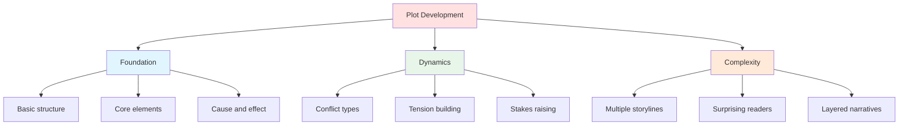
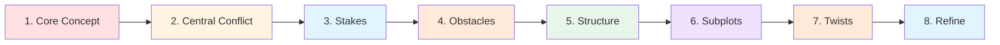

# 📈 Plot Development

> *The Art of Crafting Compelling Story Events*

---

## 📖 **Overview**

**Plot development** is the craft of arranging story events into a compelling sequence that engages readers, reveals character, builds tension, and delivers satisfying resolution. It's not just "what happens"—it's how and why it happens, creating a chain of cause and effect that keeps readers turning pages.

This section provides comprehensive guidance on every aspect of plot construction, from basic principles through advanced techniques like subplots and twists.

---

## 🎯 **What You'll Learn**

---

## 📚 **Complete Plot Development Guide**

### **🧱 Foundation: Building Your Plot**

<table>
<tr>
<td width="50%">

#### **[📖 Plot Basics](plot-basics.md)**

**Learn the fundamentals of plot construction:**
- What plot actually is (vs. story)
- Essential plot elements
- The plot arc structure
- Cause and effect chains
- Plot vs. character relationship
- Common plot mistakes

**The spine of your story**

</td>
<td width="50%">

#### **[⚡ Conflict Types](conflict-types.md)**

**Master the seven types of conflict:**
- Person vs. Person
- Person vs. Society
- Person vs. Nature
- Person vs. Technology
- Person vs. Supernatural
- Person vs. Self
- Person vs. Fate

**The engine that drives your story**

</td>
</tr>
</table>

---

### **⚡ Dynamics: Creating Engagement**

<table>
<tr>
<td width="50%">

#### **[🎯 Tension & Stakes](tension-stakes.md)**

**Keep readers on the edge of their seats:**
- Understanding stakes (what's at risk)
- Types of stakes (physical, emotional, moral)
- Raising stakes throughout story
- Creating and maintaining tension
- Tension-building techniques
- Managing tension curve

**What makes your story unputdownable**

</td>
<td width="50%">

#### **[📚 Subplots](subplots.md)**

**Weave secondary storylines:**
- Eight types of subplots
- Structuring subplot arcs
- Connecting to main plot
- Balancing multiple storylines
- Subplot timing and pacing
- Weaving techniques

**Adding depth and complexity**

</td>
</tr>
</table>

---

### **🎭 Advanced: Surprising Your Reader**

<table>
<tr>
<td>

#### **[🎭 Plot Twists](plot-twists.md)**

**Master the art of surprise:**
- What makes a great twist
- Ten types of plot twists
- Planting clues and foreshadowing
- Misdirection techniques
- Timing the reveal
- Making twists fair and meaningful

**Shocking readers while playing fair**

</td>
</tr>
</table>

---

## 🗺️ **Learning Paths**

Choose your path based on your current needs:

### **📘 For Beginners:**

Start with core concepts, then build complexity:

1. **[Plot Basics](plot-basics.md)** — Understand plot fundamentals
2. **[Conflict Types](conflict-types.md)** — Learn sources of opposition
3. **[Tension & Stakes](tension-stakes.md)** — Keep readers engaged
4. **[Subplots](subplots.md)** — Add secondary storylines
5. **[Plot Twists](plot-twists.md)** — Surprise your readers

---

### **🎯 For Specific Needs:**

Jump directly to what you need:

**My plot feels aimless:**
→ [Plot Basics](plot-basics.md) — Learn structure and cause-effect

**My story has no drama:**
→ [Conflict Types](conflict-types.md) — Add meaningful opposition

**Readers aren't engaged:**
→ [Tension & Stakes](tension-stakes.md) — Make them care and worry

**My story feels thin:**
→ [Subplots](subplots.md) — Add depth with secondary threads

**My story is predictable:**
→ [Plot Twists](plot-twists.md) — Learn to surprise effectively

---

### **📈 For Advanced Writers:**

Deepen your understanding of plot:

1. **[Conflict Types](conflict-types.md)** — Layer multiple conflicts
2. **[Tension & Stakes](tension-stakes.md)** — Master tension curves
3. **[Subplots](subplots.md)** — Weave complex storylines
4. **[Plot Twists](plot-twists.md)** — Create sophisticated surprises
5. **[Plot Basics](plot-basics.md)** — Refine cause-effect chains

---

## 🎨 **The Plot Development Process**

### **Step-by-Step Plot Construction:**

**1. Concept**
- What's the story about?
- Central situation or premise
- Basic "what if?"

**Resources:** [Plot Basics](plot-basics.md)

---

**2. Central Conflict**
- What opposes protagonist?
- Primary conflict type
- Source of opposition
- Core dramatic question

**Resources:** [Conflict Types](conflict-types.md)

---

**3. Stakes**
- What's at risk?
- Why does it matter?
- What's gained or lost?
- Personal investment

**Resources:** [Tension & Stakes](tension-stakes.md)

---

**4. Obstacles**
- What stands in the way?
- How do complications escalate?
- What tests character?
- Rising difficulty

**Resources:** [Plot Basics](plot-basics.md), [Conflict Types](conflict-types.md)

---

**5. Structure**
- How to arrange events?
- Where are key moments?
- Pacing and rhythm
- Act structure

**Resources:** [Plot Basics](plot-basics.md), [Story Structure](../story-structure/)

---

**6. Subplots**
- What secondary threads?
- How do they connect?
- Character development
- Thematic reinforcement

**Resources:** [Subplots](subplots.md)

---

**7. Twists**
- Where to surprise?
- How to foreshadow?
- Keeping it fair
- Maximum impact

**Resources:** [Plot Twists](plot-twists.md)

---

**8. Refinement**
- Tighten cause-effect
- Escalate tension
- Remove coincidence
- Polish pacing

**Resources:** All sections

---

## 🎯 **Essential Plot Elements**

Every well-developed plot should have:

### **✅ The Core Seven:**

| Element | Purpose | See |
|---------|---------|-----|
| **Inciting Incident** | Disrupts normal, starts story | [Plot Basics](plot-basics.md) |
| **Clear Goal** | What protagonist pursues | [Plot Basics](plot-basics.md) |
| **Strong Conflict** | Opposition to goal | [Conflict Types](conflict-types.md) |
| **High Stakes** | What matters, what's at risk | [Tension & Stakes](tension-stakes.md) |
| **Escalating Obstacles** | Rising difficulty | [Tension & Stakes](tension-stakes.md) |
| **Crisis Moment** | Impossible choice | [Plot Basics](plot-basics.md) |
| **Satisfying Resolution** | Earned conclusion | [Plot Basics](plot-basics.md) |

---

## 📊 **Plot Elements Comparison**

### **Understanding Different Plot Components:**

<table>
<thead>
<tr>
<th>Element</th>
<th>What It Is</th>
<th>Purpose</th>
<th>When It Appears</th>
</tr>
</thead>
<tbody>
<tr>
<td><b>Conflict</b></td>
<td>Opposition between forces</td>
<td>Creates drama</td>
<td>Throughout</td>
</tr>
<tr>
<td><b>Tension</b></td>
<td>Reader's anticipation/anxiety</td>
<td>Keeps pages turning</td>
<td>Building throughout</td>
</tr>
<tr>
<td><b>Stakes</b></td>
<td>What's gained or lost</td>
<td>Makes readers care</td>
<td>Established early, raised throughout</td>
</tr>
<tr>
<td><b>Obstacle</b></td>
<td>Specific challenge blocking progress</td>
<td>Tests character, creates difficulty</td>
<td>Multiple, escalating</td>
</tr>
<tr>
<td><b>Complication</b></td>
<td>Event that makes things harder</td>
<td>Raises stakes, increases tension</td>
<td>Acts 2-3</td>
</tr>
<tr>
<td><b>Crisis</b></td>
<td>Impossible choice</td>
<td>Forces character definition</td>
<td>Late Act 3</td>
</tr>
<tr>
<td><b>Climax</b></td>
<td>Final confrontation</td>
<td>Resolves central conflict</td>
<td>Act 3</td>
</tr>
<tr>
<td><b>Subplot</b></td>
<td>Secondary storyline</td>
<td>Depth, character, theme</td>
<td>Introduced Act 1-2, resolved by end</td>
</tr>
<tr>
<td><b>Twist</b></td>
<td>Surprising revelation</td>
<td>Shock and recontextualize</td>
<td>Midpoint or Act 3</td>
</tr>
</tbody>
</table>

---

## ⚖️ **Common Plot Development Mistakes**

<b>❌ Pitfalls to Avoid</b>

### **Episodic Plot:**
- **Problem:** Events don't cause each other
- **Fix:** Create cause-effect chain
- **See:** [Plot Basics](plot-basics.md)

### **No Clear Conflict:**
- **Problem:** No meaningful opposition
- **Fix:** Establish strong antagonistic force
- **See:** [Conflict Types](conflict-types.md)

### **Low Stakes:**
- **Problem:** Nothing important at risk
- **Fix:** Raise what character stands to lose
- **See:** [Tension & Stakes](tension-stakes.md)

### **Flat Tension:**
- **Problem:** Same level throughout
- **Fix:** Escalate tension in waves
- **See:** [Tension & Stakes](tension-stakes.md)

### **Too Many Subplots:**
- **Problem:** Main plot gets lost
- **Fix:** Limit and connect subplots
- **See:** [Subplots](subplots.md)

### **Coincidence:**
- **Problem:** Too many lucky breaks
- **Fix:** Character must earn solutions
- **See:** [Plot Basics](plot-basics.md)

### **Unfair Twist:**
- **Problem:** No foreshadowing
- **Fix:** Plant clues throughout
- **See:** [Plot Twists](plot-twists.md)

### **Deus Ex Machina:**
- **Problem:** Convenient rescue
- **Fix:** Protagonist solves own problem
- **See:** [Plot Basics](plot-basics.md)

### **Meandering Middle:**
- **Problem:** Story loses direction
- **Fix:** Clear midpoint, escalating complications
- **See:** [Plot Basics](plot-basics.md), [Tension & Stakes](tension-stakes.md)

### **Rushed Ending:**
- **Problem:** Resolution too quick
- **Fix:** Properly build and earn climax
- **See:** [Plot Basics](plot-basics.md)

---

## 💡 **Quick Reference: Plot Checklist**

### **Use this checklist for your plot:**

**Foundation:**
- [ ] Clear inciting incident
- [ ] Protagonist's goal established
- [ ] Strong opposing force
- [ ] Stakes clearly defined
- [ ] Cause-effect chain

**Development:**
- [ ] Obstacles escalate
- [ ] Tension rises throughout
- [ ] Stakes increase
- [ ] Character drives plot
- [ ] Subplots support main

**Resolution:**
- [ ] Crisis forces choice
- [ ] Climax resolves central conflict
- [ ] Protagonist earns victory/defeat
- [ ] Subplots resolved
- [ ] Satisfying conclusion

**Overall:**
- [ ] No coincidental solutions
- [ ] Fair foreshadowing
- [ ] Proper pacing
- [ ] Engaging throughout
- [ ] Thematically coherent

---

## 🔗 **Related Resources**

### **Within Fundamentals:**
- 📖 **[Story Structure](../story-structure/)** — How to organize your plot
- 👥 **[Character Development](../character-development/)** — Plot's partner
- 🎭 **[Protagonist & Antagonist](../character-development/protagonist-antagonist.md)** — Central conflict
- 💬 **[Dialogue Techniques](../dialogue-techniques/)** — Revealing plot through speech
- 🌍 **[World-Building](../world-building/)** — Setting that affects plot

### **Craft & Advanced:**
- ⏱️ **[Pacing & Rhythm](../../craft/pacing-rhythm/)** — Controlling plot flow
- 👁️ **[POV & Perspective](../../craft/pov-perspective/)** — Revealing plot
- 🎨 **[Show vs. Tell](../../craft/show-vs-tell/)** — Plot revelation techniques

### **Templates & Tools:**
- 📋 **[Plot Outlines](../../../templates/plot-outlines/)** — Planning templates
- ✍️ **[Scene Templates](../../../templates/scene-templates/)** — Scene structure
- 📚 **[Examples](../../../examples/plot-structures/)** — Plot analysis

---

## 📖 **Recommended Reading**

**Essential Books on Plot:**
- *Story* — Robert McKee
- *The Anatomy of Story* — John Truby
- *Plot & Structure* — James Scott Bell
- *Wired for Story* — Lisa Cron
- *Save the Cat!* — Blake Snyder
- *Creating Character Arcs* — K.M. Weiland (character-plot connection)
- *Conflict & Suspense* — James Scott Bell

See **[Craft Books Reading List](../../../resources/reading-lists/craft-books.md)** for more.

---

## 🎯 **Next Steps**

### **Ready to Start?**

1. **New to plot development?**  
   → Start with [Plot Basics](plot-basics.md)

2. **Plot lacks drama?**  
   → Study [Conflict Types](conflict-types.md)

3. **Readers aren't engaged?**  
   → Focus on [Tension & Stakes](tension-stakes.md)

4. **Story feels simple?**  
   → Add [Subplots](subplots.md)

5. **Story is predictable?**  
   → Learn [Plot Twists](plot-twists.md)

6. **Need planning tools?**  
   → Visit [Plot Templates](../../../templates/plot-outlines/)

---

## **✨ Plot Is the Engine of Your Story ✨**

*Master plot development and you master reader engagement. Events aren't just happenings—they're carefully constructed cause-effect chains that reveal character, build emotion, and deliver meaning.*

---

### **📚 Explore Plot Development:**

**[Plot Basics](plot-basics.md)** | **[Conflict Types](conflict-types.md)** | **[Tension & Stakes](tension-stakes.md)**

**[Subplots](subplots.md)** | **[Plot Twists](plot-twists.md)**

---

**[⬅️ Back to Fundamentals](../README.md)** | **[🏠 Home](../../../README.md)**

