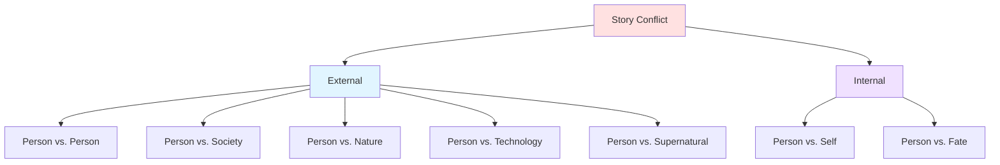
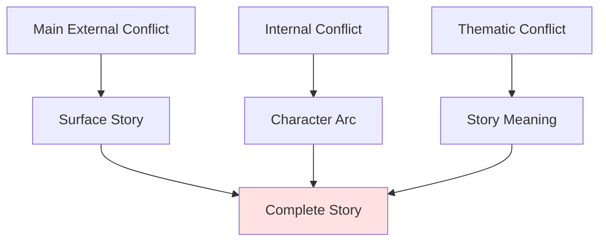

# ⚡ Conflict Types

> *The engine of drama: understanding the forces that drive your story*

---

## 📖 **Overview**

**Conflict** is the opposition between forces—the fundamental ingredient that makes stories compelling. Without conflict, there is no story. Conflict creates tension, reveals character, drives plot forward, and delivers meaning. Understanding the different types of conflict allows you to craft richer, more layered narratives.

### **Why Conflict Matters:**
- 🎭 **Creates Drama:** Source of all tension
- 💡 **Reveals Character:** Shows who people really are
- ⚡ **Drives Plot:** Forces action and change
- 🎯 **Engages Readers:** Creates investment
- 🌟 **Embodies Theme:** Represents story's ideas

### **The Golden Rule:**
> "Conflict is not arguments or fights—it's opposition. Any time a character wants something and something stands in their way, you have conflict."  
> — The best stories layer multiple types of conflict

---

## 🎯 **The Seven Types of Conflict**

---

## 👥 **1. Person vs. Person**

### **Definition:**
Direct opposition between protagonist and antagonist—one character's goals conflict with another's.

**Characteristics:**
- Most common conflict type
- Clear, tangible opposition
- Personal stakes
- Active resistance
- Face-to-face confrontation

---

### **Why It Works:**

**Personal:** Readers relate to interpersonal conflict  
**Clear:** Easy to understand and follow  
**Dynamic:** Characters react and adapt  
**Emotional:** Deep investment in outcome  

---

### **Types of Person vs. Person:**

**Hero vs. Villain:**
- Clear good vs. evil
- Moral opposition
- High stakes
- Epic confrontation

**Examples:** Harry vs. Voldemort, Batman vs. Joker, Luke vs. Vader

---

**Rival vs. Rival:**
- Similar goals, different approaches
- Competition
- Mutual respect possible
- Growth through opposition

**Examples:** Sherlock vs. Moriarty, Rocky vs. Apollo Creed

---

**Protagonist vs. Authority:**
- Power imbalance
- Rules vs. freedom
- Justice vs. law
- Underdog appeal

**Examples:** Katniss vs. President Snow, Ferris Bueller vs. Principal Rooney

---

**Friend vs. Friend:**
- Relationship at stake
- Moral dilemma
- Internal conflict overlaps
- Emotional complexity

**Examples:** Steve Rogers vs. Tony Stark (*Civil War*), Brutus vs. Caesar

---

**Family Conflict:**
- Deep history
- Love and hate
- Identity struggles
- Cannot escape

**Examples:** Hamlet vs. Claudius, Thor vs. Loki, East of Eden (Cal vs. Aron)

---

### **Creating Effective Person vs. Person Conflict:**

**✅ DO:**
- Give antagonist strong motivation
- Make opposition ideological, not just physical
- Create personal stakes
- Show escalation
- Make both characters active
- Create moral complexity

**❌ DON'T:**
- Make villain evil for evil's sake
- Rely only on misunderstandings
- Make conflict one-sided
- Resolve too easily
- Forget antagonist's perspective

---

### **Key Examples:**

| Story | Protagonist | Antagonist | Core Conflict |
|-------|-------------|------------|---------------|
| **Harry Potter** | Harry | Voldemort | Survival, prophecy, good vs. evil |
| **The Dark Knight** | Batman | Joker | Order vs. chaos, moral philosophy |
| **Pride and Prejudice** | Elizabeth | Darcy (initially) | Pride vs. prejudice, misunderstanding |
| **Les Misérables** | Valjean | Javert | Mercy vs. justice, redemption vs. law |
| **The Godfather** | Michael | Rival families | Power, family loyalty, survival |

---

## 🏛️ **2. Person vs. Society**

### **Definition:**
Individual against social systems, cultural norms, government, or collective values.

**Characteristics:**
- Large-scale opposition
- Cultural/political dimension
- Systemic resistance
- Multiple antagonists
- Often no single villain
- Thematic depth

---

### **Why It Works:**

**Relevant:** Reflects real-world issues  
**Complex:** No easy solutions  
**Thematic:** Rich in meaning  
**Universal:** Readers relate to feeling oppressed  

---

### **Forms of Societal Conflict:**

**Government/Totalitarian State:**
- Dystopian control
- Propaganda and surveillance
- Individual freedom vs. collective control
- Rebellion and resistance

**Examples:** *1984*, *The Hunger Games*, *V for Vendetta*, *The Handmaid's Tale*

---

**Cultural Norms:**
- Tradition vs. change
- Gender roles
- Class systems
- Generational conflict

**Examples:** *A Doll's House*, *The Awakening*, *Persepolis*

---

**Social Injustice:**
- Racism, discrimination
- Economic inequality
- Legal injustice
- Marginalization

**Examples:** *To Kill a Mockingbird*, *The Help*, *12 Years a Slave*

---

**Institutional Opposition:**
- Corruption
- Bureaucracy
- Corporate greed
- Military authority

**Examples:** *The Shawshank Redemption*, *Erin Brockovich*, *Catch-22*

---

### **Creating Effective Person vs. Society Conflict:**

**✅ DO:**
- Show system's power over individual
- Create specific human antagonists within system
- Show impossible choices
- Make oppression concrete
- Connect to theme
- Show others affected

**❌ DON'T:**
- Make it abstract
- Ignore individual agency
- Preach instead of show
- Make victory too easy
- Forget human cost

---

### **Key Examples:**

| Story | Protagonist | Society | Core Conflict |
|-------|-------------|---------|---------------|
| **The Hunger Games** | Katniss | The Capitol | Oppression, sacrifice, rebellion |
| **1984** | Winston | The Party | Freedom vs. control, truth vs. lies |
| **To Kill a Mockingbird** | Atticus | Racist society | Justice vs. prejudice |
| **The Handmaid's Tale** | Offred | Gilead | Women's rights, autonomy |
| **V for Vendetta** | V | Totalitarian government | Freedom, fascism |

---

## 🌍 **3. Person vs. Nature**

### **Definition:**
Character struggles against natural forces—environment, weather, animals, or elements.

**Characteristics:**
- Primal conflict
- Survival emphasis
- No malice or intent
- Physical challenge
- Man's smallness vs. nature's power
- Existential dimension

---

### **Why It Works:**

**Universal:** Everyone understands nature's power  
**Visceral:** Physical, immediate danger  
**Isolating:** Strips away social complexity  
**Revealing:** Shows character under pressure  

---

### **Forms of Natural Conflict:**

**Survival Against Elements:**
- Extreme weather
- Wilderness survival
- Deserted island
- Hostile environment

**Examples:** *Into the Wild*, *The Revenant*, *Cast Away*, *Life of Pi*

---

**Animal Threat:**
- Predator attack
- Natural enemy
- Monster/creature
- Swarm or infestation

**Examples:** *Jaws*, *The Birds*, *Jurassic Park*, *The Grey*

---

**Natural Disaster:**
- Earthquake, tsunami
- Hurricane, tornado
- Flood, fire
- Volcanic eruption

**Examples:** *The Perfect Storm*, *Into Thin Air*, *San Andreas*

---

**Disease/Biological:**
- Plague or pandemic
- Parasites
- Infection
- Biological threat

**Examples:** *The Andromeda Strain*, *Contagion*, *The Hot Zone*

---

**Space/Alien Environment:**
- Hostile planet
- Vacuum of space
- Radiation
- Alien ecosystem

**Examples:** *The Martian*, *Gravity*, *Interstellar*

---

### **Creating Effective Person vs. Nature Conflict:**

**✅ DO:**
- Make nature indifferent, not evil
- Show escalation of threat
- Use nature to reveal character
- Create specific, visceral danger
- Include survival expertise
- Show respect for nature's power

**❌ DON'T:**
- Make nature the only conflict (too simple)
- Make survival too easy
- Rely on luck instead of skill/character
- Forget the human element
- Make it repetitive

---

### **Key Examples:**

| Story | Protagonist | Nature | Core Conflict |
|-------|-------------|--------|---------------|
| **The Martian** | Mark Watney | Mars | Survival, problem-solving |
| **Life of Pi** | Pi | Ocean, tiger | Survival, faith, coexistence |
| **Into the Wild** | Chris McCandless | Alaskan wilderness | Self-reliance, nature's indifference |
| **The Revenant** | Hugh Glass | Winter, bear, elements | Survival, revenge |
| **Jaws** | Chief Brody | Shark | Protecting community, facing fear |

---

## 🤖 **4. Person vs. Technology**

### **Definition:**
Character opposes artificial intelligence, machines, or the consequences of technological advancement.

**Characteristics:**
- Modern conflict
- Ethical dimensions
- Humanity's creation turns against it
- Control vs. autonomy
- Progress vs. preservation
- Often sci-fi

---

### **Why It Works:**

**Relevant:** Reflects modern anxieties  
**Philosophical:** Questions humanity's nature  
**Frightening:** Loss of control  
**Timely:** Technology advancing rapidly  

---

### **Forms of Technological Conflict:**

**Artificial Intelligence:**
- AI gains consciousness
- Machine superiority
- Human obsolescence
- Control vs. autonomy

**Examples:** *The Matrix*, *Ex Machina*, *I, Robot*, *2001: A Space Odyssey*

---

**Robots/Machines:**
- Automation threat
- Mechanical rebellion
- Dehumanization
- Dependency danger

**Examples:** *Terminator*, *Westworld*, *Black Mirror*

---

**Surveillance/Digital Control:**
- Privacy invasion
- Data manipulation
- Digital imprisonment
- Loss of identity

**Examples:** *The Circle*, *Person of Interest*, *Black Mirror* (various episodes)

---

**Biotechnology:**
- Genetic engineering
- Cloning ethics
- Human enhancement
- Playing God

**Examples:** *Gattaca*, *Jurassic Park*, *Blade Runner*

---

**Virtual Reality:**
- Digital addiction
- Loss of reality
- Simulated worlds
- Identity confusion

**Examples:** *Ready Player One*, *The Matrix*, *Tron*

---

### **Creating Effective Person vs. Technology Conflict:**

**✅ DO:**
- Ground in human concerns
- Ask ethical questions
- Show technology's seduction
- Create specific threats
- Question what makes us human
- Make technology believable

**❌ DON'T:**
- Make technology purely evil
- Ignore human culpability
- Use technology as magic
- Forget the human story
- Preach about dangers

---

### **Key Examples:**

| Story | Protagonist | Technology | Core Conflict |
|-------|-------------|------------|---------------|
| **The Matrix** | Neo | AI overlords | Reality, freedom, humanity |
| **Ex Machina** | Caleb | AI (Ava) | Consciousness, manipulation |
| **Terminator 2** | Sarah Connor | Skynet | Survival, changing fate |
| **Black Mirror** | Various | Various tech | Technology's dark side |
| **Her** | Theodore | AI (Samantha) | Love, connection, reality |

---

## 🔮 **5. Person vs. Supernatural**

### **Definition:**
Character faces ghosts, magic, gods, demons, or other supernatural forces.

**Characteristics:**
- Fantasy/horror element
- Unknown rules
- Often symbolic
- Existential fear
- Faith vs. skepticism
- Beyond human control

---

### **Forms of Supernatural Conflict:**

**Ghosts/Spirits:**
- Haunting
- Unfinished business
- Past trauma manifest
- Death's lingering

**Examples:** *The Sixth Sense*, *Poltergeist*, *A Christmas Carol*

---

**Demons/Evil Entities:**
- Possession
- Temptation
- Pure evil
- Cosmic horror

**Examples:** *The Exorcist*, *Supernatural*, *Constantine*

---

**Gods/Cosmic Forces:**
- Divine intervention
- Fate manipulation
- Testing by gods
- Cosmic insignificance

**Examples:** *American Gods*, *Percy Jackson*, Greek tragedies

---

**Magic/Curses:**
- Enchantment
- Spell effects
- Magical bargains
- Price of power

**Examples:** *Thinner*, *Howl's Moving Castle*, *Beauty and the Beast*

---

**Witches/Wizards:**
- Dark magic users
- Power corruption
- Magical opposition
- Hidden world

**Examples:** *Harry Potter* (Death Eaters), *The Witch*, *The Craft*

---

### **Creating Effective Supernatural Conflict:**

**✅ DO:**
- Establish clear rules
- Make it symbolic of real issues
- Create atmosphere
- Use supernatural to reveal character
- Build dread gradually
- Make stakes personal

**❌ DON'T:**
- Make rules inconsistent
- Rely only on jump scares
- Make it random
- Forget human element
- Make solution too convenient

---

## 💭 **6. Person vs. Self**

### **Definition:**
Internal struggle within a character—psychological, emotional, or moral conflict.

**Characteristics:**
- Internal battleground
- Psychological depth
- Character-driven
- Often combined with external conflict
- Resolution through growth
- Thematic richness

---

### **Why It's Essential:**

**Depth:** Creates complex characters  
**Relatability:** Everyone has internal struggles  
**Growth:** Enables character arcs  
**Theme:** Embodies story's meaning  

---

### **Forms of Internal Conflict:**

**Moral Dilemma:**
- Right vs. right
- Lesser of two evils
- Ethical choice
- Values conflict

**Examples:** *Sophie's Choice*, *The Road*, *Breaking Bad*

---

**Identity Crisis:**
- Who am I?
- Cultural identity
- Gender/sexuality
- Purpose and meaning

**Examples:** *The Catcher in the Rye*, *Moonlight*, *Eat Pray Love*

---

**Addiction/Vice:**
- Substance abuse
- Behavioral addiction
- Self-destructive patterns
- Losing control

**Examples:** *Trainspotting*, *Requiem for a Dream*, *The Shining*

---

**Fear/Trauma:**
- Overcoming phobia
- PTSD
- Past wounds
- Psychological damage

**Examples:** *The King's Speech*, *Room*, *Precious*

---

**Guilt/Shame:**
- Past mistakes
- Unforgivable acts
- Self-forgiveness
- Redemption

**Examples:** *Atonement*, *Crime and Punishment*, *The Kite Runner*

---

**Ambition vs. Morality:**
- Desire for success
- Corruption temptation
- Selling soul
- Pride and hubris

**Examples:** *Macbeth*, *The Wolf of Wall Street*, *There Will Be Blood*

---

**Love vs. Duty:**
- Personal desire vs. responsibility
- Heart vs. head
- Sacrifice
- Competing loyalties

**Examples:** *Casablanca*, *The English Patient*, *Atonement*

---

### **Creating Effective Internal Conflict:**

**✅ DO:**
- Make it specific and concrete
- Show external manifestation
- Create impossible choices
- Connect to external conflict
- Show through action, not just thoughts
- Make resolution transformative

**❌ DON'T:**
- Tell instead of show
- Make it vague
- Resolve too easily
- Forget external conflict
- Make character too self-aware
- Wallow without movement

---

### **Key Examples:**

| Story | Protagonist | Internal Conflict | Manifestation |
|-------|-------------|-------------------|---------------|
| **Breaking Bad** | Walter White | Ego vs. family | Criminal empire |
| **The Kite Runner** | Amir | Guilt over betrayal | Return to Afghanistan |
| **Hamlet** | Hamlet | Action vs. thought | Revenge paralysis |
| **Fight Club** | Narrator | Identity, masculinity | Tyler Durden |
| **Black Swan** | Nina | Perfection obsession | Mental breakdown |

---

## 🎲 **7. Person vs. Fate/Destiny**

### **Definition:**
Character struggles against prophecy, predetermined outcomes, or cosmic forces.

**Characteristics:**
- Philosophical dimension
- Inevitability
- Free will vs. determinism
- Greek tragedy roots
- Existential questions
- Ironic twists

---

### **Forms of Fate Conflict:**

**Prophecy:**
- Foretold future
- Trying to prevent
- Self-fulfilling
- Cannot escape

**Examples:** *Oedipus Rex*, *Macbeth*, *Harry Potter*

---

**Destiny/Chosen One:**
- Special purpose
- Burden of fate
- Accepting role
- Price of greatness

**Examples:** *The Matrix*, *Star Wars*, *Dune*

---

**Time/Mortality:**
- Death inevitable
- Racing against time
- Living with terminal illness
- Legacy

**Examples:** *The Fault in Our Stars*, *Ikiru*, *Arrival*

---

**Cosmic Indifference:**
- Meaninglessness
- Existential void
- Creating own meaning
- Absurdism

**Examples:** *The Stranger*, *Waiting for Godot*, *No Country for Old Men*

---

### **Creating Effective Fate Conflict:**

**✅ DO:**
- Question free will
- Create self-fulfilling prophecies
- Show character fighting fate
- Make acceptance transformative
- Connect to theme
- Show irony

**❌ DON'T:**
- Remove all agency
- Make everything predetermined
- Ignore character choices
- Use as deus ex machina
- Make it too abstract

---

## 🎨 **Layering Conflicts**

### **The Power of Multiple Conflicts:**

**Best stories combine conflict types:**

---

### **Example: The Hunger Games**

**Person vs. Person:**
- Katniss vs. other tributes
- Katniss vs. President Snow

**Person vs. Society:**
- Katniss vs. The Capitol
- Districts vs. oppression

**Person vs. Self:**
- Survival vs. humanity
- Real feelings vs. performance
- Identity: who is she really?

**Person vs. Nature:**
- Arena dangers
- Survival skills

**Result:** Rich, layered story with depth

---

### **Example: Breaking Bad**

**Person vs. Person:**
- Walt vs. Gus
- Walt vs. Hank
- Walt vs. Jesse (later)

**Person vs. Self:**
- Walt's ego
- Justification vs. reality
- Pride and identity

**Person vs. Society:**
- Legal system
- DEA
- Drug world rules

**Result:** Character study with external stakes

---

## 📊 **Choosing Your Conflict Type**

### **By Genre:**

| Genre | Primary Conflict | Secondary Conflict |
|-------|------------------|-------------------|
| **Action/Thriller** | Person vs. Person | Person vs. Time |
| **Horror** | Person vs. Supernatural/Nature | Person vs. Self |
| **Dystopian** | Person vs. Society | Person vs. Self |
| **Romance** | Person vs. Self | Person vs. Person |
| **Survival** | Person vs. Nature | Person vs. Self |
| **Sci-Fi** | Person vs. Technology | Person vs. Self |
| **Literary** | Person vs. Self | Person vs. Society |
| **Fantasy** | Person vs. Person | Person vs. Supernatural |

---

### **By Theme:**

**Power and Corruption:** Person vs. Self + Person vs. Society  
**Love and Sacrifice:** Person vs. Self + Person vs. Fate  
**Identity:** Person vs. Self + Person vs. Society  
**Survival:** Person vs. Nature + Person vs. Self  
**Justice:** Person vs. Person + Person vs. Society  
**Freedom:** Person vs. Society + Person vs. Self  

---

## 💡 **Conflict Development Exercises**

### **Exercise 1: Identify Your Conflicts**
For your story, list:
- Primary external conflict
- Secondary external conflict
- Internal conflict
- How they intersect

### **Exercise 2: Escalate Each Type**
For each conflict in your story:
1. Current level
2. How to make it worse
3. How to make it personal
4. Ultimate stakes

### **Exercise 3: Layer Test**
Check your story:
- External conflict (plot)?
- Internal conflict (arc)?
- Thematic conflict (meaning)?
- Do they reinforce each other?

### **Exercise 4: Opposition Analysis**
For your main conflict:
- What does protagonist want?
- What opposes this?
- Why is opposition valid?
- What makes it personal?
- How does it escalate?

### **Exercise 5: Genre Fit**
- What's your genre?
- What conflicts are expected?
- What conflicts create depth?
- How can you subvert expectations?

---

## 🔗 **Related Resources**

- 📖 **[Plot Basics](plot-basics.md)** — Understanding plot structure
- 🎯 **[Tension & Stakes](tension-stakes.md)** — Maximizing conflict impact
- 📚 **[Character Development](../character-development/)** — Internal conflict
- 🎭 **[Protagonist & Antagonist](../character-development/protagonist-antagonist.md)** — Person vs. Person
- 📈 **[Story Structure](../story-structure/)** — Where conflicts appear

---

## 📖 **Recommended Reading**

- *The Anatomy of Story* — John Truby
- *Story* — Robert McKee
- *Conflict & Suspense* — James Scott Bell

---

### **Conflict Is the Heart of Story ⚡**

*Without conflict, there is no story. Master the types of conflict and you master drama itself.*

**[⬅️ Back to Plot Development](README.md)** | **[📚 Fundamentals](../README.md)**

