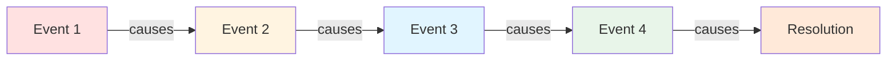
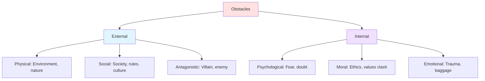
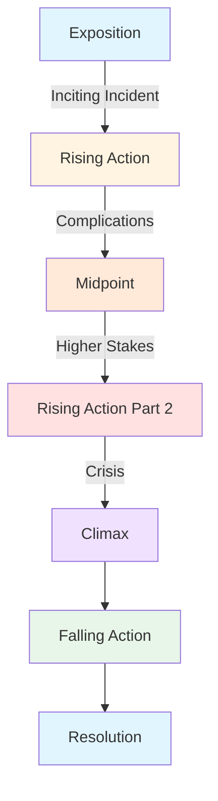
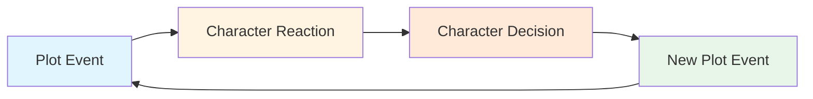

# 📖 Plot Basics

> *The foundation of storytelling: understanding what plot is and how it works*

---

## 📖 **Overview**

**Plot** is the sequence of events that make up your story—the "what happens" that keeps readers turning pages. It's not just a random collection of events, but a carefully structured chain of cause and effect that moves characters from beginning to end while exploring theme and delivering emotional satisfaction.

### **Why Plot Matters:**
- 🎯 **Provides Direction:** Gives story shape and purpose
- ⚡ **Creates Momentum:** Keeps readers engaged
- 💡 **Reveals Character:** Tests and transforms protagonists
- 🎭 **Delivers Theme:** Embodies story's meaning
- 💔 **Generates Emotion:** Creates investment and payoff

### **The Golden Rule:**
> "Plot is not what happens—it's what happens *because* of what happened. It's cause and effect, action and consequence."  
> — Every event should be connected, not coincidental

---

## 🎯 **What is Plot?**

### **Plot vs. Story:**

**Story** = The chronological sequence of all events  
**Plot** = The artistic arrangement of those events for maximum impact

**Example:**

**Story (Chronological):**
1. King dies
2. Queen dies of grief

**Plot (Arranged for Impact):**
1. Queen dies mysteriously
2. Revelation: King died first
3. Discovery: She died of grief

**The Difference:** Plot creates intrigue, reveals information strategically, and builds emotional resonance.

---

### **Plot = Cause and Effect:**



**❌ Random Events:**
> "The hero fought a dragon. Then he went to the city. Then he met a wizard."

**✅ Connected Plot:**
> "The hero fought a dragon. **Because** he was wounded, he sought help in the city, **where** he met a wizard who could heal him—**but** at a terrible price."

---

## 🧱 **The Essential Elements of Plot**

### **1. The Inciting Incident:**

**What It Is:**
The event that disrupts the protagonist's normal world and sets the story in motion.

**Purpose:**
- Introduces the central problem
- Forces protagonist to act
- Establishes stakes
- Hooks the reader
- Starts the story clock

**Characteristics:**
- **Disruptive:** Changes status quo
- **Unavoidable:** Can't be ignored
- **Specific:** Clear moment
- **Early:** Usually first 10-15% of story

**Examples:**

| Story | Inciting Incident |
|-------|-------------------|
| **Harry Potter** | Harry receives Hogwarts letter |
| **The Hunger Games** | Prim's name is drawn (Katniss volunteers) |
| **Star Wars** | Leia's message via R2-D2 |
| **Pride and Prejudice** | Bingley moves to Netherfield |
| **The Matrix** | Neo meets Trinity, follows the white rabbit |

---

### **2. The Goal:**

**What It Is:**
What the protagonist wants to achieve; the external objective driving the plot.

**Requirements:**
- **Specific:** Clear and concrete
- **Achievable:** Possible (even if difficult)
- **Important:** Significant stakes
- **Active:** Requires protagonist action
- **Visible:** Reader can track progress

**Types of Goals:**

**To Obtain Something:**
- Find treasure
- Win competition
- Gain love
- Achieve status

**To Escape Something:**
- Survive danger
- Flee oppression
- Avoid fate
- Escape prison

**To Defeat Someone:**
- Overcome antagonist
- Win battle
- Prove innocence
- Beat rival

**To Discover Something:**
- Solve mystery
- Find truth
- Uncover secret
- Learn identity

**Examples:**

| Protagonist | Goal |
|-------------|------|
| **Frodo** | Destroy the One Ring |
| **Katniss** | Survive the Hunger Games |
| **Elizabeth Bennet** | Find suitable marriage (on her terms) |
| **Sherlock Holmes** | Solve the case |
| **Luke Skywalker** | Destroy Death Star / Defeat Empire |

---

### **3. Obstacles:**

**What They Are:**
The challenges, complications, and opposition that stand between protagonist and goal.

**Purpose:**
- Create conflict
- Test character
- Build tension
- Force growth
- Make victory meaningful

**Types:**



**Best Obstacles:**
- Escalate in difficulty
- Force impossible choices
- Reveal character
- Connect to theme
- Feel inevitable, not contrived

---

### **4. Conflict:**

**What It Is:**
The opposition between forces—the fundamental ingredient of plot.

**The Core Conflicts:**

**Person vs. Person:**
- Protagonist vs. Antagonist
- Most common in fiction
- Direct opposition
- Personal stakes

**Person vs. Self:**
- Internal struggle
- Psychological conflict
- Moral dilemma
- Character arc focus

**Person vs. Society:**
- Individual vs. system
- Cultural/social opposition
- Dystopian stories
- Social commentary

**Person vs. Nature:**
- Environmental challenges
- Survival stories
- Natural disasters
- Elements/creatures

**Person vs. Fate/God:**
- Destiny/prophecy
- Cosmic forces
- Inevitability
- Fighting the impossible

**Person vs. Technology:**
- AI, machines
- Modern sci-fi
- Technological threat
- Human vs. creation

**See [Conflict Types](conflict-types.md) for detailed analysis**

---

### **5. Complications:**

**What They Are:**
Plot developments that make the situation more difficult or complex.

**Purpose:**
- Raise stakes
- Increase tension
- Deepen conflict
- Surprise reader
- Prevent easy victory

**Types:**

**New Information:**
- Revelation changes everything
- Discovery of truth
- Secret exposed
- Misleading clue

**New Threat:**
- Additional danger emerges
- Deadline accelerates
- Ally becomes enemy
- Situation worsens

**Failed Plan:**
- Strategy backfires
- Victory becomes defeat
- Unintended consequences
- Miscalculation

**Personal Cost:**
- Sacrifice required
- Relationship damaged
- Moral compromise
- Loss of something valued

---

### **6. Crisis:**

**What It Is:**
The moment of greatest tension—the protagonist's darkest hour where all seems lost.

**Characteristics:**
- Maximum pressure
- Difficult choice required
- No easy solution
- Character defining moment
- Point of no return

**The Crisis Question:**
Forces protagonist to choose between:
- What they want vs. what they need
- Safety vs. doing right
- Self vs. others
- Old self vs. new self

**Examples:**

| Story | Crisis |
|-------|--------|
| **Star Wars** | Luke must trust the Force (not targeting computer) |
| **Harry Potter** | Harry must sacrifice himself to Voldemort |
| **The Hunger Games** | Katniss and Peeta face double suicide |
| **Pride and Prejudice** | Elizabeth loses Darcy (she thinks) |

**The Crisis Sets Up:** The climax that follows

---

### **7. Climax:**

**What It Is:**
The highest point of tension—the final confrontation between protagonist and antagonistic force.

**Characteristics:**
- Maximum action/emotion
- Protagonist's choice/action
- Resolution of central conflict
- Payoff of setup
- Change demonstrated

**Requirements:**
- **Protagonist must act:** Can't be saved by others
- **Stakes are highest:** Everything on the line
- **Change shown:** Character arc evident
- **Inevitable yet surprising:** Feels earned
- **Thematically relevant:** Embodies meaning

**Structure:**
1. Final confrontation
2. Protagonist applies growth
3. Victory or defeat
4. Central question answered

**Examples:**

| Story | Climax |
|-------|--------|
| **The Lord of the Rings** | Ring destroyed at Mount Doom |
| **Romeo and Juliet** | Double suicide |
| **Die Hard** | McClane defeats Hans Gruber |
| **The Matrix** | Neo becomes The One, defeats Smith |

---

### **8. Resolution:**

**What It Is:**
The aftermath—showing the new normal after the climax.

**Purpose:**
- Show consequences
- Demonstrate change
- Satisfy emotional needs
- Tie up loose ends
- Provide closure

**Length:**
- Short (5-10% of story)
- Longer = less satisfying
- Match tone to story

**What to Include:**
- How world has changed
- What protagonist gained/lost
- Key relationships
- Thematic statement
- Emotional closure

**What to Avoid:**
- New conflicts
- Lengthy explanations
- Unnecessary epilogues
- Undermining victory

---

## 📈 **The Plot Arc**

### **Visual Structure:**



---

### **Tension Over Time:**

```
     Tension
       ↑
       |                    *  ← Climax
       |                 *
       |              *
       |           *  ← Crisis
       |        *
       |     *  ← Midpoint
       |  *
       |*  ← Inciting Incident
       |________________→ Time
```

**The Pattern:**
- Start low (establish normal)
- Incite (disruption)
- Rise (complications)
- Peak (climax)
- Fall (resolution)

---

## 🎨 **Types of Plots**

### **1. Action Plot:**

**Focus:** External events and physical challenges

**Characteristics:**
- Fast-paced
- Clear goals
- Physical obstacles
- External conflict emphasis
- Spectacle and excitement

**Examples:**
- James Bond films
- The Bourne Identity
- Indiana Jones
- Die Hard

**Best For:** Thrillers, action, adventure

---

### **2. Character Plot:**

**Focus:** Internal change and psychological journey

**Characteristics:**
- Introspective
- Emotional depth
- Internal obstacles
- Character arc emphasis
- Subtle, intimate

**Examples:**
- Literary fiction
- Character studies
- Coming-of-age stories
- The Remains of the Day

**Best For:** Literary fiction, drama

---

### **3. Idea Plot:**

**Focus:** Exploration of concept or theme

**Characteristics:**
- Philosophical
- Thought-provoking
- Conceptual challenges
- Thematic emphasis
- Intellectual engagement

**Examples:**
- 1984
- Arrival
- The Matrix
- Black Mirror

**Best For:** Sci-fi, philosophical fiction

---

### **4. Combination Plot:**

**The Sweet Spot:**
Most successful stories combine all three:
- Action provides excitement
- Character provides depth
- Idea provides meaning

**Examples:**
- The Hunger Games (action + character + social commentary)
- The Lord of the Rings (adventure + character growth + themes)
- Breaking Bad (action + character transformation + moral exploration)

---

## 🎯 **Plot vs. Story Structures**

### **Understanding the Difference:**

**Plot** = The engine (cause and effect chain)  
**Story Structure** = The vehicle (how you organize the plot)

**Plot asks:** What happens and why?  
**Structure asks:** How do I arrange these events?

**Examples:**

**Same Plot, Different Structures:**

**Linear Structure:**
> Beginning → Middle → End (chronological)

**In Medias Res:**
> Middle → Beginning (flashback) → End

**Reverse Chronology:**
> End → Middle → Beginning (Memento)

**Parallel Timelines:**
> Two stories, eventually converge

**See [Story Structure](../story-structure/) for detailed structural frameworks**

---

## 🔄 **The Plot-Character Relationship**

### **Plot Reveals Character:**

**Through Action:**
- What choices they make
- How they face obstacles
- What they sacrifice
- How they solve problems

**Through Reaction:**
- How they handle failure
- How they treat others
- What breaks them
- What drives them forward

---

### **Character Drives Plot:**

**Through Decisions:**
- Character choices create consequences
- Flaws create complications
- Goals create direction
- Growth enables victory

**The Cycle:**



---

## 📝 **Building Your Plot: Step by Step**

### **Step 1: Identify Core Elements**

Answer these questions:
- **Who** is the protagonist?
- **What** do they want? (goal)
- **Why** do they want it? (motivation)
- **What** stands in their way? (obstacles)
- **Who** opposes them? (antagonist)
- **What** will they sacrifice? (stakes)
- **How** will they change? (arc)

---

### **Step 2: Create Cause-Effect Chain**

Map major plot points:
1. What happens first?
2. What happens **because** of that?
3. What happens **because** of that?
4. Continue until climax
5. What happens **after** climax?

**Test:** Can you connect each event with "because" or "but"?

❌ "This happened, and then this happened"  
✅ "This happened, so this happened, but then this happened"

---

### **Step 3: Identify Key Moments**

Mark your plot's structure:
- [ ] Inciting Incident
- [ ] Point of No Return
- [ ] Midpoint Reversal
- [ ] Crisis (Dark Night)
- [ ] Climax
- [ ] Resolution

---

### **Step 4: Add Complications**

At each stage, ask:
- What could go wrong?
- What makes it harder?
- What raises the stakes?
- What forces a choice?

**Rule:** Each complication should escalate difficulty

---

### **Step 5: Ensure Protagonist Agency**

Check that:
- Protagonist drives the action
- Decisions have consequences
- They're not just lucky
- They earn the victory
- They face real choices

❌ **Passive:** Things happen TO character  
✅ **Active:** Character makes things happen

---

### **Step 6: Build Cause-Effect**

Test your plot:
- Does each event cause the next?
- Can you remove any event without consequences?
- Are coincidences minimal?
- Do consequences matter?

**If something doesn't cause or result from something else, cut it or connect it.**

---

## ⚖️ **Common Plot Mistakes**

<details>
<summary><b>❌ Pitfalls to Avoid</b></summary>

### **Episodic Plot:**
- **Problem:** Series of unconnected events
- **Fix:** Create cause-effect chain
- **Test:** Can you rearrange scenes? If yes, they're not connected enough

### **Deus Ex Machina:**
- **Problem:** Convenient rescue saves the day
- **Fix:** Protagonist must solve own problem
- **Rule:** Setup earlier if you'll use later

### **Meandering Middle:**
- **Problem:** Story loses direction
- **Fix:** Clear midpoint reversal, escalating complications
- **Check:** Is protagonist pursuing clear goal?

### **Coincidence:**
- **Problem:** Too many lucky breaks
- **Fix:** Make protagonist earn it
- **Rule:** Coincidence can create problems, not solve them

### **No Stakes:**
- **Problem:** Nothing important at risk
- **Fix:** Establish what protagonist will lose
- **Test:** Would it matter if protagonist failed?

### **Predictable:**
- **Problem:** Readers see everything coming
- **Fix:** Complicate, subvert expectations, add layers
- **Balance:** Surprising yet inevitable

### **Too Complex:**
- **Problem:** Too many subplots, too many characters
- **Fix:** Focus on main plot, reduce tangents
- **Rule:** Every scene should advance main story

### **Rushed Ending:**
- **Problem:** Climax comes too fast
- **Fix:** Build tension properly, earn the victory
- **Check:** Did protagonist grow enough to succeed?

### **Passive Protagonist:**
- **Problem:** Things happen TO character
- **Fix:** Protagonist must make active choices
- **Test:** Remove protagonist—does plot still happen?

### **No Resolution:**
- **Problem:** Story just stops
- **Fix:** Show consequences, new normal
- **Note:** Open ending ≠ no resolution

</details>

---

## 💡 **Plot Development Exercises**

### **Exercise 1: The Chain**
Take your plot idea and write:
- This happens...
- **So** this happens...
- **But** this happens...
- **Therefore** this happens...

Continue for 10-15 events. Can you connect them all?

---

### **Exercise 2: The Escalation**
List 5 obstacles your protagonist faces. Now:
- Make each one worse
- Make each one more personal
- Connect each to the next
- Make the last one seemingly impossible

---

### **Exercise 3: The Test**
For each major plot point, ask:
- Does this reveal character?
- Does this advance the plot?
- Does this raise stakes?
- Could this be cut without consequences?

If you answer "no" to first three or "yes" to the last, revise.

---

### **Exercise 4: The "Because" Test**
Write your plot summary connecting each event:
- "Event 1 happens **because** [inciting incident]"
- "Event 2 happens **because** of Event 1"
- Continue...

If you can't use "because," "so," or "but," your plot isn't connected.

---

### **Exercise 5: The Reversal**
At your midpoint, try:
- Victory becomes defeat
- Ally becomes enemy
- Truth is a lie
- Goal changes
- New information shifts everything

Does this energize your second half?

---

## 🔗 **Related Resources**

- 📖 **[Story Structure](../story-structure/)** — How to organize your plot
- ⚡ **[Conflict Types](conflict-types.md)** — Types of opposition
- 🎯 **[Tension & Stakes](tension-stakes.md)** — Keeping readers engaged
- 📚 **[Subplots](subplots.md)** — Secondary story threads
- 🎭 **[Plot Twists](plot-twists.md)** — Surprising your reader
- 👥 **[Character Development](../character-development/)** — Plot's partner
- 📋 **[Plot Templates](../../../templates/plot-outlines/)** — Practical tools

---

## 📖 **Recommended Reading**

- *Story* — Robert McKee
- *The Anatomy of Story* — John Truby
- *Plot & Structure* — James Scott Bell
- *Wired for Story* — Lisa Cron

---

<div align="center">

### **Plot Is the Spine of Your Story 📖**

*Master plot basics and you master storytelling. Everything else hangs on this framework.*

**[⬅️ Back to Plot Development](README.md)** | **[📚 Fundamentals](../README.md)**

</div>
