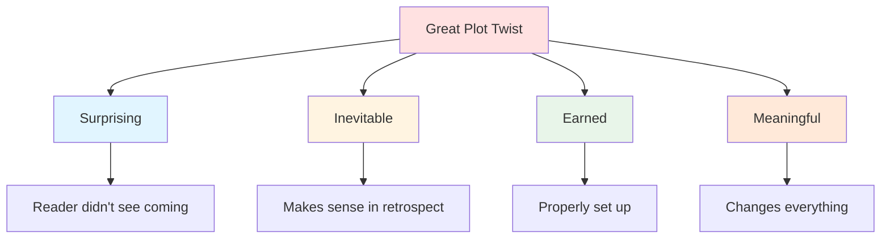

# 🎭 Plot Twists

> *The art of surprise: crafting revelations that shock, satisfy, and feel inevitable*

---

## 📖 **Overview**

A **plot twist** is a radical change in the expected direction or outcome of the plot. It subverts reader expectations while simultaneously feeling like it was meant to be all along. Great twists make readers want to immediately re-experience the story, seeing it in a new light.

### **Why Plot Twists Matter:**
- 🎯 **Surprise Readers:** Create memorable "wow" moments
- 💡 **Reveal Truth:** Expose what was hidden
- ⚡ **Energize Story:** Inject new momentum
- 🎭 **Deepen Theme:** Illuminate story's meaning
- 📖 **Reward Re-Reading:** Plant seeds that pay off
- 💔 **Generate Emotion:** Shock, delight, devastate

### **The Golden Rule:**
> "The best plot twists are simultaneously surprising and inevitable. Looking back, readers should see it was there all along."  
> — Fair play twist: all clues present, but cleverly hidden

---

## 🎯 **What Makes a Great Plot Twist?**

### **The Essential Elements:**

---

### **1. Surprising:**

**The twist must shock:**
- Readers didn't predict it
- Defies expectations
- "I didn't see that coming!"
- Fresh and unexpected

**But Not Random:**
- Still makes logical sense
- Clues were present
- Feels organic, not forced

---

### **2. Inevitable:**

**Looking back, it should feel meant to be:**
- "Oh, of course!"
- "It was there all along!"
- Clues make sense now
- Pieces fit together

**The Recontextualization:**
Everything you thought you knew means something different now

**Example — *The Sixth Sense*:**
> **Twist:** Bruce Willis is dead  
> **Rewatch:** Every scene makes perfect sense—he never interacts with others, sits alone, wife ignores him

---

### **3. Earned:**

**Properly set up:**
- Clues planted throughout
- Foreshadowing present
- Not pulled from nowhere
- Fair to the reader

**The "Fair Play" Rule:**
Reader had all information needed to figure it out (but probably didn't)

---

### **4. Meaningful:**

**Must matter to story:**
- Changes our understanding
- Affects character journey
- Serves theme
- Raises stakes or complicates situation

**Not just surprising for its own sake**

---

## 🎨 **Types of Plot Twists**

### **1. Identity Reveal:**

**Character is not who they seem**

**Variations:**
- **Secret Identity:** Hero is actually villain
- **Hidden Relation:** Characters are related
- **Impostor:** Character is someone else
- **False Identity:** Fake name/background

**Examples:**

| Story | Twist |
|-------|-------|
| **Star Wars** | Darth Vader is Luke's father |
| **The Prestige** | Borden is twins |
| **Fight Club** | Tyler is the narrator |
| **The Usual Suspects** | Verbal Kint is Keyser Söze |
| **Game of Thrones** | Jon Snow is Targaryen |

**Setting Up Identity Twists:**
- Plant clues in behavior
- Create gaps in knowledge
- Use unreliable narration
- Misdirect attention
- Make clues ambiguous

---

### **2. Perspective Shift:**

**What we thought happened didn't**

**Variations:**
- **Unreliable Narrator:** Story we heard is false
- **Limited POV:** Didn't see full picture
- **Recontextualization:** Same events, new meaning
- **Misinterpreted:** Wrong assumption

**Examples:**

| Story | Twist |
|-------|-------|
| **Gone Girl** | Amy faked everything |
| **The Sixth Sense** | Malcolm is dead |
| **Shutter Island** | Teddy is a patient |
| **Arrival** | Flashbacks are flash-forwards |
| **Memento** | Leonard killed his wife |

**Setting Up Perspective Twists:**
- Use first-person or limited third
- Show what character believes
- Plant objective clues
- Control information flow
- Create logical alternative

---

### **3. Betrayal:**

**Ally is actually enemy**

**Variations:**
- **The Mole:** Traitor in the group
- **False Friend:** Never an ally
- **Reluctant Betrayer:** Forced to betray
- **Lover's Betrayal:** Romance was lie

**Examples:**

| Story | Twist |
|-------|-------|
| **Harry Potter** | Snape's true loyalty |
| **The Departed** | Multiple moles |
| **Mission: Impossible** | Jim Phelps is villain |
| **Casino Royale** | Vesper's betrayal |
| **The Empire Strikes Back** | Lando's deal |

**Setting Up Betrayal:**
- Establish trust first
- Plant subtle doubts
- Give betrayer convincing motivation
- Create necessity
- Show private moments

---

### **4. False Protagonist:**

**Main character isn't the hero**

**Variations:**
- **Protagonist Dies:** Unexpected early death
- **Villain Protagonist:** Hero is actually bad
- **Decoy Protagonist:** Wrong person focused on
- **Perspective Switch:** New protagonist emerges

**Examples:**

| Story | Twist |
|-------|-------|
| **Psycho** | Marion dies; Norman is focus |
| **Game of Thrones** | Ned Stark's death |
| **Executive Decision** | Steven Seagal dies early |
| **Breaking Bad** | Walt is the villain |

**Setting Up False Protagonist:**
- Make initial character compelling
- Plant seeds of true protagonist
- Make death/shift meaningful
- Ensure story continues strongly

---

### **5. Hidden Motivation:**

**Character's true goal is different**

**Variations:**
- **Secret Agenda:** Not what they claimed
- **Deeper Reason:** Surface goal hides real one
- **Opposite Goal:** Actually working against apparent aim
- **Personal Stakes:** It's more personal than shown

**Examples:**

| Story | Twist |
|-------|-------|
| **The Prestige** | Obsession, not performance |
| **Saw** | Jigsaw's terminal illness motivation |
| **Inception** | Cobb's guilt and projection |
| **The Others** | Mother protecting ghost children |

**Setting Up Motivation Twists:**
- Show surface motivation clearly
- Plant emotional clues
- Create gaps in explanation
- Use subtext
- Reveal in stages

---

### **6. Fake Death:**

**Character thought dead is alive**

**Variations:**
- **Faked Death:** Planned deception
- **Mistaken Death:** Wrong body/person
- **Survived:** Impossibly survived
- **Never Dead:** Assumed incorrectly

**Examples:**

| Story | Twist |
|-------|-------|
| **Sherlock Holmes** | Reichenbach Falls survival |
| **The Prestige** | Multiple "deaths" |
| **The Dark Knight Rises** | Batman survives |
| **Game of Thrones** | Jon Snow's resurrection |

**Setting Up Fake Deaths:**
- Make death believable
- Plant possibility of survival
- Don't overuse (cheapens death)
- Make return meaningful
- Explain convincingly

---

### **7. Time/Reality Twist:**

**Story's reality is not what it seems**

**Variations:**
- **It Was a Dream:** Story is imagined
- **Simulation:** Virtual reality
- **Time Loop:** Repeating events
- **Parallel Reality:** Multiple timelines
- **Non-Linear:** Time out of order

**Examples:**

| Story | Twist |
|-------|-------|
| **The Matrix** | Reality is simulation |
| **Inception** | Dream within dream |
| **The Sixth Sense** | (Also a reality twist) |
| **Arrival** | Non-linear time perception |
| **Fight Club** | (Also reality twist) |

**Setting Up Reality Twists:**
- Plant clues to true reality
- Make fake reality internally consistent
- Create logical rules
- Avoid "it was all a dream" (usually cheap)
- Make revelation meaningful

---

### **8. Reversal of Fortune:**

**Victory becomes defeat or vice versa**

**Variations:**
- **Pyrrhic Victory:** Won but at terrible cost
- **Defeat Is Victory:** Loss is actually win
- **The Trap:** Success was the plan all along
- **False Victory:** Didn't really win

**Examples:**

| Story | Twist |
|-------|-------|
| **Saw** | Victim was being tested to become killer |
| **The Usual Suspects** | Telling story was escape |
| **Ocean's Eleven** | Theft already completed |
| **The Sting** | Whole con for revenge |

**Setting Up Reversals:**
- Establish expected outcome
- Plant alternative interpretation
- Create dual meanings
- Make reversal logical
- Ensure thematic relevance

---

### **9. The MacGuffin Twist:**

**What everyone is chasing doesn't matter or doesn't exist**

**Variations:**
- **Worthless Object:** Not what they thought
- **No Object:** Never existed
- **Wrong Object:** Chasing wrong thing
- **Object Is Character:** Person is the MacGuffin

**Examples:**

| Story | Twist |
|-------|-------|
| **Maltese Falcon** | Falcon is fake |
| **Pulp Fiction** | Contents of briefcase (never revealed) |
| **National Treasure** | Treasure is knowledge |

**Setting Up MacGuffin Twists:**
- Make pursuit feel legitimate
- Plant doubts about importance
- Shift focus to journey
- Make real goal character growth

---

### **10. Future/Past Twist:**

**What we know about timeline is wrong**

**Variations:**
- **Flashback Reveal:** Past is different
- **Prophecy Subversion:** Future prediction wrong
- **Time Travel:** Causality twist
- **Setting Reveal:** Not the time/place we thought

**Examples:**

| Story | Twist |
|-------|-------|
| **Planet of the Apes** | Earth all along |
| **Arrival** | Learning their language changes time perception |
| **Harry Potter** | Time-Turner saves both |
| **Westworld** | Multiple timelines |

---

## 🎯 **Crafting Your Twist**

### **Step 1: Decide What to Reveal**

**Choose your twist type:**
- What revelation would most impact your story?
- What fits your genre?
- What serves your theme?
- What would readers not expect?

---

### **Step 2: Plant the Seeds**

**Foreshadowing Techniques:**

**The Unreliable Narrator:**
- First-person POV
- Character doesn't know/lies
- Reader shares limited view
- Clues in what's not said

**The Red Herring:**
- Misdirection to wrong conclusion
- Attention drawn away from truth
- False clues
- Satisfying alternative explanation

**The Hidden in Plain Sight:**
- Truth is stated but dismissed
- Seems unimportant
- Readers overlook it
- "Of course! It was there!"

**The Double Meaning:**
- Statements true in two ways
- One interpretation obvious
- Another becomes clear after twist
- Rewarding on re-read

**The Visual Clue:**
- Background details
- Behaviors
- Absences (who's not there)
- Patterns

---

### **Step 3: Control Information**

**What to Show:**
- ✅ Enough clues to make it fair
- ✅ Alternative interpretations
- ✅ Ambiguous evidence
- ✅ Pieces that connect after reveal

**What to Hide:**
- ❌ Direct confirmation
- ❌ Character's inner thoughts (if they know)
- ❌ Too many clues
- ❌ Obvious foreshadowing

---

### **Step 4: Misdirect**

**Techniques:**

**The False Trail:**
Set up logical but wrong conclusion

**The Parallel:**
Similar situation suggests wrong outcome

**The Genre Expectation:**
Use genre conventions to mislead

**The Character Focus:**
Draw attention to wrong person/object

---

### **Step 5: Time the Reveal**

**When to Reveal:**

**Midpoint Twist:**
- Changes direction
- Raises stakes
- Energizes second half

**Third Act Twist:**
- Near climax
- Recontextualizes story
- Changes resolution

**Final Scene Twist:**
- Last moment reveal
- Reframes entire story
- Reader wants to re-read

**Ongoing Revelations:**
- Multiple smaller twists
- Building pattern
- Layers of truth

---

### **Step 6: Execute the Reveal**

**The Moment of Truth:**

**Build to It:**
- Rising tension
- Sense something's coming
- Can't be random moment

**Make It Clear:**
- Reader understands immediately
- No confusion
- Precise revelation

**Show Impact:**
- Character reaction
- Changed understanding
- Emotional response
- New stakes

**Explain Fairly:**
- Enough information
- Logical connections
- Readers can follow
- But don't over-explain

---

## ⚖️ **Common Twist Mistakes**

<b>❌ Pitfalls to Avoid</b>

### **No Foreshadowing:**
- **Problem:** Comes from nowhere
- **Fix:** Plant clues throughout
- **Test:** Could reader have guessed?

### **Too Obvious:**
- **Problem:** Everyone sees it coming
- **Fix:** Add misdirection, delay reveal
- **Test:** Beta readers predicted it

### **Unfair:**
- **Problem:** Information withheld from reader
- **Fix:** Give clues, play fair
- **Example:** Twist depends on fact never mentioned

### **Meaningless:**
- **Problem:** Surprise for its own sake
- **Fix:** Connect to theme, character, stakes
- **Test:** Does it matter to the story?

### **Too Many Twists:**
- **Problem:** Loses impact, feels gimmicky
- **Fix:** Choose best twist, cut others
- **Rule:** Quality over quantity

### **Character Acts Out of Character:**
- **Problem:** Twist requires inconsistency
- **Fix:** Establish hidden side or motivation
- **Test:** Does it break characterization?

### **The "It Was All a Dream":**
- **Problem:** Nothing mattered
- **Fix:** Almost never use this
- **Exception:** If set up from beginning (like *Inception*)

### **Overly Complex:**
- **Problem:** Reader can't follow
- **Fix:** Simplify, make clear
- **Test:** Can you explain in one sentence?

### **Breaks Rules of World:**
- **Problem:** Violates established logic
- **Fix:** Stay consistent with world-building
- **Test:** Does it contradict earlier information?

### **Unresolved After Twist:**
- **Problem:** Reveal but no consequences
- **Fix:** Show impact, explore implications
- **Requirement:** Twist must change something

---

## 🎨 **Twist Examples & Analysis**

### **Example 1: *The Sixth Sense***

**The Twist:** Dr. Malcolm Crowe (Bruce Willis) has been dead the entire film

**Why It Works:**

**Surprising:**
- Shocking revelation
- Completely changes understanding
- Unexpected POV

**Inevitable:**
- Clues throughout:
  - Wife ignores him
  - No one else speaks to him
  - He wears same clothes
  - He doesn't eat
  - Door seems locked but isn't

**Earned:**
- Every scene planted evidence
- Fair to viewer
- Rewarding rewatch

**Meaningful:**
- Thematic resonance
- Emotional impact
- Completes arc
- Cole helped him move on

---

### **Example 2: *Gone Girl***

**The Twist:** Amy faked her disappearance and framed Nick

**Why It Works:**

**Surprising:**
- Reliable-seeming narration
- Sympathetic victim
- Completely changes who to root for

**Inevitable:**
- Clues in her diary entries
- Too perfect a victim
- Inconsistencies in evidence
- Her character hints

**Earned:**
- Dual narration structure
- Planted evidence
- Character established

**Meaningful:**
- Theme of marriage as performance
- Media manipulation
- Gender expectations
- Toxic relationship

---

### **Example 3: *The Prestige***

**The Twist:** Alfred Borden is twins living one life

**Why It Works:**

**Surprising:**
- Explains impossible magic
- Radical solution
- Hidden in plain sight

**Inevitable:**
- "Are you watching closely?"
- Inconsistent behavior
- Two different knots
- "The sacrifice"
- References to "twin"

**Earned:**
- Hints throughout
- Fair clues
- Thematic setup
- Obsession established

**Meaningful:**
- Theme of sacrifice for art
- Duality
- Cost of obsession
- What we give up

---

## 💡 **Plot Twist Exercises**

### **Exercise 1: The Rewatch Test**
Watch/read a story with a great twist:
- List all the clues you missed
- How were they hidden?
- What misdirected you?
- How was it foreshadowed?

### **Exercise 2: Plant Your Clues**
For your twist:
1. List what readers need to know
2. How to present each clue
3. Where to plant them
4. How to hide them
5. What misdirects away

### **Exercise 3: The Alternative**
Create false solution:
- What should readers think is true?
- What evidence supports this?
- Why is it believable?
- When does it fall apart?

### **Exercise 4: The Reveal Scene**
Write your twist reveal:
- Build tension approaching it
- The moment of revelation
- Character reaction
- Reader understanding
- Immediate consequences

### **Exercise 5: The Fair Play Check**
For your twist, answer:
- Are all clues present?
- Could clever reader deduce it?
- Is anything withheld unfairly?
- Does it require character inconsistency?
- Does it violate world rules?

If any answer is "yes" to last three, revise.

---

## 🔗 **Related Resources**

- 📖 **[Plot Basics](plot-basics.md)** — Foundation of plot structure
- ⚡ **[Conflict Types](conflict-types.md)** — Twist complications
- 🎯 **[Tension & Stakes](tension-stakes.md)** — Building to twist
- 📚 **[Backstory](../character-development/backstory.md)** — Hidden past reveals
- 👁️ **[POV & Perspective](../../craft/pov-perspective/)** — Controlling information
- 🎭 **[Show vs. Tell](../../craft/show-vs-tell/)** — Hiding clues in plain sight

---

## 📖 **Recommended Reading**

- *Story* — Robert McKee
- *The Anatomy of Story* — John Truby
- *Plot & Structure* — James Scott Bell

---

### **The Best Twists Are Both Surprising and Inevitable 🎭**

*Plant your clues, misdirect attention, and deliver a revelation that makes readers want to experience your story all over again.*

**[⬅️ Back to Plot Development](README.md)** | **[📚 Fundamentals](../README.md)**

