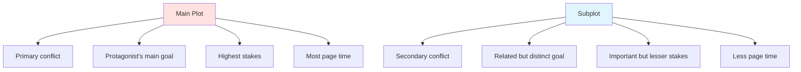
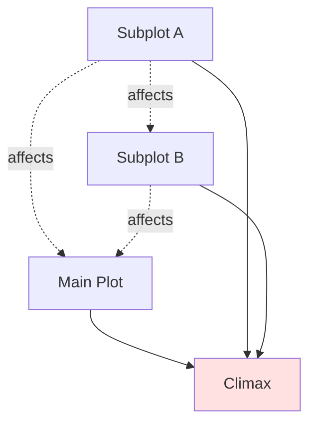

# 📚 Subplots

> *Weaving secondary storylines: adding depth, complexity, and richness to your narrative*

---

## 📖 **Overview**

**Subplots** are secondary story threads that run alongside the main plot, enriching your narrative with additional conflict, character development, thematic depth, and pacing variety. They're not distractions—when done well, they enhance and illuminate the main story.

### **Why Subplots Matter:**
- 🌟 **Add Depth:** Multiple storylines create complexity
- 🎭 **Develop Characters:** Explore different aspects
- 💡 **Reinforce Theme:** Echo and amplify main story's meaning
- ⚡ **Control Pacing:** Provide breathing room or additional tension
- 🎯 **Increase Stakes:** More to win or lose
- 💑 **Enrich World:** Make setting feel lived-in

### **The Golden Rule:**
> "Every subplot should either support the main plot, develop character, or reinforce theme. Ideally, it does all three."  
> — Subplots aren't filler; they're essential story architecture

---

## 🎯 **What Is a Subplot?**

### **Definition:**

**Subplot** = A secondary storyline with its own beginning, middle, and end that runs concurrent with the main plot

**Characteristics:**
- Own conflict and resolution
- Own character arc (usually)
- Connected to main plot
- Smaller in scope
- Supports larger story
- Has its own stakes

---

### **Main Plot vs. Subplot:**



---

### **How They Work Together:**

**The Weave:**
```
Main Plot:    ═══════════════════════════
Subplot A:      ══════════════
Subplot B:          ════════════
Subplot C:             ═══════════
```

**Points of Intersection:**
- Subplots can affect main plot
- Main plot can affect subplots
- Subplots can intersect each other
- All resolve by story's end

---

## 🎨 **Types of Subplots**

### **1. Romantic Subplot:**

**Purpose:** Develop love interest relationship

**Characteristics:**
- Most common subplot type
- Emotional development
- Own obstacles and complications
- Often mirrors main plot themes
- Provides personal stakes

**Structure:**
- Meeting/attraction
- Complications/obstacles
- Relationship crisis
- Resolution (together or apart)

**Examples:**

| Story | Main Plot | Romantic Subplot |
|-------|-----------|------------------|
| **Harry Potter** | Defeat Voldemort | Harry & Ginny, Ron & Hermione |
| **The Hunger Games** | Survive games | Katniss, Peeta, Gale triangle |
| **Die Hard** | Stop terrorists | John & Holly's marriage |
| **Pride and Prejudice** | (Main plot IS romance) | Jane & Bingley subplot |

**Best Practices:**
- ✅ Don't overshadow main plot
- ✅ Create real obstacles, not just miscommunication
- ✅ Make it matter to character arc
- ❌ Don't treat it as reward/prize
- ❌ Don't make it feel obligatory

---

### **2. Character Development Subplot:**

**Purpose:** Explore secondary character's arc or aspect of protagonist not covered in main plot

**Characteristics:**
- Focuses on specific character
- Own internal or external journey
- Illuminates different character facets
- Often thematic mirror

**Examples:**

**Protagonist's Secondary Issue:**
- *Breaking Bad:* Walter's cancer (subplot) while building empire (main)
- *The Godfather:* Michael's relationship with Kay while transforming
- *Iron Man:* Tony's PTSD in Iron Man 3

**Secondary Character Arc:**
- *Lord of the Rings:* Aragorn accepting kingship
- *Harry Potter:* Neville's growth and confidence
- *The Hunger Games:* Haymitch's redemption

**Best Practices:**
- ✅ Connect to theme
- ✅ Give character full arc
- ✅ Intersect with main plot
- ❌ Don't abandon mid-story
- ❌ Don't make disconnected from main story

---

### **3. Thematic Subplot:**

**Purpose:** Explore story's themes from different angle

**Characteristics:**
- Parallels or contrasts main plot
- Different characters exploring same question
- Reinforces or complicates theme
- Provides comparison point

**Examples:**

**Lord of the Rings:**
- **Main:** Frodo resisting Ring's corruption
- **Subplot:** Boromir succumbing to temptation
- **Theme:** Power corrupts; different responses

**Breaking Bad:**
- **Main:** Walter's transformation
- **Subplot:** Jesse's attempts to stay human
- **Theme:** Morality and corruption; parallel journeys

**The Dark Knight:**
- **Main:** Batman vs. Joker
- **Subplot:** Harvey Dent's corruption
- **Theme:** One bad day can destroy anyone

**Best Practices:**
- ✅ Make parallel clear but not heavy-handed
- ✅ Offer different perspective on theme
- ✅ Resolve in way that illuminates main story
- ❌ Don't make too obvious
- ❌ Don't preach

---

### **4. Relationship Subplot:**

**Purpose:** Develop non-romantic important relationships

**Types:**
- **Friendship:** Building or testing bonds
- **Familial:** Parent-child, siblings, family dynamics
- **Mentor-Student:** Teaching and learning
- **Rivalry:** Competition and respect

**Examples:**

**Friendship:**
- *Harry Potter:* The Golden Trio's friendship
- *Lord of the Rings:* Frodo and Sam
- *Toy Story:* Woody and Buzz

**Family:**
- *The Godfather:* Michael and his father
- *Frozen:* Elsa and Anna's sisterhood
- *The Lion King:* Simba and Mufasa

**Mentor:**
- *Star Wars:* Luke and Obi-Wan/Yoda
- *The Karate Kid:* Daniel and Mr. Miyagi
- *Good Will Hunting:* Will and Sean

**Best Practices:**
- ✅ Show evolution of relationship
- ✅ Test relationship meaningfully
- ✅ Make it affect main plot
- ❌ Don't introduce too late
- ❌ Don't resolve too easily

---

### **5. Comic Relief Subplot:**

**Purpose:** Provide levity and pacing contrast

**Characteristics:**
- Lighter tone
- Less intense stakes
- Often involves secondary characters
- Provides emotional breaks
- Can still have meaning

**Examples:**
- *Lord of the Rings:* Merry and Pippin's adventures
- *Harry Potter:* Various Weasley twin pranks
- *Die Hard:* Argyle in the limo
- *Shakespeare's Tragedies:* Comic relief characters (Porter in Macbeth)

**Best Practices:**
- ✅ Still connect to story
- ✅ Don't undermine tension at wrong moments
- ✅ Use to enhance, not escape
- ❌ Don't make it feel like different story
- ❌ Don't overuse

---

### **6. Antagonist Subplot:**

**Purpose:** Develop villain's perspective and plans

**Characteristics:**
- Shows antagonist's world
- Builds threat
- Humanizes villain
- Creates dramatic irony
- Parallel journey

**Examples:**
- *Harry Potter:* Voldemort's search for Horcruxes
- *Breaking Bad:* Gus Fring's operation and backstory
- *The Dark Knight:* Joker's schemes
- *Game of Thrones:* Various antagonist perspectives

**Best Practices:**
- ✅ Make antagonist three-dimensional
- ✅ Show their perspective as valid (to them)
- ✅ Create dramatic irony
- ❌ Don't reveal too much too soon
- ❌ Don't make more interesting than main plot

---

### **7. Mystery/Investigation Subplot:**

**Purpose:** Create additional questions and revelations

**Characteristics:**
- Puzzle to solve
- Gradual revelation
- Often tied to backstory
- Creates curiosity
- Pays off with revelation

**Examples:**
- *Harry Potter:* Mystery of Snape's loyalty
- *The Prestige:* The secret of the trick
- *Fight Club:* Who is Tyler Durden?
- *Gone Girl:* What really happened?

**Best Practices:**
- ✅ Plant clues throughout
- ✅ Pay off satisfyingly
- ✅ Connect to main story
- ❌ Don't make too obvious
- ❌ Don't make unsolvable

---

### **8. World-Building Subplot:**

**Purpose:** Explore setting and its rules

**Characteristics:**
- Expands story world
- Shows different aspects of setting
- Can involve secondary characters
- Enriches context
- Makes world feel larger

**Examples:**
- *Lord of the Rings:* Ents and Fangorn Forest
- *Harry Potter:* House-elf liberation subplot
- *Game of Thrones:* Various house politics
- *Star Wars:* Political machinations

**Best Practices:**
- ✅ Connect to theme
- ✅ Illuminate main story
- ✅ Keep relevant
- ❌ Don't info-dump
- ❌ Don't distract from main story

---

## 📊 **Structuring Subplots**

### **The Subplot Arc:**

Every subplot should have its own structure:


**Simplified from main plot, but complete**

---

### **Subplot Timing:**

**Introduction:**
- Not too early (readers need to care about main plot first)
- Not too late (needs time to develop)
- **Sweet spot:** Late Act 1 or Early Act 2

**Development:**
- Weave in throughout Acts 2
- Don't abandon for long periods
- Escalate alongside main plot

**Resolution:**
- Before or during climax
- **Never after main plot resolves**
- Can inform or affect main plot climax

---

### **Page Time Allocation:**

| Story Element | Approximate Page Time |
|---------------|----------------------|
| **Main Plot** | 60-70% |
| **Primary Subplot** | 15-20% |
| **Secondary Subplot** | 10-15% |
| **Tertiary Subplot** | 5-10% |

**Rule:** No subplot should take more page time than main plot

---

### **Number of Subplots:**

**Novel Length:**
- **Short (60-80k):** 1-2 subplots
- **Medium (80-100k):** 2-3 subplots
- **Long (100k+):** 3-5 subplots
- **Epic (150k+):** 5+ subplots possible

**Rule of Thumb:** Only as many as you can fully develop and resolve

---

## 🎯 **Crafting Effective Subplots**

### **1. Connect to Main Plot:**

**Types of Connection:**

**Thematic Echo:**
- Explores same theme differently
- Parallel or contrasting journey
- Illuminates main story's meaning

**Structural Support:**
- Affects main plot's direction
- Information discovered in subplot impacts main
- Resolution enables main plot resolution

**Character Impact:**
- Changes protagonist's perspective
- Provides necessary skill/knowledge
- Creates emotional state that affects main choices

**Causal Link:**
- Events in subplot directly cause main plot events
- Or vice versa
- Intersecting consequences

---

### **2. Give It Own Stakes:**

**The subplot must matter on its own:**
- Own consequences
- Own emotional investment
- Own resolution needs
- Can't feel like filler

**Test:** Could this be a short story on its own?

---

### **3. Intersect at Key Moments:**

**Points of Connection:**
- **Introduction:** Often triggered by main plot event
- **Midpoint:** Subplot affects main plot's direction
- **Crisis:** Complicates main plot at crucial moment
- **Climax:** Resolution informs or enables main resolution

**Example — Harry Potter:**
- **Main:** Defeat Voldemort
- **Romantic Subplot:** Harry & Ginny
- **Intersection:** Harry must protect Ginny, but his love for her becomes a strength, not weakness

---

### **4. Maintain Proportionality:**

**Subplots should:**
- Feel significant but not overwhelming
- Support rather than compete with main
- Have appropriate stakes (high, but not higher than main)
- Resolve satisfyingly but not overshadow main climax

**Warning Signs:**
- Subplot more interesting than main plot
- Readers more invested in subplot
- Subplot taking too much page time
- Main plot feels like the subplot

**Fix:** Either elevate subplot to co-main plot, or reduce its prominence

---

### **5. Avoid Repetition:**

**If you have multiple subplots:**
- Different types of conflict
- Different character aspects
- Different thematic angles
- Different tones

**❌ Don't:** Have three different romantic subplots  
**✅ Do:** Romance + friendship + mystery subplots

---

## ⚖️ **Common Subplot Mistakes**

<details>
<summary><b>❌ Pitfalls to Avoid</b></summary>

### **Disconnected Subplot:**
- **Problem:** No connection to main story
- **Fix:** Link thematically, structurally, or causally
- **Test:** If removed, would main story change?

### **Abandoned Subplot:**
- **Problem:** Introduced but never resolved
- **Fix:** Track all subplots, resolve before ending
- **Rule:** Chekhov's gun applies to subplots too

### **Overwhelming Subplot:**
- **Problem:** More interesting than main plot
- **Fix:** Either promote it or reduce it
- **Warning:** If everyone talks about subplot, not main plot

### **Too Many Subplots:**
- **Problem:** Reader confused, overwhelmed
- **Fix:** Combine similar subplots, cut unnecessary ones
- **Rule:** Quality over quantity

### **Late Introduction:**
- **Problem:** No time to develop
- **Fix:** Introduce by end of Act 1, early Act 2
- **Exception:** Very short subplots can start later

### **Obligatory Romance:**
- **Problem:** Feels forced, doesn't add value
- **Fix:** Only include if it serves story
- **Truth:** Not every story needs romance

### **Unresolved Threads:**
- **Problem:** Subplot just stops
- **Fix:** Give every subplot complete arc
- **Note:** Open ending ≠ no resolution

### **Subplot Deus Ex Machina:**
- **Problem:** Subplot solves main plot too conveniently
- **Fix:** Earn connection, set up properly
- **Rule:** Convenience feels like cheating

### **Wrong Proportions:**
- **Problem:** Subplot too small or too large
- **Fix:** Adjust page time to importance
- **Balance:** Should feel significant but not dominant

### **Repetitive Subplots:**
- **Problem:** Multiple subplots doing same thing
- **Fix:** Vary types, themes, tones
- **Goal:** Each subplot offers something unique

</details>

---

## 🎨 **Weaving Subplots: Techniques**

### **1. The Braid:**

**Alternate between storylines:**

```
Main Plot Scene → Subplot A → Main Plot → Subplot B → Main Plot → Subplot A...
```

**Creates rhythm and pacing variety**

---

### **2. The Intersection:**

**Subplots affect each other:**



**All storylines converge**

---

### **3. The Parallel:**

**Run side-by-side without direct connection until end:**

```
Main Plot:    ═════════════╗
                            ╠═► Combined Climax
Subplot:      ═════════════╝
```

**Both inform final resolution**

---

### **4. The Nested:**

**Subplot within subplot:**

```
Main Plot
 └─ Subplot A
     └─ Subplot B
```

**Use sparingly; can be complex**

---

### **5. The Frame:**

**Subplot bookends main story:**

```
Subplot Opening → Main Plot → Subplot Resolution
```

**Example:** *The Princess Bride* (Grandfather reading to grandson)

---

## 💡 **Subplot Development Exercises**

### **Exercise 1: Subplot Inventory**
List all your subplots:
- Type of subplot?
- Purpose?
- Connection to main plot?
- Thematic relevance?
- Resolution plan?

### **Exercise 2: The Three Questions**
For each subplot, answer:
1. How does this support the main plot?
2. How does this develop character?
3. How does this reinforce theme?

If you can't answer at least two, reconsider the subplot.

### **Exercise 3: Timeline Mapping**
Create timeline showing:
- Main plot events
- Subplot introductions
- Intersection points
- Resolutions
- Verify proper spacing and development

### **Exercise 4: The Cut Test**
Imagine removing each subplot:
- What's lost?
- Does main plot still work?
- What would need to change?

If nothing significant is lost, the subplot isn't pulling its weight.

### **Exercise 5: Page Count**
Count pages/words for each subplot:
- What percentage of story?
- Is it proportional to importance?
- Any adjustments needed?

---

## 🔗 **Related Resources**

- 📖 **[Plot Basics](plot-basics.md)** — Foundation of main plot
- ⚡ **[Conflict Types](conflict-types.md)** — Types of subplot conflicts
- 🎯 **[Tension & Stakes](tension-stakes.md)** — Managing multiple tensions
- 👥 **[Character Development](../character-development/)** — Character subplots
- 💑 **[Relationships](../character-development/relationships.md)** — Relationship subplots
- 📈 **[Story Structure](../story-structure/)** — Where subplots fit

---

## 📖 **Recommended Reading**

- *The Anatomy of Story* — John Truby
- *Plot & Structure* — James Scott Bell
- *Save the Cat!* — Blake Snyder (A Story vs. B Story)

---

<div align="center">

### **Subplots Enrich Your Story 📚**

*Well-crafted subplots add depth, complexity, and emotional resonance. They're not distractions—they're essential architecture.*

**[⬅️ Back to Plot Development](README.md)** | **[📚 Fundamentals](../README.md)**

</div>
