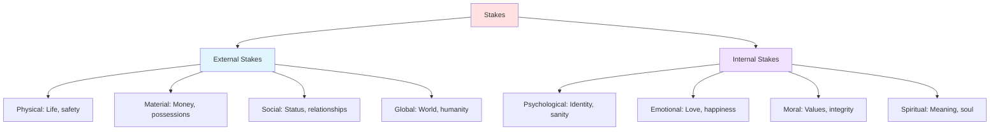
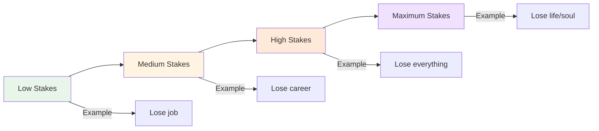

# 🎯 Tension & Stakes

> *Keeping readers on the edge of their seats: the art of suspense and consequence*

---

## 📖 **Overview**

**Tension** is the feeling of unease, anticipation, or anxiety that keeps readers turning pages. **Stakes** are what the character stands to gain or lose—the consequences that make the story matter. Together, they create reader investment and emotional engagement.

### **Why They Matter:**
- 📖 **Drive Reading:** Make readers need to know what happens
- 💔 **Create Investment:** Make readers care about outcome
- ⚡ **Generate Emotion:** Produce anxiety, excitement, fear
- 🎭 **Sustain Interest:** Prevent boredom or abandonment
- 🎯 **Deliver Payoff:** Make resolution satisfying

### **The Golden Rule:**
> "Tension is the promise that something important is at risk. Stakes are what makes that something matter."  
> — Without stakes, tension is meaningless. Without tension, stakes don't feel real.

---

## 🎯 **Understanding Stakes**

### **Definition:**

**Stakes** = What the character will gain or lose based on the story's outcome

**The Question Stakes Answer:**
> "Why should I care what happens?"

---

### **Types of Stakes:**



---

### **1. Physical/Survival Stakes:**

**What's at Risk:** Life, safety, physical wellbeing

**Examples:**
- Will they survive?
- Will they be injured?
- Will they escape danger?

**Stories:**
- *The Hunger Games* — Survival
- *Jaws* — Town's safety
- *The Martian* — Survival on Mars
- *Die Hard* — Hostages' lives

**Why It Works:** Primal, universal fear of death/harm

---

### **2. Material/Practical Stakes:**

**What's at Risk:** Money, home, possessions, livelihood

**Examples:**
- Will they lose their home?
- Will they go bankrupt?
- Will they lose their job?
- Will they lose inheritance?

**Stories:**
- *It's a Wonderful Life* — Building & Loan, George's life work
- *The Queen's Gambit* — Chess career
- *Knives Out* — Inheritance
- *Moneyball* — Team's future

**Why It Works:** Relatable, practical concerns

---

### **3. Relational Stakes:**

**What's at Risk:** Relationships, love, family, friendship

**Examples:**
- Will they get together?
- Will the relationship survive?
- Will they lose family?
- Will friendship be destroyed?

**Stories:**
- *Pride and Prejudice* — Elizabeth and Darcy's relationship
- *The Godfather* — Family loyalty
- *When Harry Met Sally* — Friendship vs. romance
- *Kramer vs. Kramer* — Custody of son

**Why It Works:** Humans are social; relationships matter

---

### **4. Social Stakes:**

**What's at Risk:** Reputation, status, honor, belonging

**Examples:**
- Will they be humiliated?
- Will they lose social standing?
- Will they be exposed?
- Will they be accepted?

**Stories:**
- *The Social Network* — Status, ownership
- *Mean Girls* — Social hierarchy
- *The King's Speech* — Public humiliation
- *Emma* — Reputation, matchmaking

**Why It Works:** Social creatures; status matters

---

### **5. Global/Societal Stakes:**

**What's at Risk:** World, nation, community, humanity

**Examples:**
- Will the world be destroyed?
- Will society collapse?
- Will evil reign?
- Will humanity survive?

**Stories:**
- *The Lord of the Rings* — Middle-earth's fate
- *The Matrix* — Humanity's freedom
- *Independence Day* — Earth's survival
- *1984* — Human freedom

**Why It Works:** Epic scale, affects everyone

**Note:** Must also have personal stakes or feels abstract

---

### **6. Psychological/Identity Stakes:**

**What's at Risk:** Sense of self, sanity, identity, beliefs

**Examples:**
- Will they lose themselves?
- Will they go insane?
- Will they compromise values?
- Will they become the villain?

**Stories:**
- *Black Swan* — Sanity
- *Fight Club* — Identity
- *Shutter Island* — Reality vs. delusion
- *Breaking Bad* — Moral identity

**Why It Works:** Existential fear, who we are matters

---

### **7. Moral/Ethical Stakes:**

**What's at Risk:** Integrity, soul, values, righteousness

**Examples:**
- Will they compromise morals?
- Will they stay true to values?
- Will they become corrupted?
- Will they do the right thing?

**Stories:**
- *A Man for All Seasons* — Integrity vs. life
- *The Crucible* — Honesty vs. survival
- *12 Angry Men* — Justice vs. convenience
- *Schindler's List* — Profit vs. lives

**Why It Works:** Internal conflict, character depth

---

## 📈 **Raising the Stakes**

### **Progression of Stakes:**



---

### **How to Raise Stakes:**

**1. Add Time Pressure:**
- Deadline approaches
- Opportunity closing
- Threat escalating
- Window narrowing

**Example:** 
- Before: "She must solve the case"
- After: "She has 24 hours or the killer strikes again"

---

**2. Make It Personal:**
- Threat to loved ones
- Attack on identity
- Betrayal by trusted
- Personal sacrifice required

**Example:**
- Before: "The city is in danger"
- After: "Her daughter is in the building"

---

**3. Increase Scope:**
- More people affected
- Larger consequences
- Wider impact
- Cascading effects

**Example:**
- Before: "She'll lose her job"
- After: "Company will go bankrupt, thousands unemployed"

---

**4. Remove Options:**
- Eliminate safe choices
- Force impossible decision
- No backup plan
- Point of no return

**Example:**
- Before: "He can quit anytime"
- After: "They know his identity; he's in too deep"

---

**5. Layer Multiple Stakes:**
- Physical AND emotional
- Personal AND global
- Internal AND external
- Short-term AND long-term

**Example:**
- Physical: Might die in arena
- Emotional: Might lose Peeta
- Social: Represent her district
- Political: Symbol of rebellion

---

### **Stakes Escalation Timeline:**

**Act 1:** Establish basic stakes  
**Act 2A:** Raise stakes significantly  
**Midpoint:** Game-changing escalation  
**Act 2B:** Stakes reach critical level  
**Crisis:** Maximum stakes, impossible choice  
**Climax:** All stakes on the line  

---

## ⚡ **Understanding Tension**

### **Definition:**

**Tension** = The reader's anticipation of negative consequences

**Not the Same As:**
- Action (can have action without tension)
- Conflict (can have conflict without tension)
- Suspense (though closely related)

**Tension Is:** The emotional state of uncertainty and anxiety

---

### **Types of Tension:**

**1. Anticipatory Tension:**
- Waiting for shoe to drop
- Know danger is coming
- Dread and foreboding
- "When will it happen?"

**Example:** Jaws — waiting for shark attack

---

**2. Immediate Tension:**
- Right now danger
- Active threat
- Fast-paced
- "What happens next?"

**Example:** Action scene chase

---

**3. Romantic Tension:**
- Will they/won't they
- Attraction with obstacles
- Near misses
- Unresolved desire

**Example:** Any good slow-burn romance

---

**4. Mystery Tension:**
- Unanswered questions
- Hidden information
- Puzzle solving
- "What's the truth?"

**Example:** Any mystery novel

---

**5. Dramatic Irony Tension:**
- Reader knows more than character
- Watching them walk into danger
- Helpless to warn
- "Don't go in there!"

**Example:** Horror films, Romeo & Juliet

---

**6. Moral Tension:**
- Difficult choice ahead
- No good option
- Values conflict
- "What will they do?"

**Example:** Ethical dilemmas

---

## 🎨 **Creating Tension: Techniques**

### **1. Raise Questions:**

**Plant questions in reader's mind:**
- Will they succeed?
- Who is the killer?
- What's the secret?
- How will they escape?
- What will they choose?

**Then delay answers**

**Example:**
> She opened the door. The room was empty—except for a single photograph on the floor. Her photograph. From last night. *End chapter.*

---

### **2. Use Deadlines:**

**Time pressure creates urgency:**
- Bomb ticking
- Deadline approaching
- Opportunity expiring
- Race against time

**Show the clock running**

**Types:**
- **Explicit:** "You have 24 hours"
- **Implicit:** "Rescue her before it's too late"
- **Escalating:** Deadline moves closer
- **Multiple:** Several overlapping deadlines

---

### **3. Create Obstacles:**

**Block protagonist's path:**
- Physical barriers
- Opposition from others
- Internal doubt
- Limited resources
- Complications

**Each obstacle increases tension**

**Pattern:**
1. Protagonist makes progress
2. New obstacle appears
3. Stakes raise
4. Repeat, escalating

---

### **4. Use Dramatic Irony:**

**Reader knows what character doesn't:**
- Danger approaching
- Betrayal planned
- Mistake being made
- Truth hidden

**Creates helpless tension**

**Example:**
> The killer watched from the closet as she entered the room, humming softly, completely unaware.

---

### **5. Withhold Information:**

**Control what reader knows:**
- Reveal slowly
- Plant mysteries
- Create questions
- Promise answers

**But don't frustrate:**
- Answer some questions
- Plant new ones
- Provide partial information
- Show progress

---

### **6. Put Characters in Danger:**

**Types of danger:**
- Physical peril
- Emotional vulnerability
- Social risk
- Moral compromise
- Loss of something valued

**The more we care about character, the more tension their danger creates**

---

### **7. Use Foreshadowing:**

**Hint at future trouble:**
- Ominous details
- Warnings ignored
- Chekhov's gun
- Patterns noticed

**Creates anticipation**

**Example:**
> "The old bridge had held for fifty years. Surely it would hold one more day."  
> *Narrator: It would not hold one more day.*

---

### **8. Create Near Misses:**

**Almost caught, almost escape:**
- Close calls
- Narrow escapes
- Just barely
- Not quite

**Shows stakes are real, increases dread**

**Example:**
- Hides in closet as killer searches room
- Finds clue just before it's destroyed
- Barely catches falling friend

---

### **9. Use Pacing:**

**Control information flow:**
- **Fast pacing:** Quick cuts, short sentences, rapid action
- **Slow pacing:** Drawn-out anticipation, detail
- **Alternating:** Switch between fast and slow

**Slow can create more tension than fast**

**Example of Slow Tension:**
> She turned the doorknob. It was unlocked. She pushed, and the door creaked open. The hallway was dark. She took one step. Then another. The floorboard groaned beneath her weight.

---

### **10. End Chapters on Cliffhangers:**

**Types:**
- Revelation cut off
- Danger arrives
- Question posed
- Decision made (consequences unknown)
- Shocking development

**Forces reader to continue**

**Example:**
> She opened the email. Read it twice. Then she looked at him, her husband of twenty years, and knew everything had been a lie.  
> *End chapter*

---

## 📊 **Tension Curve**

### **Managing Tension Throughout Story:**

```
Tension Level
    ↑
    |              
    |                    ***  ← Climax
    |                 **    **
    |              **         **
    |          ***              **
    |       **  ← Midpoint       **
    |    **                       **
    | **                           *
    |*  ← Inciting Incident         * ← Resolution
    |_________________________________→ Time
```

---

### **The Pattern:**

**Act 1:**
- Start low (establish normal)
- Inciting incident (spike)
- Rising tension

**Act 2A:**
- Complications increase
- Mini climaxes
- Build to midpoint

**Midpoint:**
- Major shift
- Stakes raise
- New information

**Act 2B:**
- Higher baseline tension
- Escalating complications
- Approaching crisis

**Act 3:**
- Maximum tension
- Crisis and climax
- Release in resolution

---

### **Pacing Tension:**

**✅ DO:**
- Vary intensity
- Give breathing room
- Build gradually
- Escalate stakes
- Deliver payoffs
- Create rhythm

**❌ DON'T:**
- Maintain constant high tension (exhausting)
- Let tension disappear too long
- Raise stakes artificially
- Forget to resolve tension
- Create false tension
- Ignore reader fatigue

---

## 🎯 **Stakes + Tension = Page-Turner**

### **The Formula:**

```mermaid
graph LR
    A[Clear Stakes] + B[Rising Tension] = C[Engaged Reader]
    
    A --> D[Reader cares about outcome]
    B --> E[Reader anxious about outcome]
    D + E --> C
    
    style C fill:#ffe1e1
```

---

### **The Questions:**

**Stakes Answer:**
- What's at risk?
- Why does it matter?
- What will character lose?
- What will character gain?

**Tension Asks:**
- Will they succeed?
- How will they do it?
- What will go wrong?
- What happens next?

---

### **Example: The Hunger Games**

**Stakes (Why We Care):**
- **Physical:** Katniss might die
- **Emotional:** Might lose Peeta
- **Social:** Represents District 12
- **Global:** Symbol of rebellion
- **Personal:** Prim's safety, family survival

**Tension (How It's Maintained):**
- Countdown to arena
- Other tributes hunting
- Gamemakers manipulating
- Unclear who to trust
- Romantic confusion
- Rule changes
- Berries (final choice)

**Result:** Can't stop reading

---

## ⚖️ **Common Mistakes**

<details>
<summary><b>❌ Pitfalls to Avoid</b></summary>

### **Low Stakes:**
- **Problem:** Nothing important at risk
- **Fix:** Raise what character stands to lose
- **Test:** Would it matter if they failed?

### **Unclear Stakes:**
- **Problem:** Reader doesn't understand consequences
- **Fix:** Be explicit about what's at risk
- **Test:** Can you state stakes in one sentence?

### **Stakes Don't Escalate:**
- **Problem:** Same level throughout
- **Fix:** Increase what's at risk as story progresses
- **Pattern:** Bad → Worse → Terrible → Catastrophic

### **All Tension, No Release:**
- **Problem:** Constant crisis exhausts reader
- **Fix:** Provide breathing room, vary intensity
- **Pattern:** Tension → Release → Higher tension → Release

### **False Tension:**
- **Problem:** Based on misunderstanding or lack of communication
- **Fix:** Create real obstacles, not artificial ones
- **Test:** Could simple conversation resolve it?

### **Stakes Only in Act 3:**
- **Problem:** No investment early
- **Fix:** Establish stakes in Act 1, raise throughout
- **Rule:** Know stakes from beginning

### **Deus Ex Machina:**
- **Problem:** Convenient rescue deflates tension
- **Fix:** Character must solve own problem
- **Rule:** Tension should pay off, not be erased

### **No Personal Stakes:**
- **Problem:** Only global/abstract stakes
- **Fix:** Give protagonist personal investment
- **Example:** "Save world" + "Save daughter"

### **Repetitive Tension:**
- **Problem:** Same danger repeatedly
- **Fix:** Vary types of tension, escalate threats
- **Pattern:** Physical → Emotional → Moral

### **Ignoring Stakes:**
- **Problem:** Character doesn't act like stakes matter
- **Fix:** Show fear, urgency, desperation
- **Test:** Does character's behavior match stakes?

</details>

---

## 💡 **Tension & Stakes Exercises**

### **Exercise 1: Identify Stakes**
For your story, list:
- Physical stakes
- Emotional stakes
- Social stakes
- Moral stakes
- Global stakes

Which is strongest? Which needs development?

---

### **Exercise 2: The Escalation Ladder**
Create 5-step stakes escalation:
1. Initial stake (Act 1)
2. Raised stake (Early Act 2)
3. Much higher stake (Midpoint)
4. Critical stake (Late Act 2)
5. Maximum stake (Climax)

Each should feel significantly worse.

---

### **Exercise 3: Tension Moments**
List 10 moments of highest tension in your story:
- What creates tension?
- What's the unanswered question?
- How long until answer?
- How do you escalate?

---

### **Exercise 4: The "So What?" Test**
For every plot point, ask "So what?":
- "Character discovers secret" — So what?
- "If they don't act, villain wins" — Now it matters!

If you can't answer why it matters, raise stakes.

---

### **Exercise 5: Scene Tension Audit**
For each scene:
- What's the tension/question?
- What makes reader want to keep reading?
- Does it end with answer or new question?
- Could it be more tense?

---

### **Exercise 6: The Worst Case**
For your protagonist:
- What's the worst that could happen?
- Make that worse
- Make it even worse
- How close can you bring them to this?

---

## 🔗 **Related Resources**

- 📖 **[Plot Basics](plot-basics.md)** — Foundation of story events
- ⚡ **[Conflict Types](conflict-types.md)** — Sources of tension
- 🎭 **[Plot Twists](plot-twists.md)** — Surprising tension spikes
- 📈 **[Story Structure](../story-structure/)** — Where to place tension peaks
- 📚 **[Character Development](../character-development/)** — Creating investment
- ⏱️ **[Pacing & Rhythm](../../craft/pacing-rhythm/)** — Controlling tension flow

---

## 📖 **Recommended Reading**

- *Wired for Story* — Lisa Cron
- *Story* — Robert McKee
- *The Anatomy of Story* — John Truby
- *Conflict & Suspense* — James Scott Bell

---

<div align="center">

### **Tension + Stakes = Unputdownable Story 🎯**

*Give readers a reason to care (stakes), then make them anxious about the outcome (tension). That's the secret to page-turners.*

**[⬅️ Back to Plot Development](README.md)** | **[📚 Fundamentals](../README.md)**

</div>
