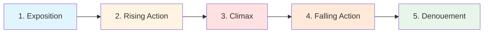

# 📊 Freytag's Pyramid

> *The dramatic arc that has shaped storytelling for over 2,000 years*

---

## 📖 **Overview**

**Freytag's Pyramid** (also called **Freytag's Triangle** or the **Dramatic Arc**) is a structural model developed by German playwright and novelist **Gustav Freytag** in 1863. Based on his analysis of ancient Greek and Shakespearean drama, Freytag identified five essential stages that create a satisfying dramatic structure.

### **Why It Works:**
- 📈 Clear rising and falling action
- 🎯 Emphasizes climax as pinnacle
- ⚖️ Balanced structure with tension building and release
- 🎭 Perfect for dramatic storytelling
- 📚 Foundation of classical dramatic theory

### **Best For:**
- Traditional tragedies and dramas
- Five-act plays
- Short stories with clear climax
- Stories focused on conflict and tension
- Classical narrative structures

---

## 📊 **The Pyramid at a Glance**



### **Visual Representation:**

```
                    CLIMAX ★
                    /    \
                   /      \
           RISING /        \ FALLING
          ACTION /          \ ACTION
                /            \
               /              \
        EXPOSITION          DENOUEMENT
```

---

## 📚 **The Five Parts of the Pyramid**

---

## 📍 **1. EXPOSITION** (Introduction)

### **What It Is:**
The **foundation** of your story where you establish the essential background information readers need to understand what follows.

### **Purpose:**
- Introduce main characters
- Establish setting (time and place)
- Present initial circumstances
- Set up the status quo
- Plant seeds for conflict
- Establish tone and mood

### **What to Include:**

#### **Characters:**
- Protagonist introduction
- Key supporting characters
- Character relationships
- Character motivations and desires

#### **Setting:**
- Time period
- Location and environment
- Social/cultural context
- World rules (especially for fantasy/sci-fi)

#### **Situation:**
- Current state of affairs
- Normal routine
- Existing tensions
- Background conflicts

#### **Mood:**
- Genre establishment
- Tone setting
- Atmospheric elements
- Foreshadowing

### **Duration:**
- **Short Story:** First few paragraphs
- **Novel:** First chapter(s)
- **Play:** First act or scene

### **Examples:**

**Romeo and Juliet:**
- Setting: Verona, two feuding families
- Characters: Romeo (Montague), Juliet (Capulet)
- Situation: Ancient family rivalry, violence in streets
- Mood: Passionate, dangerous, destined for tragedy

**Harry Potter and the Philosopher's Stone:**
- Setting: Modern England, secret magical world
- Characters: Harry living with abusive Dursleys
- Situation: Harry is mistreated, unaware of his identity
- Mood: Magical, mysterious, hopeful

**The Great Gatsby:**
- Setting: 1920s Long Island, Jazz Age
- Characters: Nick Carraway arrives, meets Gatsby
- Situation: Wealth, parties, mysterious neighbor
- Mood: Glamorous, mysterious, anticipatory

### **Techniques:**
- **In Medias Res:** Start in the middle of action, fill in exposition later
- **Gradual Reveal:** Spread exposition throughout story
- **Show, Don't Tell:** Reveal through action and dialogue
- **Natural Integration:** Weave in organically, avoid info-dumps

### **Common Mistakes:**
- ❌ Too much information too soon
- ❌ Boring prologue or backstory dump
- ❌ Characters explaining things they already know
- ❌ Delaying the story to explain everything

### **The Balance:**
Give readers **enough** to understand, but not so much they're overwhelmed. Create intrigue by withholding some information.

---

## ⬆️ **2. RISING ACTION** (Complication)

### **What It Is:**
The **building tension** phase where complications arise, conflicts develop, and stakes escalate toward the climax.

### **Purpose:**
- Introduce and develop conflict
- Build suspense and tension
- Complicate the situation
- Raise the stakes
- Develop characters through challenges
- Move toward climax

### **What Happens:**

#### **Inciting Incident:**
The event that disrupts the status quo and sets the story in motion
- Occurs early in rising action
- Creates the central problem
- Forces protagonist to act

#### **Complications:**
A series of obstacles and challenges
- Each obstacle more difficult than the last
- Multiple layers of conflict
- Subplots develop
- Character relationships tested
- Protagonist faces setbacks

#### **Escalation:**
Progressive increase in:
- **Tension:** Emotional and psychological pressure
- **Stakes:** What protagonist stands to lose
- **Urgency:** Time pressure increases
- **Difficulty:** Challenges become harder

### **Structure:**

```
Each complication raises tension:
    Problem 1 → Worse → Even Worse → Crisis Point
```

### **Duration:**
**Longest section** of the story (typically 40-50% of narrative)

### **Examples:**

**Romeo and Juliet:**
- Romeo crashes Capulet party, meets Juliet
- Secret balcony meeting and marriage
- Tybalt kills Mercutio
- Romeo kills Tybalt, is banished
- Each event makes situation worse

**Harry Potter and the Philosopher's Stone:**
- Harry discovers he's famous in wizarding world
- Learns magic at Hogwarts
- Encounters mysteries and dangers
- Suspects Snape is after the Stone
- Each discovery raises stakes

**Macbeth:**
- Witches' prophecy tempts Macbeth
- Lady Macbeth pressures him
- Macbeth murders Duncan
- Must cover up crime with more murders
- Guilt and paranoia increase

### **Types of Complications:**

#### **External Obstacles:**
- Physical barriers
- Antagonist actions
- Environmental challenges
- Time constraints
- Resource limitations

#### **Internal Obstacles:**
- Self-doubt
- Moral dilemmas
- Fear and insecurity
- Conflicting desires
- Character flaws

#### **Relational Obstacles:**
- Betrayals
- Misunderstandings
- Conflicting loyalties
- Relationship strains
- Social pressures

### **Building Tension Techniques:**

**Yes, But / No, And:**
- Hero succeeds, BUT new problem arises
- Hero fails, AND situation gets worse

**Example:**
- Romeo marries Juliet (Yes), BUT Tybalt kills Mercutio
- Romeo tries to make peace (Yes), BUT is forced to kill Tybalt
- Romeo is alive (Yes), BUT is banished

**Ticking Clock:**
Add time pressure to increase urgency

**Raising Stakes:**
What protagonist could lose becomes more severe:
- Personal loss → Loved one's loss → Community loss → World loss

**Reversals and Surprises:**
Unexpected twists that change the situation

### **Pacing:**
- Start slower, accelerate
- Balance action with breathing room
- Build in waves: tension → brief relief → higher tension
- End section at highest tension point before climax

### **Common Mistakes:**
- ❌ Complications that don't escalate
- ❌ Too many unrelated obstacles
- ❌ Protagonist passively reacting, not acting
- ❌ Losing sight of main conflict
- ❌ Rising action that drags or feels repetitive

### **Key Principle:**
Each complication should be **more difficult** and **more significant** than the last, building inexorably toward the climax.

---

## ⭐ **3. CLIMAX** (Crisis)

### **What It Is:**
The **turning point** and **highest point of tension** where the main conflict reaches its peak and the outcome is decided.

### **Purpose:**
- Resolve central conflict
- Create maximum tension
- Force protagonist's defining choice
- Determine story's outcome
- Provide emotional catharsis

### **Characteristics:**

#### **Highest Tension:**
- Most intense moment of story
- Everything is at stake
- Point of maximum danger or emotion
- No going back

#### **Turning Point:**
- Decisive moment
- Protagonist makes critical choice
- Action that determines outcome
- Point where story pivots from rising to falling action

#### **Confrontation:**
- Protagonist faces antagonist/obstacle directly
- Uses skills/knowledge gained
- Tests character growth
- Demonstrates transformation

### **Position:**
**Center or slightly past center** of the story (50-66%)
- Not at the end (common misconception)
- Apex of the pyramid
- Point from which story descends

### **Types of Climax:**

#### **Action Climax:**
Physical confrontation or event
- Battle, chase, fight
- Rescue, escape
- Competition, challenge

**Example:** Lightsaber duel, final Quidditch match

#### **Emotional Climax:**
Emotional or psychological peak
- Confession of love
- Moment of truth
- Emotional breaking point
- Revelation

**Example:** Mr. Darcy's second proposal

#### **Moral Climax:**
Ethical choice or moral dilemma
- Sacrifice decision
- Choosing between competing values
- Moral stand
- Character-defining choice

**Example:** Harry choosing to face Voldemort

#### **Revelation Climax:**
Discovery or revelation
- Truth revealed
- Mystery solved
- Identity discovered
- Understanding achieved

**Example:** Oedipus learning the truth

### **Examples:**

**Romeo and Juliet:**
**Climax:** Juliet drinks the sleeping potion
- Point of no return
- Sets tragic ending in motion
- Maximum tension and risk
- After this, events spiral downward

**Hamlet:**
**Climax:** Hamlet kills Polonius
- Accidental murder changes everything
- Can no longer delay or plot
- Consequences become inevitable
- Story turns from planning to catastrophe

**Harry Potter and the Philosopher's Stone:**
**Climax:** Harry faces Quirrell/Voldemort in the chamber
- Direct confrontation with antagonist
- Life or death stakes
- Uses lessons learned
- Discovers protection through love

**The Great Gatsby:**
**Climax:** Confrontation in the Plaza Hotel
- Tom exposes Gatsby's criminal background
- Daisy chooses Tom over Gatsby
- Gatsby's dream dies
- After this, only tragedy remains

### **What Makes a Strong Climax:**

✅ **Earned Through Story:**
- Result of all rising action
- Uses elements established earlier
- Feels inevitable yet surprising

✅ **Forces Character Choice:**
- Protagonist must act
- Decision reveals character
- Active, not passive

✅ **Maximum Stakes:**
- Everything on the line
- Point of greatest danger/risk
- Win or lose moment

✅ **Emotionally Satisfying:**
- Delivers on story promise
- Provides catharsis
- Resonates with themes

✅ **Clear and Definite:**
- Obvious turning point
- Unmistakable moment
- Changes story direction

### **Common Mistakes:**
- ❌ Confusing climax with ending
- ❌ Multiple equally important climaxes (dilutes impact)
- ❌ Climax resolved by external force (deus ex machina)
- ❌ Climax that doesn't involve protagonist
- ❌ Anticlimactic climax (doesn't live up to buildup)
- ❌ Placing climax at wrong point in structure

### **After the Climax:**
The outcome is determined. What follows is consequence and resolution.

---

## ⬇️ **4. FALLING ACTION** (Return/Reversal)

### **What It Is:**
Events that **occur as a result of the climax**, showing the consequences and leading toward resolution.

### **Purpose:**
- Show immediate consequences of climax
- Begin resolving subplots
- Move toward final resolution
- Release tension gradually
- Show impact of climax on characters and world

### **What Happens:**

#### **Immediate Consequences:**
The direct results of the climax
- Reactions from characters
- Immediate changes
- Ripple effects
- Unavoidable outcomes

#### **Unraveling:**
Story complications begin to resolve
- Subplots conclude
- Mysteries explained
- Loose threads tied
- Questions answered

#### **Character Responses:**
How characters deal with climax outcome
- Emotional reactions
- Practical responses
- Acceptance or denial
- New realizations

### **Duration:**
Typically **shorter than rising action** (10-20% of story)

### **Pacing:**
- Decelerating tension
- Winding down
- More reflective
- Moving toward closure

### **Examples:**

**Romeo and Juliet:**
- Romeo, believing Juliet dead, takes poison
- Juliet wakes, finds Romeo dead
- Juliet kills herself
- (Denouement: families discover bodies and reconcile)

**Hamlet:**
- Poison affects all the main characters
- Hamlet kills Claudius
- Deaths of Gertrude, Laertes, Hamlet
- Truth about murder revealed

**Harry Potter and the Philosopher's Stone:**
- Harry wakes in hospital wing
- Learns what happened after he passed out
- Dumbledore explains protections and magic
- Points awarded at end-of-year feast

**The Great Gatsby:**
- Daisy drives home, kills Myrtle
- George Wilson believes Gatsby did it
- George kills Gatsby
- Nick discovers what happened

### **What to Include:**

#### **Mandatory Elements:**
- Immediate climax consequences
- Key character fates
- Major subplot resolutions

#### **Optional Elements:**
- Character reflections
- Minor detail resolutions
- Transition to new normal

### **Techniques:**

**Domino Effect:**
Show how climax consequences cascade
- One event leads to next
- Chain of causality
- Inevitable progression

**Revelation:**
Explain or reveal information about climax
- What really happened
- Why it happened
- Hidden information
- Character motivations

**Emotional Processing:**
Characters (and readers) process climax
- Grief, joy, relief
- Understanding
- Acceptance
- Change integration

### **Tragedy vs. Comedy:**

**In Tragedy:**
- Falling action shows deterioration
- Consequences worsen
- Movement toward catastrophe
- Inevitable doom

**In Comedy:**
- Falling action shows improvement
- Complications resolve happily
- Movement toward celebration
- Joyful conclusion

### **Common Mistakes:**
- ❌ Too long (dragging after climax)
- ❌ Introducing new major conflicts
- ❌ Ignoring consequences of climax
- ❌ Resolving too quickly (whiplash)
- ❌ Bringing story to complete stop

### **Key Principle:**
Falling action should feel like the **natural consequence** of the climax, not new story.

---

## 🎬 **5. DENOUEMENT** (Resolution/Catastrophe)

### **What It Is:**
The **final resolution** where all remaining issues are settled and a new equilibrium is established. The French word means "unknotting" or "untying."

### **Also Called:**
- Resolution
- Catastrophe (in tragedy)
- Conclusion
- Epilogue

### **Purpose:**
- Provide closure
- Show final character states
- Establish new normal
- Tie up remaining loose ends
- Deliver final emotional note
- Satisfy reader expectations

### **What Happens:**

#### **Complete Resolution:**
All major story questions answered
- Protagonist's fate finalized
- Relationships settled
- World state established
- Theme reinforced

#### **New Equilibrium:**
A new status quo emerges
- Different from beginning
- Result of journey
- Stable or stable-ish
- Sense of ending

#### **Final Emotional Note:**
Last impression on reader
- Mood and tone
- Thematic statement
- Emotional resonance
- Sense of satisfaction or purposeful dissatisfaction

### **Duration:**
**Shortest section** (5-10% or less)

### **Types Based on Genre:**

#### **Tragedy (Catastrophe):**
- Death and destruction
- Total downfall
- Lesson or moral
- Somber reflection
- Often includes communal mourning

**Example:** 
In *Romeo and Juliet*, families discover dead children, reconcile, agree to build golden statues. The tragedy achieves its purpose: ending the feud through terrible cost.

#### **Comedy (Happy Resolution):**
- Problems solved
- Relationships restored
- Celebration
- Weddings, reunions
- Joyful atmosphere

#### **Drama (Mixed Resolution):**
- Bittersweet ending
- Some elements resolved, others ambiguous
- Realistic conclusion
- Thoughtful reflection

### **Examples:**

**Romeo and Juliet:**
**Denouement:** 
- Prince arrives, demands explanation
- Friar explains entire story
- Families see what their feud caused
- Montague and Capulet reconcile
- Agree to honor the lovers with golden statues
- Peace achieved through tragedy

**Harry Potter and the Philosopher's Stone:**
**Denouement:**
- Gryffindor wins House Cup
- Harry leaves Hogwarts for summer
- Returns to Dursleys
- But now knows his true identity and will return
- Hopeful, cyclical ending (for series)

**The Great Gatsby:**
**Denouement:**
- Nick arranges Gatsby's funeral
- Almost no one attends
- Nick disgusted with East Coast society
- Returns to Midwest
- Reflects on Gatsby's dream and American Dream
- "So we beat on, boats against the current..."

**Hamlet:**
**Denouement:**
- Fortinbras arrives from Norway
- Sees carnage
- Horatio explains what happened
- Fortinbras claims throne
- Orders Hamlet honored as soldier
- Order restored, but at terrible cost

### **What to Include:**

#### **Essential:**
- Protagonist's final state
- Resolution of main conflict
- Establishment of new status quo

#### **Optional:**
- Minor character fates
- Distant future glimpse (epilogue)
- Thematic reflection
- Final image or line

### **Techniques:**

**Full Circle:**
Echo the opening to show change
- Similar scene, different meaning
- Same location, different circumstances
- Callback to beginning

**Final Image:**
End with powerful visual or metaphor
- Memorable
- Thematic
- Resonant

**Epilogue:**
Jump forward in time
- Show long-term consequences
- Future glimpse
- Generational impact
- (Common in series)

**Reflection:**
Character or narrator reflects on events
- Lessons learned
- Meaning derived
- Perspective gained

### **Length Considerations:**

**Too Short:**
- Feels abrupt
- Unsatisfying
- Readers feel cheated
- Questions unanswered

**Too Long:**
- Loses momentum
- Becomes boring
- Dilutes climax
- Overstays welcome

**Just Right:**
- Brief but complete
- Emotionally satisfying
- Leaves on right note
- Answers essential questions

### **Common Mistakes:**
- ❌ Introducing new conflicts or characters
- ❌ Explaining everything in exhaustive detail
- ❌ Moralizing or lecturing
- ❌ Undoing the climax
- ❌ Multiple false endings
- ❌ Deus ex machina (divine intervention) solving problems

### **Mood:**
- **Tragedy:** Somber, reflective, lesson-bearing
- **Comedy:** Joyful, celebratory, optimistic
- **Drama:** Realistic, bittersweet, contemplative

---

## 📊 **Freytag's Pyramid in Different Formats**

### **Five-Act Play:**
- **Act 1:** Exposition
- **Act 2:** Rising Action (first half)
- **Act 3:** Climax
- **Act 4:** Falling Action
- **Act 5:** Denouement

### **Three-Act Structure:**
- **Act 1:** Exposition + early Rising Action
- **Act 2:** Rising Action + Climax + early Falling Action
- **Act 3:** Falling Action + Denouement

### **Novel:**
- **Chapters 1-5:** Exposition
- **Chapters 6-15:** Rising Action
- **Chapters 16-18:** Climax
- **Chapters 19-22:** Falling Action
- **Chapters 23-25:** Denouement

*(Proportions vary by story length and style)*

---

## 🎭 **Freytag's Original Focus: Tragedy**

### **Classical Tragedy Elements:**

**Protagonist:**
- Noble or high-status character
- Fatal flaw (hamartia)
- Makes crucial mistake
- Falls from high to low

**Structure:**
- Exposition: Introduce noble hero
- Rising Action: Hero's flaw leads to complications
- Climax: Point of no return, catastrophe becomes inevitable
- Falling Action: Hero's downfall
- Catastrophe: Complete ruin, often death

**Examples:**
- *Oedipus Rex*
- *Macbeth*
- *Romeo and Juliet*
- *Hamlet*
- *King Lear*

### **Tragic Elements:**

**Catharsis:**
Emotional purging through pity and fear

**Hamartia:**
Tragic flaw that leads to downfall

**Peripeteia:**
Reversal of fortune

**Anagnorisis:**
Recognition or discovery of truth

---

## ⚖️ **Comparing Freytag to Other Structures**

### **Freytag vs. Three-Act Structure:**

| Aspect | Freytag's Pyramid | Three-Act Structure |
|--------|------------------|-------------------|
| **Acts** | 5 | 3 |
| **Climax Position** | Center (50%) | Near end (75-90%) |
| **Focus** | Dramatic tension arc | Plot progression |
| **Falling Action** | Emphasized | Brief |
| **Origin** | Classical drama | Modern film/fiction |
| **Best For** | Tragedies, dramas | All genres |

### **Freytag vs. Hero's Journey:**

| Aspect | Freytag | Hero's Journey |
|--------|---------|---------------|
| **Focus** | Plot structure | Character transformation |
| **Stages** | 5 | 12 |
| **Emphasis** | Dramatic tension | Internal growth |
| **Climax** | External crisis | Ordeal & Resurrection |
| **Origin** | Western drama | Cross-cultural myth |

---

## ✅ **How to Use Freytag's Pyramid**

### **For Planning:**
1. **Outline each section:**
   - What exposition is essential?
   - What complications will build tension?
   - What is the climactic moment?
   - What are consequences of climax?
   - How does story resolve?

2. **Map key events to pyramid:**
   - Place events in appropriate sections
   - Ensure steady rise to climax
   - Plan falling action consequences
   - Design satisfying denouement

### **For Revision:**
1. **Check structure:**
   - Does tension rise steadily?
   - Is climax the highest point?
   - Does falling action feel consequential?
   - Is resolution satisfying?

2. **Fix structural problems:**
   - Cut exposition that doesn't serve story
   - Escalate rising action complications
   - Strengthen climax if weak
   - Trim falling action if dragging
   - Tighten denouement

### **For Diagnosis:**
If your story feels off:

**Too slow:** Exposition too long, rising action not escalating
**Confusing:** Climax unclear or misplaced
**Anticlimactic:** Falling action more intense than climax
**Unsatisfying:** Denouement too brief or too long

---

## 🎯 **Common Mistakes**

<details>
<summary><b>❌ Pitfalls to Avoid</b></summary>

### **Confusing Climax with Ending:**
- **Problem:** Placing climax at story's end
- **Fix:** Remember climax is turning point, not conclusion

### **Multiple Climaxes:**
- **Problem:** Several moments of equal intensity
- **Fix:** One clear pinnacle, others are complications

### **Info-Dumping Exposition:**
- **Problem:** Boring opening with too much background
- **Fix:** Weave exposition into action and dialogue

### **Flat Rising Action:**
- **Problem:** Complications don't escalate
- **Fix:** Make each obstacle harder, stakes higher

### **Neglecting Falling Action:**
- **Problem:** Jumping from climax straight to ending
- **Fix:** Show consequences, allow for emotional processing

### **Overlong Denouement:**
- **Problem:** Continuing too long after climax
- **Fix:** Wrap up efficiently, end on strong note

### **Deus Ex Machina:**
- **Problem:** Outside force solves conflict
- **Fix:** Resolution must come from protagonist's actions

</details>

---

## 📚 **Examples in Action**

### **Shakespearean Tragedies:**
- *Hamlet*
- *Macbeth*
- *Othello*
- *Romeo and Juliet*
- *King Lear*

*(All follow Freytag's structure almost perfectly)*

### **Modern Applications:**
- *The Great Gatsby* — Modern tragedy
- *Of Mice and Men* — American tragedy
- *Breaking Bad* — TV tragedy
- *Titanic* — Film tragedy

### **Analysis Exercise:**
Take any tragedy and map it to Freytag's Pyramid. You'll find:
- Clear exposition introducing noble protagonist
- Rising complications from character flaw
- Definitive climactic turning point
- Inevitable consequences falling from climax
- Final catastrophe with lesson/moral

---

## 💡 **Modern Adaptations**

While Freytag focused on tragedy, his structure applies to:

### **Comedy:**
- Same structure, different outcomes
- Rising action toward happy resolution
- Climax still turns story
- Falling action shows happy consequences

### **Modern Fiction:**
- May place climax later (closer to ending)
- Falling action often compressed
- Denouement briefer
- But basic principle remains: tension rises and falls

### **Genre Fiction:**
- **Mystery:** Climax is revelation of truth
- **Romance:** Climax is declaration or union
- **Thriller:** Climax is confrontation with villain
- **Horror:** Climax is facing the monster

---

## 🔗 **Related Resources**

- 📋 **[Three-Act Structure](three-act-structure.md)** — Related framework
- 🗺️ **[Hero's Journey](heros-journey.md)** — Character-focused structure
- 📊 **[Plot Development](../../plot-development/)** — Crafting complications
- ✍️ **[Literary Devices](../../../craft/literary-devices/)** — Techniques for each stage
- 📖 **[Story Analysis](../../../examples/story-analysis/)** — Pyramid in practice

### **Recommended Reading:**
- *Freytag's Technique of the Drama* — Gustav Freytag
- *Poetics* — Aristotle
- *The Art of Dramatic Writing* — Lajos Egri

---

<div align="center">

### **Master the Arc — Create Satisfying Drama 📊**

*Freytag's Pyramid is more than structure — it's the shape of tension itself.*

**[⬅️ Back to Story Structure](README.md)** | **[📚 Fundamentals](../../README.md)**

</div>
