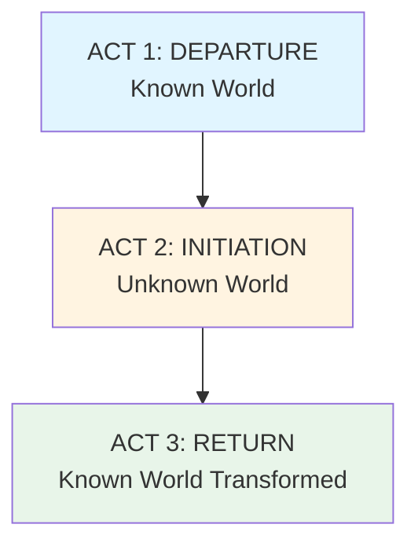

# 🗺️ The Hero's Journey

> *"The adventure of the hero is the adventure of being alive."* — Joseph Campbell

---

## 📖 **What is the Hero's Journey?**

The **Hero's Journey** (also called the **Monomyth**) is a narrative pattern identified by mythologist Joseph Campbell in his seminal work *The Hero with a Thousand Faces* (1949). After studying myths from cultures worldwide, Campbell discovered they shared a common structure: the hero's transformative journey.

### **Why It Matters:**

The Hero's Journey resonates because it mirrors:
- 🌱 **Personal growth** — We all face challenges and change
- 🌍 **Universal experience** — Found across all cultures
- 🧠 **Psychological truth** — Matches human developmental stages
- ⚡ **Emotional power** — Taps into deep archetypal patterns

**Result:** Stories following this pattern feel deeply satisfying and meaningful.

---

## 🎭 **The 12 Stages of the Hero's Journey**

### **Three Acts of Transformation:**

---

## 🏠 **ACT ONE: DEPARTURE** (The Known World)

The hero begins in their ordinary world but is called to leave it.

---

### **1. Ordinary World** 📍

*Establish the hero's normal life before the adventure*

**Purpose:**
- Show who the hero is now
- Establish what they'll risk/lose
- Create contrast with adventure
- Make readers care

**What to Show:**
- Hero's daily routine
- Relationships and environment
- Skills and weaknesses
- Internal lack or dissatisfaction
- What's at stake

**Examples:**
- **Luke Skywalker** (*Star Wars*): Farm boy dreaming of adventure
- **Frodo Baggins** (*LOTR*): Comfortable life in the Shire
- **Katniss Everdeen** (*Hunger Games*): Hunting to feed family in District 12
- **Harry Potter**: Living under the stairs, bullied by Dursleys

**Questions to Answer:**
- What is the hero's normal?
- What do they want?
- What do they need (but don't know yet)?
- What's missing from their life?

---

### **2. Call to Adventure** 📞

*Something disrupts the ordinary world and issues a challenge*

**Purpose:**
- Set story in motion
- Present the problem/opportunity
- Raise the question: "Will the hero answer?"

**Forms of the Call:**
- **External threat:** War, invasion, disaster
- **Personal loss:** Death, kidnapping, betrayal
- **Opportunity:** Quest, mission, challenge
- **Discovery:** Secret revealed, new world found
- **Supernatural:** Prophecy, vision, magical event

**Examples:**
- **Luke**: Leia's holographic message
- **Frodo**: Gandalf reveals the Ring's danger
- **Katniss**: Prim's name is called
- **Harry**: Hogwarts letter arrives
- **Neo** (*Matrix*): Message to follow the white rabbit

**The Call Should:**
- Be impossible to ignore
- Threaten/change ordinary world
- Hint at transformation ahead
- Create urgency

---

### **3. Refusal of the Call** ❌

*The hero hesitates, doubts, or outright refuses the adventure*

**Purpose:**
- Show hero is relatable (has fears)
- Raise stakes (shows danger/difficulty)
- Make acceptance meaningful
- Create tension

**Common Reasons for Refusal:**
- **Fear** — Too dangerous, overwhelming
- **Responsibility** — Can't leave family, duties
- **Self-doubt** — "I'm not the one, I'm not ready"
- **Attachment** — Comfortable with status quo
- **Ignorance** — Doesn't understand true stakes

**Examples:**
- **Luke**: "I can't get involved" (loyalty to uncle)
- **Frodo**: "I wish the Ring had never come to me"
- **Harry**: "I think you've made a mistake" (disbelief)
- **Simba** (*Lion King*): Runs from responsibility

**Note:** In some stories, this stage is brief or internalized. In others (like Katniss volunteering immediately), the refusal is implicit—she doesn't want this, but chooses it anyway.

**Duration:** Can be moments or extend across multiple scenes

---

### **4. Meeting the Mentor** 👴

*The hero encounters a wise guide who provides aid*

**Purpose:**
- Give hero confidence/tools to proceed
- Represent wisdom hero needs
- Embody theme or lesson
- Can only guide, not complete journey for hero

**What the Mentor Provides:**
- **Training** — Skills needed for quest
- **Gifts** — Magical items, weapons, knowledge
- **Advice** — Wisdom for the journey
- **Confidence** — Belief in hero's potential
- **Motivation** — Reason to accept call

**Classic Mentors:**
- **Gandalf** (LOTR) — Wisdom and guidance
- **Obi-Wan** (Star Wars) — Jedi training
- **Haymitch** (Hunger Games) — Survival strategy
- **Dumbledore** (Harry Potter) — Magical wisdom
- **Morpheus** (Matrix) — Truth revealer

**Types of Mentors:**
- **Wise Elder** — Traditional sage
- **Reluctant Teacher** — Must be convinced
- **Fallen Hero** — Once great, now flawed
- **Anti-Mentor** — Teaches through opposition
- **Inner Mentor** — Dead mentor's teachings
- **Multiple Mentors** — Different teachers for different lessons

**Important:** The mentor cannot complete the journey for the hero—they can only prepare them.

---

### **5. Crossing the Threshold** 🚪

*The hero commits to the adventure and enters the new world*

**Purpose:**
- Point of no return
- Leave safety behind
- Enter unknown territory
- Transform from ordinary to hero-in-training

**The Threshold:**
- Physical boundary (leaving home, entering forest, portal)
- Psychological commitment (decision made)
- First major action (first battle, first spell, first kiss)

**Threshold Guardians:**
Often, guardians test whether hero is ready:
- Literal guards or gatekeepers
- Tests of worthiness
- Initial obstacles
- Forces that try to turn hero back

**Examples:**
- **Luke**: Leaving Tatooine after aunt/uncle killed
- **Frodo**: Leaving the Shire with the Ring
- **Harry**: Entering Platform 9¾
- **Neo**: Taking the red pill
- **Dorothy** (*Wizard of Oz*): Tornado to Oz

**After Crossing:**
- Hero is in unfamiliar territory
- Old rules don't apply
- Must learn new ways
- Can't easily return

---

## ⚔️ **ACT TWO: INITIATION** (The Unknown World)

The hero faces tests, makes allies and enemies, and approaches ultimate challenge.

---

### **6. Tests, Allies, and Enemies** 🤝⚔️

*The hero learns the rules of the new world through trials*

**Purpose:**
- Develop hero's skills
- Establish relationships
- Show world's rules and dangers
- Build toward main ordeal
- Create bonds that will matter later

**What Happens:**
- **Tests:** Smaller challenges and obstacles
- **Allies:** Form bonds with companions
- **Enemies:** Identify antagonistic forces
- **Learning:** Acquire skills and knowledge
- **Mistakes:** Fail and learn from failures

**Examples:**
- **Harry Potter**: First year classes, making friends with Ron and Hermione, rivalries with Draco
- **Luke**: Learning the Force, befriending Han and Leia
- **Katniss**: Training for Games, forming alliance with Rue
- **Frodo**: Fellowship forms, learning to evade Ringwraiths

**Story Function:**
- **Rising action** — Escalating challenges
- **Character development** — Hero grows
- **Relationship building** — Found family forms
- **World exploration** — Reader learns world rules
- **Subplot development** — Secondary stories begin

**Common Tests:**
- Combat training
- Social navigation (new culture/society)
- Moral choices
- Loyalty tests
- Skill demonstrations
- Minor victories and defeats

**Duration:** This stage often covers substantial story time (25-40% of narrative)

---

### **7. Approach to the Inmost Cave** 🏰

*The hero prepares for the major challenge—the ordeal*

**Purpose:**
- Build tension before climax of Act Two
- Show hero preparing (physically, mentally, emotionally)
- Raise stakes
- Create anticipation
- Last moment of relative safety

**What "Inmost Cave" Means:**
- **Literal:** Physical dangerous place (cave, fortress, arena)
- **Metaphorical:** Greatest fear or challenge
- **Psychological:** Hero's inner demons
- **Social:** Place of judgment or confrontation

**This Stage Includes:**
- **Strategic planning** — Formulating the approach
- **Reconnaissance** — Gathering intelligence
- **Preparation** — Training, acquiring items
- **Bonding** — Last moments with allies
- **Doubt** — Final hesitation or fear
- **Commitment** — Decision to face the ordeal

**Examples:**
- **Luke**: Approaching Death Star with plans
- **Frodo**: Approaching Mordor
- **Harry**: Discovering Chamber of Secrets location, preparing to enter
- **Katniss**: Final moments before Cornucopia
- **Simba**: Returning to Pride Rock to face Scar

**Atmosphere:** Tension builds, calm before storm, anticipation

**Connection to Structure:**
- Often corresponds to end of Act Two's first half
- Leading directly to Midpoint/Ordeal
- Transitions from learning to testing

---

### **8. The Ordeal** ☠️

*The hero faces their greatest fear—symbolic death and rebirth*

**Purpose:**
- **Crisis point** of story (often the Midpoint)
- Hero confronts death (literal or symbolic)
- Transformation through "death" and "rebirth"
- Test of everything learned
- Prove worthiness

**What "Death" Means:**
- **Literal death** — Hero appears to die or nearly dies
- **Ego death** — Old self must "die" for new self to emerge
- **Death of others** — Mentor or ally dies
- **Symbolic death** — Loss of identity, hope, or belief
- **Near-death experience** — Brush with mortality

**The Pattern:**
1. **Confrontation** — Face the greatest fear
2. **Death** — Experience of dying (literally or symbolically)
3. **Rebirth** — Emerge transformed
4. **Reward** — Earn something for surviving

**Examples:**
- **Luke**: Nearly crushed in trash compactor, then confronts stormtroopers
- **Harry Potter 1**: Faces Quirrell/Voldemort, nearly dies
- **Katniss**: Tracker jacker attack (near-death), Rue's death
- **Frodo**: Shelob's lair (poisoned, appears dead)
- **Simba**: Confronts truth about father's death (ego death)
- **Neo**: Dies and is resurrected with new powers

**Emotional Impact:**
- Highest tension so far
- Reader fears hero will fail/die
- Victory snatched from jaws of defeat
- Changes everything that follows

**After the Ordeal:**
Hero is transformed:
- Gained new power or knowledge
- Shed limiting belief
- Proven themselves worthy
- Earned respect of allies
- Now capable of completing quest

---

### **9. Reward (Seizing the Sword)** 🏆

*Having survived the ordeal, the hero claims their reward*

**Purpose:**
- Show consequences of surviving ordeal
- Provide brief respite
- Give hero what they need for final challenge
- Celebrate transformation
- Set up final act

**Types of Rewards:**
- **Physical object** — Magical sword, treasure, MacGuffin
- **Knowledge** — Secret, truth, revelation
- **Reconciliation** — Forgiveness, understanding, acceptance
- **Love** — Romantic connection solidified
- **Power** — New ability or strength
- **Freedom** — Liberation from constraint
- **Respect** — Recognition from others
- **Self-knowledge** — Understanding one's true nature

**Examples:**
- **Luke**: Rescues Princess Leia (reward is ally and love interest)
- **Frodo**: Survives Shelob, gets closer to Mount Doom
- **Harry**: Saves Ginny from Chamber, earns respect
- **Katniss**: Rue's friendship and sacrifice (emotional reward), supplies from Cornucopia
- **Neo**: Resurrection grants mastery of Matrix

**Celebration:**
- Brief moment of victory
- Hero and allies bond
- Reflect on journey so far
- Acknowledge growth

**But...**
The reward is not the end—the journey home remains, and new challenges await.

---

## 🏡 **ACT THREE: RETURN** (The Known World Transformed)

The hero must return home and prove transformation.

---

### **10. The Road Back** 🛤️

*The hero begins the journey home, but faces renewed pursuit or danger*

**Purpose:**
- Transition from unknown to known world
- Raise stakes again (story's not over!)
- Create urgency for final confrontation
- Show hero's determination
- Set up final ordeal

**What Happens:**
- **Pursuit** — Enemies chase or attack
- **Escape** — Racing against time
- **Chase sequence** — High-action return
- **Renewed threat** — Villain rallies for final battle
- **Consequences** — Actions in special world catch up
- **Commitment to return** — Hero decides to go home

**Examples:**
- **Luke**: Escaping Death Star, but it's tracking them
- **Frodo**: Reaching Mount Doom, Gollum attacks
- **Harry**: Must get Stone before Quirrell/Voldemort
- **Katniss**: Rule change, must kill Peeta or die
- **Simba**: Returns to Pride Lands for final confrontation

**Common Elements:**
- **Increased pace** — Faster, more urgent
- **Ticking clock** — Time running out
- **Reversal** — Seeming victory threatened
- **Betrayal or obstacle** — New problem emerges
- **Choice** — Hero must decide: return or stay?

**Emotional Tone:**
- Urgency
- Determination
- Anticipation
- Anxiety
- Commitment

**Structural Position:**
- Beginning of Act Three
- Around 75-80% of story
- Leading to climax

---

### **11. Resurrection** 🔥

*The hero faces a final, most dangerous ordeal—the supreme test*

**Purpose:**
- **Final exam** — Test everything hero learned
- **Purification** — Hero must be "reborn" again
- **Prove transformation** — Show growth is complete
- **Higher stakes** — More is at risk than ever
- **Apply all lessons** — Use all skills and wisdom gained

**Why "Resurrection"?**
- Hero faces "death" again
- This time, must draw on full transformation
- Emerges fully reborn as complete hero
- Transcends previous limitations

**Characteristics:**
- **More dangerous** than Ordeal
- **More at stake** — World/others threatened, not just hero
- **Hero must choose** — Active moral/ethical choice
- **Uses new self** — Could not have survived this before transformation
- **Clean/renew** — Purification from journey's trials

**Examples:**
- **Luke**: Final Death Star trench run—must trust the Force completely
- **Frodo**: At Mount Doom, tempted by Ring, must let go
- **Harry Potter 7**: Dies and returns at Battle of Hogwarts
- **Katniss**: Berries scene (willing to die with Peeta)
- **Neo**: Final battle with Agent Smith
- **Simba**: Final battle with Scar

**The Test:**
- Can hero apply lessons?
- Will they sacrifice for others?
- Have they truly changed?
- Are they worthy?

**Two Types:**
1. **Physical resurrection** — Actual death and return
2. **Symbolic resurrection** — Transcendence of old self

**After Resurrection:**
- Hero is fully transformed
- Old self completely shed
- New self proven and tested
- Ready to return home as hero

---

### **12. Return with the Elixir** 🌟

*The hero returns home changed, bringing something of value*

**Purpose:**
- **Demonstrate transformation** — Show how hero has changed
- **Benefit community** — Share what was gained
- **Complete circle** — Return to where we started (but different)
- **Provide resolution** — Answer story questions
- **Satisfying conclusion** — Emotional payoff

**The "Elixir":**
Not literal medicine, but anything of value brought back:
- **Physical object** — Treasure, magical item, rescued person
- **Knowledge** — Wisdom, truth, information
- **Love** — Relationship formed
- **Freedom** — Liberation (for self or others)
- **Healing** — Power to cure/fix community problem
- **Maturity** — Grown into adult/leader
- **Peace** — Resolution of conflict
- **Hope** — Inspiration for others

**Examples:**
- **Luke**: Returns as Jedi, with Rebellion victory
- **Frodo**: Returns to Shire (though changed, bittersweet)
- **Harry**: Returns to Dursleys knowing his true identity
- **Katniss**: Returns with Peeta, having sparked rebellion
- **Dorothy**: "There's no place like home" (appreciation of what she had)

**Showing Transformation:**
- **Contrast** with Ordinary World
- **New abilities** — Can do what was impossible before
- **Changed relationships** — Interacts differently
- **New status** — Recognized as hero
- **Wisdom** — Shares lessons learned
- **Confidence** — Comfortable in own skin

**Types of Returns:**

**Triumphant Return:**
- Hero celebrated
- Community improved
- Problems solved
- Happy ending

**Bittersweet Return:**
- Victory achieved but at cost
- Hero changed too much to fit in
- Community doesn't understand
- Wistful, melancholy

**Failed Return:**
- Hero cannot return
- Community rejects hero
- Tragedy
- Exile

**Refusing the Return:**
- Hero stays in special world
- Cannot go back
- Voluntary or forced

---

## 🎨 **Variations and Flexibility**

### **The 17-Stage Version:**

Christopher Vogler expanded Campbell's work for screenwriters, sometimes breaking stages into sub-stages:

**Additional Stages:**
- **Refusal of the Return** — Hero doesn't want to leave special world
- **Magic Flight** — Escape chase
- **Rescue from Without** — Outside help needed
- **Crossing the Return Threshold** — Re-entering ordinary world
- **Master of Two Worlds** — Balance both worlds
- **Freedom to Live** — Release from fear of death

**Note:** These are often incorporated into the 12 stages rather than treated separately.

---

### **Abbreviated Journeys:**

Not every story includes all stages:

**Possible to Skip:**
- Refusal of the Call (if hero immediately willing)
- Meeting the Mentor (if hero is experienced)
- Reward (if merged with Ordeal)

**Never Skip:**
- Call to Adventure
- Crossing Threshold
- Ordeal
- Resurrection
- Return with Elixir

---

### **Multiple Journeys:**

Complex stories may feature:
- **Multiple heroes** — Each on own journey
- **Nested journeys** — Journey within journey
- **Repeated cycles** — Multiple complete journeys (series)
- **Parallel journeys** — Hero's allies on simultaneous journeys

---

## 📊 **Hero's Journey vs. Three-Act Structure**

### **Alignment:**

| Three-Act | Hero's Journey |
|-----------|----------------|
| **Act 1: Setup** | Ordinary World → Crossing Threshold |
| **Act 2a** | Tests, Allies, Enemies → Approach |
| **Midpoint** | The Ordeal |
| **Act 2b** | Reward → Road Back |
| **Act 3: Resolution** | Resurrection → Return with Elixir |

**They complement each other:**
- Three-Act provides percentage structure
- Hero's Journey provides psychological/archetypal depth

---

## 🎭 **Archetypal Characters**

The Hero's Journey often features archetypal characters:

### **The Hero:**
- Protagonist on journey
- Represents audience
- Transforms through trials

### **The Mentor:**
- Wise guide
- Provides gifts/training
- Often dies or departs

### **The Threshold Guardian:**
- Tests hero's commitment
- Guards entrance to special world
- Can become ally if passed

### **The Herald:**
- Brings Call to Adventure
- Often appears at beginning

### **The Shapeshifter:**
- Unclear loyalties
- Keeps hero guessing
- Often love interest
- Creates doubt and suspense

### **The Shadow:**
- Antagonist
- Hero's dark opposite
- Represents suppressed aspects
- Must be confronted

### **The Trickster:**
- Comic relief
- Disrupts status quo
- Brings change through chaos
- Often sidekick

**Note:** One character can fulfill multiple archetypes, or archetypes can shift.

---

## 💡 **Applying the Hero's Journey**

### **For Planning:**

**1. Identify Your Story's Journey:**
- What is the hero's transformation?
- What must they learn?
- What are the two "deaths"?

**2. Map the Stages:**
- Place stages at appropriate story points
- Identify which stages fit your story
- Determine percentage placement

**3. Develop Each Stage:**
- Create scenes fulfilling stage requirements
- Ensure progression and growth
- Connect stages logically

---

### **For Revision:**

**1. Map Your Existing Draft:**
- Identify where stages fall
- Note missing stages
- Check stage strength

**2. Strengthen Weak Stages:**
- Emphasize key moments
- Add missing elements
- Deepen transformation

**3. Verify Transformation:**
- Hero different at end than beginning?
- Change earned through trials?
- Demonstrated in Resurrection?

---

## ✅ **Hero's Journey Checklist**

Ensure your story hits key points:

**Act One: Departure**
- [ ] Ordinary World established (hero's starting point)
- [ ] Call to Adventure (inciting incident)
- [ ] Refusal of Call (doubt/hesitation)
- [ ] Meeting the Mentor (guidance received)
- [ ] Crossing the Threshold (entering new world)

**Act Two: Initiation**
- [ ] Tests, Allies, Enemies (learning phase)
- [ ] Approach to Inmost Cave (preparation)
- [ ] The Ordeal (symbolic death)
- [ ] Reward (seizing the sword)

**Act Three: Return**
- [ ] The Road Back (returning journey)
- [ ] Resurrection (final test)
- [ ] Return with Elixir (transformed home)

**Character Arc**
- [ ] Hero transforms from beginning to end
- [ ] Transformation earned through trials
- [ ] Could not succeed at start with end-of-story skills
- [ ] Internal and external journeys complete

**Thematic**
- [ ] Journey reflects theme
- [ ] Elixir relates to theme
- [ ] Mentor embodies lesson
- [ ] Ordeal tests thematic question

---

## 🎯 **Best For:**

### **Genres:**
- ✅ Fantasy
- ✅ Adventure
- ✅ Science Fiction
- ✅ Coming-of-age
- ✅ Epic stories
- ✅ Quest narratives

### **Story Types:**
- ✅ Transformation stories
- ✅ Adventure plots
- ✅ Bildungsroman
- ✅ Fish-out-of-water
- ✅ Chosen One narratives

---

## 📚 **Essential Reading**

- **"The Hero with a Thousand Faces"** — Joseph Campbell (original)
- **"The Writer's Journey"** — Christopher Vogler (application for writers)
- **"Into the Woods"** — John Yorke (modern analysis)

---

## 🔗 **Related Resources**

- 📋 **[Hero's Journey Template](../../../templates/plot-outlines/heros-journey-template.md)** — Blank worksheet
- 📖 **[Story Examples](../../../examples/plot-structures/)** — Hero's Journey in action
- 🎭 **[Character Development](../character-development/)** — Creating transformative arcs
- 🏗️ **[Three-Act Structure](three-act-structure.md)** — Complementary framework

---

### **Embark on the Hero's Journey! 🗺️**

*"The cave you fear to enter holds the treasure you seek."* — Joseph Campbell

**[⬅️ Back to Story Structure](README.md)** | **[📚 Fundamentals](../README.md)**

