# 🎌 Kishotenketsu

> *The four-act structure of East Asian storytelling: harmony, disruption, twist, and resolution*

---

## 📖 **Overview**

**Kishotenketsu** (起承転結) is a traditional **four-act narrative structure** originating from classical Chinese poetry and adopted throughout East Asia, particularly in Japan, Korea, and China. Unlike Western structures that emphasize conflict, kishotenketsu focuses on **harmony, contrast, and contemplation**.

### **The Name:**

**Ki** (起) — Introduction, beginning  
**Sho** (承) — Development, continuation  
**Ten** (転) — Twist, turn, complication  
**Ketsu** (結) — Conclusion, reconciliation

### **Why It's Different:**
- 🕊️ **No required conflict** between protagonist and antagonist
- 🎨 **Emphasis on contrast** and perspective shifts
- 🤔 **Contemplative** rather than action-driven
- 🌸 **Subtle and nuanced** storytelling
- 🧩 **Harmony through difference**

### **Why It Matters:**
- Offers alternative to conflict-based storytelling
- Perfect for literary and contemplative fiction
- Creates space for character studies
- Emphasizes emotional and philosophical depth
- Refreshing variation from Western structures

### **Best For:**
- Literary fiction
- Character studies
- Slice-of-life stories
- Contemplative narratives
- Stories about relationships and understanding
- Manga, anime, and Asian cinema
- Flash fiction and short stories

---

## 📊 **The Structure at a Glance**

```mermaid
graph LR
    A[起<br/>Ki<br/>Introduction] --> B[承<br/>Sho<br/>Development]
    B --> C[転<br/>Ten<br/>Twist]
    C --> D[結<br/>Ketsu<br/>Reconciliation]
    
    style A fill:#e1f5ff
    style B fill:#fff4e1
    style C fill:#ffe1e1
    style D fill:#e8f5e9
```



### **Basic Structure:**

| Act | Name | Percentage | Purpose |
|-----|------|------------|---------|
| **1** | **Ki** (起) | 25% | Introduce elements |
| **2** | **Sho** (承) | 25% | Develop and expand |
| **3** | **Ten** (転) | 25% | Introduce twist or contrast |
| **4** | **Ketsu** (結) | 25% | Reconcile and conclude |

---

## 🌱 **Act 1: KI (起) — Introduction**

### **What It Is:**
The **introduction** that establishes the setting, characters, and initial situation. This is the foundation upon which the rest of the story builds.

### **Japanese Concept:**
**起** means "to get up," "to rise," "to begin"

### **Purpose:**
- Introduce main elements
- Establish setting and atmosphere
- Present characters
- Set tone and mood
- Create baseline for comparison

### **What to Include:**

#### **Characters:**
- Introduce protagonist
- Establish personality
- Show daily life
- Present relationships

#### **Setting:**
- Time and place
- Atmosphere
- World details
- Environmental mood

#### **Situation:**
- Current state of affairs
- Status quo
- Character's position
- Initial circumstances

#### **Tone:**
- Genre establishment
- Emotional atmosphere
- Aesthetic quality
- Pacing rhythm

### **Key Difference from Western Structure:**
No need to introduce conflict. Simply present elements that will be developed and contrasted later.

### **Examples:**

**Haiku Structure (Ki):**
> *"An old silent pond..."*

Introduces the scene — a pond, quiet, ancient.

**Story Example:**
> "Yuki walked the same path to school every morning, passing the cherry trees that lined the riverbank. Today, as always, she stopped to watch the koi swim lazy circles."

- **Character:** Yuki, routine-oriented
- **Setting:** Path by river, cherry trees, koi pond
- **Situation:** Regular morning walk
- **Tone:** Peaceful, contemplative

**My Neighbor Totoro (Ki):**
- Two sisters and father move to old house in countryside
- Simple premise: new home, exploring, settling in
- No antagonist introduced, just situation

### **Techniques:**

**Establish Harmony:**
Show the normal state that will later be contrasted

**Visual Details:**
Emphasize sensory and atmospheric elements

**Character Baseline:**
Show who character is now (for later contrast)

**Create World:**
Make setting a character in itself

### **Duration:**
Approximately **25%** of the story (first act of four)

### **Common Mistakes:**
- ❌ Forcing conflict into Ki
- ❌ Too much exposition
- ❌ Rushing through introduction
- ❌ Not establishing clear baseline

---

## 🌿 **Act 2: SHO (承) — Development**

### **What It Is:**
The **development and continuation** of what was introduced in Ki. Elements are expanded, relationships explored, and details deepened.

### **Japanese Concept:**
**承** means "to receive," "to continue," "to succeed"

### **Purpose:**
- Develop introduced elements
- Deepen understanding
- Expand relationships
- Build on foundation
- Explore variations on theme

### **What Happens:**

#### **Development:**
Elaborate on what was introduced
- Character development
- Relationship exploration
- Setting details
- Situation nuances

#### **Continuation:**
Natural progression from Ki
- Same trajectory
- Same tone
- Deepening, not changing
- Building familiarity

#### **Exploration:**
Show different facets
- Multiple perspectives
- Various aspects
- Depth of character
- Complexity of situation

### **Key Principle:**
Sho **continues** and **develops** Ki without introducing major disruptions or contradictions. It's deepening, not pivoting.

### **Examples:**

**Haiku Structure (Sho):**
> *"A frog jumps into it..."*

Develops the scene — adds action, introduces new element (frog), but continues the pond scene.

**Story Example:**
> "The cherry blossoms had fallen early this year, creating pink carpets along the path. Yuki noticed a new koi in the pond — smaller, golden, swimming apart from the others. Each morning she looked for it, wondering if it felt lonely."

- **Development:** More detail about trees, fish, Yuki's observations
- **Deepening:** Emotional connection forming
- **Continuation:** Same routine, same path, same character
- **Theme Emerging:** Isolation, observation, connection

**My Neighbor Totoro (Sho):**
- Sisters explore house and grounds
- Meet Totoro and forest spirits
- Relationship with environment deepens
- Daily life in new home develops

### **Techniques:**

**Layer Details:**
Add depth to introduced elements

**Show Patterns:**
Develop routines and rhythms

**Deepen Relationships:**
Explore connections between elements

**Maintain Harmony:**
Develop without disrupting

**Subtle Progression:**
Changes should feel natural, not dramatic

### **Difference from Western Rising Action:**
- No escalating conflict required
- Not building toward confrontation
- Simply developing and deepening
- More horizontal than upward movement

### **Duration:**
Approximately **25%** of the story (second act of four)

### **Common Mistakes:**
- ❌ Introducing conflict too soon
- ❌ Abandoning Ki's elements
- ❌ Changing tone dramatically
- ❌ Moving too fast
- ❌ Not developing enough

---

## 🌸 **Act 3: TEN (転) — Twist/Turn**

### **What It Is:**
The **twist, turn, or complication** that introduces a new perspective, element, or development. This is the most distinctive feature of kishotenketsu — the surprise that reframes everything.

### **Japanese Concept:**
**転** means "to turn," "to change," "to shift"

### **Purpose:**
- Introduce unexpected element
- Provide new perspective
- Create contrast with Ki and Sho
- Shift understanding
- Add complexity or surprise

### **Key Principle:**
Ten introduces something **different** or **unexpected**, but not necessarily conflict. It's a twist in perspective, situation, or understanding — not a battle or confrontation.

### **Types of Ten:**

#### **1. Perspective Shift:**
See situation from different angle
- Another character's viewpoint
- Revelation of hidden truth
- Recontextualization

#### **2. New Element:**
Introduce new factor
- New character
- New information
- External event
- Discovery

#### **3. Contrast:**
Present opposite or difference
- Opposite situation
- Contrasting character
- Alternative approach
- Different interpretation

#### **4. Internal Realization:**
Character's understanding shifts
- Epiphany
- Recognition
- Change in feeling
- New understanding

#### **5. External Change:**
Situation changes
- Environment shifts
- Circumstances alter
- New development
- Unexpected occurrence

### **What Ten Is NOT:**
- ❌ Necessarily a conflict
- ❌ Always a problem
- ❌ Villain appearing
- ❌ Crisis or climax
- ❌ Action sequence

**It CAN be these things, but doesn't have to be.**

### **Examples:**

**Haiku Structure (Ten):**
> *"Listen! Splash!"*

Twist — sound focuses attention, shifts from visual to auditory, creates moment of realization. The splash implies but doesn't show impact.

**Story Example:**
> "One morning, the golden koi was gone. But in its place, floating among the lily pads, was a small origami crane — perfectly folded, bright gold. Yuki looked around but saw no one. The cherry trees stood silent, petals swirling in the wind."

- **Twist:** Mysterious disappearance and replacement
- **New Element:** Origami crane
- **Reframing:** The pond scene now mysterious, magical
- **Shift:** From observation to wonder
- **No Conflict:** Just mystery and beauty

**My Neighbor Totoro (Ten):**
- Mother becomes ill, must stay in hospital longer
- Not a villain or antagonist
- Emotional shift and concern
- Changes atmosphere
- Introduces worry without conflict

**Other Examples:**

**Garden Story:**
- Ki: Man tends garden daily
- Sho: Shows routine, care, patience
- Ten: One plant refuses to bloom while others flourish
- (Not conflict, just contrast and curiosity)

**Two Old Men:**
- Ki: Old man sits on park bench daily
- Sho: Feeds pigeons, watches people, enjoys routine
- Ten: Another old man sits on same bench
- (Not conflict, but change in situation)

**Rain:**
- Ki: Village during drought, people hoping
- Sho: Daily life, waiting, conservation
- Ten: Rain finally comes
- (Resolution of tension, but not through conflict)

### **Techniques:**

**Surprise But Earned:**
Unexpected but feels natural in retrospect

**Shift Perspective:**
Show new way of seeing

**Create Contrast:**
Juxtapose with what came before

**Introduce Wonder:**
Mystery, beauty, or strangeness

**Gentle Disruption:**
Change that intrigues rather than threatens

### **Duration:**
Approximately **25%** of the story (third act of four)

### **Common Mistakes:**
- ❌ Making Ten too similar to Western climax
- ❌ Forcing conflict where none is needed
- ❌ Making twist too dramatic or violent
- ❌ Abandoning the story's contemplative nature
- ❌ Not providing enough contrast

---

## 🌕 **Act 4: KETSU (結) — Reconciliation**

### **What It Is:**
The **conclusion and reconciliation** that brings the elements together, shows their relationship, and creates a sense of harmony or understanding.

### **Japanese Concept:**
**結** means "to tie," "to bind," "to conclude"

### **Purpose:**
- Reconcile introduced elements
- Show how they relate
- Create synthesis
- Provide resolution (not necessarily solution)
- Establish new understanding
- Find harmony in difference

### **Key Principle:**
Ketsu doesn't necessarily "solve" a problem. Instead, it shows how the different elements (from Ki, Sho, and Ten) **exist together** or **inform each other**. It creates unity through understanding.

### **What Happens:**

#### **Reconciliation:**
Elements come together
- Perspectives merge
- Contrasts harmonize
- Understanding achieved
- Relationships defined

#### **Reflection:**
Often contemplative
- Character reflects
- Reader considers
- Meaning emerges
- Theme clarifies

#### **New Equilibrium:**
Different from Ki, but harmonious
- Changed understanding
- New perspective
- Growth or insight
- Peace or acceptance

#### **Emotional Resolution:**
Satisfy emotionally
- Catharsis
- Contentment
- Bittersweet feeling
- Sense of completeness

### **Types of Ketsu:**

**1. Understanding:**
- Character sees how elements connect
- Realizes relationship between things
- Gains new perspective

**2. Acceptance:**
- Character accepts situation
- Makes peace with change
- Finds contentment

**3. Harmony:**
- Contrasting elements coexist
- Difference becomes strength
- Unity in diversity

**4. Transformation:**
- Character changed by experience
- New way of being
- Growth achieved

**5. Continuation:**
- Life goes on, but different
- Cycle continues
- Return to routine with new awareness

### **Examples:**

**Haiku Structure (Ketsu):**
> *"Stillness."*

Reconciliation — returns to quiet, but now imbued with the moment that just occurred. Same pond, but our understanding changed.

**Story Example:**
> "Yuki never discovered who left the crane. But each morning, as she passed the pond, she looked for it — still floating among the lilies. The koi swam their lazy circles. The cherry trees prepared to bloom again. And Yuki walked to school, no longer searching for what was missing, but treasuring what remained."

- **Reconciliation:** Mystery accepted, not solved
- **Harmony:** Peace found in not knowing
- **Transformation:** Yuki's perspective changed
- **Continuation:** Routine continues, but enriched
- **No Solution:** Crane mystery unsolved, but that's okay

**My Neighbor Totoro (Ketsu):**
- Mother will recover (but gradually)
- Sisters accept reality
- Find comfort in magical friends and each other
- Life continues with both difficulty and wonder
- Harmony between real struggles and magical comfort

**Other Examples:**

**Garden Story (Ketsu):**
- Man realizes the reluctant plant is a different species
- Needs different care than others
- When he adjusts, it blooms beautifully
- Understanding, not force, brought harmony

**Two Old Men (Ketsu):**
- Both men sit in silence for days
- Eventually, one offers to share his bird seed
- Begin feeding pigeons together
- Companionship found through presence, not words

**Rain (Ketsu):**
- Village celebrates rain
- Realizes both drought and rain are part of cycle
- Appreciation for both dry and wet seasons
- Understanding that change is natural

### **Techniques:**

**Create Unity:**
Show how elements belong together

**Reflect and Contemplate:**
Allow space for thought

**Return Transformed:**
Circle back to beginning, but changed

**Leave Space:**
Don't over-explain

**Emotional Resonance:**
End on feeling, not just event

**Accept Ambiguity:**
Not everything needs resolution

### **Duration:**
Approximately **25%** of the story (final act of four)

### **Common Mistakes:**
- ❌ Forcing Western-style resolution
- ❌ Explaining too much
- ❌ Creating false conflict to resolve
- ❌ Abandoning contemplative tone
- ❌ Providing neat, tidy endings
- ❌ Not allowing reflection

---

## 🎭 **Kishotenketsu vs. Western Structures**

### **Key Differences:**

| Aspect | Kishotenketsu | Western (3-Act) |
|--------|--------------|----------------|
| **Acts** | 4 equal acts | 3 acts (1-2-1) |
| **Conflict** | Optional | Central |
| **Climax** | Subtle shift (Ten) | High-intensity peak |
| **Focus** | Harmony & contrast | Conflict & resolution |
| **Pacing** | Even, contemplative | Rising tension |
| **Resolution** | Reconciliation | Problem solved |
| **Theme** | Revealed through contrast | Proven through conflict |
| **Protagonist** | May be observer | Active hero |

### **Conflict:**

**Western:** 
- Conflict drives story
- Protagonist vs. Antagonist
- Problem must be solved
- Victory or defeat

**Kishotenketsu:**
- Contrast drives story
- Protagonist observes/experiences
- Situation understood or accepted
- Harmony or insight

### **Structure:**

**Western (Three-Act):**
```
Setup → Rising Conflict → Climax → Resolution
        (Escalating)      (Peak)   (Falling)
```

**Kishotenketsu:**
```
Introduction → Development → Twist → Reconciliation
    (25%)          (25%)      (25%)      (25%)
   (Even pacing, equal weight to each act)
```

---

## 🌏 **Cultural Context**

### **Origins:**

**China:**
- Classical poetry structure (絶句 jueju)
- Four-line poems with this structure
- Ancient literary tradition

**Japan:**
- Adopted and adapted (起承転結)
- Used in poetry, manga, anime
- Part of artistic tradition
- Haiku follows this pattern (compressed)

**Korea:**
- Similar structure (기승전결)
- Used in traditional narratives
- Part of storytelling culture

### **Philosophy:**

**Eastern Thought:**
- Harmony over conflict
- Balance and acceptance
- Contemplation and understanding
- Indirect revelation
- Subtlety and nuance

**Zen Influence:**
- Moment of insight
- Present-moment awareness
- Non-dualistic thinking
- Simplicity

**Taoist Influence:**
- Natural flow
- Wu wei (non-action)
- Harmony of opposites
- Cyclical thinking

---

## 🎨 **Examples in Popular Media**

### **Anime & Manga:**

**My Neighbor Totoro:**
Perfect kishotenketsu structure — minimal conflict, emphasis on wonder and acceptance

**Spirited Away:**
- Ki: Chihiro enters spirit world
- Sho: Works at bathhouse, learns rules
- Ten: Remembers Haku's true identity
- Ketsu: Saves parents, leaves transformed

**Mushishi:**
Each episode follows kishotenketsu — mystery, not conflict

### **Literature:**

**The Tale of Genji:**
Classical Japanese literature using this structure

**Haruki Murakami:**
Often uses kishotenketsu elements:
- Quiet beginnings
- Surreal twists
- Contemplative endings

### **Film:**

**Still Walking (Hirokazu Kore-eda):**
Family gathering, minimal conflict, maximum observation and emotion

**Tokyo Story (Yasujirō Ozu):**
Masterclass in kishotenketsu — contemplative, subtle, profound

### **Western Examples:**

**"The Lottery" (Shirley Jackson):**
- Ki: Pleasant village scene
- Sho: Lottery tradition described
- Ten: Winner is stoned to death
- Ketsu: Reader's horror and realization

**"Hills Like White Elephants" (Hemingway):**
- Ki: Couple at train station
- Sho: Drink, talk casually
- Ten: Realize discussing abortion
- Ketsu: Ambiguous, unresolved tension

---

## ✅ **How to Use Kishotenketsu**

### **For Planning:**

**1. Identify Your Elements:**
- What do you want to present?
- What contrasts exist?
- What perspective shift is interesting?
- What harmony do you seek?

**2. Structure Four Acts:**
- **Ki:** Introduce key elements
- **Sho:** Develop and deepen
- **Ten:** Introduce contrast or twist
- **Ketsu:** Show how they relate

**3. Focus on Contemplation:**
- What do you want reader to feel?
- What understanding should emerge?
- What beauty exists in the situation?

### **For Different Story Lengths:**

**Flash Fiction (1,000 words):**
- Ki: 250 words
- Sho: 250 words
- Ten: 250 words
- Ketsu: 250 words

**Short Story (5,000 words):**
- Each act: 1,250 words

**Novella (30,000 words):**
- Each act: 7,500 words

**Novel (100,000 words):**
- Each act: 25,000 words

### **Genre Applications:**

**Literary Fiction:**
Perfect natural fit — character studies, observations

**Slice of Life:**
Ideal for everyday moments and small epiphanies

**Magical Realism:**
Ten can introduce magical element into realistic setting

**Mystery (Alternative):**
- Ki: Situation
- Sho: Details deepen
- Ten: Revelation
- Ketsu: Understanding, not necessarily solution

**Romance (Contemplative):**
- Ki: Character's life
- Sho: Meet someone different
- Ten: Perspective shift
- Ketsu: New understanding of love/self

---

## 🎯 **When to Use Kishotenketsu**

### **Good Choices:**

✅ Character studies  
✅ Contemplative narratives  
✅ Stories about understanding  
✅ Relationship explorations  
✅ Cultural observations  
✅ Philosophical tales  
✅ Slice-of-life stories  
✅ Literary fiction  
✅ Flash fiction  
✅ Poetry  

### **Challenging Choices:**

⚠️ Action-heavy plots  
⚠️ High-stakes thrillers  
⚠️ Stories requiring clear villain  
⚠️ Goal-oriented quests  
⚠️ Battle-focused narratives  

**Note:** Can still work, but requires adaptation

---

## 🎨 **Blending Structures**

### **Kishotenketsu + Western:**

Can combine elements:

**Use Kishotenketsu for:**
- Character arcs
- Subplots
- Thematic layers
- Quiet moments

**Use Western for:**
- Main plot
- External conflict
- Rising action
- Clear antagonist

**Example:**
- External plot follows three-act structure
- Character's internal journey follows kishotenketsu
- Creates depth and contemplation within action

### **Hybrid Approach:**

**Acts:**
1. **Ki:** Introduce world and character
2. **Sho:** Develop situation (may include conflict)
3. **Ten:** Major twist (could be climactic)
4. **Ketsu:** Reconciliation (contemplative ending)

Maintains four-act structure and contemplative ending while allowing for conflict.

---

## 💡 **Writing Exercise**

### **Create a Kishotenketsu Story:**

**1. Choose Your Elements:**
- A character
- A place
- An object
- A feeling

**2. Structure:**

**Ki (Introduction):**
Present character in place with object. Establish feeling.

**Sho (Development):**
Show character's relationship with place/object. Deepen feeling.

**Ten (Twist):**
Introduce contrasting element — new perspective, discovery, change.

**Ketsu (Reconciliation):**
Show how elements relate. Find harmony or understanding.

**3. Focus:**
- Emphasize observation over action
- Show rather than explain
- Leave space for contemplation
- Trust reader to make connections

---

## 📚 **Examples to Study**

### **Recommended Viewing:**
- **My Neighbor Totoro** — Perfect example
- **Kikujiro** — Contemplative journey
- **Still Walking** — Family observation
- **Tokyo Story** — Masterpiece of subtlety

### **Recommended Reading:**
- **Haiku poetry** — Structure in miniature
- **Haruki Murakami stories** — Modern application
- **"The Paper Menagerie" by Ken Liu** — Beautiful example

### **Recommended Analysis:**
Take any four-line haiku or classical Chinese poem and identify:
- Ki (introduction)
- Sho (development)
- Ten (twist)
- Ketsu (conclusion)

---

## 🔗 **Related Resources**

- 📋 **[Three-Act Structure](three-act-structure.md)** — Western comparison
- 🗺️ **[Hero's Journey](heros-journey.md)** — Contrast in approach
- ✍️ **[Literary Devices](../../../craft/literary-devices/)** — Subtle techniques
- 📖 **[Character Development](../../character-development/)** — Internal focus
- 🎨 **[Literary Fiction](../../../genres/literary-fiction/)** — Ideal genre

### **Recommended Reading:**
- *Still Life with Woodpecker* — Tom Robbins
- *The Wind-Up Bird Chronicle* — Haruki Murakami
- *The Tale of Genji* — Murasaki Shikibu

---

<div align="center">

### **Harmony Through Contrast — Beauty in Subtlety 🎌**

*Kishotenketsu offers an alternative voice: contemplative, harmonious, and deeply human.*

**[⬅️ Back to Story Structure](README.md)** | **[📚 Fundamentals](../../README.md)**

</div>
