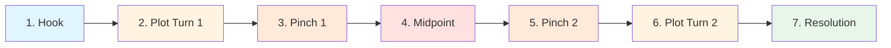

# 7️⃣ The Seven-Point Story Structure

> *A flexible framework perfect for plot-driven narratives*

---

## 📖 **Overview**

The **Seven-Point Story Structure** is a plotting method developed by author **Dan Wells**, based on his analysis of successful stories and adapted from various narrative theories. This structure focuses on **character change** and **plot momentum**, making it perfect for writers who want a clear roadmap without rigid constraints.

### **Why It Works:**
- 🎯 Focuses on character transformation
- 📊 Creates clear turning points
- ⚡ Maintains narrative momentum
- 🎨 Flexible and adaptable
- ✍️ Easy to understand and apply
- 🔄 Works for all genres

### **Best For:**
- Plot-driven stories
- Genre fiction (thriller, mystery, fantasy, sci-fi)
- Character-driven narratives
- Stories with clear arcs
- Writers who outline before writing
- Diagnosing pacing problems

---

## 📊 **The Structure at a Glance**



### **The Seven Points:**

| Point | Name | Purpose | Character State |
|-------|------|---------|----------------|
| **1** | Hook | Introduce protagonist in their "before" state | Weakness/flaw present |
| **2** | Plot Turn 1 | Force protagonist into the story | Reluctantly entering |
| **3** | Pinch 1 | Apply pressure, introduce antagonistic force | Struggling, reactive |
| **4** | Midpoint | Protagonist shifts from reaction to action | Gaining agency |
| **5** | Pinch 2 | Apply maximum pressure | Desperate, lowest point |
| **6** | Plot Turn 2 | Protagonist gains final piece to solve problem | Armed with solution |
| **7** | Resolution | Protagonist solves problem, shows change | Transformed |

---

## 🎣 **Point 1: THE HOOK**

### **What It Is:**
The **opening** of your story that establishes the protagonist in their "**before**" state — flawed, lacking, or in need of growth.

### **Purpose:**
- Introduce protagonist
- Show their current state
- Establish their weakness, need, or flaw
- Set up character arc
- Create reader interest
- Establish tone and genre

### **Key Question:**
*What does your protagonist need to learn or overcome?*

### **What to Show:**

#### **Character's Flaw or Weakness:**
The limitation that will be challenged throughout the story
- Moral flaw
- Emotional weakness
- False belief
- Skill deficit
- Relationship problem

#### **The World:**
Setting and context
- Physical environment
- Social situation
- Rules and norms
- Conflicts and tensions

#### **Status Quo:**
Normal life before adventure
- Daily routine
- Relationships
- Comfort zone
- What they stand to lose

### **Character States:**

**Common "Before" States:**
- 😔 **Victim:** Passive, powerless
- 😤 **Cynic:** Bitter, closed-off
- 🤔 **Naive:** Innocent, ignorant
- 😌 **Complacent:** Comfortable, unmotivated
- 😰 **Fearful:** Paralyzed by fear
- 😡 **Angry:** Driven by rage or revenge

### **Examples:**

**Harry Potter (Philosopher's Stone):**
- **Hook:** Harry lives in cupboard, abused by Dursleys, unaware of his identity
- **Flaw:** Doesn't know his worth, lacks confidence
- **Before State:** Victim, powerless

**The Hunger Games:**
- **Hook:** Katniss hunts illegally to feed family in oppressive District 12
- **Flaw:** Distrusts everyone, emotionally closed-off
- **Before State:** Survivor, but isolated

**Star Wars:**
- **Hook:** Luke is bored farm boy on Tatooine, dreaming of adventure
- **Flaw:** Impatient, impulsive, lacks discipline
- **Before State:** Naive dreamer

**Pride and Prejudice:**
- **Hook:** Elizabeth Bennet is witty but judgmental, too quick to form opinions
- **Flaw:** Pride in her judgment, prejudice against Darcy
- **Before State:** Self-assured but closed-minded

### **Techniques:**

**Show, Don't Tell:**
Demonstrate the flaw through:
- Actions and choices
- Dialogue and thoughts
- Relationships
- Reactions to events

**Create Sympathy:**
Make readers care about protagonist despite (or because of) their flaws

**Plant Seeds:**
Hint at the person they could become

**Hook Readers:**
Create compelling opening that makes readers want to continue

### **Duration:**
- **Short Story:** First page or two
- **Novel:** First chapter
- **Film:** First 10 minutes

---

## 🌪️ **Point 2: PLOT TURN 1**

### **What It Is:**
The event that **forces the protagonist into the story** and disrupts their status quo. This is the call to adventure they cannot refuse.

### **Purpose:**
- Launch the main plot
- Disrupt status quo
- Force protagonist into action
- Establish external goal
- Set story in motion

### **Key Question:**
*What forces your protagonist to leave their comfort zone?*

### **Characteristics:**

#### **External Event:**
Something happens TO the protagonist
- Outside their control
- Cannot be ignored
- Creates urgency
- Raises stakes

#### **Point of No Return:**
Once this happens, protagonist cannot go back to old life
- Irreversible
- Life-changing
- Forces commitment

### **Types of Plot Turn 1:**

**Direct Threat:**
- Attack on protagonist or loved ones
- Life in danger
- Home destroyed

**Opportunity:**
- Job offer, invitation
- Discovery
- Meeting someone

**Loss:**
- Death of loved one
- Losing job/home
- Relationship ends

**Obligation:**
- Called to duty
- Responsibility thrust upon them
- Must help someone

**Discovery:**
- Learning truth
- Finding something
- Revelation changes everything

### **Examples:**

**Harry Potter:**
- **Plot Turn 1:** Receives Hogwarts letter (repeatedly), Hagrid arrives
- **Result:** Can no longer live in ignorance; magical world demands his presence

**The Hunger Games:**
- **Plot Turn 1:** Prim's name called in reaping, Katniss volunteers
- **Result:** Forced into arena, life on the line

**Star Wars:**
- **Plot Turn 1:** Luke finds aunt and uncle murdered, home destroyed
- **Result:** Nothing to return to, must leave Tatooine

**The Matrix:**
- **Plot Turn 1:** Neo takes the red pill
- **Result:** Leaves Matrix, learns truth, cannot return to old life

**Pride and Prejudice:**
- **Plot Turn 1:** Elizabeth meets Darcy at Meryton ball
- **Result:** Relationship journey begins (though she doesn't know it yet)

### **Position:**
Approximately **25% into the story** (same as First Plot Point in Three-Act Structure)

### **What Changes:**

**Before Plot Turn 1:**
- Ordinary world
- Status quo
- Protagonist in comfort zone
- Reactive to minor issues

**After Plot Turn 1:**
- Special world
- New situation
- Protagonist out of comfort zone
- Forced to act on major problem

### **Common Mistakes:**
- ❌ Too subtle (readers miss it)
- ❌ Too late (story drags)
- ❌ Protagonist makes it happen (should be external)
- ❌ Easy to refuse or ignore
- ❌ No clear stakes

### **Techniques:**

**Make It Personal:**
Not just any problem, but one protagonist must face

**Raise Stakes:**
Show what will happen if protagonist doesn't act

**Create Urgency:**
Time pressure or immediate danger

**Destroy Safety Net:**
Remove option to return to old life

---

## 👊 **Point 3: PINCH 1**

### **What It Is:**
The first **major application of pressure** where the **antagonistic force** is revealed or reinforced, reminding readers (and the protagonist) what's at stake.

### **Purpose:**
- Introduce or emphasize antagonistic force
- Apply pressure to protagonist
- Raise stakes
- Show what protagonist is up against
- Create urgency
- Demonstrate villain's power

### **Key Question:**
*What is the antagonistic force, and how does it threaten the protagonist?*

### **The Antagonistic Force:**

Can be:
- 🦹 **Villain:** Antagonist character
- 🌪️ **Force of Nature:** Natural disaster
- 👥 **System:** Society, government, institution
- 🧠 **Internal:** Protagonist's own flaws
- ⏰ **Circumstance:** Situation, bad luck

### **What Happens:**

#### **Show Antagonist's Power:**
Demonstrate that this is a serious threat
- Antagonist succeeds at something
- Shows skills, resources, ruthlessness
- Defeats minor characters
- Displays strength

#### **Apply Pressure:**
Make things harder for protagonist
- New obstacle appears
- Situation worsens
- Timeline shortens
- Stakes increase

#### **Protagonist Struggles:**
Hero is still in reactive mode
- Doesn't yet have solution
- Making mistakes
- Learning the hard way
- Out of depth

### **Examples:**

**Harry Potter (Philosopher's Stone):**
- **Pinch 1:** Troll in the dungeon (Halloween)
- **Shows:** Real danger at Hogwarts, trio bonds through crisis
- **Pressure:** Harry realizes this isn't just school; there are real threats

**The Hunger Games:**
- **Pinch 1:** Tracker jackers attack, Rue's alliance warning
- **Shows:** How deadly the arena is, other tributes are threats
- **Pressure:** Katniss nearly dies, realizes she can't survive alone

**Star Wars:**
- **Pinch 1:** Obi-Wan death, Death Star's power demonstrated
- **Shows:** Empire's strength, Vader's power, stakes are galactic
- **Pressure:** Luke loses mentor, Death Star can destroy planets

**The Matrix:**
- **Pinch 1:** Training programs, learning Matrix rules, Agents demonstrated
- **Shows:** How powerful Agents are, difficulty of fighting system
- **Pressure:** Neo realizes how outmatched he is

### **Position:**
Approximately **37.5% into the story** (3/8ths mark, midway through Act Two Part A)

### **Function:**

**Remind Readers:**
- What the stakes are
- Who/what the antagonist is
- Why this matters
- What could go wrong

**Escalate Tension:**
- Make situation worse
- Add new complications
- Increase urgency

**Keep Protagonist Reactive:**
- Still learning
- Still struggling
- Haven't found solution yet
- Building toward midpoint shift

### **Common Mistakes:**
- ❌ Pinch too weak (doesn't create real pressure)
- ❌ Antagonist not involved or present
- ❌ Protagonist easily overcomes it
- ❌ No lasting consequences
- ❌ Doesn't escalate tension

### **Techniques:**

**Make It Visceral:**
Show the threat concretely, not abstractly

**Personal Consequences:**
Affect protagonist or people they care about

**Demonstrate Antagonist:**
Let villain/threat show their strength

**Raise Body Count:**
Minor characters can die to show stakes

---

## 🔄 **Point 4: THE MIDPOINT**

### **What It Is:**
The **critical turning point** where the protagonist **shifts from reaction to action**. They gain new information, power, or perspective that changes their approach.

### **Purpose:**
- Transform protagonist from reactive to proactive
- Provide revelation or power-up
- Shift story momentum
- Raise stakes
- Change protagonist's approach

### **Key Question:**
*What changes the protagonist from reacting to problems to actively pursuing solutions?*

### **The Shift:**

### **Before Midpoint:**
- 😰 **Reactive:** Responding to events
- 🤷 **Passive:** Things happen TO them
- 🧭 **Lost:** Searching for answers
- 😔 **Victim Mentality:** Struggling to survive

### **After Midpoint:**
- 💪 **Proactive:** Initiating action
- 🎯 **Active:** Making things happen
- 🗺️ **Directed:** Has a plan
- 🦸 **Hero Mentality:** Fighting to win

### **What Happens:**

#### **Revelation:**
New information that changes everything
- Discovery of truth
- Learning antagonist's plan
- Understanding the real problem
- Piece of puzzle falls into place

#### **Power-Up:**
Protagonist gains new ability or resource
- Learns new skill
- Gets weapon or tool
- Forms key alliance
- Discovers inner strength

#### **Decision:**
Protagonist makes active choice to engage
- Commits fully
- Takes control
- Formulates plan
- Shifts from defense to offense

### **Types of Midpoints:**

**False Victory:**
- Protagonist thinks they've won
- But problem is bigger than they thought
- Or, "victory" makes things worse

**False Defeat:**
- Protagonist seems to have lost
- But gains crucial information
- Or, loss forces new perspective

**Revelation:**
- Truth revealed
- Changes understanding of situation
- Reframes the conflict

**Commitment:**
- Protagonist fully commits
- No more hesitation
- Takes responsibility

### **Examples:**

**Harry Potter (Philosopher's Stone):**
- **Midpoint:** Harry realizes someone is trying to steal the Stone; shifts from passive student to active investigator
- **Shift:** From wondering about mysteries to actively investigating
- **Action:** Begins planning to protect/retrieve the Stone

**The Hunger Games:**
- **Midpoint:** Rule change allows two winners; Katniss seeks Peeta
- **Shift:** From lone survivor to active partner/strategist
- **Action:** Changes from avoiding to seeking alliance

**Star Wars:**
- **Midpoint:** Rescue Leia, escape Death Star (seemingly succeed)
- **Shift:** From "I'm just here by accident" to "I'm joining the Rebellion"
- **Action:** Luke commits to attacking Death Star

**The Matrix:**
- **Midpoint:** Sees the Oracle, told he's not the One (false defeat)
- **Shift:** From seeking validation to accepting responsibility
- **Action:** Chooses to save Morpheus anyway

**Pride and Prejudice:**
- **Midpoint:** Darcy's first proposal and Elizabeth's rejection
- **Shift:** Both characters forced to examine themselves
- **Action:** Begin processes of change and understanding

### **Position:**
Exactly **50% into the story** (dead center)

### **Why It Matters:**

**Structural:**
- Prevents "sagging middle"
- Refreshes story momentum
- Gives readers new hook

**Character:**
- Shows growth
- Demonstrates agency
- Proves they're learning

**Plot:**
- Raises stakes
- Changes direction
- Accelerates toward climax

### **Common Mistakes:**
- ❌ No clear midpoint (story sags)
- ❌ Midpoint doesn't change protagonist's approach
- ❌ Too subtle (readers miss the shift)
- ❌ Protagonist still reactive after midpoint
- ❌ Doesn't raise stakes

### **Techniques:**

**Make It Obvious:**
Clear, definable moment

**Show the Shift:**
Demonstrate change in protagonist's behavior

**Raise Stakes:**
Make problem bigger or more urgent

**Connect to Theme:**
Midpoint often relates to story's central question

---

## 👊 **Point 5: PINCH 2**

### **What It Is:**
The **second major application of pressure**, even stronger than the first. The antagonistic force strikes back, and things look worst for the protagonist.

### **Purpose:**
- Apply maximum pressure
- Show antagonist's full power
- Create "all is lost" moment
- Strip away protagonist's resources or hope
- Force protagonist to dig deep
- Set up final confrontation

### **Key Question:**
*What is the worst that could happen to the protagonist at this point?*

### **Characteristics:**

#### **Worse Than Pinch 1:**
- More intense
- More personal
- Higher stakes
- Bigger losses

#### **Apparent Defeat:**
- Protagonist seems to have lost
- Victory looks impossible
- All hope seems gone
- Darkest moment

#### **Forces Growth:**
- Protagonist must change to survive
- Old methods won't work
- Transformation necessary
- Must become the person they need to be

### **What Happens:**

**Loss:**
- Mentor dies or leaves
- Key ally betrays or is lost
- Important resource destroyed
- Hope eliminated

**Antagonist's Power:**
- Villain's plan succeeds
- Shows full strength
- Defeats protagonist directly
- Seems invincible

**Personal Low:**
- Protagonist's flaw exposed
- Fears realized
- Worst fear comes true
- Identity questioned

### **Examples:**

**Harry Potter (Philosopher's Stone):**
- **Pinch 2:** Realizes Quirrell (not Snape) is the enemy; confronts him alone, seemingly too late
- **Pressure:** Harry faces Voldemort without help, appears outmatched
- **Loss:** No backup, must face fear alone

**The Hunger Games:**
- **Pinch 2:** Rue dies; rule change reversed (only one winner again)
- **Pressure:** Loses ally, forced to potentially kill Peeta
- **Loss:** Hope for dual victory, forced to face her relationship

**Star Wars:**
- **Pinch 2:** Death Star approaching Rebel base, time running out
- **Pressure:** Only minutes left, pilots dying, Luke's turn coming
- **Loss:** Obi-Wan gone, pilots failing, hope fading

**The Matrix:**
- **Pinch 2:** Morpheus captured, torture, must choose to save or run
- **Pressure:** Choice between mission and friend
- **Loss:** Leader captured, crew in danger

**Pride and Prejudice:**
- **Pinch 2:** Lydia elopes with Wickham, family ruined
- **Pressure:** Elizabeth's family disgraced, marriage to Darcy impossible
- **Loss:** Hope for relationship, family reputation

### **Position:**
Approximately **62.5% into the story** (5/8ths mark, midway through Act Two Part B)

### **The "All Is Lost" Moment:**

Often called the **"Dark Night of the Soul"**:
- Protagonist at lowest point
- Everything seems hopeless
- Wants to give up
- Questions everything
- Processes loss

**But:**
This moment forces the transformation needed for victory

### **Difference from Pinch 1:**

| Aspect | Pinch 1 | Pinch 2 |
|--------|---------|---------|
| **Intensity** | Moderate | Maximum |
| **Protagonist** | Still learning | Must become new self |
| **Stakes** | Rising | Peak |
| **Hope** | Challenged | Seemingly lost |
| **Position** | Before midpoint | After midpoint |
| **Purpose** | Apply pressure | Force transformation |

### **Common Mistakes:**
- ❌ Not intense enough
- ❌ Same as Pinch 1 (not escalated)
- ❌ Protagonist overcomes too easily
- ❌ No real loss or consequence
- ❌ Doesn't force change

### **Techniques:**

**Make It Personal:**
Attack what protagonist cares about most

**Maximum Stakes:**
Everything on the line

**Show Vulnerability:**
Protagonist at most human, broken

**Force Choice:**
Impossible decision that reveals character

**Strip Resources:**
Take away safety nets and advantages

---

## 💡 **Point 6: PLOT TURN 2**

### **What It Is:**
The protagonist **gains the final piece of information, power, or understanding** needed to solve the problem and defeat the antagonistic force.

### **Purpose:**
- Provide solution or key to victory
- Show complete transformation
- Set up final confrontation
- Demonstrate character growth
- Create path to resolution

### **Key Question:**
*What does the protagonist realize, learn, or gain that makes victory possible?*

### **The Missing Piece:**

Can be:
- 💡 **Knowledge:** Truth, secret, understanding
- 🗡️ **Tool/Weapon:** Physical means to fight
- 💪 **Inner Strength:** Confidence, courage, transformation
- 🤝 **Ally:** Help arrives
- 🧩 **Plan:** Strategy to defeat antagonist
- 🦋 **Transformation:** Becoming who they need to be

### **What Happens:**

#### **Realization:**
Protagonist understands what they must do
- Sees solution
- Connects dots
- Overcomes internal block
- Accepts truth

#### **Transformation:**
Shows they've become the "after" version
- Overcome flaw from Hook
- Demonstrate growth
- Opposite of starting state
- Ready to face antagonist

#### **Commitment:**
Makes final decision to act
- No more hesitation
- Fully committed
- Willing to sacrifice
- Ready for final battle

### **Character States:**

**From Hook → To Plot Turn 2:**

| Hook (Before) | Plot Turn 2 (After) |
|--------------|-------------------|
| Victim | Hero |
| Cynic | Believer |
| Naive | Wise |
| Complacent | Driven |
| Fearful | Courageous |
| Angry | At Peace |
| Selfish | Selfless |
| Powerless | Empowered |

### **Examples:**

**Harry Potter (Philosopher's Stone):**
- **Plot Turn 2:** Harry realizes the power of his mother's love protection
- **Transformation:** From powerless child to person with unique strength
- **Tool:** Understanding that love is power Voldemort doesn't have

**The Hunger Games:**
- **Plot Turn 2:** Katniss realizes she can use berries to defy the Capitol
- **Transformation:** From survivor to rebel symbol
- **Tool:** Strategy that refuses to play by their rules

**Star Wars:**
- **Plot Turn 2:** Obi-Wan's voice tells Luke to trust the Force, turn off computer
- **Transformation:** From impatient boy to trusting Jedi
- **Tool:** Faith in the Force over technology

**The Matrix:**
- **Plot Turn 2:** Neo sees the code, realizes he is the One, Trinity's love
- **Transformation:** From doubter to believer
- **Tool:** Complete acceptance of his nature

**Pride and Prejudice:**
- **Plot Turn 2:** Elizabeth learns Darcy saved Lydia, paid Wickham
- **Transformation:** From prejudiced to understanding
- **Tool:** Knowledge of Darcy's true character

### **Position:**
Approximately **75% into the story** (same as Second Plot Point in Three-Act Structure)

### **Types:**

**External Solution:**
- Get weapon, tool, information
- Ally arrives with help
- Discover antagonist's weakness

**Internal Solution:**
- Overcome fear
- Accept identity
- Embrace transformation
- Let go of limiting belief

**Combination:**
- External tool + internal change
- Most powerful type

### **Connection to Theme:**

Plot Turn 2 often embodies the story's theme:
- What the story was really about
- The lesson protagonist needed to learn
- The truth that sets them free

### **Common Mistakes:**
- ❌ Solution comes from external source (not earned)
- ❌ Deus ex machina (divine intervention)
- ❌ No connection to character growth
- ❌ Too easy or convenient
- ❌ Doesn't require transformation

### **Techniques:**

**Earn It:**
Solution should be result of journey

**Connect to Flaw:**
Overcoming Hook's weakness enables solution

**Synthesize Lessons:**
Use everything learned throughout story

**Make It Active:**
Protagonist discovers/realizes, not told

**Show Growth:**
Clear contrast with beginning state

---

## ✨ **Point 7: THE RESOLUTION**

### **What It Is:**
The **final confrontation** where the protagonist, armed with their new knowledge/power/transformation, defeats the antagonistic force and resolves the story.

### **Purpose:**
- Resolve main conflict
- Demonstrate complete transformation
- Defeat antagonist
- Prove character growth
- Satisfy reader expectations
- Show "after" state

### **Key Question:**
*How does the transformed protagonist solve the problem their old self couldn't?*

### **What Happens:**

#### **Final Confrontation:**
Protagonist faces antagonistic force
- Uses skills learned
- Applies new knowledge
- Demonstrates transformation
- Shows they're now the opposite of Hook state

#### **Victory Through Change:**
Success comes specifically because protagonist changed
- Old self would have failed
- New self succeeds
- Growth was necessary
- Transformation was earned

#### **Resolve Conflict:**
Main story question answered
- External goal achieved (or meaningfully failed)
- Antagonist defeated
- Problem solved
- Stakes resolved

#### **Show New Normal:**
Demonstrate lasting change
- New equilibrium
- Changed world
- Transformed relationships
- "After" state clear

### **Structure of Resolution:**

**Climax:**
- Peak action
- Direct confrontation
- Highest tension
- Decisive moment

**Falling Action:**
- Immediate consequences
- Villain's fate
- Other conflicts resolved

**Denouement:**
- New normal established
- Show protagonist in new state
- Final image or statement
- Emotional satisfaction

### **Examples:**

**Harry Potter (Philosopher's Stone):**
- **Resolution:** Harry's touch destroys Quirrell (love defeats hate); Stone destroyed; hospital wing celebration
- **Transformation Shown:** From believing he's nobody to knowing he's special, protected by love
- **New Normal:** Returns to Dursleys but knowing he's a wizard, will return to Hogwarts

**The Hunger Games:**
- **Resolution:** Katniss and Peeta eat berries, Capitol forced to allow two winners; return home as victors
- **Transformation Shown:** From isolated survivor to person who can trust and love
- **New Normal:** Victor, but now symbol of rebellion

**Star Wars:**
- **Resolution:** Luke trusts Force, destroys Death Star; medal ceremony
- **Transformation Shown:** From impatient farm boy to disciplined Jedi-in-training
- **New Normal:** Member of Rebellion, on path to becoming Jedi

**The Matrix:**
- **Resolution:** Neo defeats Smith, resurrects, controls Matrix; escapes
- **Transformation Shown:** From doubter to the One
- **New Normal:** Ready to free humanity

**Pride and Prejudice:**
- **Resolution:** Darcy proposes again, Elizabeth accepts; marriages and happiness
- **Transformation Shown:** Both overcame pride and prejudice
- **New Normal:** United in understanding and love

### **Position:**
Final **25% of the story** (though climax often closer to 85-90%)

### **Victory Must Be Earned:**

**Wrong:** 
- Luck saves protagonist
- Outside force solves problem
- Deus ex machina
- Villain defeats self

**Right:**
- Protagonist's transformation enables victory
- Skills learned throughout story applied
- Choice protagonist makes
- Growth was necessary

### **The Mirror:**

Resolution should mirror and contrast Hook:

| Hook | Resolution |
|------|-----------|
| Weak | Strong |
| Alone | Connected |
| Ignorant | Wise |
| Powerless | Empowered |
| Fearful | Courageous |
| Lost | Found |

### **Emotional Satisfaction:**

**For Reader:**
- Catharsis
- Sense of completion
- Emotional payoff
- Thematic resonance

**For Character:**
- Earned victory
- Visible growth
- New identity
- Changed world

### **Types of Resolution:**

**Total Victory:**
- Protagonist succeeds completely
- Antagonist defeated
- Happy ending

**Bittersweet Victory:**
- Success but at cost
- Victory with losses
- Achieved goal but changed by journey

**Pyrrhic Victory:**
- Won but cost too high
- Victory feels hollow
- Questions remain

**Tragic Defeat:**
- Protagonist fails
- But failure is meaningful
- Theme explored through failure

### **Common Mistakes:**
- ❌ Victory not earned through growth
- ❌ Deus ex machina rescue
- ❌ Antagonist suddenly weak
- ❌ No clear final confrontation
- ❌ Doesn't show transformation
- ❌ Too long after climax
- ❌ Introducing new problems

### **Techniques:**

**Show Transformation:**
Make character growth obvious

**Use Callbacks:**
Reference Hook to show contrast

**Satisfy Theme:**
Resolution embodies story's meaning

**Emotional Resonance:**
End on strong emotional note

**Clear Image:**
Final scene that captures new state

---

## 🔄 **Putting It All Together**

### **The Character Arc:**

The Seven-Point Structure is fundamentally about **character transformation**:

```
HOOK → PLOT TURN 1 → PINCH 1 → MIDPOINT → PINCH 2 → PLOT TURN 2 → RESOLUTION
 ↓         ↓            ↓           ↓           ↓            ↓            ↓
Weak → Forced Out → Tested → Active → Broken → Armed → Transformed
```

### **The Plot Arc:**

```
HOOK → PLOT TURN 1 → PINCH 1 → MIDPOINT → PINCH 2 → PLOT TURN 2 → RESOLUTION
 ↓         ↓            ↓           ↓           ↓            ↓            ↓
Setup → Disruption → Pressure → Shift → Crisis → Solution → Victory
```

---

## 📊 **Seven-Point vs. Other Structures**

### **Seven-Point vs. Three-Act:**

| Seven-Point | Percentage | Three-Act Equivalent |
|-------------|------------|---------------------|
| Hook | 0-25% | Act 1 - Opening & Setup |
| Plot Turn 1 | 25% | First Plot Point |
| Pinch 1 | 37.5% | Act 2A - Complications |
| Midpoint | 50% | Midpoint |
| Pinch 2 | 62.5% | Act 2B - All Is Lost |
| Plot Turn 2 | 75% | Second Plot Point |
| Resolution | 75-100% | Act 3 - Climax & Resolution |

### **Seven-Point vs. Hero's Journey:**

| Seven-Point | Hero's Journey |
|-------------|---------------|
| Hook | Ordinary World |
| Plot Turn 1 | Crossing Threshold |
| Pinch 1 | Tests, Allies, Enemies |
| Midpoint | Ordeal |
| Pinch 2 | Road Back |
| Plot Turn 2 | Resurrection (gaining solution) |
| Resolution | Return with Elixir |

---

## ✅ **How to Use the Seven-Point Structure**

### **Planning Your Story:**

**1. Start with Resolution:**
- Where will your protagonist end up?
- What will they become?
- How will they be different?

**2. Define the Hook:**
- What's the opposite of Resolution?
- What weakness/flaw do they start with?
- Where are they "before"?

**3. Identify Midpoint:**
- What shifts them from reactive to active?
- What revelation or power-up?
- How do they change approach?

**4. Determine Plot Turns:**
- **Plot Turn 1:** What forces them into story?
- **Plot Turn 2:** What gives them solution?

**5. Create Pinches:**
- **Pinch 1:** How does antagonist apply pressure?
- **Pinch 2:** What's the "all is lost" moment?

**6. Fill in Between:**
- Scenes that connect the points
- Character development moments
- Subplots and relationships

### **For Pantsers (Discovery Writers):**

Use Seven-Point Structure in **revision**:

1. Identify where these points naturally occurred
2. Strengthen weak points
3. Ensure character transformation is clear
4. Verify protagonist shifts at midpoint
5. Check that Resolution mirrors Hook

### **For Plotters (Outliners):**

1. Fill out Seven Points first
2. Expand each point into scenes
3. Add connecting tissue
4. Ensure smooth transitions
5. Maintain momentum between points

---

## 🎯 **Common Mistakes**

<details>
<summary><b>❌ Pitfalls to Avoid</b></summary>

### **Weak Hook:**
- **Problem:** Starting character already heroic
- **Fix:** Show genuine flaw or weakness that needs growth

### **External Plot Turn 1:**
- **Problem:** Protagonist chooses adventure
- **Fix:** Something must FORCE them into it

### **Protagonist Still Reactive After Midpoint:**
- **Problem:** Continues just reacting to events
- **Fix:** Midpoint must shift them to driving action

### **Weak Pinches:**
- **Problem:** Not enough pressure, stakes not raised
- **Fix:** Make antagonist powerful, create real danger

### **Unearned Resolution:**
- **Problem:** Victory through luck or deus ex machina
- **Fix:** Victory must come through character transformation

### **No Clear Transformation:**
- **Problem:** Character same at end as beginning
- **Fix:** Hook and Resolution must show opposite states

### **Missing or Unclear Points:**
- **Problem:** Can't identify where points occur
- **Fix:** Make each point clear and definable

</details>

---

## 📚 **Examples Analyzed**

### **Harry Potter and the Philosopher's Stone:**

1. **Hook:** Harry in cupboard, abused, unaware of identity
2. **Plot Turn 1:** Hagrid arrives, letters won't stop coming
3. **Pinch 1:** Troll attack on Halloween
4. **Midpoint:** Realizes someone after Stone, becomes investigator
5. **Pinch 2:** Confronts Quirrell alone, face to face with Voldemort
6. **Plot Turn 2:** Realizes mother's love protects him
7. **Resolution:** Touch destroys Quirrell, knows he's special and loved

### **The Hunger Games:**

1. **Hook:** Katniss isolated, distrustful, survival mode
2. **Plot Turn 1:** Prim's name called, Katniss volunteers
3. **Pinch 1:** Tracker jackers, nearly dies
4. **Midpoint:** Two-winner rule, seeks Peeta alliance
5. **Pinch 2:** Rue dies, rule reversed
6. **Plot Turn 2:** Realizes can use berries to defy Capitol
7. **Resolution:** Both win, but now symbol of rebellion

---

## 💡 **Advanced Applications**

### **Multiple Character Arcs:**
Each major character can have their own Seven Points

### **Series:**
- Each book has Seven Points
- Overall series has Seven Points

### **Subplots:**
Can structure subplots using Seven Points

### **Non-Linear:**
Seven Points work even if story told out of order

---

## 🔗 **Related Resources**

- 📋 **[Three-Act Structure](three-act-structure.md)** — Complementary framework
- 🗺️ **[Hero's Journey](heros-journey.md)** — Character transformation focus
- 📊 **[Character Arcs](../../character-development/character-arcs.md)** — Internal transformation
- ✍️ **[Plot Development](../../plot-development/)** — Crafting your plot
- 📖 **[Story Analysis](../../../examples/story-analysis/)** — Seven Points in practice

### **Recommended Resources:**
- Dan Wells' Seven-Point Structure Lectures (YouTube)
- *Structuring Your Novel* — K.M. Weiland
- Any story — analyze using Seven Points

---

<div align="center">

### **Seven Points, Infinite Stories 7️⃣**

*A flexible framework that keeps your protagonist transforming and your plot moving.*

**[⬅️ Back to Story Structure](README.md)** | **[📚 Fundamentals](../../README.md)**

</div>
