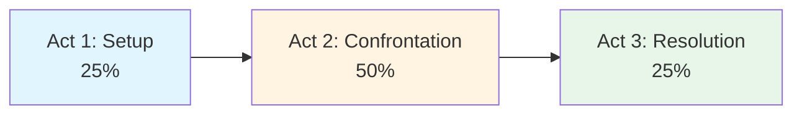

# 🎭 The Three-Act Structure

> *The timeless foundation of compelling storytelling*

---

## 📖 **Overview**

The **Three-Act Structure** is the most fundamental story framework in Western storytelling. Dating back to ancient Greek drama and codified by Aristotle, it divides stories into three distinct parts: **Setup, Confrontation, and Resolution**.

### **Why It Works:**
- ✨ Mirrors natural story flow
- 🎯 Provides clear dramatic progression
- 📊 Creates satisfying pacing
- 🌍 Universal across cultures and genres
- ⚡ Easy to understand and apply

---

## 📊 **The Structure at a Glance**

### **Basic Division:**

| Act | Percentage | Purpose | Key Events |
|-----|------------|---------|------------|
| **Act 1** | 25% | Establish normal world, introduce conflict | Inciting Incident, First Plot Point |
| **Act 2** | 50% | Protagonist struggles with obstacle | Midpoint, Rising Action, Second Plot Point |
| **Act 3** | 25% | Climax and resolution | Climax, Denouement |

---

## 🎬 **ACT ONE: SETUP** (First 25%)

### **Purpose:**
Establish the **who, what, where, when** of your story. Introduce the protagonist's ordinary world and the conflict that will drive the narrative.

---

### **Key Components:**

#### **1. Opening / Hook** (0-5%)
*Grab reader attention immediately*

**What to Include:**
- Compelling opening line
- Establish tone and genre
- Introduce protagonist (or hint at them)
- Create intrigue or atmosphere

**Examples:**
> "It was a bright cold day in April, and the clocks were striking thirteen."  
> — *1984*, George Orwell

> "Mr. and Mrs. Dursley, of number four, Privet Drive, were proud to say that they were perfectly normal, thank you very much."  
> — *Harry Potter*, J.K. Rowling

**Techniques:**
- Start with action
- Begin with intriguing statement
- Drop reader into interesting moment
- Establish voice immediately

---

#### **2. Ordinary World** (5-10%)
*Show protagonist's normal life before adventure begins*

**What to Show:**
- Daily routine and environment
- Key relationships
- Skills and weaknesses
- Internal desires/dissatisfaction
- What they have to lose

**Purpose:**
- Establish baseline for change
- Make readers care about protagonist
- Show what's at stake
- Contrast with coming adventure

**Example:**
In *The Hunger Games*, we see Katniss's harsh but familiar life in District 12 — hunting with Gale, caring for her sister Prim, navigating her broken family dynamics. This "ordinary world" (though dystopian) establishes who she is before everything changes.

---

#### **3. Inciting Incident** (10-12%)
*The event that disrupts the ordinary world*

**Characteristics:**
- External event beyond protagonist's control
- Creates immediate problem or opportunity
- Sets main story in motion
- Cannot be ignored or undone

**Examples:**
- **Harry Potter:** Receiving Hogwarts letter
- **The Hunger Games:** Prim's name called in reaping
- **Pride and Prejudice:** Mr. Bingley arrives in neighborhood
- **The Hobbit:** Gandalf arrives with dwarves

**Note:** This is NOT the same as the First Plot Point (though some stories combine them).

---

#### **4. Debate / Reluctance** (12-20%)
*Protagonist resists or questions the call to adventure*

**What Happens:**
- Protagonist considers options
- Weighs risks and benefits
- Shows fear or doubt
- External pressure builds
- Stakes clarify

**Purpose:**
- Makes protagonist relatable
- Builds tension
- Raises stakes
- Shows they're choosing actively (not passive)

**Example:**
After learning he's a wizard, Harry is torn between his miserable life with the Dursleys and fear of this unknown magical world. This debate is brief but present.

---

#### **5. First Plot Point / Act Break** (25%)
*Protagonist commits to the journey — crosses threshold into Act Two*

**Characteristics:**
- Clear, definable moment
- Protagonist makes active choice
- Point of no return
- Enters "new world" (literally or metaphorically)
- Can't go back to ordinary life

**Structure Position:** Exactly at 25% mark (approximately)

**Examples:**
- **Star Wars:** Luke finds his aunt and uncle killed, commits to training
- **The Matrix:** Neo takes red pill
- **Hunger Games:** Katniss volunteers for Prim
- **Pride and Prejudice:** Elizabeth meets Darcy at ball (begins relationship journey)

**After This Point:** Story is in motion, protagonist is committed.

---

## 🔥 **ACT TWO: CONFRONTATION** (Middle 50%)

### **Purpose:**
The protagonist **struggles, learns, fails, and grows** while pursuing their goal. This is where most of your story lives.

### **Challenge:**
Act Two is hardest to write because it's longest and must maintain momentum without resolution.

---

### **Key Components:**

#### **1. New World / Learning Phase** (25-37%)
*Protagonist enters unfamiliar territory and learns the ropes*

**What Happens:**
- Explore new setting/situation
- Meet new characters (allies, mentors, enemies)
- Face initial obstacles
- Experience small victories
- Make early mistakes
- "Fun and Games" — deliver premise promise

**Purpose:**
- World-building
- Character development
- Genre fulfillment
- Rising action begins

**Example:**
In *Harry Potter*, this is Harry's first experiences at Hogwarts — classes, making friends, learning about the wizarding world, discovering his fame, encountering mysteries.

**Techniques:**
- Show adaptation process
- Balance victories with setbacks
- Develop relationships
- Layer in subplots
- Maintain mystery/questions

---

#### **2. Midpoint** (50%)
*Everything changes — story pivots*

**Types of Midpoints:**

**False Victory:**
- Protagonist seems to have won
- Thinks goal is achieved
- But something's wrong...
- Stakes actually raised

**False Defeat:**
- Protagonist seems to have failed
- All appears lost
- But...new information emerges
- Or, protagonist finds determination

**Characteristics:**
- Occurs at exact center
- Raises stakes significantly
- Often involves revelation
- Shifts story direction
- Increases urgency

**Examples:**
- **Star Wars:** Death Star plans acquired (victory), but Empire tracks them (raises stakes)
- **Pride and Prejudice:** Darcy's first proposal (seems to end relationship, but actually transforms it)
- **Hunger Games:** Katniss and Peeta fake romance (strategy that changes game)

**After Midpoint:** Story accelerates, stakes higher, protagonist more committed.

---

#### **3. Rising Obstacles / Bad Guys Close In** (50-62%)
*Things get progressively harder*

**What Happens:**
- Obstacles increase in difficulty
- Antagonistic forces strengthen
- Internal doubts grow
- Relationships strain
- Subplots complicate
- Mistakes compound
- Time pressure intensifies

**Purpose:**
- Build to crisis
- Test protagonist
- Raise emotional stakes
- Prove growth is needed

**Techniques:**
- Escalate conflict types
- Layer multiple problems
- Remove safety nets
- Increase personal cost
- Tighten deadline

**Example:**
In *The Lord of the Rings: The Fellowship*, after the midpoint (Council of Elrond), the fellowship faces increasingly difficult obstacles: Moria and Gandalf's fall, Boromir's corruption, group fracturing — everything gets worse.

---

#### **4. All Is Lost / Crisis** (75%)
*The lowest point — protagonist faces apparent defeat*

**Characteristics:**
- Opposite of Midpoint
- Worst moment in story
- Often includes "death" (literal, symbolic, or metaphorical)
- Protagonist seems unable to continue
- External goal appears impossible
- Internal wound exposed

**The "Whiff of Death":**
Something dies:
- A person (mentor, friend)
- A relationship
- A dream
- Hope
- Protagonist's old self
- A belief

**Examples:**
- **Harry Potter 1:** Harry believes Snape will steal the Stone
- **Empire Strikes Back:** Han frozen, Luke defeated and mutilated
- **Hunger Games:** Rue dies
- **Pride and Prejudice:** Lydia elopes (family reputation "dies")

**Purpose:**
- Force protagonist to dig deeper
- Earn the transformation
- Make victory meaningful
- Maximum tension before climax

---

#### **5. Dark Night of the Soul** (75-80%)
*Protagonist processes the loss, wallows, reflects*

**What Happens:**
- Emotional reaction to "All Is Lost"
- Internal reflection
- Questions everything
- Considers giving up
- Faces fears/flaws
- Processes grief

**Duration:** Can be brief or extended depending on story

**Purpose:**
- Emotional realism
- Earn the breakthrough
- Show vulnerability
- Make triumph satisfying

**Example:**
After Rue's death in *The Hunger Games*, Katniss grieves, questions the system, and nearly breaks before finding resolve.

---

#### **6. Second Plot Point / Act Break** (80%)
*Protagonist finds solution, gains new knowledge, makes final commitment*

**Also Called:**
- Break into Three
- "Aha!" moment
- Catalyst to climax

**What Happens:**
- Revelation or realization
- Protagonist discovers solution
- New information emerges
- Makes final commitment
- Synthesizes lessons learned
- Formulates plan for climax

**Characteristics:**
- Active choice (not passive)
- Based on growth achieved
- Incorporates Act Two lessons
- Commits fully to final battle

**Examples:**
- **Harry Potter 1:** Harry realizes he must face Quirrell alone
- **Star Wars:** Luke decides to trust the Force
- **Pride and Prejudice:** Elizabeth receives Darcy's letter (understands truth)

**After This Point:** Racing toward climax with clear purpose.

---

## ⚔️ **ACT THREE: RESOLUTION** (Final 25%)

### **Purpose:**
**Climax, resolution, and denouement**. Protagonist faces final challenge using lessons learned, story questions answered, transformation complete.

---

### **Key Components:**

#### **1. Race to the Finish / Final Push** (80-90%)
*Protagonist executes plan with renewed commitment*

**What Happens:**
- Gathering forces/preparing
- Journey to final confrontation
- Building to climax
- Subplots resolving
- Tension maximizing
- Hope returning

**Pacing:** Fast, urgent, intense

**Techniques:**
- Short scenes
- Active movement
- Building momentum
- Ticking clock
- Clear goal in sight

---

#### **2. Climax** (85-95%)
*The final confrontation — protagonist vs. antagonistic force*

**Characteristics:**
- Highest tension point
- External goal addressed
- Internal growth tested
- Must succeed using transformation
- Victory earned through change
- Everything at stake

**Structure:**
- Protagonist applies lessons learned
- Uses new skills/knowledge
- Demonstrates growth
- Faces fear/flaw
- Achieves (or loses) external goal

**Types:**
- **Physical:** Battle, chase, competition
- **Mental:** Puzzle-solving, strategy
- **Emotional:** Confession, reconciliation, sacrifice
- **Social:** Confrontation, speech, revelation

**Examples:**
- **Harry Potter 1:** Harry faces Quirrell/Voldemort under the school
- **Pride and Prejudice:** Darcy's second proposal (emotional climax)
- **The Hunger Games:** Final confrontation with Cato, then berries
- **Star Wars:** Luke destroys Death Star

**Critical:** Climax must be **earned** through character growth. Protagonist wins because they changed, not through luck or external rescue.

---

#### **3. Resolution** (95-98%)
*Immediate aftermath of climax*

**What to Show:**
- Consequence of climax
- External plot resolution
- Secondary conflicts resolved
- Subplots tied up
- Questions answered
- Stakes paid off

**Keep it Brief:** Don't linger excessively after emotional high

---

#### **4. Denouement / New Ordinary World** (98-100%)
*Show the "new normal" after transformation*

**What to Include:**
- Protagonist in new state
- World changed
- Relationships evolved
- Contrast with opening
- Hint at future (if series)
- Emotional satisfaction

**Purpose:**
- Prove transformation
- Satisfy reader emotionally
- Mirror opening (show change)
- Provide closure

**Example:**
*Harry Potter* ends with Harry returning to Dursleys for summer, but now armed with knowledge of his identity and the magical world. We see he's forever changed.

---

## 📊 **Three-Act Structure in Different Lengths**

### **Short Story** (5,000 words)
- **Act 1:** 1,250 words (Setup)
- **Act 2:** 2,500 words (Confrontation)
- **Act 3:** 1,250 words (Resolution)

### **Novella** (30,000 words)
- **Act 1:** 7,500 words
- **Act 2:** 15,000 words
- **Act 3:** 7,500 words

### **Novel** (100,000 words)
- **Act 1:** 25,000 words
- **Act 2:** 50,000 words
- **Act 3:** 25,000 words

*These are flexible guidelines, not rigid rules.*

---

## ✅ **Using Three-Act Structure**

### **For Plotting (Planners):**
1. Identify your key plot points
2. Place them at appropriate percentages
3. Fill in scenes between plot points
4. Ensure progression and pacing

### **For Revision (Pantsers):**
1. Write discovery draft
2. Identify where plot points naturally fell
3. Restructure if necessary
4. Strengthen weak act structure

### **For Diagnosis:**
If story feels off:
- Check if acts are proportional
- Verify plot points exist and are strong
- Ensure midpoint shifts story
- Confirm climax is earned

---

## 🎯 **Common Mistakes**

<b>❌ Pitfalls to Avoid</b>

### **Act One Too Long:**
- **Problem:** Boring readers before story begins
- **Fix:** Start closer to inciting incident

### **Act Two Sag:**
- **Problem:** Middle drags, loses momentum
- **Fix:** Stronger midpoint, escalating obstacles, subplots

### **Weak Plot Points:**
- **Problem:** Structure beats not definitive
- **Fix:** Make plot points clear, active choices

### **Unearned Climax:**
- **Problem:** Victory through luck, not growth
- **Fix:** Ensure climax requires internal transformation

### **Too Long Denouement:**
- **Problem:** Story continues after emotional peak
- **Fix:** Wrap up quickly after climax

---

## 📚 **Examples in Action**

### **Classic Three-Act Films:**
- *Star Wars: A New Hope*
- *The Matrix*
- *Casablanca*

### **Novels:**
- *Harry Potter and the Philosopher's Stone*
- *The Hunger Games*
- *Pride and Prejudice*
- *To Kill a Mockingbird*

### **Analyze:** Pick any of these and identify the three acts and key plot points. You'll find them remarkably consistent.

---

## 🔗 **Related Resources**

- 📋 **[Three-Act Template](../../../templates/plot-outlines/three-act-structure-template.md)** — Blank template
- 📖 **[Story Structure Examples](../../../examples/plot-structures/)** — Analyzed stories
- 🎬 **[Save the Cat](save-the-cat.md)** — Detailed 15-beat version
- 🗺️ **[Hero's Journey](heros-journey.md)** — Alternative structure
- 📊 **[Plot Development](../../plot-development/)** — Plotting techniques

---

### **Master the Foundation, Then Break the Rules ✨**

*The three-act structure is a tool, not a prison. Learn it well, then adapt it to your unique story.*

**[⬅️ Back to Story Structure](README.md)** | **[📚 Fundamentals](../../README.md)**

