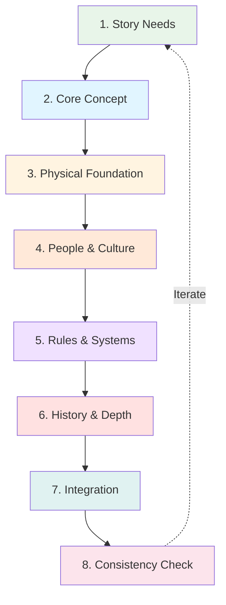

# 🌍 World-Building

> *Creating immersive, believable worlds that breathe life into your stories*

---

## 📖 **Welcome to World-Building**

World-building is the art and craft of creating settings that feel authentic, lived-in, and purposeful. Whether you're constructing a sprawling fantasy universe, a futuristic sci-fi civilization, or simply bringing a contemporary setting to life, effective world-building provides the foundation that makes your story resonate.

**This section provides comprehensive guides** to help you build worlds that serve your narrative, engage your readers, and create the context in which your characters live and your plot unfolds.

---

## 🗺️ **Complete Guide to World-Building**

| Guide | Focus | Key Topics | Best For |
|-------|-------|------------|----------|
| **[World-Building Basics](world-building-basics.md)** | Foundation & Process | The 5 pillars, iceberg principle, integration techniques | All writers starting world-building |
| **[Geography & Environment](geography-environment.md)** | Physical World | Terrain, climate, resources, ecology | Creating believable landscapes |
| **[Cultures & Societies](cultures-societies.md)** | People & Civilization | Social structures, beliefs, customs, daily life | Building authentic cultures |
| **[Magic Systems](magic-systems.md)** | Fantasy Rules | Hard vs soft, costs, limitations, consistency | Fantasy & supernatural fiction |
| **[History & Mythology](history-mythology.md)** | Temporal Depth | Past events, legends, cultural memory | Adding depth through backstory |

---

## 🎯 **Learning Paths**

### **Path 1: First-Time World-Builders**

**If you're new to world-building:**

1. **Start Here:** [World-Building Basics](world-building-basics.md)
   - Understand the five pillars
   - Learn the iceberg principle
   - Grasp integration techniques

2. **Then:** [Geography & Environment](geography-environment.md)
   - Map your physical world
   - Establish climate and terrain
   - Determine resources

3. **Next:** [Cultures & Societies](cultures-societies.md)
   - Create your main culture
   - Develop social structures
   - Design daily life details

4. **Optional:** [Magic Systems](magic-systems.md) *(if fantasy)*
   - Define magical rules
   - Establish costs and limits
   - Integrate with society

5. **Finally:** [History & Mythology](history-mythology.md)
   - Build relevant backstory
   - Create founding myths
   - Connect past to present

---

### **Path 2: Genre-Specific Building**

**For Fantasy Writers:**
1. [World-Building Basics](world-building-basics.md) — Foundation
2. [Magic Systems](magic-systems.md) — Define your magic
3. [Cultures & Societies](cultures-societies.md) — How magic affects culture
4. [Geography & Environment](geography-environment.md) — Magical landscapes
5. [History & Mythology](history-mythology.md) — Legendary past

**For Science Fiction Writers:**
1. [World-Building Basics](world-building-basics.md) — Foundation
2. [Geography & Environment](geography-environment.md) — Planets and environments
3. [Cultures & Societies](cultures-societies.md) — Future civilizations
4. [History & Mythology](history-mythology.md) — Future history
5. *Consider:* [Magic Systems](magic-systems.md) for "technology as magic"

**For Contemporary/Realistic Fiction:**
1. [World-Building Basics](world-building-basics.md) — Principles apply
2. [Geography & Environment](geography-environment.md) — Real locations with detail
3. [Cultures & Societies](cultures-societies.md) — Authentic cultural portrayal
4. [History & Mythology](history-mythology.md) — Real history's impact

**For Historical Fiction:**
1. [History & Mythology](history-mythology.md) — Research the era
2. [Cultures & Societies](cultures-societies.md) — Period-accurate culture
3. [Geography & Environment](geography-environment.md) — Historical landscapes
4. [World-Building Basics](world-building-basics.md) — Integration techniques

---

### **Path 3: Specific Challenges**

**"My world feels shallow":**
→ [History & Mythology](history-mythology.md) — Add temporal depth  
→ [Cultures & Societies](cultures-societies.md) — Create internal diversity

**"Magic solves everything too easily":**
→ [Magic Systems](magic-systems.md) — Establish costs and limitations  
→ [World-Building Basics](world-building-basics.md) — Balance and stakes

**"My setting is just a backdrop":**
→ [World-Building Basics](world-building-basics.md) — Integration techniques  
→ [Geography & Environment](geography-environment.md) — Setting as obstacle/character

**"I'm info-dumping too much":**
→ [World-Building Basics](world-building-basics.md) — Iceberg principle  
→ All guides — "Showing in Narrative" sections

**"All my cultures feel the same":**
→ [Cultures & Societies](cultures-societies.md) — Differentiation techniques  
→ [Geography & Environment](geography-environment.md) — How land shapes culture

---

## 🔄 **The World-Building Process**

### **Overview:**

---

### **Step-by-Step:**

**1. Identify Story Needs**
- What does your plot require?
- Where does action take place?
- What conflicts does setting create?
- What genre conventions apply?

**2. Establish Core Concept**
- What makes your world unique?
- What's the central "hook"?
- What fascinates you about it?
- One-sentence world description?

**3. Build Physical Foundation**
- Geography and terrain
- Climate and weather
- Natural resources
- Key locations
- See: [Geography & Environment](geography-environment.md)

**4. Develop People & Culture**
- Who lives here?
- How do they organize?
- What do they believe?
- How do they live daily?
- See: [Cultures & Societies](cultures-societies.md)

**5. Establish Rules & Systems**
- What's possible? What's not?
- Magic or technology?
- Economic systems?
- Political structures?
- See: [Magic Systems](magic-systems.md) if fantasy

**6. Create History & Depth**
- How did we get here?
- Major past events?
- Legends and myths?
- Lost knowledge?
- See: [History & Mythology](history-mythology.md)

**7. Integrate with Story**
- Reveal through character experience
- Use conflict to show world
- Sensory details naturally
- No info-dumps
- See: [World-Building Basics](world-building-basics.md)

**8. Check Consistency**
- No contradictions?
- Rules applied consistently?
- Geography makes sense?
- History affects present?
- Create world bible/reference

---

## 🎨 **Essential World-Building Elements**

### **The Five Pillars:**

<b>🌎 Physical World</b>

**What to Develop:**
- Landforms and terrain
- Climate and weather
- Water bodies
- Natural resources
- Flora and fauna
- Ecology and ecosystems

**Why It Matters:**
- Shapes how people live
- Creates natural obstacles
- Determines resources
- Affects culture development
- Provides sensory details

**Deep Dive:** [Geography & Environment](geography-environment.md)

<b>👥 Cultures & Society</b>

**What to Develop:**
- Social structures
- Beliefs and values
- Customs and traditions
- Daily life details
- Arts and expression
- Language and communication

**Why It Matters:**
- Makes world feel lived-in
- Creates cultural conflict
- Shapes character worldviews
- Adds authentic detail
- Enables social commentary

**Deep Dive:** [Cultures & Societies](cultures-societies.md)

<b>📜 History & Mythology</b>

**What to Develop:**
- Timeline of events
- Major historical moments
- Legends and myths
- Cultural memory
- Lost knowledge
- Founding stories

**Why It Matters:**
- Explains current state
- Creates depth
- Generates conflict from past
- Establishes traditions
- Provides context

**Deep Dive:** [History & Mythology](history-mythology.md)

<b>⚙️ Systems & Rules</b>

**What to Develop:**
- Magic or technology rules
- Economic systems
- Political structures
- Legal frameworks
- Power distribution
- What's possible/impossible

**Why It Matters:**
- Maintains consistency
- Creates boundaries
- Prevents deus ex machina
- Shapes conflict
- Enables reader understanding

**Deep Dive:** [Magic Systems](magic-systems.md) for fantasy

<b>🏠 Daily Life</b>

**What to Develop:**
- Food and cuisine
- Clothing and fashion
- Housing and architecture
- Transportation
- Communication
- Entertainment and leisure

**Why It Matters:**
- Grounds fantastic elements
- Makes world relatable
- Provides sensory detail
- Shows culture through specifics
- Creates authenticity

**Coverage:** All guides include daily life sections

---

## 📊 **World-Building Comparison**

### **By Scope:**

| Scope | Description | Best For | Time Investment | Example Works |
|-------|-------------|----------|-----------------|---------------|
| **Minimal** | Single location, light detail | Short stories, tight plots | Low | *The Shawshank Redemption* |
| **Focused** | City or region, moderate detail | Novels, character-driven | Moderate | *Harry Potter* (Hogwarts focus) |
| **Moderate** | Country/continent, rich detail | Series, plot & character balance | High | *Mistborn*, *The Hunger Games* |
| **Extensive** | Planet/universe, deep detail | Epic series, world-driven | Very High | *LOTR*, *Dune*, *Star Wars* |

---

### **By Genre:**

| Genre | World-Building Focus | Unique Challenges | Key Resources |
|-------|---------------------|-------------------|---------------|
| **Fantasy** | Magic systems, non-human races, medieval tech | Making magic consistent | [Magic Systems](magic-systems.md) |
| **Science Fiction** | Technology, future societies, space | Scientific plausibility | [Geography](geography-environment.md) (planets) |
| **Contemporary** | Real locations with detail | Authenticity and research | [Cultures](cultures-societies.md) |
| **Historical** | Period accuracy, historical events | Research and authenticity | [History](history-mythology.md) |
| **Horror** | Atmosphere, isolation, rules of horror | Creating dread through setting | [Geography](geography-environment.md) |
| **Romance** | Emotional landscapes, social structures | Setting serves relationship | [Cultures](cultures-societies.md) |

---

## 💡 **Core Principles**

### **1. The Iceberg Principle**

> Know 90%, show 10%

**Build Deep:**
- Develop extensive world knowledge
- Understand how everything connects
- Know more than readers will see

**Show Sparingly:**
- Reveal only what serves story
- Trust readers to infer
- Avoid info-dumps

**See:** [World-Building Basics](world-building-basics.md)

---

### **2. Serve the Story**

> World-building enables narrative, not replaces it

**Good World-Building:**
- ✅ Creates conflict
- ✅ Shapes character
- ✅ Affects plot
- ✅ Enhances theme
- ✅ Grounds reader

**Bad World-Building:**
- ❌ Exists for its own sake
- ❌ Stops narrative flow
- ❌ Doesn't affect story
- ❌ Overwhelms character
- ❌ Confuses reader

---

### **3. Consistency Is Key**

> Establish rules, then follow them

**Be Consistent With:**
- Magic/technology capabilities
- Geographic relationships
- Cultural practices
- Historical timeline
- Character knowledge

**Tools:**
- World bible/reference document
- Maps and timelines
- Character notes
- Contradiction checks

---

### **4. Show, Don't Tell**

> Reveal through experience, not exposition

**Effective Techniques:**
- Character assumptions
- Conflict-based reveals
- Sensory details
- Dialogue and idioms
- Actions and reactions

**Avoid:**
- Textbook explanations
- Info-dump passages
- Guidebook descriptions
- Lecture-style reveals

**See:** Integration sections in all guides

---

### **5. Think Through Implications**

> Every element affects everything else

**Ask "What If" Questions:**
- If magic exists, how does it change warfare?
- If teleportation is possible, why have roads?
- If dragons are real, how do they affect ecology?
- If this resource is scarce, what conflicts arise?

**Create Ripple Effects:**
One change affects:
→ Technology/Magic
→ Economy
→ Social Structure
→ Daily Life
→ Politics
→ Culture

---

## 🚫 **Common Mistakes to Avoid**

<b>❌ Major Pitfalls</b>

### **Info-Dumping:**
- **Problem:** Pages of world explanation
- **Fix:** Reveal through character experience
- **Rule:** No more than 2-3 sentences straight description

### **The Planet of Hats:**
- **Problem:** One trait defines entire culture
- **Fix:** Create internal diversity, complex cultures
- **Reality:** Cultures are multifaceted

### **Inconsistency:**
- **Problem:** Rules change as convenient for plot
- **Fix:** Establish and follow rules consistently
- **Tool:** Keep world bible/reference

### **No Stakes:**
- **Problem:** Magic/tech solves everything easily
- **Fix:** Add costs, limitations, trade-offs
- **Remember:** Limitations create tension

### **All Style, No Substance:**
- **Problem:** Cool world, but doesn't affect story
- **Fix:** Make world matter to plot and character
- **Test:** Would story change if world was different?

### **Worldbuilder's Disease:**
- **Problem:** Building becomes procrastination
- **Fix:** Build only what story needs
- **Wisdom:** Perfect is enemy of done

### **Cultural Monolith:**
- **Problem:** Entire planet/nation one culture
- **Fix:** Create regional and social diversity
- **Reality:** Earth has thousands of cultures

### **Ignoring Implications:**
- **Problem:** Major elements with no societal impact
- **Fix:** Think through how one thing affects others
- **Logic:** Everything is connected

---

## 📋 **Quick-Start Checklist**

### **Minimum Viable World:**

For any story, you need:

**Physical:**
- [ ] Key locations defined
- [ ] Climate/environment established
- [ ] Geography supports plot

**Cultural:**
- [ ] Main culture's values clear
- [ ] Social structures defined
- [ ] Daily life details for authenticity

**Historical:**
- [ ] Current conflicts rooted in past
- [ ] Major recent events known
- [ ] Cultural memory affects present

**Rules:**
- [ ] What's possible vs. impossible
- [ ] Consistent limitations
- [ ] No contradictions

**Integration:**
- [ ] World affects plot
- [ ] World shapes characters
- [ ] Revealed naturally
- [ ] No info-dumps

---

## 🔗 **Related Resources**

### **Within This Section:**
- 🌍 **[World-Building Basics](world-building-basics.md)** — Start here
- 🌎 **[Geography & Environment](geography-environment.md)** — Physical world
- 👥 **[Cultures & Societies](cultures-societies.md)** — People and civilization
- ✨ **[Magic Systems](magic-systems.md)** — Fantasy rules
- 📜 **[History & Mythology](history-mythology.md)** — Temporal depth

### **Templates & Tools:**
- 📋 **[World-Building Templates](../../../templates/world-building/)** — Worksheets and guides
- 🗺️ **[Character Sheets](../../../templates/character-sheets/)** — How world shapes character
- 📝 **[Scene Templates](../../../templates/scene-templates/)** — Integrating world in scenes

### **Craft Guides:**
- 🎨 **[Setting as Character](../../craft/)** — Advanced setting techniques
- 📖 **[Show vs Tell](../../craft/show-vs-tell/)** — Revealing world naturally
- ✍️ **[Prose Style](../../craft/prose-style/)** — Descriptive writing

### **Character Development:**
- 👤 **[Character Basics](../character-development/)** — How world shapes people
- 💭 **[Motivation & Goals](../character-development/motivation-goals.md)** — Environment influences desires
- 📚 **[Backstory](../character-development/backstory.md)** — Personal history in world

---

## 📖 **Recommended Reading**

### **World-Building Craft Books:**
- *The Complete Guide to Writing Fantasy* — Various authors
- *On Writing and Worldbuilding* — Timothy Hickson
- *How to Write Science Fiction & Fantasy* — Orson Scott Card
- *Wonderbook* — Jeff VanderMeer
- *The Fantasy Worldbuilding Questions* — Patricia C. Wrede

### **Exemplary World-Building to Study:**

**Fantasy:**
- *The Lord of the Rings* (J.R.R. Tolkien) — Deep, ancient world
- *Mistborn* (Brandon Sanderson) — Hard magic system
- *A Song of Ice and Fire* (George R.R. Martin) — Complex history
- *The Kingkiller Chronicle* (Patrick Rothfuss) — Rich cultural detail
- *Earthsea* (Ursula K. Le Guin) — Soft magic, deep culture

**Science Fiction:**
- *Dune* (Frank Herbert) — Ecology and politics
- *Foundation* (Isaac Asimov) — Galactic civilization
- *The Expanse* (James S.A. Corey) — Realistic solar system
- *Neuromancer* (William Gibson) — Cyberpunk world
- *The Left Hand of Darkness* (Ursula K. Le Guin) — Alien culture

**Contemporary/Literary:**
- *One Hundred Years of Solitude* (Gabriel García Márquez) — Magical realism
- *The Namesake* (Jhumpa Lahiri) — Cultural authenticity
- Any Haruki Murakami — Surreal contemporary worlds

---

## 🎯 **Your Next Steps**

### **Getting Started:**

1. **Read:** [World-Building Basics](world-building-basics.md) first
2. **Choose:** Select learning path above based on your needs
3. **Focus:** Build only what your story requires
4. **Integrate:** Reveal world through narrative, not exposition
5. **Iterate:** World-building and writing inform each other

### **Remember:**

> "World-building is not about creating a comprehensive encyclopedia. It's about building the world your story needs—deep enough to feel real, focused enough to serve the narrative."

**The goal isn't a perfect world. The goal is a world that makes your story possible and your readers believe.**

---

## **Build Worlds That Breathe 🌍**

*Great world-building creates the foundation for compelling stories. It shapes character, generates conflict, and immerses readers in your narrative.*

**Choose your guide above and start building.**

---

**[⬅️ Back to Fundamentals](../README.md)** | **[📚 Main Documentation](../../README.md)**

