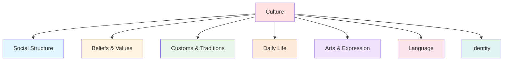
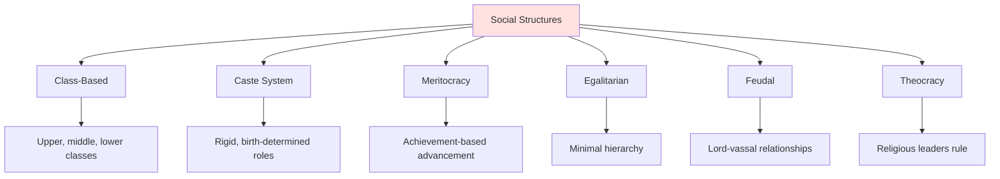
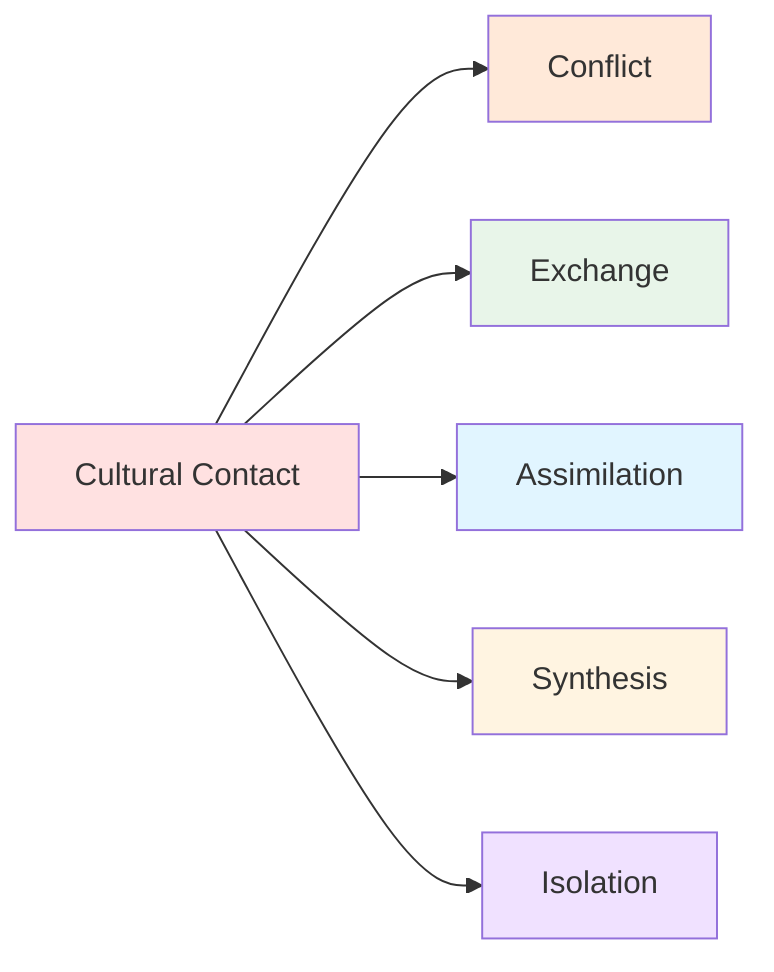

# 👥 Cultures & Societies

> *Building believable civilizations: from social structures to daily life*

---

## 📖 **Overview**

**Culture** encompasses the beliefs, customs, behaviors, social structures, and practices that define a group of people. Creating rich, authentic cultures transforms your world from a backdrop into a living, breathing reality that shapes your characters and drives your story.

### **Why Culture Matters:**
- 🎭 **Creates Authenticity:** Detailed cultures feel real
- ⚔️ **Generates Conflict:** Cultural differences drive tension
- 💡 **Shapes Characters:** Culture influences worldview
- 🌟 **Enriches Setting:** Traditions and customs add depth
- 🎯 **Enables Themes:** Culture embodies values
- 🎨 **Provides Variety:** Diverse cultures create interest

### **The Golden Rule:**
> "Culture is the invisible water in which your characters swim. They may not see it, but it shapes everything they do."  
> — Show culture through character assumptions, not exposition

---

## 🌐 **What Is Culture?**

### **Definition:**

**Culture** = The shared beliefs, values, customs, behaviors, and artifacts that characterize a group or society

**It Includes:**
- Social structures and hierarchies
- Beliefs and values
- Customs and traditions
- Language and communication
- Arts and entertainment
- Food and clothing
- Rituals and celebrations
- Taboos and restrictions

**It's Not:**
- Just ethnicity or race
- Monolithic or unchanging
- Only "exotic" or "foreign" elements
- Separate from individuals

---

## 🧱 **The Seven Pillars of Culture**

---

## 🏛️ **Pillar 1: Social Structure**

### **How Society Is Organized:**

**Hierarchy Types:**

---

### **Key Questions:**

<b>Social Structure Questions</b>

**Power & Authority:**
- Who has power in this society?
- How is power obtained? Birth, wealth, merit, force?
- Can people move between classes?
- What gives someone status?

**Class System:**
- What classes or groups exist?
- How do they relate to each other?
- What privileges/restrictions per class?
- How visible are class distinctions?

**Family Structure:**
- Nuclear or extended families?
- Patriarchal, matriarchal, or egalitarian?
- Importance of bloodline?
- Arranged or chosen marriages?
- Children's status and roles?

**Gender Roles:**
- What are expected roles for each gender?
- Are there more than two recognized genders?
- Access to education, property, power?
- Restrictions or freedoms?

**Age & Generations:**
- How are elders treated?
- When does childhood end?
- Rites of passage?
- Respect for age vs. youth?

---

### **Examples in Fiction:**

**Class-Based:**
- *Pride and Prejudice:* Georgian England's strict social classes
- *The Great Gatsby:* Old money vs. new money
- *Downton Abbey:* Aristocracy and servants

**Caste System:**
- *Game of Thrones:* Noble houses and smallfolk
- *The Hunger Games:* District hierarchy

**Meritocracy:**
- *Ender's Game:* Military achievement determines status
- *Harry Potter:* Magical ability matters more than birth (mostly)

**Egalitarian:**
- *Star Trek:* Post-scarcity society with equality
- *The Giver:* Enforced sameness

---

## 🙏 **Pillar 2: Beliefs & Values**

### **What People Hold Important:**

**Belief Systems:**

**Religion:**
- Monotheistic (one god)
- Polytheistic (multiple gods)
- Animistic (spirits in nature)
- Atheistic (no gods)
- Ancestor worship

**Philosophy:**
- What is the good life?
- Meaning of existence?
- Ethics and morality?
- Purpose of suffering?

**Worldview:**
- How does the world work?
- Humanity's place in it?
- Relationship with nature?
- Life after death?

---

### **Core Values:**

**What the Culture Prizes:**
- Honor and reputation?
- Family and community?
- Individual freedom?
- Wealth and success?
- Knowledge and wisdom?
- Strength and courage?
- Peace and harmony?
- Innovation and progress?

**What the Culture Rejects:**
- Dishonor and shame?
- Selfishness?
- Conformity?
- Poverty?
- Ignorance?
- Weakness?
- Conflict?
- Tradition?

---

### **Moral Framework:**

<b>Values Questions</b>

**Right and Wrong:**
- What's considered moral?
- What's unforgivable?
- How is justice administered?
- Punishment or rehabilitation?

**Virtue and Vice:**
- What traits are admired?
- What behaviors are shameful?
- How do people judge others?
- What earns respect?

**Obligations:**
- Duty to family?
- Loyalty to tribe/nation?
- Obligations to strangers?
- Individual vs. collective good?

**Taboos:**
- What's forbidden?
- What's never spoken of?
- What's considered unclean?
- Sacred vs. profane?

---

### **Examples:**

**Honor-Based:**
- *A Song of Ice and Fire:* "A Lannister always pays his debts"
- *The Count of Monte Cristo:* Honor and revenge
- Samurai culture: Bushido code

**Community-Based:**
- *Avatar (James Cameron):* Na'vi and connection to all life
- *The Lord of the Rings:* Hobbits and the Shire

**Individual Freedom:**
- *The Hunger Games:* Rebellion against control
- American Western: Frontier independence

**Knowledge-Based:**
- *Game of Thrones:* "A mind needs books like a sword needs a whetstone"
- *Harry Potter:* Ravenclaws value wisdom

---

## 🎉 **Pillar 3: Customs & Traditions**

### **Rituals and Practices:**

**Life Milestones:**

**Birth:**
- Naming ceremonies?
- Blessing rituals?
- Baptism or equivalent?
- How are children welcomed?

**Coming of Age:**
- When does childhood end?
- Tests or trials?
- Ceremony or ritual?
- New responsibilities?

**Marriage:**
- Arranged or chosen?
- Ceremony format?
- Symbolic elements?
- Union of families?

**Death:**
- Funeral customs?
- Burial or cremation?
- Mourning period?
- Beliefs about afterlife?

---

### **Holidays & Celebrations:**

**Types:**
- **Religious:** Holy days, observances
- **Historical:** National days, commemorations
- **Seasonal:** Harvest, solstice, equinox
- **Personal:** Birthdays, anniversaries
- **Cultural:** Unique to this society

**Elements:**
- **Food:** Special dishes, feasts
- **Dress:** Ceremonial clothing
- **Activities:** Games, performances, rituals
- **Symbols:** Decorations, icons
- **Stories:** Legends told, history remembered

---

### **Social Customs:**

<b>Custom Questions</b>

**Greetings:**
- How do people greet each other?
- Handshake, bow, kiss?
- Different by status?
- Formal vs. informal?

**Hospitality:**
- How are guests treated?
- Food and shelter obligations?
- Guest rights and responsibilities?
- Gift-giving customs?

**Dining:**
- How do people eat?
- Utensils or hands?
- Meal structure?
- Table manners?
- Food taboos?

**Interactions:**
- Personal space norms?
- Eye contact expectations?
- Touching acceptable?
- Conversation topics (allowed/forbidden)?

**Respect:**
- How is respect shown?
- To elders? To authority?
- Titles and forms of address?
- Deference behaviors?

---

### **Examples:**

**Game of Thrones:**
- Guest right (bread and salt)
- Wedding ceremonies
- Trial by combat

**Avatar: The Last Airbender:**
- Tea ceremony (Earth Kingdom)
- Water Tribe betrothal necklaces
- Fire Nation honor duels

**Dune:**
- Water-sharing rituals
- Spice ceremonies
- Fremen traditions

---

## 🏡 **Pillar 4: Daily Life**

### **How People Actually Live:**

**Material Culture:**

**Food:**
- What do they eat?
- How is food prepared?
- Meal times and structure?
- Significant dishes?
- Scarcity or abundance?

**Clothing:**
- What do they wear?
- Materials and colors?
- Climate appropriate?
- Status indicators?
- Practical or decorative?

**Shelter:**
- Houses, apartments, tents?
- Building materials?
- Architectural style?
- Who lives together?
- Privacy or communal?

**Objects:**
- Common possessions?
- Technology level?
- Tools and instruments?
- Decorative items?

---

### **Time & Schedule:**

**Daily Rhythm:**
- When do people wake/sleep?
- Work hours?
- Meal times?
- Leisure time?
- Prayer or meditation?

**Weekly/Monthly:**
- Market days?
- Rest days?
- Regular gatherings?
- Cycles and patterns?

**Yearly:**
- Planting and harvest?
- Weather patterns?
- Festival calendar?
- Travel seasons?

---

### **Work & Economy:**

<b>Economic Life Questions</b>

**Occupations:**
- What jobs exist?
- Most common work?
- Prestigious professions?
- Forbidden occupations?
- Gender/class restrictions?

**Economy:**
- Agricultural, industrial, service?
- Currency or barter?
- Market or planned?
- Wealth distribution?
- Poverty level?

**Trade:**
- What's imported/exported?
- Major trade routes?
- Merchant class?
- Guilds or unions?

**Property:**
- Who owns land?
- Inheritance systems?
- Private or communal?
- Women's property rights?

---

## 🎨 **Pillar 5: Arts & Expression**

### **Creative Culture:**

**Visual Arts:**
- Painting, sculpture?
- Decorative arts?
- Styles and subjects?
- Sacred or secular?
- Folk or elite?

**Performing Arts:**
- Music and instruments?
- Dance traditions?
- Theater or storytelling?
- Sacred performances?
- Popular entertainment?

**Literature:**
- Oral or written tradition?
- Poetry forms?
- Epic tales?
- Sacred texts?
- Popular stories?

**Crafts:**
- Textiles and weaving?
- Pottery and ceramics?
- Metalwork and jewelry?
- Woodcarving?
- Practical beauty?

---

### **Entertainment:**

**Games & Sports:**
- Physical competitions?
- Board or strategy games?
- Gambling?
- Spectator sports?
- Children's games?

**Leisure Activities:**
- How do people relax?
- Social gathering places?
- Hobbies and pastimes?
- Intellectual pursuits?

---

## 🗣️ **Pillar 6: Language & Communication**

### **How People Express Themselves:**

**Language Structure:**
- One language or many?
- Dialects by region/class?
- Formal and informal registers?
- Gendered language?
- Written systems?

**Communication Styles:**
- Direct or indirect?
- Emotional or reserved?
- Loud or soft?
- Interrupting acceptable?
- Silence comfortable?

**Naming:**
- Naming patterns?
- Multiple names?
- Inherited names?
- Name meanings?
- Titles and honorifics?

**Gestures:**
- Body language norms?
- Gestures and meanings?
- Cross-cultural misunderstandings?

**Slang & Idioms:**
- Common expressions?
- Proverbs and sayings?
- Curse words?
- Unique phrases?

---

## 🏁 **Pillar 7: Identity & Belonging**

### **Who We Are:**

**Group Identity:**
- What unites this culture?
- Shared history?
- Common enemy?
- Mythology and origin?
- Pride and stereotypes?

**Markers of Identity:**
- Physical appearance?
- Clothing and symbols?
- Language and accent?
- Customs and behaviors?
- Values and beliefs?

**In-Group vs. Out-Group:**
- Who's "us"? Who's "them"?
- How are outsiders treated?
- Can outsiders join?
- Inter-cultural relationships?
- Prejudices and stereotypes?

---

## 🔄 **Cultural Dynamics**

### **Cultures in Contact:**

---

### **Types of Interaction:**

**Conflict:**
- Cultural imperialism
- Forced conversion
- Cultural suppression
- War and conquest
- Resistance and rebellion

**Exchange:**
- Trade and commerce
- Diplomatic relations
- Cultural borrowing
- Intermarriage
- Peaceful coexistence

**Assimilation:**
- Adopting dominant culture
- Loss of original culture
- Integration pressure
- Generational changes

**Synthesis:**
- Blending of cultures
- Hybrid traditions
- Creole development
- New cultural forms

**Isolation:**
- Rejection of outsiders
- Cultural purity
- Insular communities
- Preservation of tradition

---

## 🎯 **Creating Your Culture**

### **Development Process:**

**Step 1: Define Core Concept**
- What's unique about this culture?
- What's the cultural "hook"?
- What fascinates you about them?

**Step 2: Establish Environment**
- Geography and climate
- Resources available
- Neighbors and threats
- Historical development

**Step 3: Core Values**
- What do they prize most?
- What do they fear/reject?
- How do they see the world?

**Step 4: Social Structure**
- How is society organized?
- Power distribution
- Gender and age roles
- Class and mobility

**Step 5: Daily Life**
- Food, clothing, shelter
- Work and economy
- Leisure and art
- Typical day

**Step 6: Traditions**
- Major rituals
- Holidays and celebrations
- Life milestone customs
- Unique practices

**Step 7: Conflicts**
- Internal tensions
- External threats
- Cultural evolution
- Generation gaps

---

## 🌈 **Cultural Diversity**

### **Multiple Cultures:**

**Why Have Multiple Cultures:**
- Creates realistic complexity
- Generates conflict
- Provides variety
- Enables fish-out-of-water stories
- Reflects real world

**How to Differentiate:**
- Different values and beliefs
- Contrasting social structures
- Unique customs and traditions
- Distinct aesthetics
- Varied languages/accents
- Opposing worldviews

---

### **Avoiding Monolithic Cultures:**

**Even Within One Culture:**
- Regional variations
- Class differences
- Generational divides
- Urban vs. rural
- Conservative vs. progressive
- Religious vs. secular

**Reality Check:**
- No culture is perfectly uniform
- Internal diversity exists
- Individuals vary
- Cultures change over time

---

## 📝 **Showing Culture in Narrative**

### **Integration Techniques:**

**1. Character Assumptions:**
Show culture through what characters take for granted

**Example:**
> She couldn't meet the elder's eyes—that would be unforgivably rude.

*Shows respect customs without explaining*

---

**2. Dialogue and Idioms:**
Use culturally-specific expressions

**Example:**
> "May your nets always be full," he said in parting—the traditional fisherman's blessing.

---

**3. Conflict Over Values:**
Cultural misunderstandings create tension

**Example:**
> The merchant's directness shocked her. In her homeland, business required hours of tea and pleasantries first.

---

**4. Rituals and Ceremonies:**
Show culture through participation

**Example:**
> The wedding lasted three days. The first for the bride's family, the second for the groom's, the third for the couple themselves.

---

**5. Sensory Details:**
Cultural elements through senses

**Example:**
> The city smelled of cardamom and cumin. Every doorway hung with blue beads to ward off evil. The call to prayer echoed five times daily.

---

## 🚫 **Common Culture Mistakes**

<b>❌ Pitfalls to Avoid</b>

### **The Planet of Hats:**
- **Problem:** Every member identical, single trait defines culture
- **Fix:** Create internal diversity, complex individuals
- **Reality:** Cultures are complex, people vary

### **Cultural Anachronisms:**
- **Problem:** Modern values in historical/fantasy settings
- **Fix:** Research era, create consistent values
- **Note:** Intentional commentary is different from ignorance

### **Exoticism:**
- **Problem:** Culture exists to be "mysterious" or "exotic"
- **Fix:** Develop culture fully, avoid othering
- **Respect:** Cultures are normal to their people

### **Cardboard Cutouts:**
- **Problem:** Surface-level stereotypes without depth
- **Fix:** Research real cultures, create complexity
- **Remember:** Real cultures are rich and nuanced

### **No Cultural Impact:**
- **Problem:** Culture doesn't affect character or plot
- **Fix:** Make culture matter to story
- **Test:** Would story change if culture was different?

### **Info-Dumping:**
- **Problem:** Pages of cultural explanation
- **Fix:** Reveal through character experience
- **Show:** Don't lecture, demonstrate

### **Ignoring Implications:**
- **Problem:** Cultural elements without consequences
- **Fix:** Think through how one aspect affects others
- **Example:** If magic exists, how does it change religion, economy, war?

### **Cultural Appropriation:**
- **Problem:** Taking sacred/significant elements without understanding
- **Fix:** Research deeply, consult, credit inspiration
- **Respect:** Be thoughtful about what you borrow

### **No Cultural Conflict:**
- **Problem:** Everyone agrees on everything
- **Fix:** Create internal tensions, diverse viewpoints
- **Reality:** All cultures have debates, divisions

### **Static Culture:**
- **Problem:** Culture never changes or evolves
- **Fix:** Show generational shifts, external influence
- **Reality:** Cultures are always changing

---

## 💡 **Culture Development Exercises**

### **Exercise 1: The Anthropologist**
Observe and document your own culture:
- What do you take for granted?
- What would confuse an outsider?
- What are unspoken rules?
- Then apply to fictional culture

### **Exercise 2: The Fish Out of Water**
Write a scene:
- Character from Culture A visits Culture B
- What confuses or surprises them?
- What do they miss from home?
- What cultural faux pas do they commit?

### **Exercise 3: The Dinner Scene**
Describe a meal in your culture:
- What food? How prepared?
- Who's present? Seating arrangement?
- What's discussed? What's taboo?
- What rituals or customs?

### **Exercise 4: The Proverb**
Create 5-10 proverbs for your culture:
- What do they reveal about values?
- What metaphors are used?
- What's considered wisdom?

### **Exercise 5: The Calendar**
Create a yearly calendar:
- What holidays exist?
- How are they celebrated?
- What do they commemorate?
- What's the rhythm of the year?

---

## 🔗 **Related Resources**

- 🌍 **[World-Building Basics](world-building-basics.md)** — Foundation principles
- 🌎 **[Geography & Environment](geography-environment.md)** — How land shapes culture
- 📜 **[History & Mythology](history-mythology.md)** — Cultural backstory
- ✨ **[Magic Systems](magic-systems.md)** — How magic affects society
- 📋 **[Culture Template](../../../templates/world-building/)** — Development worksheet

---

## 📖 **Recommended Reading**

- *Writing the Other* — Nisi Shawl & Cynthia Ward
- *The Fantasy Worldbuilding Questions* — Patricia C. Wrede
- *Wonderbook* — Jeff VanderMeer

---

### **Culture Is the Heart of Your World 👥**

*Great cultures feel authentic, complex, and lived-in. They shape your characters and drive your conflicts. Build cultures that breathe.*

**[⬅️ Back to World-Building](README.md)** | **[📚 Fundamentals](../README.md)**

