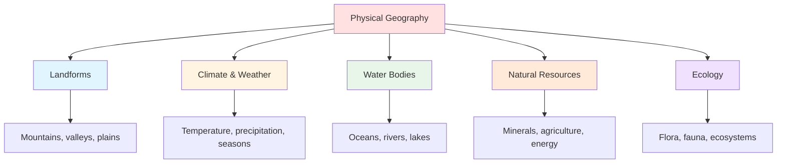
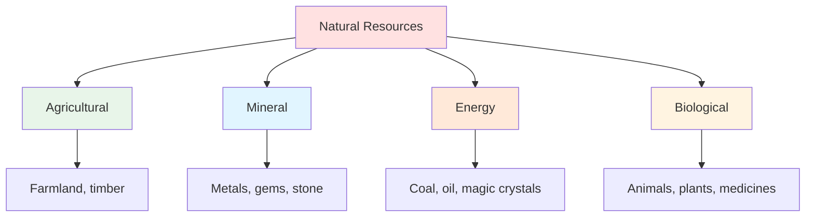

# 🌎 Geography & Environment

> *Shaping your world's physical foundation: terrain, climate, and natural forces*

---

## 📖 **Overview**

**Geography and environment** form the physical foundation of your world—the landscape, climate, natural resources, and ecosystems that shape where and how your characters live. Whether creating a fantasy continent or detailing a real city, understanding geography is essential for believable world-building.

### **Why Geography Matters:**
- 🏔️ **Shapes Culture:** Environment influences how people live
- ⚔️ **Creates Conflict:** Natural barriers and resources generate struggle
- 🎯 **Establishes Realism:** Consistent geography feels authentic
- 🌊 **Affects Plot:** Terrain creates obstacles and opportunities
- 🎨 **Provides Atmosphere:** Setting creates mood
- 💡 **Influences History:** Geography determines civilizations' paths

### **The Golden Rule:**
> "Geography is destiny. The land shapes the people, and the people shape the story."  
> — Climate, terrain, and resources determine what's possible

---

## 🗺️ **The Elements of Physical Geography**

---

## 🏔️ **Landforms & Terrain**

### **Major Landform Types:**

**1. Mountains:**
- **Characteristics:** High elevation, steep slopes, difficult terrain
- **Creates:** Natural barriers, isolated communities, distinct climates
- **Resources:** Minerals, defensible positions, water sources
- **Challenges:** Cold, thin air, difficult travel
- **Cultural Impact:** Isolation, independence, mountaineer culture

**Examples in Fiction:**
- *Lord of the Rings:* Misty Mountains (barrier), Lonely Mountain (dragon lair)
- *Game of Thrones:* The Eyrie (defensible fortress)
- *Mulan:* Mountains of northern China (invasion route)

---

**2. Plains & Grasslands:**
- **Characteristics:** Flat, open terrain, fertile soil
- **Creates:** Agricultural centers, easy travel, vulnerable to invasion
- **Resources:** Farmland, grazing, open trade routes
- **Challenges:** Exposure, no natural defense, weather extremes
- **Cultural Impact:** Agricultural societies, nomadic peoples, trade hubs

**Examples in Fiction:**
- *The Wheel of Time:* Two Rivers (agricultural community)
- *Little House on the Prairie:* American plains (frontier life)

---

**3. Forests & Jungles:**
- **Characteristics:** Dense vegetation, limited visibility
- **Creates:** Hidden communities, resource abundance, dangerous wildlife
- **Resources:** Timber, game, medicinal plants
- **Challenges:** Navigation difficulty, predators, disease
- **Cultural Impact:** Hunter-gatherer cultures, isolation, nature worship

**Examples in Fiction:**
- *Lord of the Rings:* Fangorn Forest (ancient, sentient)
- *The Jungle Book:* Indian jungle (wild, untamed)
- *Avatar:* Pandora's forests (bioluminescent, interconnected)

---

**4. Deserts:**
- **Characteristics:** Arid, extreme temperatures, scarce water
- **Creates:** Hardy peoples, valuable oases, difficult traversal
- **Resources:** Minerals, unique flora/fauna, clear skies
- **Challenges:** Water scarcity, heat, sandstorms
- **Cultural Impact:** Nomadic tribes, water as wealth, survival skills

**Examples in Fiction:**
- *Dune:* Arrakis (desert planet, spice resource)
- *The English Patient:* Sahara (harsh, beautiful, deadly)
- *Mad Max:* Post-apocalyptic desert (water wars)

---

**5. Coasts & Islands:**
- **Characteristics:** Land meets water, moderate climate
- **Creates:** Maritime cultures, trade centers, strategic ports
- **Resources:** Fish, trade access, naval power
- **Challenges:** Storms, tsunamis, piracy, invasion from sea
- **Cultural Impact:** Seafaring traditions, fishing, naval prowess

**Examples in Fiction:**
- *Moana:* Pacific islands (ocean culture)
- *Pirates of the Caribbean:* Caribbean islands (maritime adventure)
- *Earthsea:* Archipelago world (island nations)

---

**6. Wetlands & Swamps:**
- **Characteristics:** Waterlogged, muddy, difficult terrain
- **Creates:** Natural protection, disease breeding grounds
- **Resources:** Fish, waterfowl, unique plants
- **Challenges:** Disease, difficult travel, flooding
- **Cultural Impact:** Isolation, adapted lifestyles, mysticism

**Examples in Fiction:**
- *The Princess Bride:* Fire Swamp (dangerous, mysterious)
- *Harry Potter:* Swamps as hiding places
- *Shrek:* Swamp as isolation/refuge

---

**7. Tundra & Frozen Lands:**
- **Characteristics:** Extremely cold, permafrost, minimal vegetation
- **Creates:** Isolated cultures, harsh survival conditions
- **Resources:** Fur-bearing animals, ice fishing, minerals
- **Challenges:** Extreme cold, short growing season, isolation
- **Cultural Impact:** Survival focus, ice culture, hardy peoples

**Examples in Fiction:**
- *Game of Thrones:* Beyond the Wall (frozen wasteland)
- *His Dark Materials:* Arctic regions (exploration setting)
- *The Thing:* Antarctica (isolation, paranoia)

---

## 🌡️ **Climate & Weather**

### **Climate Zones:**

---

### **Climate Types:**

**Tropical:**
- Hot year-round
- High rainfall
- Dense vegetation
- Disease and insects
- Agricultural abundance

**Temperate:**
- Four seasons
- Moderate temperature
- Varied precipitation
- Most Earth civilizations
- Agricultural variety

**Arid:**
- Low rainfall
- Temperature extremes
- Sparse vegetation
- Water scarcity
- Adapted life forms

**Polar:**
- Extremely cold
- Ice and snow
- Minimal life
- Survival challenges
- Unique ecosystems

---

### **Weather Patterns:**

**Seasons:**
- How many? Earth has 4, but yours might differ
- How long? Duration affects agriculture
- How extreme? Temperature ranges
- How predictable? Stability affects civilization

**Storms & Natural Disasters:**
- **Hurricanes/Typhoons:** Coastal devastation
- **Tornadoes:** Plains destruction
- **Earthquakes:** Tectonic activity
- **Volcanoes:** Destruction and fertility
- **Floods:** Water overflow
- **Droughts:** Water scarcity
- **Blizzards:** Snow and cold

**How Weather Affects Story:**
- Creates obstacles
- Forces characters together
- Provides deadline pressure
- Reveals character
- Sets atmosphere

---

### **Fantasy Weather:**

**Magical Influence:**
- Wizard-caused storms
- Cursed eternal winter
- Magical season changes
- Weather as divine punishment
- Elemental disruptions

**Examples:**
- *Frozen:* Magical eternal winter
- *Game of Thrones:* Irregular, years-long seasons
- *The Chronicles of Narnia:* Eternal winter curse

---

## 💧 **Water Bodies**

### **Types of Water:**

**Oceans:**
- Separate continents
- Trade and exploration routes
- Naval power importance
- Marine resources
- Mystery and danger

**Seas:**
- Smaller than oceans
- Often enclosed/semi-enclosed
- Strategic importance
- Cultural significance
- Trade hubs

**Rivers:**
- Civilization cradles
- Transportation arteries
- Natural boundaries
- Fresh water source
- Agricultural irrigation

**Lakes:**
- Fresh water reserves
- Transportation
- Fishing resources
- Strategic locations
- Natural barriers

**Wells & Springs:**
- Settlement locations
- Oases in deserts
- Sacred sites
- Conflict points
- Survival resources

---

### **Water's Role:**

**Civilizational:**
- Cities form near water
- Trade follows waterways
- Power comes from water control
- Borders often follow rivers
- Ports = wealth and power

**Strategic:**
- Crossing points (bridges, fords)
- Defensible positions
- Supply lines
- Naval battles
- Siege warfare

**Cultural:**
- Sacred rivers
- Water worship
- Baptismal significance
- Purification rituals
- Sea god mythologies

---

## ⛏️ **Natural Resources**

### **Resource Types:**

---

### **Resource Impact:**

**Abundance Creates:**
- Wealth and power
- Target for invasion
- Trade dominance
- Population growth
- Innovation and leisure

**Scarcity Creates:**
- Conflict and war
- Trade dependence
- Innovation from necessity
- Strategic vulnerability
- Cooperation or competition

**Distribution Creates:**
- Trade networks
- Alliances and enemies
- Colonization impulses
- Strategic locations
- Power imbalances

---

### **Fictional Resources:**

**Fantasy Examples:**
- *Dune:* Spice (life extension, space travel)
- *Avatar:* Unobtainium (valuable mineral)
- *Lord of the Rings:* Mithril (rare metal)
- *Game of Thrones:* Dragonglass (weapon vs. undead)

**Creating Fictional Resources:**
- What makes it valuable?
- Where is it found?
- Who controls it?
- What conflicts does it create?
- How does it affect technology/magic?

---

## 🌿 **Ecology & Biomes**

### **Flora (Plant Life):**

**Consider:**
- What plants exist?
- Food sources?
- Medicinal plants?
- Poisonous plants?
- Magical plants?
- Useful materials (wood, fiber)?

**Impact on Culture:**
- Diet and cuisine
- Medicine and healing
- Building materials
- Clothing and textiles
- Religious significance
- Economic trade

---

### **Fauna (Animal Life):**

**Types:**
- Domestic animals (food, labor, companionship)
- Wild animals (hunting, danger)
- Predators (threats, hunting)
- Magical creatures (fantasy element)
- Extinct or legendary (mythology)

**Consider:**
- Food chain and ecosystem balance
- Dangerous creatures
- Useful animals (horses, oxen, etc.)
- Cultural significance (sacred animals)
- Hunting and domestication

**Fantasy Creatures:**
- Dragons, griffins, unicorns
- How do they fit ecosystem?
- Where do they live?
- How do humans interact?
- Are they rare or common?

---

### **Ecosystems:**

**Define:**
- Predator-prey relationships
- Food chains
- Population balance
- Environmental carrying capacity
- Human impact on nature

**Why It Matters:**
- Creates realistic world
- Affects available resources
- Determines settlements
- Generates conflicts
- Provides atmosphere

---

## 🗺️ **Creating Your Geography**

### **Step 1: Determine Scale**

**Questions:**
- How much of the world is relevant?
- Single location or multiple continents?
- Does story require travel?
- How important is geography to plot?

**Scope:**
- Small: Single city or region
- Medium: Country or large region
- Large: Continent
- Epic: Planet or multiple worlds

---

### **Step 2: Establish Basics**

**Start with:**
1. Major landforms (mountains, rivers, oceans)
2. Climate zones
3. Key locations for your story
4. Resources and their distribution
5. Natural barriers and passages

**Tool:** Sketch a rough map (doesn't need to be artistic)

---

### **Step 3: Think Realistically**

**Apply Earth Logic (unless magic changes it):**

**Mountains:**
- Create rain shadows (desert on one side)
- Have foothills, not sudden walls
- Affect wind and weather patterns
- Contain mineral resources

**Rivers:**
- Flow downhill to sea/lake
- Start from mountains/high ground
- Form deltas at mouth
- Create fertile valleys

**Climate:**
- Warmer near equator
- Colder at poles
- Coastal = moderate
- Interior = extreme
- Mountain = cold with elevation

**Coasts:**
- Beaches, cliffs, or rocks
- Ports in protected harbors
- Weather from ocean
- Fishing resources

---

### **Step 4: Add Unique Elements**

**What makes your world special?**
- Floating islands?
- Perpetual storm?
- Magic-warped terrain?
- Unusual phenomena?
- Unique resources?

**Example Unique Elements:**
- *Avatar:* Floating mountains (magnetic field)
- *Discworld:* Flat world on turtle's back
- *The Dark Tower:* Reality-warped geography

---

### **Step 5: Consider Implications**

**How does geography affect:**
- Where people live?
- What they eat?
- How they travel?
- Economic systems?
- Political boundaries?
- Cultural development?
- Historical conflicts?

**Follow the logic chain:**
> Mountains divide → Isolated cultures → Different languages → Trade difficult → Conflict at passes

---

## 🎨 **Using Geography in Narrative**

### **Geography as Obstacle:**

**Examples:**
- Mountains block army
- River prevents escape
- Desert crossing tests characters
- Ocean voyage isolates
- Swamp slows pursuit

**Creates:**
- Tension and stakes
- Character testing
- Pacing variety
- Realistic challenges

---

### **Geography as Character:**

**The Setting Becomes Active:**
- Nature as antagonist
- Weather as force
- Land as living entity
- Environment personified

**Examples:**
- *The Perfect Storm:* Ocean as villain
- *Into the Wild:* Alaska as deadly
- *The Martian:* Mars as opponent
- *Moby Dick:* Sea as character

---

### **Geography as Atmosphere:**

**Use Setting to Create Mood:**
- Stormy seas = danger, chaos
- Misty moors = mystery, eeriness
- Sun-drenched beaches = joy, freedom
- Dark forests = fear, unknown
- Mountain peaks = triumph, isolation

**Sensory Details:**
- Sight: Colors, shapes, vistas
- Sound: Wind, water, animals
- Smell: Earth, salt, vegetation
- Touch: Temperature, texture, wind
- Taste: Air quality, dust

---

### **Geography as Symbolism:**

**Land Represents Theme:**
- Desert = spiritual testing
- Ocean = freedom or chaos
- Mountain = challenge or enlightenment
- Forest = unconscious, mysterious
- Garden = paradise or innocence

---

## 🚫 **Common Geography Mistakes**

<b>❌ Pitfalls to Avoid</b>

### **Ignoring Physics:**
- **Problem:** Rivers flow uphill, impossible terrain
- **Fix:** Apply basic Earth logic (unless magic explains it)
- **Check:** Does this make physical sense?

### **All-Climate Planet:**
- **Problem:** Entire planet one climate
- **Fix:** Create climate zones based on latitude
- **Reality:** Earth has tropical, temperate, arctic zones

### **No Natural Barriers:**
- **Problem:** Nothing separates nations/cultures
- **Fix:** Add mountains, rivers, seas as boundaries
- **Reality:** Geography creates borders

### **Ignoring Resources:**
- **Problem:** Societies exist without food/water sources
- **Fix:** Establish where resources come from
- **Check:** How do they survive?

### **Scale Inconsistency:**
- **Problem:** Characters cross continent in a day
- **Fix:** Calculate travel times realistically
- **Tool:** Know distances, travel speeds

### **Generic Descriptions:**
- **Problem:** "There was a mountain" - boring, vague
- **Fix:** Specific, vivid details
- **Upgrade:** "The mountain rose like a broken tooth, its peak perpetually shrouded in storm clouds"

### **Map Doesn't Match Story:**
- **Problem:** Geography contradicts narrative
- **Fix:** Keep map consistent with text
- **Solution:** Reference your own map

### **Unchanging Environment:**
- **Problem:** No seasons, weather, changes
- **Fix:** Show passage of time through environment
- **Reality:** Nature changes

### **No Ecological Balance:**
- **Problem:** Predators with no prey, plants with no pollinators
- **Fix:** Think through food chains
- **Reality:** Ecosystems are interconnected

### **Geography Doesn't Affect Culture:**
- **Problem:** Island people same as mountain people
- **Fix:** Let environment shape culture
- **Logic:** Geography influences everything

---

## 💡 **Geography Development Exercises**

### **Exercise 1: The Map**
Draw your world's geography:
- Major landforms
- Water bodies
- Key locations
- Doesn't need to be artistic—functional is enough

### **Exercise 2: The Journey**
Trace character's journey across map:
- How long does it take?
- What terrain do they cross?
- What obstacles do they face?
- How does environment change?

### **Exercise 3: The Resource Map**
Mark on map:
- Where resources are
- Who controls them
- Trade routes
- Strategic locations
- Conflict points

### **Exercise 4: Climate Implications**
For each region:
- What's the climate?
- What can grow there?
- What challenges exist?
- How does it affect people?

### **Exercise 5: Sensory Descriptions**
For key locations, write:
- What do you see?
- What do you hear?
- What do you smell?
- What do you feel?
- How does it feel emotionally?

---

## 🔗 **Related Resources**

- 🌍 **[World-Building Basics](world-building-basics.md)** — Foundation principles
- 👥 **[Cultures & Societies](cultures-societies.md)** — How geography shapes culture
- 📜 **[History & Mythology](history-mythology.md)** — How geography influences history
- 📋 **[World-Building Templates](../../../templates/world-building/)** — Map and geography tools

---

## 📖 **Recommended Reading**

- *The Fantasy Worldbuilding Questions* — Patricia C. Wrede
- *How to Write Science Fiction & Fantasy* — Orson Scott Card
- *Wonderbook* — Jeff VanderMeer

---

### **Geography Shapes Everything 🌎**

*From the mountains to the seas, the land determines how people live, what they eat, and why they fight. Build geography that serves your story.*

**[⬅️ Back to World-Building](README.md)** | **[📚 Fundamentals](../README.md)**

