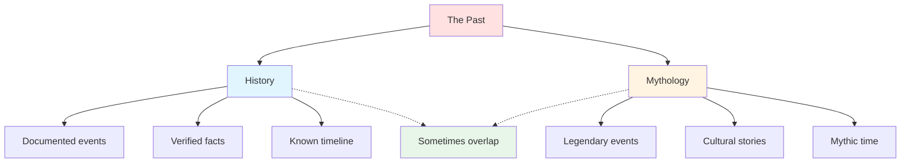
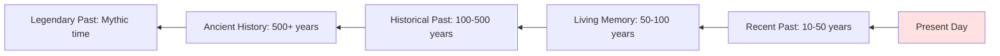

# 📜 History & Mythology

> *Building the past that shapes the present: creating depth through backstory and legend*

---

## 📖 **Overview**

**History and mythology** form the temporal foundation of your world—the events, legends, and cultural memory that explain how your world came to be and why it is as it is. A rich past creates depth, authenticity, and context for your present-day story.

### **Why History Matters:**
- 🎯 **Explains the Present:** Current state has roots in past
- ⚔️ **Creates Conflict:** Old grudges fuel new wars
- 🌟 **Adds Depth:** History makes world feel lived-in
- 💡 **Provides Context:** Understanding why things are
- 🎭 **Shapes Character:** History influences beliefs
- 📚 **Enables Themes:** Past comments on present

### **The Golden Rule:**
> "The past is never dead. It's not even past."  
> — William Faulkner

---

## 🕰️ **History vs. Mythology**

### **The Distinction:**



---

**History:**
- Documented and "known"
- Specific dates and facts
- Recorded events
- What "really happened" (in-world)
- Studied by scholars

**Mythology:**
- Legendary and symbolic
- Vague timeframes ("long ago")
- Oral traditions
- What people believe happened
- Told by storytellers

**The Overlap:**
- Ancient history becomes mythology
- Mythology may have historical basis
- Different cultures remember differently
- Truth vs. legend blurs with time

---

## 📚 **Types of Historical Events**

### **Foundational Events:**

**Creation/Origin:**
- How did the world begin?
- Divine creation?
- Natural formation?
- Catastrophic event?
- Multiple origin stories?

**Examples:**
- *Lord of the Rings:* Eru Ilúvatar's song
- *Avatar:* Lion Turtles give first bending
- *Game of Thrones:* The Long Night

---

**Founding Events:**
- How did civilization start?
- First city or nation?
- Legendary founders?
- Original settlers?
- Sacred beginnings?

**Examples:**
- Rome: Romulus and Remus
- *Star Wars:* Formation of Republic
- *The Hunger Games:* Post-war nation building

---

### **Transformative Events:**

**Golden Ages:**
- Periods of prosperity
- Cultural flowering
- Peace and plenty
- Height of power
- Remembered fondly

**Impact:**
- Nostalgia for "better times"
- Standard for comparison
- Lost knowledge or glory
- Pride in heritage

---

**Dark Ages:**
- Times of chaos
- Collapse of civilization
- Lost knowledge
- Suffering and strife
- Regression

**Impact:**
- Cultural trauma
- Fear of repetition
- Lost technologies
- Mysterious ruins
- Legends of "before times"

---

**Wars & Conflicts:**
- Major battles
- Wars that shaped nations
- Conquests and defeats
- Liberation or subjugation
- Revolutionary struggles

**Impact:**
- Current borders
- Alliances and enmities
- Cultural identity
- National myths
- Unhealed wounds

**Examples:**
- *Star Wars:* Clone Wars
- *Game of Thrones:* Robert's Rebellion
- *Avatar:* Hundred Year War

---

**Catastrophes:**
- Natural disasters
- Plagues and disease
- Magical accidents
- Divine punishment
- Apocalyptic events

**Impact:**
- Population changes
- Migration patterns
- Cultural shifts
- Religious interpretation
- Preventative measures

**Examples:**
- *The 100:* Nuclear apocalypse
- *The Last of Us:* Fungal plague
- Biblical flood

---

**Discoveries & Innovations:**
- Technological breakthroughs
- Magical discoveries
- New lands found
- Scientific revolutions
- Cultural innovations

**Impact:**
- Changed daily life
- Power shifts
- New possibilities
- Social upheaval
- Progress or problems

**Examples:**
- *Mistborn:* Discovery of Allomancy
- Industrial Revolution
- *Avatar:* Discovery of metalbending

---

**Betrayals & Scandals:**
- Famous treacheries
- Political scandals
- Broken oaths
- Infamous betrayals
- Shocking revelations

**Impact:**
- Mistrust and paranoia
- Changed laws
- Cultural sayings
- Cautionary tales
- Lasting grudges

**Examples:**
- *Game of Thrones:* Red Wedding
- *Star Wars:* Order 66
- Biblical: Judas

---

## 🎭 **Mythology & Legend**

### **Types of Myths:**

**Creation Myths:**
- Origin of world/universe
- Creation of humans
- First man and woman
- Purpose of existence
- Divine plan

**Functions:**
- Explain beginnings
- Establish cosmic order
- Define human purpose
- Justify social structures

---

**Hero Myths:**
- Legendary heroes
- Great deeds
- Monsters slain
- Quests completed
- Sacrifices made

**Functions:**
- Provide role models
- Embody cultural values
- Inspire courage
- Entertainment
- Moral lessons

**Examples:**
- *Beowulf*
- Hercules
- King Arthur
- *Game of Thrones:* Azor Ahai

---

**Trickster Myths:**
- Clever deceivers
- Rule breakers
- Chaos agents
- Transformation figures
- Boundary crossers

**Functions:**
- Challenge authority
- Question norms
- Explain change
- Provide humor
- Moral complexity

**Examples:**
- Loki (Norse)
- Coyote (Native American)
- Anansi (African)
- *The Kingkiller Chronicle:* Taborlin

---

**Apocalypse Myths:**
- End times prophecies
- Destruction and renewal
- Final battles
- Judgment days
- World's end

**Functions:**
- Explain evil
- Promise justice
- Prepare for crisis
- Motivate behavior
- Create urgency

**Examples:**
- Norse Ragnarok
- Biblical Revelation
- *Game of Thrones:* Long Night return

---

**Explanatory Myths:**
- Why things are as they are
- Natural phenomena
- Animal characteristics
- Social customs
- Place names

**Functions:**
- Make sense of world
- Teach lessons
- Preserve knowledge
- Cultural identity

**Examples:**
- Greek myths for constellations
- Native American creation stories
- *How the Zebra Got Its Stripes*

---

## 🗺️ **Building Your History**

### **Step 1: Determine Depth**

**How Much History Do You Need?**

**Minimal (Contemporary/Near Future):**
- 50-100 years detailed
- Major recent events
- Living memory
- Current conflicts' roots

**Moderate (Fantasy/Historical):**
- 500-1000 years outlined
- Major eras defined
- Legendary past hinted
- Key events detailed

**Extensive (Epic Fantasy):**
- Thousands of years
- Multiple ages
- Deep mythology
- Cyclic patterns

**Rule:** Build only what affects your story

---

### **Step 2: Work Backwards**

**Start with Present, Explain How You Got There:**



**For Each Era, Ask:**
- What major events?
- How did it affect what came after?
- What changed?
- What was lost or gained?

---

### **Step 3: Create Timeline**

**Basic Timeline Structure:**

**Year 0: Foundation Event**
- What marks the beginning?
- Calendar starting point?
- Significant transformation?

**Major Eras:**
- Name each period
- Defining characteristics
- Beginning and end points
- Key events within

**Example:**
```
Year 0: Founding of the Empire
Year 0-500: The Golden Age
Year 500-600: The Sundering (civil war)
Year 600-900: The Dark Centuries
Year 900-1200: The Reconstruction
Year 1200-Present: The Modern Era
```

---

### **Step 4: Layer History**

**Multiple Perspectives:**

Different cultures remember differently:
- Victors vs. defeated
- Colonizers vs. colonized
- Religious vs. secular
- Rich vs. poor
- Different nations

**Conflicting Accounts:**
- Who is hero? Who is villain?
- What really happened?
- Whose version is "true"?
- What's propaganda?

**Example:**
> The Empire calls it "The Unification Wars"—bringing peace and civilization. The conquered peoples call it "The Invasion"—brutal subjugation and cultural destruction.

---

### **Step 5: Forgotten & Lost**

**What Was Lost:**
- Ancient technologies
- Magical knowledge
- Lost civilizations
- Destroyed records
- Forbidden knowledge

**Why It Matters:**
- Quest for rediscovery
- Dangerous if found
- Explains current limitations
- Mystery and wonder
- Plot possibilities

**Examples:**
- *Star Wars:* Lost Sith knowledge
- *The Lord of the Rings:* Lost rings, forgotten spells
- *Avatar:* Lost Air Nomad history

---

## 📖 **Using History in Narrative**

### **Integration Techniques:**

**1. Character Knowledge:**

**What Characters Know:**
- Their culture's history
- Local legends
- Family stories
- Relevant to their life

**What They Don't Know:**
- Other cultures' history
- Forgotten events
- Suppressed truths
- Lost knowledge

**Show Through:**
> "Everyone knows the Empire fell in a day," she said. "The old capital just... gone. My grandmother remembers the earthquakes, even here. She says the gods were angry."

---

**2. Ruins & Artifacts:**

**Physical Remnants:**
- Ancient buildings
- Artifacts and relics
- Mysterious technology
- Crumbling monuments
- Buried cities

**What They Reveal:**
- Past glory or horror
- Lost capabilities
- Previous inhabitants
- Historical mysteries

---

**3. Cultural Memory:**

**How History Lives:**
- Holidays commemorate events
- Sayings reference past
- Fears rooted in history
- Pride in heritage
- Grudges from long ago

**Examples:**
> "Never trust an Elvish promise," he muttered. The old saying dated back to the Betrayal of Blackwood, a thousand years past, but memories were long.

---

**4. Prophecy & Prediction:**

**Looking Back to See Forward:**
- Old prophecies
- Cyclic history
- "History repeats"
- Pattern recognition
- Warnings ignored

---

**5. Legends Come Alive:**

**Mythology Becomes Real:**
- "Extinct" creatures return
- Legendary heroes return
- Prophecies fulfilled
- Mythical places found
- Magic returns

**Examples:**
- *Game of Thrones:* Dragons return
- *The Lord of the Rings:* King returns
- *Avatar:* Air Nomad survivor

---

## 🎨 **Historical Documentation**

### **How Is History Preserved?**

**Written Records:**
- Books and scrolls
- Chronicles and annals
- Official histories
- Personal diaries
- Letters and documents

**Advantages:** Detailed, can be studied
**Disadvantages:** Can be lost, destroyed, altered

---

**Oral Tradition:**
- Stories told and retold
- Bardic traditions
- Elder wisdom
- Griots and storytellers
- Songs and poems

**Advantages:** Living, adaptable, memorable
**Disadvantages:** Changes over time, embellishment

---

**Physical Monuments:**
- Statues and memorials
- Buildings and temples
- Tombs and graves
- Stone inscriptions
- Archaeological sites

**Advantages:** Long-lasting, visible
**Disadvantages:** Subject to interpretation, can be destroyed

---

**Magical Records:**
- Memories preserved in crystal
- Prophetic visions
- Ancestral communion
- Time viewing
- Magical archives

**Advantages:** Accurate, detailed
**Disadvantages:** Requires magic, may be restricted

---

## ⚖️ **History as Conflict**

### **How Past Creates Present Conflict:**

**1. Unresolved Grievances:**
- Ancient wrongs unavenged
- Stolen lands or artifacts
- Unpaid debts
- Broken treaties
- Historical injustice

**Example:**
> The elves had never forgiven the humans for the burning of Arandor, three centuries past. Every negotiation dragged that ancient wound into the open.

---

**2. Competing Claims:**
- Who owns what?
- Disputed territories
- Rightful heirs
- Cultural artifacts
- Historical sites

---

**3. Lost Knowledge:**
- Seeking ancient secrets
- Rediscovering technology
- Finding lost magic
- Understanding artifacts
- Recovering history

---

**4. Repeating Patterns:**
- "History repeats"
- Cyclical conflicts
- Prophecies of return
- Same mistakes
- Learned or ignored lessons

---

**5. Historical Revisionism:**
- Competing narratives
- Propaganda vs. truth
- Whose version is correct?
- Suppressed history
- Inconvenient truths

---

## 🎭 **Mythology's Function**

### **What Myths Do:**

**Explain:**
- Origins and beginnings
- Natural phenomena
- Cultural practices
- Social structures
- Why things are

**Inspire:**
- Heroes to emulate
- Values to uphold
- Courage in adversity
- Hope for future
- Pride in identity

**Unite:**
- Shared stories
- Common identity
- Cultural cohesion
- National myths
- Collective memory

**Teach:**
- Moral lessons
- Cautionary tales
- Cultural knowledge
- Survival skills
- Social rules

**Entertain:**
- Engaging stories
- Dramatic events
- Larger-than-life characters
- Fantasy and wonder
- Emotional resonance

---

## 📋 **History Development Checklist**

<details>
<summary><b>✅ Essential Elements</b></summary>

**Timeline:**
- [ ] Year 0 defined
- [ ] Major eras outlined
- [ ] Key events dated
- [ ] Cause-effect chains clear
- [ ] Gaps and mysteries identified

**Events:**
- [ ] Foundational events established
- [ ] Major wars documented
- [ ] Catastrophes recorded
- [ ] Cultural shifts noted
- [ ] Discoveries and innovations

**Mythology:**
- [ ] Creation myth exists
- [ ] Cultural heroes identified
- [ ] Legends and tales created
- [ ] Prophecies (if relevant)
- [ ] Taboos and sacred stories

**Documentation:**
- [ ] How history is recorded
- [ ] What's known vs. lost
- [ ] Competing narratives
- [ ] Reliable vs. unreliable sources

**Impact on Present:**
- [ ] Current conflicts rooted in history
- [ ] Cultural practices explained
- [ ] Political structures justified
- [ ] Character beliefs shaped
- [ ] Plot elements enabled

**Integration:**
- [ ] History revealed naturally
- [ ] No info-dumps
- [ ] Through character knowledge
- [ ] Via ruins and artifacts
- [ ] In cultural practices

</details>

---

## 🚫 **Common History Mistakes**

<details>
<summary><b>❌ Pitfalls to Avoid</b></summary>

### **Info-Dumping:**
- **Problem:** Pages of historical exposition
- **Fix:** Reveal through story, not lecture
- **Show:** Characters discover or reference history

### **Irrelevant History:**
- **Problem:** Extensive past that doesn't matter
- **Fix:** Build only what affects present story
- **Test:** Does this history impact plot or character?

### **Too Perfect Documentation:**
- **Problem:** Every detail of 10,000 years known
- **Fix:** Create gaps, mysteries, lost knowledge
- **Reality:** History has holes

### **Static History:**
- **Problem:** Nothing changed for millennia
- **Fix:** Show evolution and transformation
- **Reality:** Change is constant

### **Monolithic Perspective:**
- **Problem:** Single version of history
- **Fix:** Multiple perspectives, competing narratives
- **Reality:** History is contested

### **Ignoring Implications:**
- **Problem:** Major events with no lasting impact
- **Fix:** Show how past shapes present
- **Logic:** Events have consequences

### **Anachronistic History:**
- **Problem:** Past doesn't fit world's logic
- **Fix:** Consistent technology/magic levels
- **Check:** Could this have happened given their capabilities?

### **No Cultural Memory:**
- **Problem:** Characters don't know their own history
- **Fix:** Show history in culture, sayings, fears
- **Reality:** Past lives in present

### **Too Convenient:**
- **Problem:** Perfect prophecy or historical parallel
- **Fix:** Make history messy, ambiguous
- **Avoid:** Obvious plot convenience

### **The History Book:**
- **Problem:** Reading like textbook not story
- **Fix:** Integrate through narrative
- **Remember:** This is fiction, not history paper

</details>

---

## 💡 **History Development Exercises**

### **Exercise 1: The Timeline**
Create a one-page timeline:
- Year 0 and present
- 5-10 major events
- Cause and effect connections
- Impact on present

### **Exercise 2: The Legend**
Write a legendary story your culture tells:
- About what? (hero, catastrophe, founding)
- What moral or lesson?
- How is truth embellished?
- What does it reveal about culture?

### **Exercise 3: The Ruin**
Describe an ancient ruin:
- What was it?
- What happened to it?
- What remains?
- What's forgotten?
- What can be discovered?

### **Exercise 4: Competing Narratives**
Take one historical event, write three versions:
- Version A: One culture's account
- Version B: Opposing culture's account
- Version C: What "really" happened

### **Exercise 5: History Through Character**
Write scene where character:
- References historical event
- Shows how it affects them
- Reveals cultural attitude
- Demonstrates knowledge (or ignorance)

---

## 🔗 **Related Resources**

- 🌍 **[World-Building Basics](world-building-basics.md)** — Foundation principles
- 🌎 **[Geography & Environment](geography-environment.md)** — How land shapes history
- 👥 **[Cultures & Societies](cultures-societies.md)** — How culture preserves history
- ✨ **[Magic Systems](magic-systems.md)** — History of magic
- 📋 **[Timeline Templates](../../../templates/world-building/)** — Organization tools

---

## 📖 **Recommended Reading**

- *How to Write Science Fiction & Fantasy* — Orson Scott Card
- *Wonderbook* — Jeff VanderMeer
- *The Fantasy Worldbuilding Questions* — Patricia C. Wrede

**Study Historical Worldbuilding In:**
- *The Lord of the Rings* — Deep, ancient history
- *A Song of Ice and Fire* — Complex, layered past
- *Dune* — Mythic and political history
- *Foundation* — Fall and rise of civilizations

---

<div align="center">

### **The Past Is Never Past 📜**

*Great history creates depth, context, and conflict. It explains the present and shapes the future. Build a past that breathes life into your world.*

**[⬅️ Back to World-Building](README.md)** | **[📚 Fundamentals](../README.md)**

</div>
