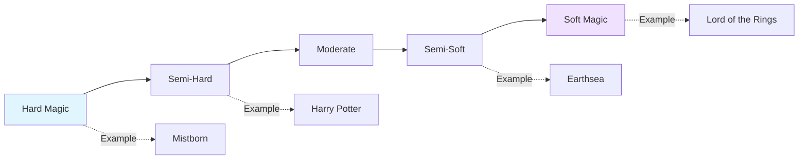
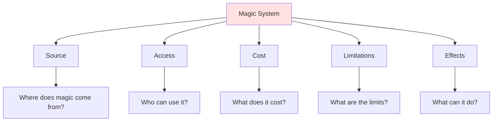
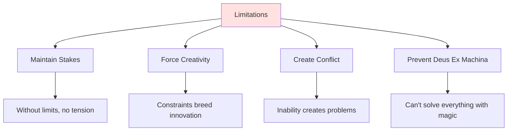

# ✨ Magic Systems

> *Creating consistent, compelling magical systems with rules, costs, and wonder*

---

## 📖 **Overview**

A **magic system** is the set of rules that governs how magic works in your world. Whether subtle or spectacular, magic must feel consistent and purposeful. The best magic systems create both wonder and limitation, enabling story possibilities while maintaining tension and stakes.

### **Why Magic Systems Matter:**
- ⚡ **Enable Story:** Magic creates plot possibilities
- ⚖️ **Maintain Stakes:** Limits prevent deus ex machina
- 🎯 **Shape Conflict:** Power creates struggle
- 💡 **Reveal Character:** Magic choices show values
- 🌟 **Create Wonder:** Magic enchants readers
- 🎨 **Express Theme:** Magic embodies meaning

### **The Golden Rule:**
> "Magic must have costs and limitations, or nothing matters and nothing is at stake."  
> — Brandon Sanderson's First Law of Magic

---

## 🎭 **Hard vs. Soft Magic**

### **The Spectrum:**

---

### **Hard Magic:**

**Definition:** Magic with clear, consistent rules that readers understand

**Characteristics:**
- ✅ Defined limitations
- ✅ Known costs
- ✅ Consistent effects
- ✅ Predictable results
- ✅ Explained mechanics

**Advantages:**
- Readers understand capabilities
- Magic can solve problems without feeling cheap
- Complex "magic-based" plots possible
- Clear strategic possibilities
- Satisfying when hero uses cleverness

**Disadvantages:**
- Can feel scientific rather than magical
- Requires extensive world-building
- Less mysterious and wondrous
- May limit storytelling flexibility

**Examples:**
- *Mistborn* (Brandon Sanderson): Metal-based magic with specific rules
- *The Name of the Wind* (Patrick Rothfuss): Sympathy requires conservation of energy
- *Avatar: The Last Airbender:* Four elements, specific techniques

---

### **Soft Magic:**

**Definition:** Magic that is mysterious, poorly understood, with flexible rules

**Characteristics:**
- ❓ Vague limitations
- ❓ Unknown costs
- ❓ Varied effects
- ❓ Unpredictable results
- ❓ Unexplained mechanics

**Advantages:**
- Maintains sense of wonder and mystery
- Flexible for storytelling
- Feels truly magical
- Emphasizes atmosphere
- Less world-building required

**Disadvantages:**
- Can't solve problems without feeling cheap
- Readers don't know what's possible
- Difficult to have magic-based plots
- Risk of deus ex machina
- May frustrate readers wanting consistency

**Examples:**
- *The Lord of the Rings* (J.R.R. Tolkien): Gandalf's magic mysterious
- *Studio Ghibli films:* Magic is wondrous, not explained
- *The Chronicles of Narnia* (C.S. Lewis): Aslan's magic divine

---

### **Choosing Your Approach:**

**Use Hard Magic When:**
- Magic is tool for solving problems
- Protagonist is magic-user
- You want magical combat/strategy
- Plot revolves around magic
- Readers need to understand possibilities

**Use Soft Magic When:**
- Magic is rare or distant
- Protagonist isn't magic-user
- Emphasizing wonder/mystery
- Magic is symbolic/thematic
- Villains or mentors are primary users

**Middle Ground:**
Many successful systems mix both:
- *Harry Potter:* Rules for common spells, mystery for powerful magic
- *The Kingkiller Chronicle:* Explained sympathy, mysterious naming
- *Earthsea:* True names have rules, but magic feels mystical

---

## 🧱 **Building Your Magic System**

### **The Essential Questions:**

---

## 🔮 **1. The Source: Where Does Magic Come From?**

### **Internal Sources:**

**Personal Power:**
- Magic comes from within the user
- Natural ability or developed skill
- Life force or stamina-based
- Emotional or mental energy

**Examples:**
- *Star Wars:* The Force (internal connection)
- *Avatar:* Bending (internal chi)
- *X-Men:* Mutant powers

---

**Bloodline/Genetics:**
- Inherited magical ability
- Family lines or chosen people
- Breeding for power
- Recessive or dominant traits

**Examples:**
- *Harry Potter:* Magical vs. muggle birth
- *Game of Thrones:* Targaryen dragon affinity
- *The Wheel of Time:* Ability to channel

---

### **External Sources:**

**Environmental:**
- Magic from the world itself
- Ley lines or power spots
- Nature or elemental forces
- Geographic concentration

**Examples:**
- *The Dark Crystal:* Crystal power
- *Final Fantasy VII:* Mako energy
- *Avatar (James Cameron):* Pandora's network

---

**Divine/Higher Power:**
- Gods grant magic
- Prayer or devotion
- Divine favor or calling
- Religious miracles

**Examples:**
- *Mistborn:* Preservation and Ruin
- Clerical magic in D&D
- *The Bible:* Miracles

---

**Learned/Studied:**
- Magic through knowledge
- Spells and formulas
- Academic discipline
- Anyone can learn (theoretically)

**Examples:**
- *The Name of the Wind:* University magic
- *Doctor Strange:* Mystic arts study
- *Fullmetal Alchemist:* Alchemy science

---

**Objects/Artifacts:**
- Magic stored in items
- Wands, staffs, talismans
- Enchanted objects
- Temporary or limited uses

**Examples:**
- *Harry Potter:* Wands focus magic
- *The Lord of the Rings:* Rings of Power
- *MCU:* Infinity Stones

---

**Sacrificial:**
- Magic from sacrifice
- Blood, life force, souls
- Bargains or trades
- Something given for power

**Examples:**
- *Fullmetal Alchemist:* Equivalent exchange
- *The Monkey's Paw:* Wishes with cost
- *Faustian bargains:* Soul for power

---

## 👤 **2. Access: Who Can Use Magic?**

### **Distribution Models:**

**Universal:**
- Everyone can use magic
- Degree of skill varies
- Some better than others
- Common part of life

**Impact on Society:**
- Magic is mundane tool
- Integrated into daily life
- Class by magical skill
- Magic-based technology

**Examples:**
- *Avatar: The Last Airbender:* Most can bend (one element)
- *Harry Potter:* All wizards have magic

---

**Rare/Elite:**
- Few can use magic
- Special selection or birth
- Magical minority
- Sets magic-users apart

**Impact on Society:**
- Mages as special class
- Fear or reverence
- Power imbalance
- Persecution possible

**Examples:**
- *X-Men:* Mutants are minority
- *The Witcher:* Mages are rare
- *Game of Thrones:* Few magic users

---

**Earned:**
- Magic through training
- Years of study required
- Dedication and discipline
- Anyone can learn (in theory)

**Impact on Society:**
- Academic institutions
- Master-apprentice relationships
- Knowledge as power
- Social mobility through magic

**Examples:**
- *The Name of the Wind:* University arcanists
- *Doctor Strange:* Trained sorcerers

---

**Chosen:**
- Destiny or selection
- Prophecy or divine choice
- Cannot be learned
- Protagonist often chosen one

**Impact on Society:**
- Messianic figures
- Prophecies and legends
- Hope or fear of chosen
- Resistance to destiny

**Examples:**
- *Star Wars:* Chosen One prophecy
- *The Matrix:* The One
- *Harry Potter:* The Boy Who Lived

---

## 💰 **3. Cost: What Does Magic Require?**

### **Types of Costs:**

**Physical Costs:**
- Exhaustion and fatigue
- Pain or injury
- Aging or life force
- Permanent damage
- Death

**Examples:**
- *The Wheel of Time:* Channeling drains stamina
- *The Dresden Files:* Magic exhausts Harry
- *Fullmetal Alchemist:* Rebound damage

---

**Mental/Emotional Costs:**
- Concentration required
- Emotional toll
- Sanity risk
- Psychological damage
- Memory loss

**Examples:**
- *Mistborn:* Snapping (trauma unlocks power)
- *The King Killer Chronicle:* Alar (willpower) needed
- *The Magicians:* Depression and darkness

---

**Material Costs:**
- Components consumed
- Ritual materials
- Money or resources
- Rare ingredients
- Tool requirements

**Examples:**
- *Harry Potter:* Potion ingredients
- *The Witcher:* Alchemy ingredients
- Traditional spell components

---

**Moral/Spiritual Costs:**
- Corruption of soul
- Loss of humanity
- Karmic debt
- Moral compromises
- Temptation to darkness

**Examples:**
- *The Lord of the Rings:* Ring corrupts
- *Star Wars:* Dark side seduction
- *The Picture of Dorian Gray:* Soul corruption

---

**Opportunity Costs:**
- Time required
- Focus on magic over other skills
- Social isolation
- Sacrificed relationships
- Cannot do other things

**Examples:**
- *The Magicians:* Years of study required
- *The Name of the Wind:* Tuition and time

---

**External Costs:**
- Environmental damage
- Collateral damage
- Harm to others
- Unintended consequences
- Balance disruption

**Examples:**
- *Avatar: The Last Airbender:* Firebending burns
- *The Witcher:* Wild magic consequences
- *Fullmetal Alchemist:* Equivalent exchange violations

---

## 🚧 **4. Limitations: What Are the Boundaries?**

### **Types of Limitations:**

**Range:**
- How far does magic reach?
- Line of sight required?
- Touch necessary?
- Distance penalties?

**Duration:**
- How long do effects last?
- Permanent or temporary?
- Concentration required?
- Decay over time?

**Magnitude:**
- How powerful is magic?
- Maximum effects?
- Scaling limits?
- Cannot affect certain things?

**Frequency:**
- How often usable?
- Cooldown periods?
- Daily/weekly limits?
- Exhaustion prevents overuse?

**Specificity:**
- What exactly can magic do?
- Narrow or broad effects?
- Categories of magic?
- Specialization required?

**Conditions:**
- When/where does magic work?
- Environmental factors?
- Time of day?
- Moon phases?
- Special locations?

**Knowledge:**
- Must know how?
- Learning required?
- Forgotten magic?
- Secret techniques?

**Vulnerability:**
- What blocks magic?
- Countermeasures?
- Anti-magic materials?
- Resistance possible?

---

### **Why Limitations Matter:**

**Remember:** Your hero should struggle even with magic

---

## ⚡ **5. Effects: What Can Magic Do?**

### **Categories of Magical Effects:**

**Elemental:**
- Fire, water, earth, air
- Lightning, ice, metal
- Classical elements
- Nature control

**Transmutation:**
- Change one thing to another
- Shapeshifting
- Transformation
- Matter manipulation

**Divination:**
- Future sight
- Scrying and sensing
- Mind reading
- Finding lost things

**Enchantment:**
- Permanent magic on objects
- Wards and protections
- Magical crafting
- Cursed items

**Healing:**
- Cure wounds
- Disease removal
- Life extension
- Regeneration

**Destruction:**
- Damage and combat
- Offensive magic
- Disintegration
- Explosive force

**Protection:**
- Shields and barriers
- Wards and defenses
- Immunity
- Safe spaces

**Mental:**
- Mind control
- Illusions
- Telepathy
- Memory alteration

**Summoning:**
- Call creatures
- Conjure objects
- Bind spirits
- Portal creation

**Temporal:**
- Time manipulation
- Speeding/slowing
- Time travel
- Prophecy

---

## 🎨 **Types of Magic Systems**

### **By Category:**

**Elemental Magic:**
- Control over natural elements
- Often multiple types

**Examples:**
- *Avatar:* Four elements
- *Pokemon:* Type advantages
- *Final Fantasy:* Elemental magic

---

**Word/Name Magic:**
- True names have power
- Speaking creates reality
- Language-based magic

**Examples:**
- *Earthsea:* True names
- *The Name of the Wind:* Naming
- *Eragon:* Ancient language

---

**Symbol/Rune Magic:**
- Symbols and sigils
- Geometric patterns
- Written magic

**Examples:**
- *Fullmetal Alchemist:* Transmutation circles
- *The Mortal Instruments:* Runes
- *Doctor Strange:* Mandalas

---

**Ritual Magic:**
- Ceremonies and rites
- Steps and components
- Time and preparation

**Examples:**
- *Harry Potter:* Complex spells and potions
- *The Magicians:* Elaborate hand movements
- Traditional witchcraft

---

**Innate/Instinctive:**
- Natural ability
- Emotion-driven
- Little control initially

**Examples:**
- *X-Men:* Mutant powers
- *Frozen:* Elsa's ice powers
- *Chronicle:* Telekinesis

---

**Pact/Bargain Magic:**
- Power through deals
- Demonic or fae contracts
- Binding agreements

**Examples:**
- *Faust:* Soul bargains
- *Supernatural:* Demon deals
- *The Little Mermaid:* Sea witch deal

---

**Divine/Faith Magic:**
- Religious power
- Prayer and devotion
- Miracles and blessings

**Examples:**
- *The Bible:* Miracles
- D&D Clerics
- *The Chronicles of Narnia:* Aslan's magic

---

**Technology Magic:**
- Magic as science
- Studied and systematic
- Predictable and reproducible

**Examples:**
- *Fullmetal Alchemist:* Alchemy as science
- *The Kingkiller Chronicle:* Sympathy
- *Mistborn:* Allomancy rules

---

## 🌍 **Magic's Impact on Society**

### **If Magic Exists, Everything Changes:**

**Warfare:**
- Battle mages
- Magical weapons
- Shields and wards
- Strategic magic use
- Arms race

**Economy:**
- Magical goods
- Enchantment industry
- Teleportation trade
- Magic labor
- Resource generation

**Social Structure:**
- Mages as class
- Magic-based hierarchy
- Persecution or privilege
- Magic schooling
- Social mobility

**Technology:**
- Magic replaces tech
- Magic-tech fusion
- Stagnation from magic
- Different development path

**Law:**
- Magic regulation
- Magical crimes
- Enforcement challenges
- Rights of magic-users
- Oaths and compulsion

**Religion:**
- Is magic divine?
- Religious magic users
- Conflict with faith
- Magic as heresy
- Gods and magic relationship

**Daily Life:**
- Magical conveniences
- Common enchantments
- Household magic
- Entertainment
- Communication

---

## 📋 **Magic System Checklist**

<b>✅ Essential Elements</b>

**Source:**
- [ ] Where does magic come from?
- [ ] Internal or external?
- [ ] Natural or learned?

**Access:**
- [ ] Who can use magic?
- [ ] How is it obtained?
- [ ] Can it be lost?

**Cost:**
- [ ] What does magic require?
- [ ] Physical, mental, material?
- [ ] Short-term and long-term costs?

**Limitations:**
- [ ] What can't magic do?
- [ ] Range and duration limits?
- [ ] Frequency limits?
- [ ] Vulnerabilities?

**Effects:**
- [ ] What can magic accomplish?
- [ ] Categories of magic?
- [ ] Power scaling?

**Rules:**
- [ ] Are rules consistent?
- [ ] Can readers predict outcomes?
- [ ] No contradictions?

**Integration:**
- [ ] How does magic affect society?
- [ ] Economic impact?
- [ ] Social structure changes?
- [ ] Historical influence?

**Story:**
- [ ] Does magic serve the plot?
- [ ] Creates conflict?
- [ ] Enables character growth?
- [ ] Maintains stakes?

---

## 🚫 **Common Magic System Mistakes**

<b>❌ Pitfalls to Avoid</b>

### **No Limitations:**
- **Problem:** Magic solves everything easily
- **Fix:** Add costs, limits, trade-offs
- **Result:** Stakes and tension maintained

### **Inconsistency:**
- **Problem:** Rules change as convenient
- **Fix:** Establish and follow rules
- **Tool:** Magic system bible

### **Deus Ex Machina:**
- **Problem:** New power appears when needed
- **Fix:** Establish abilities early, foreshadow
- **Rule:** If it solves climax, introduce in first half

### **No Cost or Consequence:**
- **Problem:** Magic without price
- **Fix:** Every spell has cost (even if small)
- **Reality:** Free lunch doesn't exist

### **Too Powerful:**
- **Problem:** Magic makes plot too easy
- **Fix:** Increase limitations or consequences
- **Balance:** Hero should still struggle

### **Unexplained Limitations:**
- **Problem:** "Just because" limits feel arbitrary
- **Fix:** In-universe logic for limits
- **Example:** "Iron blocks magic" (why? fae origin story)

### **Magic Replaces Character:**
- **Problem:** Power matters more than person
- **Fix:** Character arc separate from power growth
- **Remember:** Magic is tool, not personality

### **Info-Dumping Rules:**
- **Problem:** Pages of magic explanation
- **Fix:** Reveal through use and experience
- **Show:** Characters using magic, not lecturing

### **Copying Without Understanding:**
- **Problem:** Taking magic system without logic
- **Fix:** Understand why it works in original
- **Create:** Build your own or adapt thoughtfully

### **Magic Without Wonder:**
- **Problem:** Magic feels mundane and scientific
- **Fix:** Balance rules with sense of wonder
- **Remember:** It's magic, keep some mystery

---

## 💡 **Magic System Exercises**

### **Exercise 1: The Three Questions**
For your magic system:
1. What can magic do?
2. What can't it do?
3. What does it cost?

### **Exercise 2: The Mundane Made Magical**
Take everyday task:
- How would magic change it?
- What would be easier?
- What new problems arise?
- How does society adapt?

### **Exercise 3: The Abuse Test**
Ask: How could this be exploited?
- If loophole exists, either close it or use it in story
- Clever readers will find exploits

### **Exercise 4: The Power Ladder**
Create progression:
- Novice abilities
- Intermediate skills
- Advanced techniques
- Master-level powers
- Legendary magic

### **Exercise 5: The Limitation Challenge**
Write scene where:
- Character needs magic to solve problem
- But limitation prevents easy solution
- Must be creative within constraints

---

## 🔗 **Related Resources**

- 🌍 **[World-Building Basics](world-building-basics.md)** — Foundation principles
- 👥 **[Cultures & Societies](cultures-societies.md)** — How magic affects culture
- 📜 **[History & Mythology](history-mythology.md)** — Magical history
- 🎯 **[Plot Development](../plot-development/)** — Using magic in plot

---

## 📖 **Recommended Reading**

- *Sanderson's Laws of Magic* — Brandon Sanderson
- *How to Write Science Fiction & Fantasy* — Orson Scott Card
- *The Craft of Writing Science Fiction* — Ben Bova

**Study These Magic Systems:**
- *Mistborn* — Hard magic, metal-based
- *The Name of the Wind* — Sympathy and Naming
- *Harry Potter* — Moderate rules, wonder maintained
- *Lord of the Rings* — Soft magic, mysterious
- *Fullmetal Alchemist* — Equivalent exchange
- *Avatar: The Last Airbender* — Elemental bending

---

### **Magic Should Enable Story, Not Replace It ✨**

*Great magic systems create both wonder and limitation. They enable possibilities while maintaining stakes. Build magic that serves your story.*

**[⬅️ Back to World-Building](README.md)** | **[📚 Fundamentals](../README.md)**

