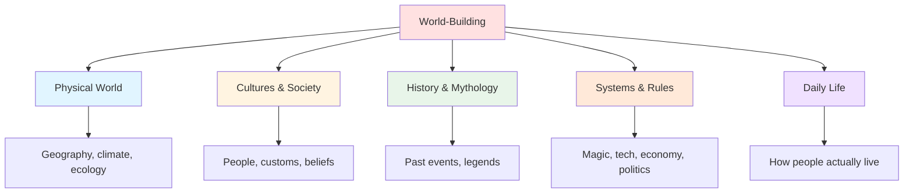
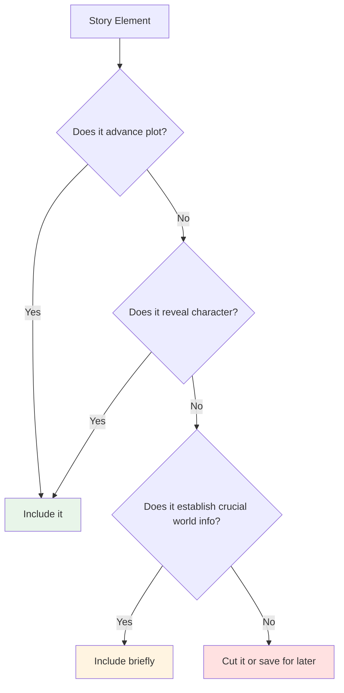

# 🌍 World-Building Basics

> *Creating immersive, believable settings: the foundation of your story's reality*

---

## 📖 **Overview**

**World-building** is the process of constructing an imaginary world with its own geography, history, cultures, rules, and systems. Whether creating a fantasy realm, sci-fi universe, or simply a detailed realistic setting, world-building provides the context in which your story unfolds.

### **Why World-Building Matters:**
- 🎭 **Creates Authenticity:** Makes fictional worlds feel real
- 🌟 **Enables Story:** Setting creates possibilities and limitations
- 💡 **Reveals Character:** Environment shapes who people are
- ⚡ **Generates Conflict:** World creates natural obstacles
- 🎯 **Immerses Readers:** Rich detail draws them in
- 🎨 **Expresses Theme:** World embodies story's meaning

### **The Golden Rule:**
> "Create an iceberg—know everything about your world, but show only the tip. World-building should feel natural, not like an encyclopedia."  
> — Build deep, reveal strategically

---

## 🎯 **What Is World-Building?**

### **Definition:**

**World-building** = The creation of a consistent, believable setting with its own internal logic, history, and rules

**It's Not:**
- Just a map
- Only for fantasy/sci-fi
- Separate from story
- An info-dump opportunity
- More important than character/plot

**It Is:**
- The context for your story
- Rules governing what's possible
- Cultural and historical background
- The air your characters breathe
- Integrated with narrative

---

### **The Scope Spectrum:**

**Your scope depends on your story:**
- Small-scale: Single location (one house, one ship)
- Medium-scale: City or region
- Large-scale: Planet or multiple worlds
- Epic-scale: Universe

**Rule:** Build only what your story needs, but know more than you show

---

## 🧱 **The Five Pillars of World-Building**

---

## 🌎 **Pillar 1: The Physical World**

### **Geography & Environment:**

**What to Develop:**
- Terrain and landforms
- Climate and weather patterns
- Natural resources
- Flora and fauna
- Natural dangers
- Unique features

**Why It Matters:**
- Shapes cultures
- Creates obstacles
- Provides resources
- Affects conflict
- Determines lifestyle

**See [Geography & Environment](geography-environment.md) for detailed guide**

---

### **Key Questions:**

<b>Geography Questions</b>

**Landforms:**
- What does the landscape look like?
- Mountains, valleys, plains, water bodies?
- How does geography connect or separate regions?

**Climate:**
- What's the weather like?
- Seasons? Temperature ranges?
- How does climate vary by region?
- Natural disasters?

**Resources:**
- What natural resources exist?
- What's scarce? What's abundant?
- How does this affect economy and conflict?

**Ecology:**
- What plants and animals exist?
- Dangerous creatures?
- Ecosystem balance?
- How do humans interact with nature?

---

## 👥 **Pillar 2: Cultures & Societies**

### **People & Civilizations:**

**What to Develop:**
- Different cultures and peoples
- Social structures and hierarchies
- Customs, traditions, taboos
- Values and beliefs
- Languages and communication
- Art, music, entertainment

**Why It Matters:**
- Creates realistic diversity
- Generates cultural conflict
- Shapes character worldviews
- Provides rich detail
- Enables social commentary

**See [Cultures & Societies](cultures-societies.md) for detailed guide**

---

### **Key Questions:**

<b>Culture Questions</b>

**Social Structure:**
- How is society organized?
- Class systems? Hierarchies?
- Power structures?
- Gender roles?
- Family structures?

**Beliefs & Values:**
- What do people believe?
- Religions or philosophies?
- What's considered moral/immoral?
- Taboos and sacred things?

**Daily Life:**
- What's a normal day like?
- Food, clothing, housing?
- Work and leisure?
- Rituals and celebrations?

**Cultural Identity:**
- How do different cultures interact?
- Prejudices and alliances?
- Cultural exchange or isolation?
- What makes each culture unique?

---

## 📜 **Pillar 3: History & Mythology**

### **The Past That Shapes the Present:**

**What to Develop:**
- Major historical events
- Wars, disasters, golden ages
- Founding myths and legends
- Historical figures and heroes
- Timeline of civilization
- Origin stories

**Why It Matters:**
- Explains current state
- Creates depth and authenticity
- Generates conflict from past
- Establishes traditions
- Provides backstory

**See [History & Mythology](history-mythology.md) for detailed guide**

---

### **Key Questions:**

<b>History Questions</b>

**Origins:**
- How did this world/civilization begin?
- Creation myths?
- Founding events?

**Major Events:**
- What wars or conflicts?
- Catastrophes or disasters?
- Golden ages or dark ages?
- Turning points?

**Historical Impact:**
- How does past affect present?
- Old grudges or alliances?
- Lost knowledge or technology?
- Prophecies or curses?

**Legends:**
- What stories do people tell?
- Heroes and villains of the past?
- What's true vs. myth?
- Cultural memory?

---

## ⚙️ **Pillar 4: Systems & Rules**

### **How the World Works:**

**What to Develop:**

**For Fantasy:**
- Magic systems and rules
- Supernatural forces
- Magical costs and limitations
- Who can use magic?

**For Sci-Fi:**
- Technology level
- Scientific principles
- Space travel, AI, etc.
- Tech limitations

**For All:**
- Economic systems
- Political structures
- Legal systems
- Education and knowledge

**Why It Matters:**
- Establishes what's possible
- Creates consistent rules
- Prevents deus ex machina
- Shapes conflict and plot
- Enables reader understanding

**See [Magic Systems](magic-systems.md) for fantasy-specific guide**

---

### **Key Questions:**

<b>Systems Questions</b>

**Rules of Reality:**
- What's possible in this world?
- What are the limits?
- What's the cost of power?
- How is balance maintained?

**Economy:**
- How do people make money?
- What's the currency?
- Trade and commerce?
- Wealth distribution?

**Politics:**
- How is power structured?
- Government types?
- How are decisions made?
- Succession and stability?

**Magic/Technology:**
- How does it work?
- Who can access it?
- What are limitations?
- How does it affect society?

---

## 🏠 **Pillar 5: Daily Life**

### **The Lived Experience:**

**What to Develop:**
- Food and cuisine
- Clothing and fashion
- Housing and architecture
- Transportation
- Communication methods
- Entertainment and leisure
- Education
- Healthcare

**Why It Matters:**
- Makes world feel lived-in
- Grounds fantastic elements
- Reveals culture through detail
- Creates relatability
- Provides sensory details

---

### **Key Questions:**

<b>Daily Life Questions</b>

**Basic Needs:**
- What do people eat?
- How is food obtained?
- What do people wear?
- Where do they live?

**Communication:**
- How do people communicate?
- Writing systems?
- Long-distance communication?
- Information spread?

**Transportation:**
- How do people travel?
- Speed and accessibility?
- Barriers to travel?

**Leisure:**
- What do people do for fun?
- Sports and games?
- Art and music?
- Social gatherings?

**Life Stages:**
- Birth customs?
- Coming of age?
- Marriage and family?
- Death and burial?

---

## 🎨 **World-Building Process**

### **Step-by-Step Approach:**

---

### **Step 1: Start with Story Needs**

**Don't build in a vacuum**

**Questions:**
- What does my story require?
- Where does action take place?
- What settings are essential?
- What conflicts does setting create?

**Principle:** Build to serve story, not for its own sake

---

### **Step 2: Establish Core Concept**

**The unique element**

**What makes your world distinctive?**
- Magic? Technology? Social structure?
- What's the hook?
- What's different from our world?
- What fascinates you?

**Examples:**
- *Harry Potter:* Hidden magical world within ours
- *Dune:* Desert planet with valuable spice
- *The Hunger Games:* Post-apocalyptic divided nation
- *Star Wars:* Space opera with The Force

---

### **Step 3: Develop Key Elements**

**Focus on what matters most**

**Priority elements:**
1. What characters interact with daily
2. What affects the plot
3. What creates conflict
4. What embodies theme
5. What readers will see most

**Don't develop:**
- Distant places never visited
- Historical periods that don't matter
- Cultures never encountered
- Systems that don't affect story

---

### **Step 4: Go Deep on What Matters**

**The iceberg principle**

For key elements:
- Develop extensively
- Know more than you show
- Create rich detail
- Establish consistency
- Think through implications

**Example:** If magic exists, consider:
- How does it affect warfare?
- How does it change economics?
- Who has power? Who doesn't?
- What social structures does it create?
- How do non-magical people feel?

---

### **Step 5: Ensure Consistency**

**Keep track of your rules**

**Create:**
- World bible/reference document
- Timeline of events
- Maps (if geographic)
- Character notes on cultures
- Rules and limitations list

**Check:**
- No contradictions
- Rules applied consistently
- Geography makes sense
- History affects present
- Cause and effect

---

### **Step 6: Integrate with Story**

**Reveal through narrative**

**How to Show Your World:**
- Through character experience
- Through conflict
- Through dialogue
- Through sensory details
- Through assumptions

**Not through:**
- Info-dumps
- Lectures
- Guidebook passages
- Tourist descriptions

---

## ⚖️ **Balancing World-Building & Story**

### **The Integration Dance:**

---

### **How Much to Include:**

**Too Little:**
- World feels vague, undefined
- Reader can't visualize
- Conflicts lack context
- Stakes unclear
- Nothing feels grounded

**Too Much:**
- Story bogs down
- Pacing suffers
- Readers overwhelmed
- Info-dumps disrupt
- Focus shifts from characters

**Just Right:**
- World feels real but not overwhelming
- Details serve story
- Revealed naturally
- Enhances rather than replaces
- Readers want to know more

---

### **The "Need to Know" Principle:**

**Include only what readers need when they need it**

**Reveal:**
- Setting details as characters experience them
- History when it becomes relevant
- Rules when they matter to plot
- Culture through character assumptions
- Systems when characters use them

**Save for later or cut:**
- Backstory that doesn't affect present
- Distant locations never visited
- Historical details with no current impact
- Cultural minutiae that don't matter
- Overly detailed technical explanations

---

## 🎯 **World-Building by Genre**

### **Fantasy:**

**Emphasis on:**
- Magic systems
- Non-human races
- Medieval/ancient settings
- Mythology and prophecy
- Good vs. evil conflicts

**Key Considerations:**
- How does magic affect society?
- What creatures exist?
- What's the technology level?
- Political structures?
- Religion and beliefs?

**See [Magic Systems](magic-systems.md)**

---

### **Science Fiction:**

**Emphasis on:**
- Technology and science
- Space travel (often)
- Future or alternate tech
- AI and robotics
- Scientific principles

**Key Considerations:**
- What technology exists?
- How does it affect society?
- What are scientific rules?
- Political structures (often galactic)?
- How has humanity changed?

---

### **Contemporary/Realistic:**

**Emphasis on:**
- Authentic real-world details
- Cultural accuracy
- Historical context
- Social issues
- Specific locations

**Key Considerations:**
- Research accuracy
- Cultural sensitivity
- Period details (if historical)
- Social dynamics
- Authentic voice

**Don't neglect world-building:** Even realistic fiction needs rich, accurate setting

---

### **Historical Fiction:**

**Emphasis on:**
- Historical accuracy
- Period details
- Real events and figures
- Cultural authenticity
- Social structures of era

**Key Considerations:**
- Research thoroughly
- Understand contemporary values
- Technology and knowledge of era
- Social constraints
- Political context

---

### **Horror:**

**Emphasis on:**
- Atmosphere and mood
- Isolated or claustrophobic settings
- Rules of supernatural (if present)
- What's normal vs. abnormal
- Environmental threat

**Key Considerations:**
- What creates dread?
- Setting as character
- Isolation techniques
- Rules of the horror
- Escalation possibilities

---

## 💡 **World-Building Techniques**

### **1. The Sensory Detail:**

**Bring world to life through senses**

**Show:**
- What it looks like
- What it sounds like
- What it smells like
- What it feels like
- What it tastes like

**Example:**
> The market reeked of spice and sweat. Merchants shouted in three different tongues while overhead, the twin suns beat down mercilessly. Sand found its way into everything—clothes, food, the gaps between your teeth.

---

### **2. The Cultural Assumption:**

**Reveal world through character perspective**

**Technique:**
Characters treat world as normal, readers learn through assumptions

**Example:**
> "You can't go out without your breather," she said, checking the oxygen level. Another brown air day.

*Shows: Polluted world, tech solution, casual acceptance*

---

### **3. The Conflict-Based Reveal:**

**Show world through problems it creates**

**Technique:**
World-building emerges from obstacles

**Example:**
> The bridge guard demanded her papers. "No magic-users cross without a license." She considered arguing, but the iron collar around his neck meant he was immune to charm spells anyway.

*Shows: Magic exists, regulated, some people immune*

---

### **4. The Dialogue Reveal:**

**Natural conversation shows world**

**Technique:**
Characters discuss world casually

**Example:**
> "The ships from Terra arrive tomorrow," he said.  
> "Think they'll have real coffee this time? Not that synthesized swill?"  
> "Depends on what Earth needs from us."

*Shows: Space trade, Earth relationship, scarcity*

---

### **5. The Comparative Detail:**

**Use familiar to explain unfamiliar**

**Technique:**
Compare to reader's world or establish difference

**Example:**
> The dragon was smaller than she'd expected—about the size of a horse, though infinitely more terrifying.

---

## 🚫 **Common World-Building Mistakes**

<b>❌ Pitfalls to Avoid</b>

### **The Info-Dump:**
- **Problem:** Pages of world history/description
- **Fix:** Reveal through action and dialogue
- **Rule:** No more than 2-3 sentences of straight description

### **Building Before Story:**
- **Problem:** Creating world before knowing what story needs
- **Fix:** Start with story, build to support it
- **Remember:** World serves story, not vice versa

### **Inconsistency:**
- **Problem:** Rules change or contradict
- **Fix:** Keep detailed notes, check consistency
- **Tool:** World bible/reference document

### **Too Much Explanation:**
- **Problem:** Over-explaining everything
- **Fix:** Trust readers to infer
- **Rule:** Iceberg principle—show tip, imply depth

### **Not Enough Distinction:**
- **Problem:** World feels generic
- **Fix:** Find unique elements, twist tropes
- **Question:** What makes this world special?

### **Ignoring Implications:**
- **Problem:** Magic/tech exists but doesn't affect society
- **Fix:** Think through consequences
- **Example:** If teleportation exists, why have roads?

### **Cultural Monolith:**
- **Problem:** One culture for entire world/planet
- **Fix:** Create diversity, different regions/peoples
- **Reality:** Earth has thousands of cultures

### **Perfect World:**
- **Problem:** No problems, conflicts, or flaws
- **Fix:** Build in tensions, inequities, conflicts
- **Remember:** Conflict comes from world

### **All Tell, No Show:**
- **Problem:** Explaining world instead of experiencing it
- **Fix:** Characters interact with world naturally
- **Technique:** Show through character perspective

### **Worldbuilder's Disease:**
- **Problem:** Building becomes procrastination
- **Fix:** Build only what story needs
- **Wisdom:** Perfect is the enemy of done

---

## 📋 **World-Building Checklist**

### **Essential Elements:**

**Physical World:**
- [ ] Geography/terrain defined
- [ ] Climate and weather established
- [ ] Key locations described
- [ ] Natural resources identified
- [ ] Flora and fauna considered

**Cultures:**
- [ ] Major cultures defined
- [ ] Social structures established
- [ ] Values and beliefs clear
- [ ] Customs and traditions noted
- [ ] Daily life details

**History:**
- [ ] Timeline created
- [ ] Major events established
- [ ] Current conflicts rooted in past
- [ ] Legends and myths exist

**Systems:**
- [ ] Rules of world consistent
- [ ] Magic/technology defined and limited
- [ ] Economic system exists
- [ ] Political structure established
- [ ] Social dynamics clear

**Integration:**
- [ ] World affects plot
- [ ] World shapes characters
- [ ] World creates conflict
- [ ] Details revealed naturally
- [ ] No contradictions

---

## 💡 **World-Building Exercises**

### **Exercise 1: The What-If**
Start with premise:
- What if magic required human sacrifice?
- What if Earth had two moons?
- What if lying was impossible?

Then ask: How would that change society?

### **Exercise 2: The Iceberg**
For one element of your world:
- Write everything you know (the iceberg)
- Mark what readers will see (the tip)
- Ensure depth exceeds visibility

### **Exercise 3: A Day in the Life**
Write a normal day for average citizen:
- What do they eat?
- How do they work?
- What do they do for fun?
- What do they worry about?

### **Exercise 4: The Conflict Test**
For each world element, ask:
- How does this create conflict?
- How does this affect the plot?
- How does this shape characters?

If no good answers, cut it.

### **Exercise 5: The Implication Chain**
Take one world element, follow implications:
- If teleportation exists...
- Then travel is instant...
- So geography doesn't matter...
- So nations are defined differently...
- So...

---

## 🔗 **Related Resources**

- 🌎 **[Geography & Environment](geography-environment.md)** — Physical world building
- 👥 **[Cultures & Societies](cultures-societies.md)** — Creating believable cultures
- ✨ **[Magic Systems](magic-systems.md)** — Fantasy world rules
- 📜 **[History & Mythology](history-mythology.md)** — Building the past
- 📋 **[World-Building Templates](../../../templates/world-building/)** — Practical tools
- 🎭 **[Setting as Character](../../craft/)** — Using world in narrative

---

## 📖 **Recommended Reading**

- *The Complete Guide to Writing Fantasy* — Various authors
- *On Writing and Worldbuilding* — Timothy Hickson
- *How to Write Science Fiction & Fantasy* — Orson Scott Card
- *The Writer's Guide to Creating a Science Fiction Universe* — George Ochoa

---

### **Build Worlds That Feel Real 🌍**

*Great world-building is invisible—it creates the sense of authenticity without overwhelming the story. Build deep, reveal strategically.*

**[⬅️ Back to World-Building](README.md)** | **[📚 Fundamentals](../README.md)**

