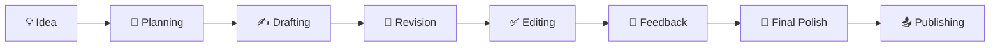

# 🔧 Writing Process & Workflow

> *From blank page to published work—master every stage of the writing journey*

---

## 📖 **Overview**

Writing a story involves much more than just putting words on a page. A **sustainable, effective writing process** helps you move from initial spark to finished manuscript with less frustration and better results.

This section covers every stage of the writing journey, from conception to publication.

---

## 🛤️ **The Writing Journey**

---

## 📚 **Process Stages**

### 📝 **[Planning & Outlining](planning-outlining/)**
*Prepare for success before you write*

Develop your story foundation:
- **[Plotter vs. Pantser](planning-outlining/plotter-pantser.md)** — Finding your approach
- **[Outlining Methods](planning-outlining/outlining-methods.md)** — Different planning techniques
- **[Scene Cards](planning-outlining/scene-cards.md)** — Flexible planning system
- **[Chapter Breakdowns](planning-outlining/chapter-breakdowns.md)** — Structuring long works
- **[Research Strategies](planning-outlining/research.md)** — Gathering necessary information
- **[Pre-Writing Rituals](planning-outlining/rituals.md)** — Getting in the zone
- **[Project Planning](planning-outlining/project-planning.md)** — Timeline and goals

---

### ✍️ **[Drafting](drafting/)**
*Get the story on the page*

Navigate the first draft effectively:
- **[First Draft Mindset](drafting/first-draft-mindset.md)** — Permission to write badly
- **[Writing Routines](drafting/writing-routines.md)** — Establishing habits
- **[Daily Word Goals](drafting/daily-goals.md)** — Sustainable productivity
- **[Overcoming Blocks](drafting/overcoming-blocks.md)** — Writer's block solutions
- **[Staying Motivated](drafting/staying-motivated.md)** — Long-term momentum
- **[Draft Zero](drafting/draft-zero.md)** — Discovery writing
- **[Fast Drafting](drafting/fast-drafting.md)** — NaNoWriMo and speed writing
- **[Writing Sprints](drafting/writing-sprints.md)** — Timed productivity

---

### 🔄 **[Revision & Editing](revision-editing/)**
*Transform your draft into a polished manuscript*

Master the art of rewriting:
- **[Revision Overview](revision-editing/overview.md)** — The revision mindset
- **[Big Picture Revision](revision-editing/big-picture.md)** — Structure and plot
- **[Character Revision](revision-editing/character-revision.md)** — Deepening characters
- **[Scene-Level Editing](revision-editing/scene-editing.md)** — Individual scenes
- **[Line Editing](revision-editing/line-editing.md)** — Sentence-level improvements
- **[Cutting & Tightening](revision-editing/cutting-tightening.md)** — Kill your darlings
- **[Continuity Check](revision-editing/continuity.md)** — Consistency issues
- **[Self-Editing Checklist](revision-editing/self-editing-checklist.md)** — Systematic approach

---

### 👥 **[Feedback & Critique](feedback/)**
*Get and use outside perspectives*

Navigate the feedback process:
- **[Types of Feedback](feedback/types-feedback.md)** — Alpha, beta, critique partners
- **[Finding Beta Readers](feedback/finding-beta-readers.md)** — Building your team
- **[Critique Groups](feedback/critique-groups.md)** — Writing communities
- **[Giving Good Critique](feedback/giving-critique.md)** — Being a helpful reader
- **[Receiving Critique](feedback/receiving-critique.md)** — Handling feedback emotionally
- **[Evaluating Feedback](feedback/evaluating-feedback.md)** — What to keep, what to ignore
- **[Professional Editors](feedback/professional-editors.md)** — When and how to hire
- **[Sensitivity Readers](feedback/sensitivity-readers.md)** — Cultural authenticity

---

### 📤 **[Publishing](publishing/)**
*Get your work into readers' hands*

Navigate the path to publication:
- **[Publishing Overview](publishing/overview.md)** — Traditional vs. self vs. hybrid
- **[Traditional Publishing](publishing/traditional.md)** — The agent and publisher route
- **[Query Letters](publishing/query-letters.md)** — Pitching your book
- **[Synopsis Writing](publishing/synopsis.md)** — Summarizing your story
- **[Agent Research](publishing/agent-research.md)** — Finding the right agent
- **[Self-Publishing](publishing/self-publishing.md)** — The indie author path
- **[Hybrid Publishing](publishing/hybrid.md)** — Combining approaches
- **[Building Platform](publishing/author-platform.md)** — Marketing yourself
- **[Book Marketing](publishing/marketing.md)** — Promotion strategies

---

## 🎨 **Different Writing Styles**

<b>🖋️ Find Your Writing Approach</b>

### **Plotters (Architects):**
✅ Detailed outlines before writing  
✅ Know the ending from the start  
✅ Less revision needed  
✅ Structured, organized approach  

**Best for:** Complex plots, mysteries, multiple POVs

---

### **Pantsers (Discovery Writers):**
✅ Write to discover the story  
✅ Let characters guide direction  
✅ More revision typically needed  
✅ Spontaneous, creative flow  

**Best for:** Character-driven stories, experimental work

---

### **Plantsers (Hybrid):**
✅ Basic outline + room for discovery  
✅ Flexible structure  
✅ Balance planning and spontaneity  
✅ Adjust approach per project  

**Best for:** Most writers find this balance

---

## 📊 **Workflow Comparison**

| Stage | Time Investment | Main Activity | Key Output |
|-------|----------------|---------------|------------|
| **Planning** | 5-20% | Outlining, research | Story roadmap |
| **Drafting** | 30-50% | Writing | Complete draft |
| **Revision** | 30-50% | Rewriting | Polished manuscript |
| **Feedback** | 5-10% | Reading, discussing | External perspectives |
| **Final Polish** | 5-15% | Line editing, proofing | Submission-ready work |

*Note: Percentages vary by writer and project*

---

## 🎯 **Process Tips by Experience Level**

<b>🌱 Beginner Writers</b>

- 📖 Focus on finishing your first draft
- ✍️ Don't edit while drafting
- 🎯 Start with shorter works (short stories, novellas)
- 📅 Establish a regular writing routine
- 👥 Join a writing community for support
- 📚 Read craft books while writing

<b>📚 Intermediate Writers</b>

- 🔄 Develop your revision process
- 👥 Build a reliable critique network
- 🎨 Experiment with different planning approaches
- 📊 Track your productivity patterns
- 🎯 Set specific goals for improvement
- 💼 Consider professional development (workshops, classes)

<b>🎓 Advanced Writers</b>

- ⚙️ Optimize your entire workflow
- 📈 Balance multiple projects
- 💼 Navigate professional relationships (agents, editors)
- 🎯 Focus on career strategy
- 👥 Mentor other writers
- 🔬 Push boundaries and experiment

---

## 🛠️ **Essential Process Tools**

### **Software & Apps:**
- 📝 **Writing:** Scrivener, Google Docs, Microsoft Word, Notion
- 📊 **Planning:** Plottr, Milanote, Trello, Aeon Timeline
- ✅ **Tracking:** Habitica, Writing Analytics, Pacemaker
- 📚 **Research:** Evernote, OneNote, DEVONthink
- 🔄 **Revision:** ProWritingAid, Grammarly, Hemingway Editor

### **Analog Tools:**
- 📓 Notebooks and index cards
- 🗂️ Bulletin boards for plotting
- 📋 Printed manuscripts for revision
- 🎨 Mind maps and diagrams

---

## 💡 **Process Principles**

> **"There is no one right way to write."** — Discover what works for YOU through experimentation and experience.

### **Core Principles:**
1. **Consistency > Perfection** — Regular writing beats occasional brilliance
2. **Process Evolves** — Your approach will change with experience
3. **Different Projects, Different Needs** — Adapt your process
4. **Community Matters** — Writing is solitary, but you don't have to be alone
5. **Finishing is a Skill** — Learn to complete projects
6. **Revision is Writing** — Embrace rewriting as creative
7. **Sustainable Pace** — Avoid burnout with realistic goals

---

## 📈 **Tracking Your Progress**

<b>📊 Measure What Matters</b>

### **Track:**
- ✍️ Daily word count
- 📅 Writing streak days
- 🎯 Project milestones
- 🔄 Revision passes completed
- 📚 Research hours
- 👥 Feedback sessions
- 📤 Submissions sent

### **Don't Obsess Over:**
- Comparing to others
- Perfect daily counts
- Linear progress (writing isn't always forward)

---

## 🔗 **Related Resources**

- 📋 **[Templates](../../templates/)** — Process tools and worksheets
- 📚 **[Writing Exercises](../../resources/exercises/)** — Skill-building activities
- 🛠️ **[Software Guide](../../resources/tools-software/)** — Detailed tool reviews
- 📖 **[Examples](../../examples/)** — Templates and worked examples

---

**[⬅️ Back to Main](../../README.md)** | **[Next: Advanced Topics ➡️](../advanced/)**

