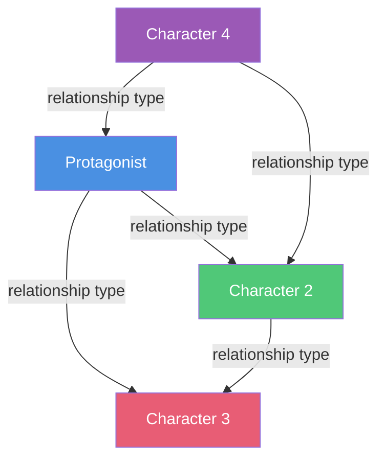

# 🕸️ Character Relationship Map

> *Map the web of connections between your characters*

Relationships are the heart of compelling stories. This template helps you visualize and design the network of connections, conflicts, and dynamics between all your characters, ensuring rich interpersonal drama and meaningful interactions.

---

## 🎯 **Understanding Relationship Mapping**

<details>
<summary><strong>Why Map Relationships?</strong></summary>

### **Benefits:**
- **Reveals story potential** — Find hidden conflict and connection opportunities
- **Ensures variety** — Prevents all relationships from feeling the same
- **Tracks changes** — See how bonds evolve through the story
- **Creates subplots** — Relationship dynamics generate secondary storylines
- **Adds depth** — Characters feel real when they have rich connections

### **What to Track:**
- 👥 Connection type (family, friends, enemies, lovers)
- ⚡ Conflict and tension sources
- 🔄 Power dynamics
- 💭 What each character wants from the other
- 📈 How the relationship changes

</details>

<details>
<summary><strong>How to Use This Template</strong></summary>

### **Process:**
1. **List all major characters**
2. **Define each relationship pair**
3. **Identify dynamics and conflicts**
4. **Map evolution through story**
5. **Visualize with diagram**

### **Tips:**
- ✅ Every relationship should have tension
- ✅ Show unequal power dynamics
- ✅ Create triangles (A→B→C→A)
- ✅ Change relationships over time
- ❌ Avoid static relationships
- ❌ Don't make everyone friends or enemies

</details>

---

## 👥 **Character Cast**

### **Main Characters**

List all characters who have significant relationships:

1. **[Character Name]** — _________________________________
   - Role: _________________________________

2. **[Character Name]** — _________________________________
   - Role: _________________________________

3. **[Character Name]** — _________________________________
   - Role: _________________________________

4. **[Character Name]** — _________________________________
   - Role: _________________________________

5. **[Character Name]** — _________________________________
   - Role: _________________________________

6. **[Character Name]** — _________________________________
   - Role: _________________________________

---

## 🔗 **Relationship Pairs**

For each significant relationship, complete a pair profile:

---

### **Relationship 1**

**Characters:** _____________ ↔ _____________

**Relationship Type:**
- [ ] Family
- [ ] Friends
- [ ] Romantic/Former Romantic
- [ ] Mentor/Student
- [ ] Rivals
- [ ] Enemies
- [ ] Professional/Colleagues
- [ ] Strangers
- [ ] Other: _____________

**Connection Strength:** ☐ Weak ☐ Moderate ☐ Strong ☐ Intense

**Current Status:** _________________________________

### **Dynamic**

**Power Balance:**
☐ Equal  
☐ A has power over B  
☐ B has power over A  
☐ Shifts between them

**Emotional Tone:**
- Primary: _________________________________
- Secondary: _________________________________

**What A Wants From B:**
_________________________________________________________________

**What B Wants From A:**
_________________________________________________________________

**What Each Provides:**
- A provides: _________________________________
- B provides: _________________________________

### **Conflict**

**Source of Tension:**
_________________________________________________________________

**Competing Goals:**
_________________________________________________________________

**Misunderstandings/Secrets:**
_________________________________________________________________

**Past History Creating Friction:**
_________________________________________________________________

### **Evolution**

**Beginning of Story:**
_________________________________________________________________

**Midpoint:**
_________________________________________________________________

**End of Story:**
_________________________________________________________________

**Key Turning Point:**
_________________________________________________________________

---

### **Relationship 2**

**Characters:** _____________ ↔ _____________

**Relationship Type:**
- [ ] Family
- [ ] Friends
- [ ] Romantic/Former Romantic
- [ ] Mentor/Student
- [ ] Rivals
- [ ] Enemies
- [ ] Professional/Colleagues
- [ ] Strangers
- [ ] Other: _____________

**Connection Strength:** ☐ Weak ☐ Moderate ☐ Strong ☐ Intense

**Current Status:** _________________________________

### **Dynamic**

**Power Balance:**
☐ Equal  
☐ A has power over B  
☐ B has power over A  
☐ Shifts between them

**Emotional Tone:**
- Primary: _________________________________
- Secondary: _________________________________

**What A Wants From B:**
_________________________________________________________________

**What B Wants From A:**
_________________________________________________________________

**What Each Provides:**
- A provides: _________________________________
- B provides: _________________________________

### **Conflict**

**Source of Tension:**
_________________________________________________________________

**Competing Goals:**
_________________________________________________________________

**Misunderstandings/Secrets:**
_________________________________________________________________

**Past History Creating Friction:**
_________________________________________________________________

### **Evolution**

**Beginning of Story:**
_________________________________________________________________

**Midpoint:**
_________________________________________________________________

**End of Story:**
_________________________________________________________________

**Key Turning Point:**
_________________________________________________________________

---

### **Relationship 3**

**Characters:** _____________ ↔ _____________

**Relationship Type:**
- [ ] Family
- [ ] Friends
- [ ] Romantic/Former Romantic
- [ ] Mentor/Student
- [ ] Rivals
- [ ] Enemies
- [ ] Professional/Colleagues
- [ ] Strangers
- [ ] Other: _____________

**Connection Strength:** ☐ Weak ☐ Moderate ☐ Strong ☐ Intense

**Current Status:** _________________________________

### **Dynamic**

**Power Balance:**
☐ Equal  
☐ A has power over B  
☐ B has power over A  
☐ Shifts between them

**Emotional Tone:**
- Primary: _________________________________
- Secondary: _________________________________

**What A Wants From B:**
_________________________________________________________________

**What B Wants From A:**
_________________________________________________________________

**What Each Provides:**
- A provides: _________________________________
- B provides: _________________________________

### **Conflict**

**Source of Tension:**
_________________________________________________________________

**Competing Goals:**
_________________________________________________________________

**Misunderstandings/Secrets:**
_________________________________________________________________

**Past History Creating Friction:**
_________________________________________________________________

### **Evolution**

**Beginning of Story:**
_________________________________________________________________

**Midpoint:**
_________________________________________________________________

**End of Story:**
_________________________________________________________________

**Key Turning Point:**
_________________________________________________________________

---

*Continue this pattern for all significant relationships...*

---

## 🔺 **Relationship Triangles**

Triangles create rich dramatic tension. Identify 2-3 triangular dynamics:

### **Triangle 1**

```
     [Character A]
        /    \
       /      \
      /        \
[Char B] ---- [Char C]
```

**Dynamic:**
- A's relationship to B: _________________________________
- A's relationship to C: _________________________________
- B's relationship to C: _________________________________

**Source of Tension:**
_________________________________________________________________

**How It Drives Story:**
_________________________________________________________________

---

### **Triangle 2**

```
     [Character __]
        /    \
       /      \
      /        \
[Char __] ---- [Char __]
```

**Dynamic:**
- A's relationship to B: _________________________________
- A's relationship to C: _________________________________
- B's relationship to C: _________________________________

**Source of Tension:**
_________________________________________________________________

**How It Drives Story:**
_________________________________________________________________

---

## 🗺️ **Visual Relationship Map**

### **Create Your Network Diagram**

Use this space to visualize all relationships:



**Legend:**
- 🟦 Protagonist
- 🟩 Allies/Friends
- 🟥 Antagonist/Enemies
- 🟪 Complex/Ambiguous

**Customize your map:**
- Use arrows to show direction of power/influence
- Use line types for relationship quality (solid=strong, dashed=weak)
- Add labels for relationship types
- Color-code by alliance or role

---

## ⚔️ **Conflict Matrix**

Track who's in conflict with whom:

|  | Character 1 | Character 2 | Character 3 | Character 4 | Character 5 |
|---|---|---|---|---|---|
| **Character 1** | — | _______ | _______ | _______ | _______ |
| **Character 2** | _______ | — | _______ | _______ | _______ |
| **Character 3** | _______ | _______ | — | _______ | _______ |
| **Character 4** | _______ | _______ | _______ | — | _______ |
| **Character 5** | _______ | _______ | _______ | _______ | — |

**Key:**
- ✅ = Allies
- ⚠️ = Tense/Complicated
- ❌ = Opposed/Enemies
- ❓ = Unknown/Suspicious
- 💔 = Former allies now opposed

---

## 💕 **Alliance & Opposition Groups**

### **Alliances**

**Alliance 1:** _________________________________
- Members: _________________________________
- United by: _________________________________
- Internal tension: _________________________________

**Alliance 2:** _________________________________
- Members: _________________________________
- United by: _________________________________
- Internal tension: _________________________________

### **Opposition**

**Opposition 1:** _________________________________
- Members: _________________________________
- United against: _________________________________
- Goal: _________________________________

---

## 🎭 **Relationship Functions**

Ensure variety in relationship types:

### **Your Story Includes:**

**Mentor/Student:**
- [ ] Characters: _____________ ↔ _____________

**Romantic/Sexual:**
- [ ] Characters: _____________ ↔ _____________

**Family Bonds:**
- [ ] Characters: _____________ ↔ _____________

**Rivalry:**
- [ ] Characters: _____________ ↔ _____________

**Deep Friendship:**
- [ ] Characters: _____________ ↔ _____________

**Professional/Transactional:**
- [ ] Characters: _____________ ↔ _____________

**Betrayal:**
- [ ] Characters: _____________ ↔ _____________

**Redemption:**
- [ ] Characters: _____________ ↔ _____________

---

## 📈 **Relationship Evolution Timeline**

Track how relationships change through your story:

| Relationship | Act I | Act II | Act III | Key Scene |
|--------------|-------|--------|---------|-----------|
| A ↔ B | _______ | _______ | _______ | _________ |
| A ↔ C | _______ | _______ | _______ | _________ |
| B ↔ C | _______ | _______ | _______ | _________ |
| A ↔ D | _______ | _______ | _______ | _________ |

---

## 🎬 **Key Relationship Scenes**

### **Essential Moments**

For each major relationship, identify pivotal scenes:

**Relationship:** _____________ ↔ _____________

1. **First Meeting/Current Status:**
   _________________________________________________________________

2. **Building Tension:**
   _________________________________________________________________

3. **Confrontation/Crisis:**
   _________________________________________________________________

4. **Transformation:**
   _________________________________________________________________

5. **Resolution:**
   _________________________________________________________________

---

## 💬 **Dialogue Dynamics**

How do characters talk to each other?

| Character Pair | Typical Tone | What They Argue About | Subtext |
|----------------|--------------|----------------------|---------|
| _____ ↔ _____ | __________ | ___________________ | _______ |
| _____ ↔ _____ | __________ | ___________________ | _______ |
| _____ ↔ _____ | __________ | ___________________ | _______ |

---

## 🔍 **Relationship Depth Check**

### **Ensure Rich Connections**

For each major relationship, verify:

- [ ] **Both characters want something from the other**
- [ ] **There's tension, even in positive relationships**
- [ ] **Power dynamics are clear**
- [ ] **The relationship changes through the story**
- [ ] **There's history (or it's established)**
- [ ] **It affects the plot**
- [ ] **It reveals character**
- [ ] **It's distinct from other relationships**

---

## 💭 **Reflection Questions**

### **Analyzing Your Web**

1. **Which relationship has the most story potential?**
   _________________________________________________________________

2. **Are any relationships too similar?**
   _________________________________________________________________

3. **Who needs more connection to other characters?**
   _________________________________________________________________

4. **What relationships will surprise readers?**
   _________________________________________________________________

5. **Where are the love triangles or rivalries?**
   _________________________________________________________________

6. **Which relationship will hurt most when it breaks?**
   _________________________________________________________________

---

## ✅ **Completion Checklist**

Before finalizing your relationship map:

- [ ] **All major characters have multiple relationships**
- [ ] **Relationships have variety (not all friends or all enemies)**
- [ ] **Each relationship has tension**
- [ ] **Power dynamics are unequal and interesting**
- [ ] **Relationships change through the story**
- [ ] **There are triangles or complex webs**
- [ ] **Relationships drive subplots**
- [ ] **Each relationship reveals character**
- [ ] **Conflicts are clear and specific**
- [ ] **You have at least one surprising dynamic**

---

## 📝 **Relationship Summary**

Write a brief overview of your character web:

_________________________________________________________________
_________________________________________________________________
_________________________________________________________________

---

## 🔗 **Related Resources**

### **Within This Repository:**
- [Basic Character Profile](basic-character-profile.md) — Individual character creation
- [Relationships Guide](../../docs/fundamentals/character-development/relationships.md) — Theory
- [Conflict Types](../../docs/fundamentals/plot-development/conflict-types.md) — Interpersonal conflict

### **Character Development Process:**
1. Create individual characters with [Basic Character Profile](basic-character-profile.md)
2. Map relationships using this template
3. Identify key relationship scenes
4. Write character interactions with tension

---

<div align="center">

**[⬅️ Back to Character Templates](README.md)** | **[📚 All Templates](../README.md)** | **[🏠 Home](../../README.md)**

</div>
