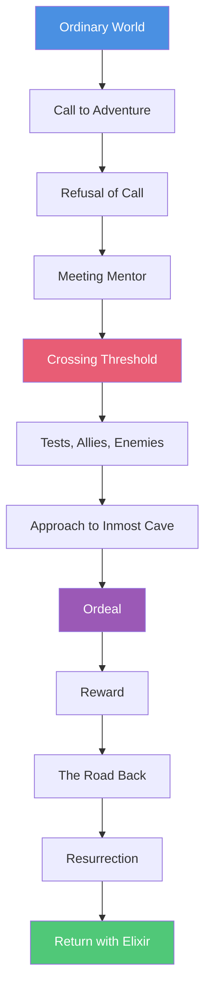

# 🗺️ Hero's Journey Template

> *Plan your story using Joseph Campbell's mythic structure*

The Hero's Journey (also called the Monomyth) is a classic storytelling pattern found in myths, legends, and modern narratives worldwide. This template guides you through all 12 stages of the hero's transformative adventure.

---

## 🎯 **Understanding the Hero's Journey**

<details>
<summary><strong>The 12-Stage Framework</strong></summary>

### **The Journey Structure:**



### **Three Acts Within the Journey:**

**Act I: Departure** (Stages 1-5)
- Hero leaves familiar world

**Act II: Initiation** (Stages 6-10)
- Hero faces tests and transformation

**Act III: Return** (Stages 11-12)
- Hero brings wisdom home

</details>

<details>
<summary><strong>How to Use This Template</strong></summary>

### **Planning Process:**
1. **Identify your hero's starting state**
2. **Define the call and refusal**
3. **Map the transformation journey**
4. **Plan the ordeal (death and rebirth)**
5. **Design the return and proof of change**

### **Tips:**
- ✅ Not every story needs all 12 stages
- ✅ Stages can be brief or extended
- ✅ Focus on transformation, not just adventure
- ✅ The ordeal is the true heart of the journey
- ❌ Don't skip the return
- ❌ Don't make it just physical travel

</details>

---

## 💡 **Story Foundation**

### **Core Concept**

**Title (Working):** _________________________________

**Logline:**
_________________________________________________________________
_________________________________________________________________

**Genre:** _________________________________

**Mythic Theme:**
_________________________________________________________________
*(What universal truth or transformation does this journey represent?)*

---

## 👤 **The Hero**

**Name:** _________________________________

**Starting State (Ordinary World):** _________________________________

**Fatal Flaw/Wound:** _________________________________

**Deepest Fear:** _________________________________

**Unconscious Need:** _________________________________

**Transformed State (End):** _________________________________

---

## 🏠 **Act I: Departure**

### **Stage 1: Ordinary World** (0-10%)

**The Normal Life:**
_________________________________________________________________
_________________________________________________________________

**What's Comfortable:**
_________________________________________________________________

**What's Limiting:**
_________________________________________________________________

**The Flaw in Action:**
_________________________________________________________________

**What Hero Believes About Self:**
_________________________________________________________________

**Key Relationships:**
- _________________________________________________________________
- _________________________________________________________________

**Opening Image:**
_________________________________________________________________

---

### **Stage 2: Call to Adventure** (~12%)

**The Disruption:**
_________________________________________________________________
_________________________________________________________________

**When It Happens:** Page/Word: _____________

**What Opportunity It Presents:**
_________________________________________________________________

**What Challenge It Presents:**
_________________________________________________________________

**How It Relates to Hero's Need:**
_________________________________________________________________

**The Herald (Who/What Delivers the Call):**
_________________________________________________________________

---

### **Stage 3: Refusal of the Call** (12-18%)

**Why Hero Resists:**
_________________________________________________________________
_________________________________________________________________

**Fear Expressed:**
_________________________________________________________________

**Excuses Made:**
_________________________________________________________________

**What They'd Rather Do:**
_________________________________________________________________

**Who Encourages Refusal:**
_________________________________________________________________

**Cost of Refusal (If They Don't Go):**
_________________________________________________________________

---

### **Stage 4: Meeting the Mentor** (18-22%)

**The Mentor Figure:**
- **Name/Type:** _________________________________
- **How They Appear:** _________________________________
- **What They Represent:** _________________________________

**Wisdom Shared:**
_________________________________________________________________

**Gift/Tool Provided:**
_________________________________________________________________
*(Physical, knowledge, or emotional)*

**Training/Preparation:**
_________________________________________________________________

**What Hero Still Needs to Learn:**
_________________________________________________________________

**Push Toward Threshold:**
_________________________________________________________________

---

### **Stage 5: Crossing the Threshold** (~25%)

**The Point of No Return:**
_________________________________________________________________
_________________________________________________________________

**When It Happens:** Page/Word: _____________

**The Threshold Guardian:**
_________________________________________________________________
*(Who or what tries to stop the crossing?)*

**How Hero Passes:**
_________________________________________________________________

**Entering the Special World:**
_________________________________________________________________

**What They Leave Behind:**
_________________________________________________________________

**What They Commit To:**
_________________________________________________________________

**New Rules/Reality:**
_________________________________________________________________

---

## ⚔️ **Act II: Initiation**

### **Stage 6: Tests, Allies, and Enemies** (25-45%)

**The New World:**
_________________________________________________________________

**Learning the Rules:**
_________________________________________________________________

#### **Tests Faced:**

**Test 1:**
- **Challenge:** _________________________________
- **Outcome:** _________________________________
- **Lesson:** _________________________________

**Test 2:**
- **Challenge:** _________________________________
- **Outcome:** _________________________________
- **Lesson:** _________________________________

**Test 3:**
- **Challenge:** _________________________________
- **Outcome:** _________________________________
- **Lesson:** _________________________________

#### **Allies Gained:**

**Ally 1:** _________________________________
- **How Met:** _________________________________
- **What They Provide:** _________________________________

**Ally 2:** _________________________________
- **How Met:** _________________________________
- **What They Provide:** _________________________________

#### **Enemies Revealed:**

**Enemy 1:** _________________________________
- **First Confrontation:** _________________________________
- **What They Represent:** _________________________________

**Fun & Games (Promise of Premise):**
_________________________________________________________________
*(Deliver on your genre's expectations)*

---

### **Stage 7: Approach to the Inmost Cave** (45-50%)

**Preparing for the Major Ordeal:**
_________________________________________________________________

**The Inmost Cave (Location/Situation):**
_________________________________________________________________
*(The most dangerous place, literally or metaphorically)*

**What Hero Knows They Must Face:**
_________________________________________________________________

**Final Preparations:**
- Planning: _________________________________
- Gathering Resources: _________________________________
- Confronting Fears: _________________________________

**Last Moment of Doubt:**
_________________________________________________________________

**Point of No Return (Again):**
_________________________________________________________________

**Crossing the Second Threshold:**
_________________________________________________________________

---

### **Stage 8: The Ordeal** (~50%)

**The Supreme Test:**
_________________________________________________________________
_________________________________________________________________

**When It Happens:** Page/Word: _____________

**The Death Experience:**
_________________________________________________________________
*(Literal death, near-death, death of identity, or symbolic death)*

**Greatest Fear Confronted:**
_________________________________________________________________

**The Battle:**
_________________________________________________________________
_________________________________________________________________

**The Crisis Moment:**
_________________________________________________________________

**Allies' Role:**
_________________________________________________________________

**Apparent Death/Defeat:**
_________________________________________________________________
*(Hero seems lost)*

**The Resurrection/Victory:**
_________________________________________________________________
*(How hero survives or overcomes)*

**What Dies (Old Self):**
_________________________________________________________________

**What's Born (New Self):**
_________________________________________________________________

---

### **Stage 9: Reward (Seizing the Sword)** (50-60%)

**The Prize:**
_________________________________________________________________
*(What hero gains from surviving the ordeal)*

**Physical Reward:**
_________________________________________________________________

**Knowledge Gained:**
_________________________________________________________________

**Internal Transformation:**
_________________________________________________________________

**New Power/Ability:**
_________________________________________________________________

**Celebration:**
_________________________________________________________________

**But... The Complication:**
_________________________________________________________________
*(Why they can't just go home easily)*

**Consequences of Victory:**
_________________________________________________________________

---

### **Stage 10: The Road Back** (60-75%)

**The Decision to Return:**
_________________________________________________________________

**Why Return is Difficult:**
_________________________________________________________________

**What Pursues Them:**
_________________________________________________________________

**Chase/Pursuit:**
_________________________________________________________________

**Hero's Commitment:**
_________________________________________________________________

**Sacrifice Required:**
_________________________________________________________________

**Stakes Raised:**
_________________________________________________________________

**Ticking Clock:**
_________________________________________________________________

**Doubt Returns:**
_________________________________________________________________

**All Is Lost Moment:**
_________________________________________________________________

---

## 🌅 **Act III: Return**

### **Stage 11: Resurrection** (~75-90%)

**The Final Test:**
_________________________________________________________________
_________________________________________________________________

**When It Happens:** Page/Word: _____________

**Why It's Necessary:**
_________________________________________________________________
*(Hero must prove transformation is complete)*

**The Ultimate Choice:**
_________________________________________________________________

**Old Self vs. New Self:**
_________________________________________________________________

**What Hero Risks:**
_________________________________________________________________

**Using New Wisdom:**
_________________________________________________________________

**The Climactic Battle:**
_________________________________________________________________
_________________________________________________________________

**Final Sacrifice:**
_________________________________________________________________

**Proof of Transformation:**
_________________________________________________________________
*(How they act differently than they would have at the start)*

**Victory:**
_________________________________________________________________

**The Purification:**
_________________________________________________________________
*(Hero emerges reborn, cleansed, transformed)*

---

### **Stage 12: Return with the Elixir** (90-100%)

**Returning Home:**
_________________________________________________________________

**The Elixir (What They Bring Back):**
_________________________________________________________________
*(Physical object, knowledge, wisdom, or the transformed self)*

**How It Heals/Improves the Ordinary World:**
_________________________________________________________________

**Sharing Wisdom:**
_________________________________________________________________

**Relationships Restored/Changed:**
- _________________________________________________________________
- _________________________________________________________________

**New Status:**
_________________________________________________________________

**How Ordinary World Has Changed:**
_________________________________________________________________

**How Hero Has Changed:**
_________________________________________________________________

**Proof of Growth:**
_________________________________________________________________

**Circular Ending:**
_________________________________________________________________
*(How does the ending mirror/contrast the beginning?)*

**Closing Image:**
_________________________________________________________________

**Possibility of New Journey:**
_________________________________________________________________

---

## 🔄 **Transformation Arc**

### **Character Evolution**

| Stage | Character State | Core Belief | Key Behavior |
|-------|----------------|-------------|--------------|
| **Ordinary World** | _____________ | _____________ | _____________ |
| **Refusal** | _____________ | _____________ | _____________ |
| **Threshold** | _____________ | _____________ | _____________ |
| **Tests** | _____________ | _____________ | _____________ |
| **Ordeal** | _____________ | _____________ | _____________ |
| **Reward** | _____________ | _____________ | _____________ |
| **Resurrection** | _____________ | _____________ | _____________ |
| **Return** | _____________ | _____________ | _____________ |

---

## 🗺️ **Journey Map Visualization**

### **Track the Movement**

```
STATUS/POWER
     ↑
High |                              ★ Resurrection
     |                          ___/|\___ 
     |                      ___/    |    \___
     |                  ___/        |        \___
Mid  |          ___★___/  Approach  |          \★ Return
     |      ___/ Tests              |           Elixir
     |  ★__/                        |
     | Threshold        ★ Ordeal    |
Low  |                  (Death)     |
     |                              |
     |★________________________________★
      Ordinary                    New Normal
      
       Departure    Initiation        Return
```

---

## 🎭 **Archetypes**

### **Key Archetypal Roles**

**Hero:** _________________________________

**Mentor:** _________________________________
- Wisdom provided: _________________________________

**Herald:** _________________________________
- Message delivered: _________________________________

**Threshold Guardian:** _________________________________
- Test presented: _________________________________

**Shapeshifter:** _________________________________
- Ambiguity created: _________________________________

**Shadow:** _________________________________
- What they represent: _________________________________

**Trickster:** _________________________________
- How they disrupt: _________________________________

**Ally/Allies:** _________________________________
- Support provided: _________________________________

---

## 🌟 **Mythic Elements**

### **Universal Themes**

**Central Myth:**
_________________________________________________________________
*(What classic myth does your story echo?)*

**Archetypal Journey:**
_________________________________________________________________
*(Coming of age, redemption, sacrifice, etc.)*

**Symbolic Death:**
_________________________________________________________________

**Symbolic Rebirth:**
_________________________________________________________________

**The Gift:**
_________________________________________________________________
*(What hero brings to the world)*

---

## ⚡ **Power Progression**

Track hero's capabilities through journey:

| Stage | Physical Power | Knowledge | Allies | Confidence | Transformation |
|-------|---------------|-----------|--------|------------|----------------|
| **Start** | _______ | _______ | _______ | _______ | 0% |
| **Mentor** | _______ | _______ | _______ | _______ | 10% |
| **Threshold** | _______ | _______ | _______ | _______ | 20% |
| **Tests** | _______ | _______ | _______ | _______ | 40% |
| **Ordeal** | _______ | _______ | _______ | _______ | 60% |
| **Reward** | _______ | _______ | _______ | _______ | 75% |
| **Resurrection** | _______ | _______ | _______ | _______ | 100% |

---

## ✅ **Hero's Journey Checklist**

Verify your journey structure:

### **Departure:**
- [ ] Ordinary world shows what's limited/wrong
- [ ] Call clearly disrupts status quo
- [ ] Refusal demonstrates fear/flaw
- [ ] Mentor provides wisdom and push
- [ ] Threshold crossing is definitive

### **Initiation:**
- [ ] Tests build skills and relationships
- [ ] Approach increases stakes
- [ ] Ordeal is true death/rebirth experience
- [ ] Reward is earned and meaningful
- [ ] Road back raises final stakes

### **Return:**
- [ ] Resurrection proves transformation
- [ ] Final battle uses all lessons learned
- [ ] Elixir benefits ordinary world
- [ ] Ending shows complete change
- [ ] Circular structure is evident

### **Overall:**
- [ ] Hero's internal journey is clear
- [ ] External and internal arcs align
- [ ] Transformation is complete and earned
- [ ] Mythic/universal quality present
- [ ] All archetypes serve clear functions

---

## 💭 **Reflection Questions**

### **Deepening Your Journey**

1. **What does your hero die to at the ordeal?**
   _________________________________________________________________

2. **What wisdom makes their return possible?**
   _________________________________________________________________

3. **How does the elixir heal the original wound?**
   _________________________________________________________________

4. **What makes this journey universal?**
   _________________________________________________________________

5. **Which archetype challenges your hero most?**
   _________________________________________________________________

6. **How is the ending a mirror of the beginning?**
   _________________________________________________________________

---

## 🔗 **Related Resources**

### **Within This Repository:**
- [Hero's Journey Guide](../../docs/fundamentals/story-structure/heros-journey.md) — Detailed theory
- [Three-Act Structure Template](three-act-structure-template.md) — Alternative framework
- [Character Arc Worksheet](../character-sheets/character-arc-worksheet.md)
- [Basic Story Outline](basic-story-outline.md)

### **Recommended Reading:**
- *The Hero with a Thousand Faces* by Joseph Campbell
- *The Writer's Journey* by Christopher Vogler

### **Workflow:**
1. Map your story to the 12 stages
2. Identify archetypal roles
3. Ensure death/rebirth at ordeal
4. Plan meaningful return with elixir
5. Write with mythic resonance

---

<div align="center">

**[⬅️ Back to Plot Templates](README.md)** | **[📚 All Templates](../README.md)** | **[🏠 Home](../../README.md)**

</div>
