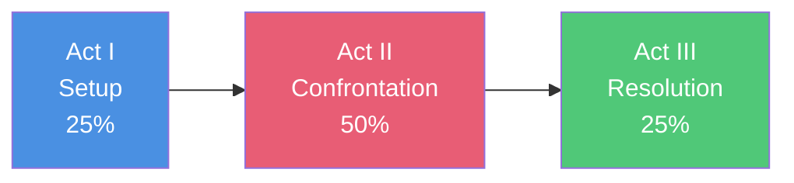

# 🎬 Three-Act Structure Template

> *The classic Hollywood story structure for planning your narrative*

The three-act structure is the most widely used story framework in Western storytelling. This template breaks your story into Setup (Act I), Confrontation (Act II), and Resolution (Act III), with clear turning points that drive the narrative forward.

---

## 🎯 **Understanding Three-Act Structure**

<details>
<summary><strong>The Framework</strong></summary>

### **The Three Acts:**



### **Act I: Setup (First Quarter)**
- Introduce protagonist and world
- Establish what's normal
- Present the inciting incident
- End with first plot point (point of no return)

### **Act II: Confrontation (Middle Half)**
- Protagonist pursues goal
- Obstacles escalate
- Midpoint shifts direction
- Dark night of the soul (all is lost)

### **Act III: Resolution (Final Quarter)**
- Protagonist reaches climax prepared
- Final confrontation
- Resolution of all threads
- New equilibrium

### **Key Percentages:**
- **Inciting Incident:** 10-15%
- **First Plot Point:** 25%
- **Midpoint:** 50%
- **Dark Night:** 75%
- **Climax:** 85-95%

</details>

<details>
<summary><strong>How to Use This Template</strong></summary>

### **Planning Process:**
1. **Fill in your story concept**
2. **Define major turning points first**
3. **Flesh out each act**
4. **Ensure causality** (because X, then Y)
5. **Check pacing and escalation**

### **Tips:**
- ✅ Major turning points should be external events
- ✅ Each act should feel distinct
- ✅ Pace accelerates through the story
- ✅ Stakes escalate continuously
- ❌ Don't let Act II sag
- ❌ Don't rush Act III

</details>

---

## 💡 **Story Foundation**

### **Core Concept**

**Title (Working):** _________________________________

**Logline:**
_________________________________________________________________
_________________________________________________________________

**Genre:** _________________________________

**Target Length:** _________________ words/pages

**Approximate Word Count per Act:**
- Act I (25%): _________________ words
- Act II (50%): _________________ words
- Act III (25%): _________________ words

---

## 🎭 **Character Core**

### **Protagonist**
**Name:** _________________________________

**Want (External Goal):** _________________________________

**Need (Internal Journey):** _________________________________

**Fatal Flaw:** _________________________________

**Character Arc:** ☐ Positive Change ☐ Negative Change ☐ Flat

### **Antagonist**
**Name/Force:** _________________________________

**Goal:** _________________________________

**Why They're Formidable:** _________________________________

---

## 📍 **Act I: Setup** (0-25%)

### **Purpose of Act I:**
- [ ] Introduce protagonist in their ordinary world
- [ ] Establish what's at stake
- [ ] Show their flaw/wound
- [ ] Disrupt the status quo
- [ ] Force protagonist into the story

---

### **Opening Scene** (Page 1 / 0-2%)

**Setting:** _________________________________

**Hook:** _________________________________
*(What grabs attention immediately?)*

**Opening Image:**
_________________________________________________________________
*(Visual/emotional snapshot of protagonist's current state)*

**Tone Established:** _________________________________

---

### **Ordinary World** (0-10%)

**Protagonist's Normal Life:**
_________________________________________________________________
_________________________________________________________________

**What's Missing/Wrong:**
_________________________________________________________________

**Relationships Established:**
- _________________________________________________________________
- _________________________________________________________________

**Status Quo:**
_________________________________________________________________

---

### **Inciting Incident** (~12%)

**The Disruption:**
_________________________________________________________________
_________________________________________________________________

**When It Happens:** Page/Word: _____________

**How It Changes Everything:**
_________________________________________________________________

**Protagonist's Initial Response:**
_________________________________________________________________

**Why They Resist:**
_________________________________________________________________

---

### **Refusal of the Call** (12-20%)

**Hesitation/Resistance:**
_________________________________________________________________

**What They're Afraid Of:**
_________________________________________________________________

**Attempts to Avoid:**
_________________________________________________________________

**Why They Can't Stay:**
_________________________________________________________________

---

### **First Plot Point** (~25%)

**The Point of No Return:**
_________________________________________________________________
_________________________________________________________________

**When It Happens:** Page/Word: _____________

**What Forces Commitment:**
_________________________________________________________________

**What They Can't Go Back To:**
_________________________________________________________________

**New Goal Established:**
_________________________________________________________________

**What Changes:**
- Physically: _________________________________
- Emotionally: _________________________________
- Stakes: _________________________________

---

## ⚔️ **Act II: Confrontation** (25-75%)

### **Purpose of Act II:**
- [ ] Protagonist actively pursues goal
- [ ] Escalating obstacles and complications
- [ ] Relationships deepen or fracture
- [ ] Stakes continually raise
- [ ] Protagonist learns (or fails to learn)

---

### **Act II-A: Rising Action** (25-50%)

#### **New World/Situation** (25-30%)

**Changed Circumstances:**
_________________________________________________________________

**New Rules/Territory:**
_________________________________________________________________

**Initial Confidence:**
_________________________________________________________________

---

#### **Fun & Games** (30-45%)

**Promise of Premise Delivered:**
_________________________________________________________________
*(The cool stuff your genre promises)*

**Lighter Moments:**
- _________________________________________________________________
- _________________________________________________________________

**Exploring the World:**
_________________________________________________________________

---

#### **Subplot Development** (30-50%)

**Subplot 1:**
- **Type:** _________________________________
- **Development:** _________________________________

**Subplot 2:**
- **Type:** _________________________________
- **Development:** _________________________________

---

#### **Progress & Setbacks** (25-50%)

**Attempt 1:**
- **Action:** _________________________________
- **Outcome:** _________________________________
- **Lesson:** _________________________________

**Attempt 2:**
- **Action:** _________________________________
- **Outcome:** _________________________________
- **Lesson:** _________________________________

**Attempt 3:**
- **Action:** _________________________________
- **Outcome:** _________________________________
- **Lesson:** _________________________________

**Relationships Evolve:**
_________________________________________________________________

---

### **Midpoint** (~50%)

**The Game-Changer:**
_________________________________________________________________
_________________________________________________________________

**When It Happens:** Page/Word: _____________

**Type:** ☐ False Victory ☐ False Defeat ☐ Major Revelation ☐ Shift in Power

**What Changes:**
- Information: _________________________________
- Stakes: _________________________________
- Goals: _________________________________
- Power Dynamic: _________________________________

**Protagonist's Response:**
_________________________________________________________________

**New Approach:**
_________________________________________________________________

**Ticking Clock Introduced/Intensified:**
_________________________________________________________________

---

### **Act II-B: Downward Spiral** (50-75%)

#### **Consequences** (50-60%)

**Midpoint Fallout:**
_________________________________________________________________

**New Complications:**
1. _________________________________________________________________
2. _________________________________________________________________
3. _________________________________________________________________

**Antagonist Response:**
_________________________________________________________________

---

#### **Raising Stakes** (60-70%)

**What Gets Worse:**
_________________________________________________________________

**Personal Cost Increases:**
_________________________________________________________________

**Time Running Out:**
_________________________________________________________________

**Relationships Tested:**
_________________________________________________________________

---

#### **Everything Falling Apart** (70-75%)

**Losses Accumulate:**
- _________________________________________________________________
- _________________________________________________________________
- _________________________________________________________________

**Internal Conflict Peaks:**
_________________________________________________________________

**Isolation:**
_________________________________________________________________

**The Flaw Causes Disaster:**
_________________________________________________________________

---

### **Second Plot Point / Dark Night** (~75%)

**All Is Lost:**
_________________________________________________________________
_________________________________________________________________

**When It Happens:** Page/Word: _____________

**What Protagonist Loses:**
- Physically: _________________________________
- Emotionally: _________________________________
- Allies/Resources: _________________________________

**Apparent Failure:**
_________________________________________________________________

**Moment of Despair:**
_________________________________________________________________

**The Real Question Emerges:**
_________________________________________________________________

**What Must Change:**
_________________________________________________________________

---

## 🌅 **Act III: Resolution** (75-100%)

### **Purpose of Act III:**
- [ ] Protagonist faces truth about themselves
- [ ] Makes final choice/sacrifice
- [ ] Confronts antagonist with new understanding
- [ ] Resolves all major threads
- [ ] Delivers satisfying conclusion

---

### **Breakthrough** (75-80%)

**Dark Night Recovery:**
_________________________________________________________________

**The Revelation:**
_________________________________________________________________
*(What protagonist finally understands)*

**Help/Insight From:**
_________________________________________________________________

**New Plan:**
_________________________________________________________________

**What They're Willing to Sacrifice:**
_________________________________________________________________

**Gathering for Final Battle:**
_________________________________________________________________

---

### **Race to Climax** (80-85%)

**Obstacles to Final Confrontation:**
_________________________________________________________________

**Ticking Clock Pressure:**
_________________________________________________________________

**Last-Minute Complications:**
_________________________________________________________________

**Allies' Support:**
_________________________________________________________________

---

### **Climax** (85-95%)

**The Final Confrontation:**
_________________________________________________________________
_________________________________________________________________

**When It Happens:** Page/Word: _____________

**Setting:** _________________________________

**What's at Stake:**
- Personal: _________________________________
- External: _________________________________
- Thematic: _________________________________

**Protagonist's Choice:**
_________________________________________________________________

**How They've Changed:**
_________________________________________________________________

**Using Their Growth:**
_________________________________________________________________

**The Battle/Test:**
_________________________________________________________________
_________________________________________________________________

**Turning Point:**
_________________________________________________________________

**Victory/Outcome:**
_________________________________________________________________

**Cost of Victory:**
_________________________________________________________________

---

### **Falling Action** (95-98%)

**Immediate Aftermath:**
_________________________________________________________________

**Quick Resolutions:**
- _________________________________________________________________
- _________________________________________________________________

**Subdued Threats:**
_________________________________________________________________

---

### **Resolution** (98-100%)

**New Normal:**
_________________________________________________________________
_________________________________________________________________

**Character's Final State:**
_________________________________________________________________

**How They're Different:**
_________________________________________________________________

**Subplots Resolved:**
- _________________________________________________________________
- _________________________________________________________________

**Relationships Settled:**
_________________________________________________________________

**Thematic Statement:**
_________________________________________________________________

**Closing Image:**
_________________________________________________________________
*(Mirrors or contrasts opening image)*

---

## 📊 **Structure Visualization**

### **Story Beat Map**

```
INTENSITY
    ↑
10  |                                        ★ Climax
    |                                    ___/|\___ 
 9  |                                ___/    |    \___
    |                            ___/        |        \
 8  |                        ___/            |         \
    |                    ___/ ⚡Dark         |          \
 7  |                ___/      Night        |           \
    |            ___/                       |            ↓
 6  |        ___/ 💫 Midpoint               |        Resolution
    |    ___/                               |
 5  | ★_/                                   |
    | Plot Point 1                          |
 4  |/                                      |
    |                                       |
 3  |⚡ Inciting                            |
    |  Incident                             |
 2  |                                       |
    |                                       |
 1  |_____________________________________|
    0%        25%        50%        75%    100%
       Act I        Act II          Act III
```

---

## ⚡ **Cause & Effect Chain**

Verify each event leads to the next:

**Opening Situation:**
_________________________________________________________________
↓
**Inciting Incident:**
_________________________________________________________________
↓
**Because of that:**
_________________________________________________________________
↓
**Which leads to:**
_________________________________________________________________
↓
**First Plot Point:**
_________________________________________________________________
↓
**Because of that:**
_________________________________________________________________
↓
**Which leads to:**
_________________________________________________________________
↓
**Midpoint:**
_________________________________________________________________
↓
**Because of that:**
_________________________________________________________________
↓
**Which leads to:**
_________________________________________________________________
↓
**Dark Night:**
_________________________________________________________________
↓
**Which forces:**
_________________________________________________________________
↓
**Climax:**
_________________________________________________________________
↓
**Resolution:**
_________________________________________________________________

---

## 📈 **Pacing Chart**

Track your story's rhythm:

| Section | Pages/% | Pace | Emotional Tone | Function |
|---------|---------|------|----------------|----------|
| **Opening** | 0-5% | Fast | Engaging | Hook |
| **Setup** | 5-12% | Moderate | Establish | World-building |
| **Inciting** | 12-15% | Fast | Disruption | Catalyst |
| **Resistance** | 15-25% | Moderate | Tension | Commitment |
| **Plot Point 1** | ~25% | Fast | Change | New direction |
| **Fun & Games** | 30-45% | Fast/Light | Entertaining | Promise |
| **Midpoint** | ~50% | Fast | Revelation | Shift |
| **Complications** | 50-70% | Accelerating | Darkening | Pressure |
| **Dark Night** | ~75% | Slow | Despair | Low point |
| **Recovery** | 75-80% | Building | Determination | Hope |
| **Race** | 80-85% | Fast | Urgent | Momentum |
| **Climax** | 85-95% | Fastest | Intense | Payoff |
| **Resolution** | 95-100% | Slowing | Satisfying | Closure |

---

## ✅ **Three-Act Structure Checklist**

Verify your structure:

### **Act I:**
- [ ] Opening hook in first pages
- [ ] Ordinary world established
- [ ] Protagonist's flaw visible
- [ ] Inciting incident disrupts status quo
- [ ] Stakes are clear
- [ ] Protagonist resists but is forced in
- [ ] First plot point at ~25%

### **Act II-A:**
- [ ] New world/situation explored
- [ ] Promise of premise delivered
- [ ] Progressive complications
- [ ] Subplots develop
- [ ] Midpoint game-changer at 50%
- [ ] Stakes raise after midpoint

### **Act II-B:**
- [ ] Consequences escalate
- [ ] Protagonist's methods fail
- [ ] Relationships strain
- [ ] Everything falls apart
- [ ] Dark night at ~75%
- [ ] Lowest point feels earned

### **Act III:**
- [ ] Protagonist has revelation
- [ ] New approach based on growth
- [ ] Race to climax accelerates
- [ ] Climax tests internal and external
- [ ] Victory uses character growth
- [ ] Resolution ties all threads
- [ ] Closing mirrors opening

### **Overall:**
- [ ] Cause and effect chain is clear
- [ ] Each act feels distinct
- [ ] Pacing accelerates
- [ ] Stakes continually escalate
- [ ] Character arc completes
- [ ] Theme is resolved

---

## 🔗 **Related Resources**

### **Within This Repository:**
- [Story Structure Guide: Three-Act](../../docs/fundamentals/story-structure/three-act-structure.md) — Detailed theory
- [Basic Story Outline](basic-story-outline.md) — Universal template
- [Hero's Journey Template](heros-journey-template.md) — Alternative structure
- [Character Arc Worksheet](../character-sheets/character-arc-worksheet.md)

### **Workflow:**
1. Use this template to plan beats
2. Complete character profiles
3. Check causality and escalation
4. Write the draft
5. Revise structure if needed

---

<div align="center">

**[⬅️ Back to Plot Templates](README.md)** | **[📚 All Templates](../README.md)** | **[🏠 Home](../../README.md)**

</div>
